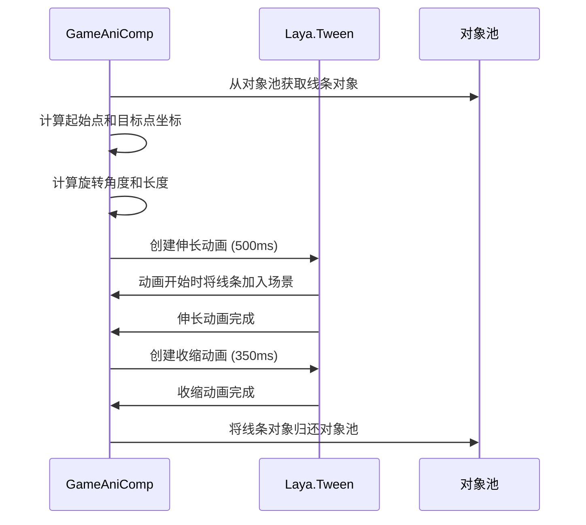
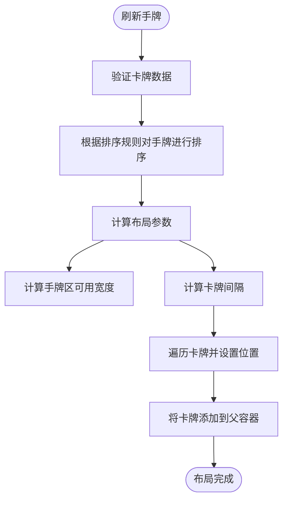
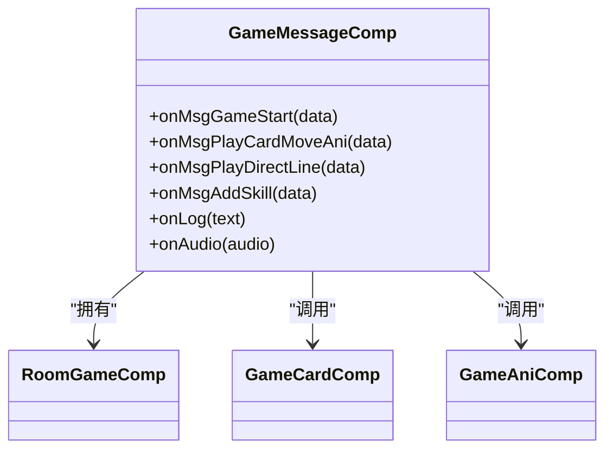
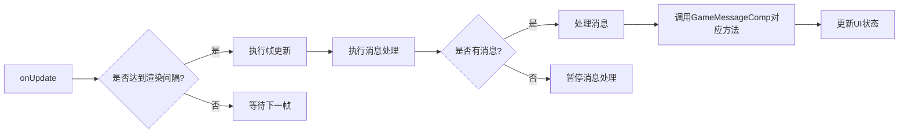

# 房间组件

<cite>
**本文档引用的文件**
- [GameAniComp.ts](file://client/src/comps/room/GameAniComp.ts)
- [GameCardComp.ts](file://client/src/comps/room/GameCardComp.ts)
- [GameMessageComp.ts](file://client/src/comps/room/GameMessageComp.ts)
- [GameWindowComp.ts](file://client/src/comps/room/GameWindowComp.ts)
- [RoomGameComp.ts](file://client/src/comps/room/RoomGameComp.ts)
- [RoomTableComp.ts](file://client/src/comps/room/RoomTableComp.ts)
</cite>

## 目录
1. [房间组件概述](#房间组件概述)
2. [游戏动画组件 (GameAniComp)](#游戏动画组件-gameanicomp)
3. [游戏卡牌组件 (GameCardComp)](#游戏卡牌组件-gamecardcomp)
4. [消息组件 (GameMessageComp)](#消息组件-gamemessagecomp)
5. [窗口组件 (GameWindowComp)](#窗口组件-gamewindowcomp)
6. [房间游戏主控组件 (RoomGameComp)](#房间游戏主控组件-roomgamecomp)
7. [房间桌台组件 (RoomTableComp)](#房间桌台组件-roomtablecomp)
8. [组件协同工作与集成示例](#组件协同工作与集成示例)
9. [性能优化策略](#性能优化策略)

## 房间组件概述

房间组件是游戏核心界面的基石，负责构建和管理整个游戏房间的UI与交互逻辑。该系统由多个高度协作的组件构成，每个组件各司其职，共同实现复杂的游戏功能。`RoomTableComp` 作为房间的顶层控制器，负责初始化游戏状态和管理玩家列表。当游戏开始时，它会创建 `RoomGameComp` 实例，后者作为游戏运行时的主控中心，协调 `GameAniComp`、`GameCardComp`、`GameMessageComp` 和 `GameWindowComp` 等子组件的工作。这种分层架构确保了代码的高内聚与低耦合，使得游戏逻辑、UI渲染和用户交互得以清晰分离。

## 游戏动画组件 (GameAniComp)

`GameAniComp` 组件专门负责处理游戏中的各类视觉动画效果，为游戏过程增添动态感和沉浸感。

### 动画播放机制

该组件通过 `playDirectLine` 方法实现指向线动画，用于指示技能或卡牌的目标。该方法支持三种播放模式：
1.  **同时播放**：从起始玩家同时向所有目标玩家播放。
2.  **顺序播放**：从起始玩家依次向每个目标玩家播放，通过 `timerOnce` 实现时间间隔。
3.  **链式播放**：从起始玩家到第一个目标，再从第一个目标到第二个目标，以此类推。

动画的实现利用了 `Laya.Tween` 补间动画系统。首先创建一个 `GImage` 对象作为线条，根据起始点和目标点的坐标计算出线条的旋转角度和长度。动画分为两个阶段：
1.  **伸长阶段**：线条从长度为0开始，持续500毫秒，逐渐伸长至目标长度。
2.  **收缩消失阶段**：线条锚点切换，从目标点开始，持续350毫秒，逐渐收缩至0并从场景中移除。



**图示来源**
- [GameAniComp.ts](file://client/src/comps/room/GameAniComp.ts#L30-L100)

### 特殊动画效果

除了指向线，该组件还支持其他动画：
- **ban势力动画**：通过 `banCountry` 方法播放势力禁用动画。
- **觉醒/限定技动画**：`jxxd` 方法处理武将觉醒或限定技的复杂动画，包括武将头像的移动、缩放和Spine骨骼动画的播放。
- **通用技能动画**：`skills` 方法通过加载 `.lh` 预制体来播放自定义的技能动画。

**组件来源**
- [GameAniComp.ts](file://client/src/comps/room/GameAniComp.ts#L9-L201)

## 游戏卡牌组件 (GameCardComp)

`GameCardComp` 是管理所有卡牌UI的核心组件，负责手牌、处理区、固定区域等不同位置卡牌的布局、排序和交互。

### 卡牌区域管理

该组件通过多个数组来管理不同区域的卡牌：
- `hand_cards`: 手牌区卡牌。
- `process_cards`: 处理区卡牌，用于展示当前操作的卡牌。
- `field_cards`: 固定区域卡牌，如马车等。

**卡牌布局与刷新**
`refreshHandCards` 方法是布局的核心。它根据当前手牌数量和固定区域卡牌数量，动态计算卡牌的间隔和位置，确保卡牌在有限的屏幕空间内均匀分布。对于手牌，当数量超过12张时，会显示“整理”按钮，允许玩家对卡牌进行排序。



**图示来源**
- [GameCardComp.ts](file://client/src/comps/room/GameCardComp.ts#L150-L200)

### 卡牌排序功能

组件内置了四种排序方式，通过私有方法实现：
- `sortHandCardsByName`: 按卡牌名称的字母顺序排序。
- `sortHandCardsByType`: 按卡牌类型排序，优先级为基本牌 > 普通锦囊 > 延时锦囊 > 装备牌（武器 > 防具 > 坐骑 > 宝物）。
- `sortHandCardsBySuit`: 按花色排序，优先级为黑桃 > 红桃 > 梅花 > 方片。
- `sortHandCardsByPoint`: 按点数从小到大排序，点数相同时按名称排序。

这些排序功能通过 `Laya.Event.CLICK` 事件绑定到UI按钮上，为玩家提供了便捷的卡牌管理方式。

### 卡牌移动与交互

`onMoveCards` 方法是处理卡牌移动的核心。它接收一个包含移动信息的数据数组，包括卡牌ID、来源区域、目标区域、动画效果等。该方法会：
1.  创建卡牌的UI表示（`UICard`）。
2.  根据是否需要动画，决定是直接移动还是使用贝塞尔曲线动画。
3.  更新游戏逻辑层的卡牌数据（如区域、可见性）。
4.  调用 `refreshHandCards` 或 `addProcessCards` 等方法更新UI。

**组件来源**
- [GameCardComp.ts](file://client/src/comps/room/GameCardComp.ts#L22-L727)

## 消息组件 (GameMessageComp)

`GameMessageComp` 组件是游戏消息的中枢，负责接收和处理来自服务器的各种消息，并将其转化为UI上的视觉反馈。

### 消息处理机制

该组件通过一系列以 `onMsg` 开头的方法来处理不同类型的服务器消息。例如：
- `onMsgGameStart`: 处理游戏开始消息，初始化游戏房间、玩家座位和UI。
- `onMsgPlayCardMoveAni`: 接收卡牌移动指令，并调用 `GameCardComp` 的 `onMoveCards` 方法执行动画。
- `onMsgPlayDirectLine`: 接收播放指向线的指令，并调用 `GameAniComp` 的 `playDirectLine` 方法。
- `onMsgAddSkill`: 处理添加技能的消息，创建技能UI按钮或标记。

这种设计模式遵循了“单一职责”原则，每个方法只负责处理一种特定类型的消息，使得代码逻辑清晰且易于维护。



**图示来源**
- [GameMessageComp.ts](file://client/src/comps/room/GameMessageComp.ts#L62-L964)

### 日志与音频系统

除了UI更新，该组件还管理游戏日志和音效：
- **日志系统**：`onLog` 方法将文本信息追加到日志面板，并根据 `isLockLog` 标志决定是否自动滚动到底部。
- **音频系统**：`onAudio` 方法根据传入的音频信息（字符串路径或包含类型、玩家ID的对象）播放相应的音效，如武将阵亡语音或技能音效。

**组件来源**
- [GameMessageComp.ts](file://client/src/comps/room/GameMessageComp.ts#L62-L964)

## 窗口组件 (GameWindowComp)

`GameWindowComp` 组件负责管理游戏中的所有弹出式窗口，提供一个统一的窗口创建、显示和销毁接口。

### 窗口管理

该组件维护一个 `windows` 数组来跟踪所有已打开的窗口。核心方法包括：
- `serverWindow`: 处理来自服务器的窗口指令，根据 `create`、`close` 等标志来创建、更新或关闭窗口。
- `open` 和 `close`: 用于将窗口添加到或从UI层级中移除。
- `getWindow`: 根据ID查找窗口实例。

### 窗口创建与显示

`showCardsWindow` 和 `showReserveWindow` 方法提供了便捷的窗口创建方式。它们会检查是否已存在同名窗口以避免重复，然后创建 `UIWindow` 实例，设置数据和选项，并调用 `open` 方法显示。

**组件来源**
- [GameWindowComp.ts](file://client/src/comps/room/GameWindowComp.ts#L10-L90)

## 房间游戏主控组件 (RoomGameComp)

`RoomGameComp` 是游戏运行时的总控制器，它整合了所有子组件，并处理游戏的核心循环和用户交互。

### 组件初始化与整合

在 `onAwake` 生命周期中，该组件通过 `addComponent` 方法创建并初始化 `GameMessageComp`、`GameWindowComp`、`GameCardComp` 和 `GameAniComp` 四个核心子组件，并将它们的引用存储在 `message`、`window`、`card` 和 `ani` 属性中。这种依赖注入的方式使得主控组件可以方便地调用子组件的功能。

### 游戏主循环

`onUpdate` 方法驱动着游戏的主循环 `gameLoop`。该循环包含两个主要部分：
1.  **帧更新**：每33毫秒（约30FPS）执行一次，用于刷新UI，如卡牌数量、倒计时等。
2.  **消息处理**：逐个处理从 `RoomTableComp` 接收到的游戏消息。它会检查消息的 `except` 字段，如果消息是针对当前玩家的，则进行处理；否则，根据消息类型调用 `GameMessageComp` 中对应的 `onMsg` 方法。



**图示来源**
- [RoomGameComp.ts](file://client/src/comps/room/RoomGameComp.ts#L45-L1386)

### 用户交互处理

该组件还绑定了大量UI按钮的点击事件，例如：
- **聊天和日志**：控制聊天面板和日志面板的显示/隐藏。
- **设置和举报**：处理设置弹窗、举报和屏蔽玩家的功能。
- **投降和托管**：实现投降 (`onTouxiang`) 和托管 (`onTuoguan`) 的逻辑。

**组件来源**
- [RoomGameComp.ts](file://client/src/comps/room/RoomGameComp.ts#L45-L1386)

## 房间桌台组件 (RoomTableComp)

`RoomTableComp` 是房间的顶层UI控制器，负责管理等待界面、玩家列表和游戏状态的切换。

### 状态管理与游戏启动

该组件通过 `bindRoom` 方法监听服务器状态的变化，如玩家加入/离开、旁观者列表更新等，并实时更新UI。当玩家点击“开始游戏”按钮时，`onStartClick` 方法会向服务器发送 `start` 消息。服务器确认后，会触发 `on_confirm_start` 方法，该方法会：
1.  创建 `UIGameRoom` 的UI实例。
2.  初始化 `RoomGameComp` 组件。
3.  切换UI控制器的状态到“游戏”页面。

### 重连机制

该组件实现了健壮的客户端重连机制。当网络断开时，`onLeave` 方法会监听 `onReconnectToken` 事件。`attempReconnect` 方法使用指数退避算法进行重连尝试，成功后会调用 `on_reconnect_data` 方法，将游戏状态恢复到断线前的那一刻，确保玩家不会丢失游戏进度。

**组件来源**
- [RoomTableComp.ts](file://client/src/comps/room/RoomTableComp.ts#L12-L553)

## 组件协同工作与集成示例

以下代码示例展示了在游戏过程中，各组件如何协同工作：

```typescript
// 1. 当服务器发送"播放指向线"消息时
// RoomTableComp 接收消息 -> RoomGameComp -> GameMessageComp.onMsgPlayDirectLine
// GameMessageComp 调用 GameAniComp.playDirectLine
this.game.ani.playDirectLine("player1", ["player2", "player3"], 2);

// 2. 当玩家使用一张【杀】时
// 游戏逻辑层生成移动指令
const moveData = {
    cards: ["card_sha_001"],
    fromArea: "player1_hand",
    toArea: "process_area",
    animation: true,
    isMove: true
};
// GameMessageComp.onMsgPlayCardMoveAni 被调用
this.game.card.onMoveCards([moveData]); // GameCardComp 执行动画和布局

// 3. 当需要显示技能选择窗口时
// GameMessageComp 收到请求
const request = { /* 请求数据 */ };
this.game.startChoose(request); // RoomGameComp 启动选择流程
// GameChooseComp 显示选择UI
```

## 性能优化策略

该系统在设计上采用了多种性能优化策略：

### 资源加载与管理
- **对象池 (Object Pooling)**：频繁创建和销毁的对象（如指向线、弹幕）都使用了 `Laya.Pool` 对象池，避免了频繁的内存分配和垃圾回收。
- **资源预加载**：关键资源（如Spine动画、预制体）在需要时通过 `Laya.loader.load` 异步加载，防止游戏卡顿。

### 渲染效率提升
- **批量更新**：`renderCardText` 方法集中更新所有与卡牌数量相关的文本，减少UI重绘次数。
- **条件渲染**：`renderSkill` 方法会根据技能的可见性 (`visible()`) 和全局性 (`global()`) 来决定是否渲染技能按钮，避免不必要的UI元素创建。
- **节流与防抖**：游戏主循环 (`gameLoop`) 以固定的33毫秒间隔执行，避免了 `onUpdate` 在每一帧都执行昂贵的逻辑。

**组件来源**
- [RoomGameComp.ts](file://client/src/comps/room/RoomGameComp.ts#L45-L1386)
- [GameAniComp.ts](file://client/src/comps/room/GameAniComp.ts#L9-L201)
- [GameCardComp.ts](file://client/src/comps/room/GameCardComp.ts#L22-L727)