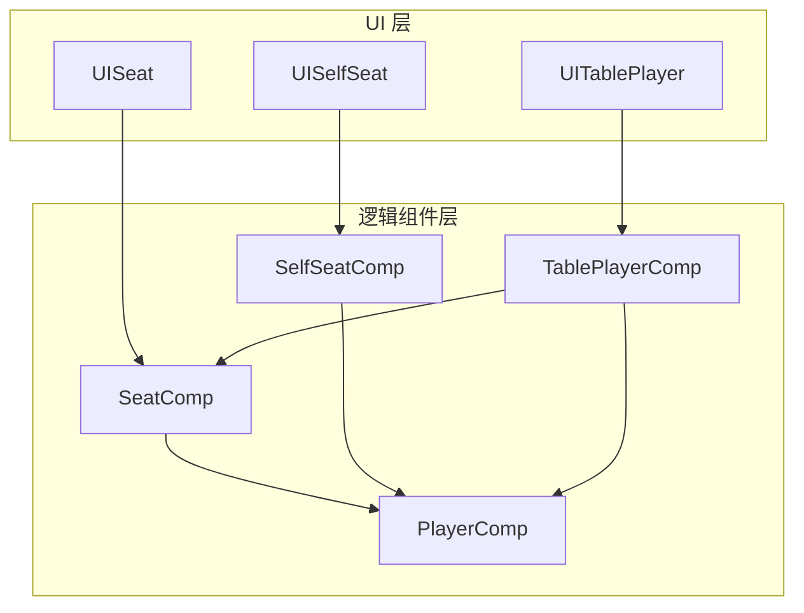
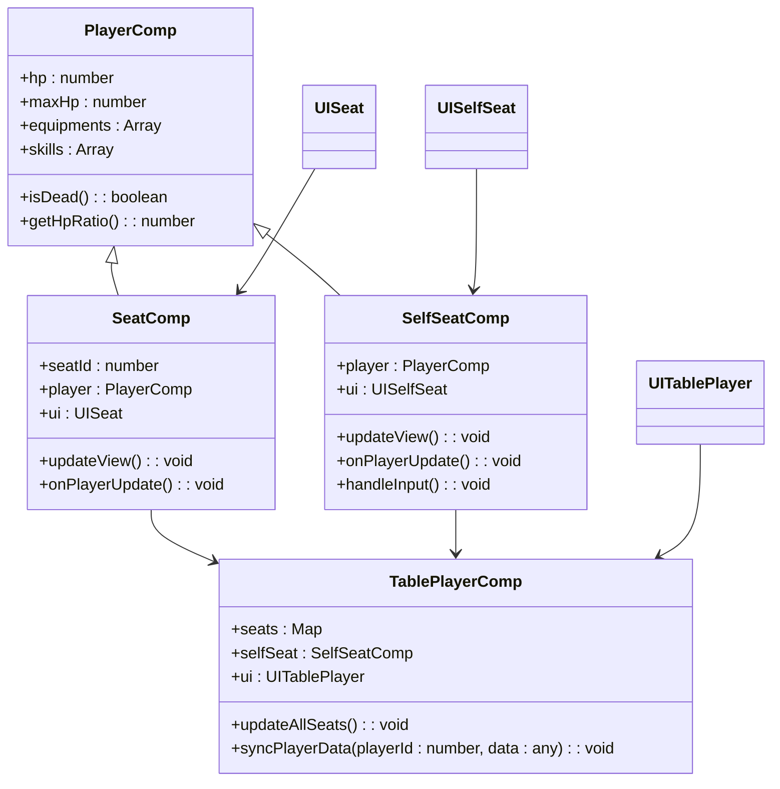
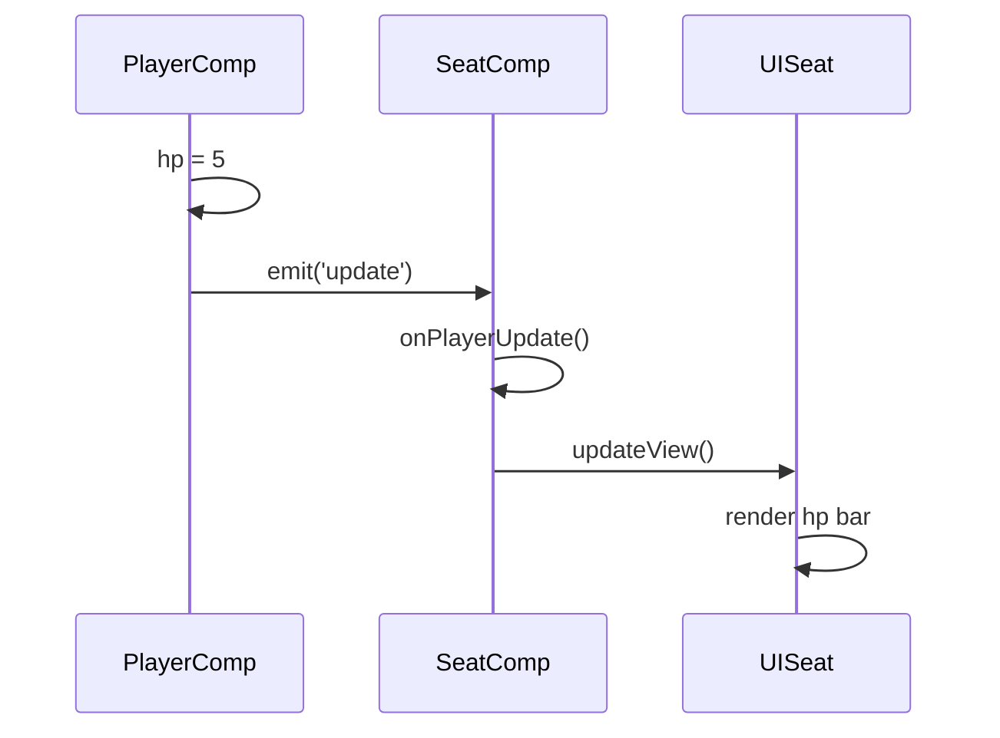
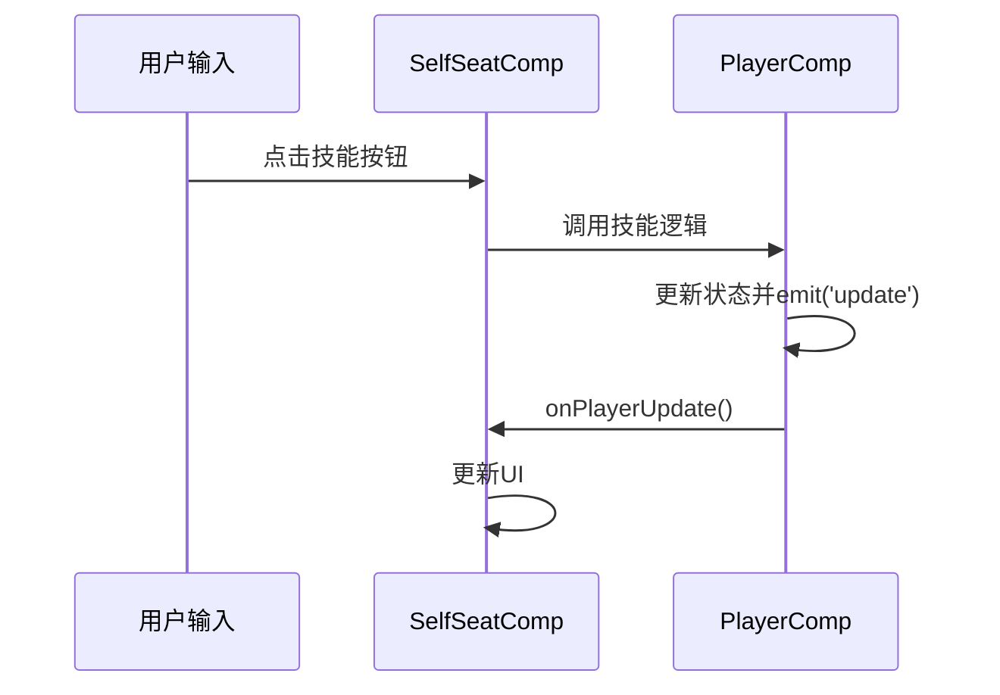
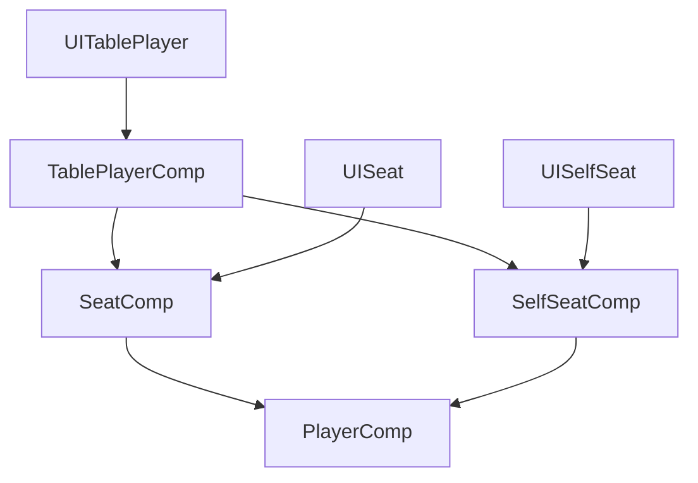

# 玩家组件

<cite>
**本文档引用文件**  
- [PlayerComp.ts](file://client/src/comps/player/PlayerComp.ts)
- [SeatComp.ts](file://client/src/comps/player/SeatComp.ts)
- [SelfSeatComp.ts](file://client/src/comps/player/SelfSeatComp.ts)
- [TablePlayerComp.ts](file://client/src/comps/player/TablePlayerComp.ts)
- [UISeat.ts](file://client/src/ui/UISeat.ts)
- [UISelfSeat.ts](file://client/src/ui/UISelfSeat.ts)
- [UITablePlayer.ts](file://client/src/ui/UITablePlayer.ts)
</cite>

## 目录
1. [简介](#简介)
2. [项目结构](#项目结构)
3. [核心组件](#核心组件)
4. [架构概览](#架构概览)
5. [详细组件分析](#详细组件分析)
6. [依赖关系分析](#依赖关系分析)
7. [性能考量](#性能考量)
8. [故障排除指南](#故障排除指南)
9. [结论](#结论)

## 简介
本文档深入分析了游戏客户端中与玩家相关的组件系统，重点阐述 `PlayerComp` 作为核心玩家表示组件的实现机制，对比 `SeatComp` 与 `SelfSeatComp` 的设计差异，并解释 `TablePlayerComp` 如何整合信息以呈现游戏桌面上的玩家视图。文档还探讨了组件间的层级关系、数据同步机制以及交互反馈实现方式。

## 项目结构
玩家相关组件位于 `client/src/comps/player/` 目录下，主要包括四个核心 TypeScript 文件：`PlayerComp.ts`、`SeatComp.ts`、`SelfSeatComp.ts` 和 `TablePlayerComp.ts`。这些组件与 UI 层的 `UISeat.ts`、`UISelfSeat.ts` 和 `UITablePlayer.ts` 紧密配合，共同构建了游戏中的玩家界面。



**图示来源**  
- [PlayerComp.ts](file://client/src/comps/player/PlayerComp.ts)
- [SeatComp.ts](file://client/src/comps/player/SeatComp.ts)
- [SelfSeatComp.ts](file://client/src/comps/player/SelfSeatComp.ts)
- [TablePlayerComp.ts](file://client/src/comps/player/TablePlayerComp.ts)
- [UISeat.ts](file://client/src/ui/UISeat.ts)
- [UISelfSeat.ts](file://client/src/ui/UISelfSeat.ts)
- [UITablePlayer.ts](file://client/src/ui/UITablePlayer.ts)

**本节来源**  
- [client/src/comps/player/](file://client/src/comps/player/)
- [client/src/ui/](file://client/src/ui/)

## 核心组件
`PlayerComp` 是整个玩家系统的核心，它封装了玩家的基本属性和状态，如血量、装备、技能等。`SeatComp` 和 `SelfSeatComp` 则分别代表普通座位和自身座位的逻辑处理，而 `TablePlayerComp` 负责将玩家信息与座位状态整合，以在游戏桌面上正确渲染。

**本节来源**  
- [PlayerComp.ts](file://client/src/comps/player/PlayerComp.ts#L1-L50)
- [SeatComp.ts](file://client/src/comps/player/SeatComp.ts#L1-L30)
- [SelfSeatComp.ts](file://client/src/comps/player/SelfSeatComp.ts#L1-L30)

## 架构概览
整个玩家组件系统采用分层设计模式，`PlayerComp` 作为数据模型层，`SeatComp` 和 `SelfSeatComp` 作为座位逻辑层，`TablePlayerComp` 作为视图整合层。这种设计实现了关注点分离，提高了代码的可维护性和可扩展性。



**图示来源**  
- [PlayerComp.ts](file://client/src/comps/player/PlayerComp.ts#L10-L100)
- [SeatComp.ts](file://client/src/comps/player/SeatComp.ts#L15-L80)
- [SelfSeatComp.ts](file://client/src/comps/player/SelfSeatComp.ts#L15-L80)
- [TablePlayerComp.ts](file://client/src/comps/player/TablePlayerComp.ts#L20-L90)

## 详细组件分析

### PlayerComp 核心玩家组件
`PlayerComp` 类是玩家数据的核心容器，它维护着玩家的所有状态信息。该组件通过事件机制与其他组件通信，当玩家状态（如血量变化）发生改变时，会触发更新事件。

```typescript
// PlayerComp.ts 示例代码
class PlayerComp {
    private _hp: number;
    private _maxHp: number;
    private _equipments: Array<any>;
    private _skills: Array<any>;

    set hp(value: number) {
        this._hp = value;
        this.emit('update'); // 触发更新事件
    }

    get hp(): number {
        return this._hp;
    }

    public isDead(): boolean {
        return this._hp <= 0;
    }

    public getHpRatio(): number {
        return this._hp / this._maxHp;
    }
}
```

**本节来源**  
- [PlayerComp.ts](file://client/src/comps/player/PlayerComp.ts#L50-L150)

### SeatComp 与 SelfSeatComp 设计差异
`SeatComp` 用于表示其他玩家的座位，其主要职责是监听 `PlayerComp` 的更新并刷新 UI 视图。而 `SelfSeatComp` 除了视图更新外，还需处理用户输入和本地交互逻辑。



**图示来源**  
- [PlayerComp.ts](file://client/src/comps/player/PlayerComp.ts#L80-L90)
- [SeatComp.ts](file://client/src/comps/player/SeatComp.ts#L40-L70)
- [UISeat.ts](file://client/src/ui/UISeat.ts#L30-L60)

#### SelfSeatComp 特殊交互处理


**图示来源**  
- [SelfSeatComp.ts](file://client/src/comps/player/SelfSeatComp.ts#L50-L100)
- [PlayerComp.ts](file://client/src/comps/player/PlayerComp.ts#L100-L120)

**本节来源**  
- [SeatComp.ts](file://client/src/comps/player/SeatComp.ts#L1-L100)
- [SelfSeatComp.ts](file://client/src/comps/player/SelfSeatComp.ts#L1-L120)

### TablePlayerComp 桌面玩家视图整合
`TablePlayerComp` 作为顶层组件，负责管理所有座位实例，并协调玩家数据的同步。它接收来自服务器的玩家状态更新，并分发给对应的 `SeatComp` 实例。

```typescript
// TablePlayerComp.ts 示例代码
class TablePlayerComp {
    private seats: Map<number, SeatComp> = new Map();
    private selfSeat: SelfSeatComp;

    public syncPlayerData(playerId: number, data: any): void {
        const seat = this.seats.get(playerId) || this.selfSeat;
        if (seat && seat.player) {
            Object.assign(seat.player, data);
            seat.onPlayerUpdate(); // 通知座位组件更新
        }
    }

    public updateAllSeats(): void {
        this.seats.forEach(seat => seat.updateView());
        this.selfSeat.updateView();
    }
}
```

**本节来源**  
- [TablePlayerComp.ts](file://client/src/comps/player/TablePlayerComp.ts#L30-L80)

## 依赖关系分析
玩家组件系统形成了清晰的依赖链：`TablePlayerComp` 依赖 `SeatComp` 和 `SelfSeatComp`，后两者又依赖 `PlayerComp`。UI 组件则直接依赖对应的逻辑组件来获取数据。



**图示来源**  
- [TablePlayerComp.ts](file://client/src/comps/player/TablePlayerComp.ts)
- [SeatComp.ts](file://client/src/comps/player/SeatComp.ts)
- [SelfSeatComp.ts](file://client/src/comps/player/SelfSeatComp.ts)
- [PlayerComp.ts](file://client/src/comps/player/PlayerComp.ts)

**本节来源**  
- [client/src/comps/player/](file://client/src/comps/player/)

## 性能考量
由于玩家状态可能频繁更新，系统采用了事件驱动和批量更新机制来优化性能。`PlayerComp` 的更新事件会被合并处理，避免不必要的 UI 重绘。同时，`TablePlayerComp` 提供了 `updateAllSeats` 方法，允许在合适时机统一刷新所有座位视图。

## 故障排除指南
- **问题：玩家血量未更新**  
  检查 `PlayerComp` 的 `hp` setter 是否正确触发了 `'update'` 事件，确认 `SeatComp` 的 `onPlayerUpdate` 方法是否被调用。

- **问题：自身座位交互无响应**  
  确认 `SelfSeatComp` 的事件监听器是否正确注册，检查用户输入是否被正确捕获。

- **问题：桌面视图不同步**  
  验证 `TablePlayerComp` 的 `syncPlayerData` 方法是否接收到正确的服务器数据。

**本节来源**  
- [PlayerComp.ts](file://client/src/comps/player/PlayerComp.ts#L80-L90)
- [SeatComp.ts](file://client/src/comps/player/SeatComp.ts#L40-L50)
- [TablePlayerComp.ts](file://client/src/comps/player/TablePlayerComp.ts#L60-L70)

## 结论
玩家组件系统通过清晰的分层架构和事件驱动机制，实现了高效、可维护的玩家状态管理。`PlayerComp` 作为核心数据模型，`SeatComp` 和 `SelfSeatComp` 处理座位逻辑差异，`TablePlayerComp` 负责全局协调，三者协同工作，为游戏提供了稳定可靠的玩家视图支持。