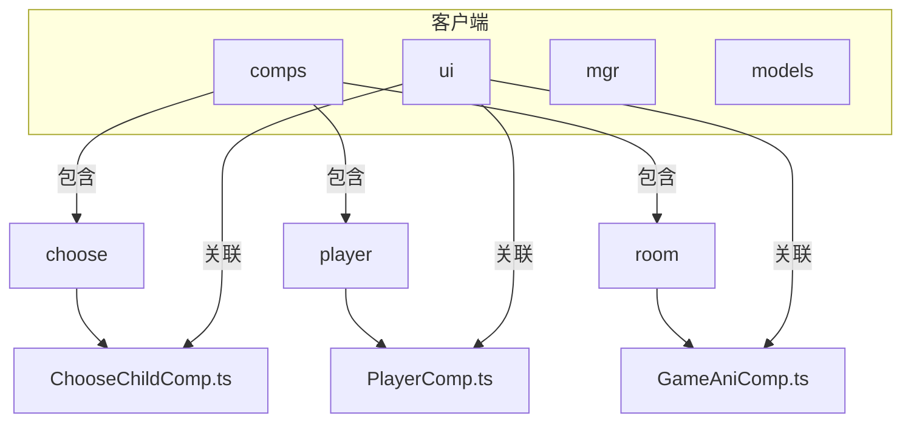
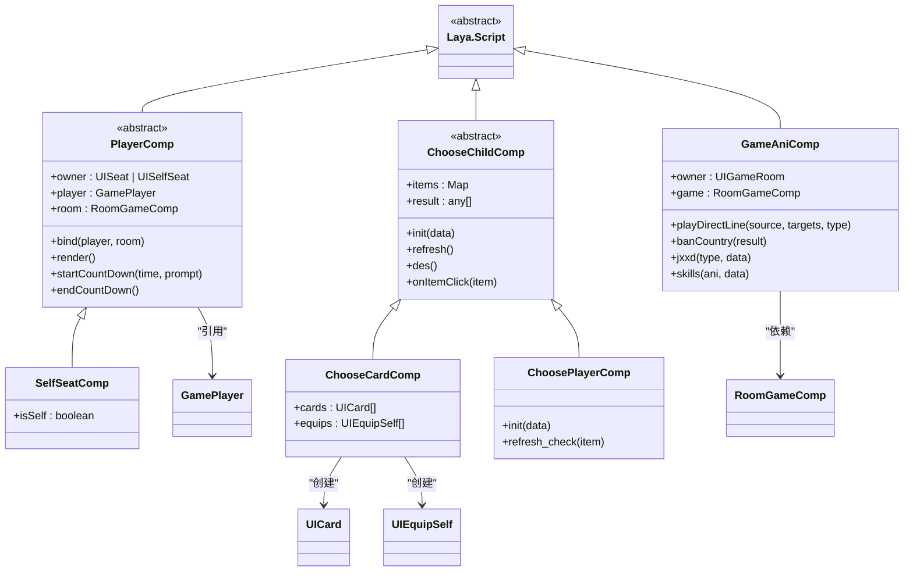
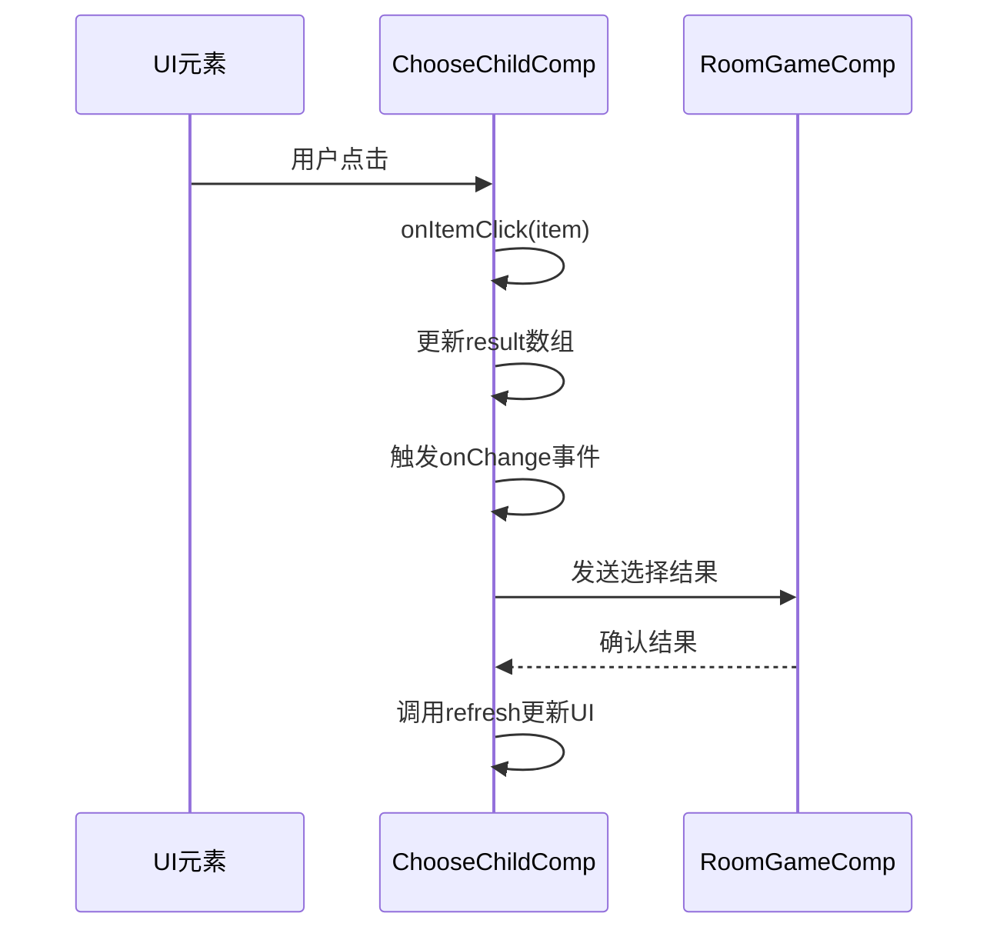
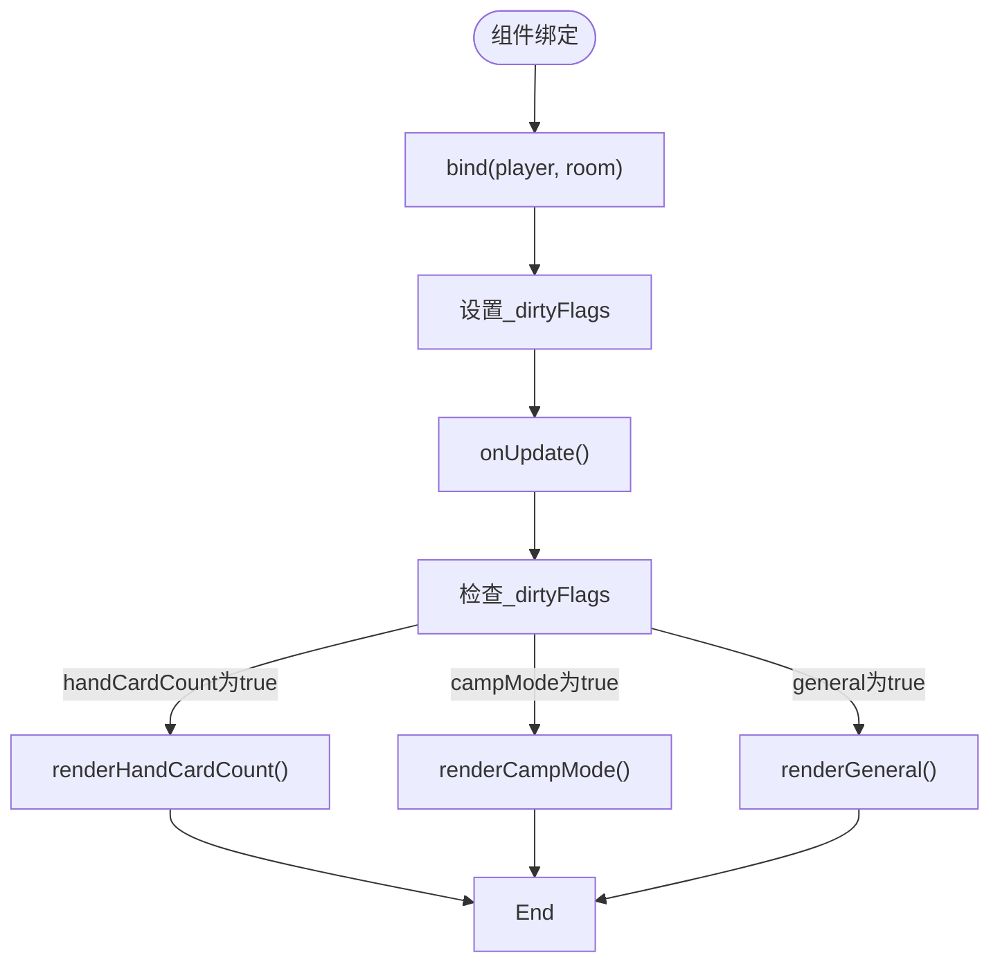
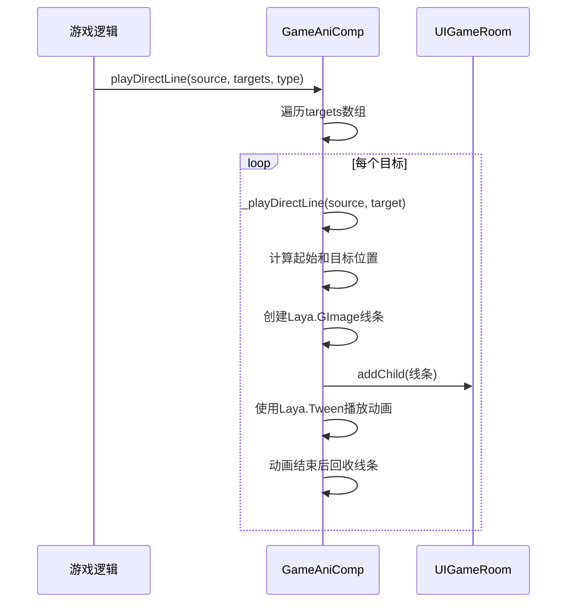
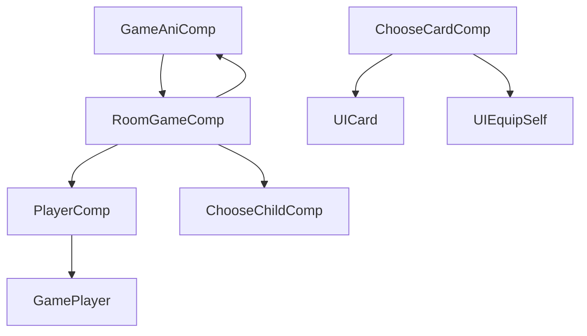

# 组件体系

<cite>
**本文档中引用的文件**  
- [ChooseChildComp.ts](file://client\src\comps\choose\ChooseChildComp.ts)
- [PlayerComp.ts](file://client\src\comps\player\PlayerComp.ts)
- [GameAniComp.ts](file://client\src\comps\room\GameAniComp.ts)
</cite>

## 目录
1. [引言](#引言)
2. [项目结构](#项目结构)
3. [核心组件](#核心组件)
4. [架构概览](#架构概览)
5. [组件详细分析](#组件详细分析)
6. [依赖关系分析](#依赖关系分析)
7. [性能考量](#性能考量)
8. [故障排查指南](#故障排查指南)
9. [结论](#结论)

## 引言
本文档旨在深入解析前端组件体系的设计与实现，重点围绕MVC架构中的View-Controller组件模式展开。通过分析ChooseChildComp、PlayerComp、GameAniComp等关键组件，揭示其生命周期管理、事件绑定机制、组件通信方式以及与UI界面的映射关系。文档将为开发者提供清晰的组件复用策略和可扩展性设计思路，帮助理解如何通过组件控制UI状态。

## 项目结构
项目采用模块化分层结构，主要分为客户端（client）和服务端（server）两大部分。客户端代码位于`client/src`目录下，按功能划分为`comps`（组件）、`ui`（用户界面）、`mgr`（管理器）、`models`（数据模型）等模块。组件体系主要集中在`comps`目录中，按功能细分为`choose`（选择类组件）、`player`（玩家相关组件）、`room`（房间游戏组件）等子模块，体现了高内聚、低耦合的设计原则。



**图示来源**
- [ChooseChildComp.ts](file://client\src\comps\choose\ChooseChildComp.ts)
- [PlayerComp.ts](file://client\src\comps\player\PlayerComp.ts)
- [GameAniComp.ts](file://client\src\comps\room\GameAniComp.ts)

**本节来源**
- [ChooseChildComp.ts](file://client\src\comps\choose\ChooseChildComp.ts)
- [PlayerComp.ts](file://client\src\comps\player\PlayerComp.ts)
- [GameAniComp.ts](file://client\src\comps\room\GameAniComp.ts)

## 核心组件
前端组件体系遵循MVC设计模式，其中`comps`目录下的各类组件扮演着Controller的角色，负责处理业务逻辑、状态管理和UI更新。`ui`目录下的类则对应View层，负责UI元素的展示。`PlayerComp`作为玩家状态的控制器，`ChooseChildComp`用于处理各种选择逻辑，`GameAniComp`则专门管理游戏动画效果，三者共同构成了游戏核心交互的基础。

**本节来源**
- [ChooseChildComp.ts](file://client\src\comps\choose\ChooseChildComp.ts)
- [PlayerComp.ts](file://client\src\comps\player\PlayerComp.ts)
- [GameAniComp.ts](file://client\src\comps\room\GameAniComp.ts)

## 架构概览
整个前端架构以LayaAir引擎为基础，采用组件化开发模式。`PlayerComp`及其子类（如`SelfSeatComp`）负责管理玩家的UI状态和行为。`ChooseChildComp`系列组件通过继承`ScriptChooseComp`基类，实现了统一的选择逻辑处理框架。`GameAniComp`则作为独立的动画控制器，通过`UIGameRoom`的`owner`属性与UI进行绑定，实现了动画逻辑与UI的解耦。



**图示来源**
- [ChooseChildComp.ts](file://client\src\comps\choose\ChooseChildComp.ts)
- [PlayerComp.ts](file://client\src\comps\player\PlayerComp.ts)
- [GameAniComp.ts](file://client\src\comps\room\GameAniComp.ts)

## 组件详细分析

### ChooseChildComp 分析
`ChooseChildComp` 是一个抽象基类，定义了选择类组件的通用行为。它通过泛型参数`T`和`U`来适配不同类型的数据和UI元素。该组件的核心功能包括初始化选择项、管理选择结果、刷新UI状态和资源释放。

#### 组件生命周期与事件绑定
组件的生命周期由`init`、`refresh`和`des`方法管理。`init`方法负责根据传入的数据初始化UI元素，`refresh`方法在每次状态变化时更新UI，`des`方法则在组件销毁时清理资源。事件绑定主要通过`onItemClick`方法实现，当用户点击选择项时，会触发相应的选择逻辑。



**图示来源**
- [ChooseChildComp.ts](file://client\src\comps\choose\ChooseChildComp.ts)

#### 组件通信模式
`ChooseChildComp`通过`items`映射表与具体的UI元素进行通信。例如，在`ChooseCardComp`中，它会遍历`data.selectable`数组，将每张卡牌与对应的`UICard`或`UIEquipSelf`实例关联起来。这种父子组件通信模式确保了数据与视图的一致性。

```typescript
// 代码示例：父子组件通信
public init(data: ChooseCardData): void {
    data.selectable.forEach((v) => {
        // 判断该牌是否在手牌区或者装备区
        const ui_card = this.game.card.hand_cards.find(
            (c) => c.type === 'card' && c.card === v
        );
        if (ui_card) {
            this.items.set(v, ui_card); // 建立数据与UI的映射
            return;
        }
        // ... 其他情况
    });
}
```

**本节来源**
- [ChooseChildComp.ts](file://client\src\comps\choose\ChooseChildComp.ts)

### PlayerComp 分析
`PlayerComp`是玩家相关组件的基类，负责管理玩家的UI状态，如体力值、身份、装备等。它通过`dirtyFlags`机制实现了高效的脏检查更新，只有当特定状态发生变化时才会触发相应的渲染方法。

#### 生命周期管理
`PlayerComp`的生命周期始于`bind`方法，该方法将组件与具体的`GamePlayer`实例和`RoomGameComp`进行绑定。`onUpdate`方法在每一帧被调用，它会检查`_dirtyFlags`并调用相应的`render`方法来更新UI。



**图示来源**
- [PlayerComp.ts](file://client\src\comps\player\PlayerComp.ts)

#### 事件绑定机制
`PlayerComp`通过LayaAir的事件系统进行事件绑定。例如，倒计时功能通过`owner.timer.loop`方法实现，当倒计时结束时会触发`CountDownEnd`事件。

```typescript
// 代码示例：事件绑定
public startCountDown(time: number, prompt?: CustomString) {
    this.owner.timer.loop(1000, this, this.onCountDown);
}

protected onCountDown() {
    this._time -= 1;
    if (this._time < -1) {
        this.endCountDown();
        this.owner.event('CountDownEnd'); // 触发事件
    }
}
```

**本节来源**
- [PlayerComp.ts](file://client\src\comps\player\PlayerComp.ts)

### GameAniComp 分析
`GameAniComp`是一个专门用于处理游戏动画的组件，它通过`owner`属性与`UIGameRoom`界面进行绑定，实现了动画逻辑与UI的分离。

#### 动画播放机制
该组件提供了多种动画播放方法，如`playDirectLine`用于播放指向线动画，`jxxd`用于播放觉醒或限定技动画，`skills`用于播放技能特效动画。



**图示来源**
- [GameAniComp.ts](file://client\src\comps\room\GameAniComp.ts)

#### 组件复用与可扩展性
`GameAniComp`的设计体现了良好的复用性和可扩展性。例如，`playDirectLine`方法通过`type`参数支持三种不同的播放方式，满足了不同场景的需求。`skills`方法通过加载预制体（prefab）的方式，可以轻松扩展新的技能动画。

```typescript
// 代码示例：组件复用
public playDirectLine(source: string, targets: string[], type: number = 1) {
    if (type === 1) {
        // 所有目标同时播放
        targets.forEach((v) => this._playDirectLine(source, v));
    }
    if (type === 2) {
        // 依次播放到每个目标
        targets.forEach((v, i) => {
            this.owner.timerOnce(i * 850, this, () => {
                this._playDirectLine(source, v);
            });
        });
    }
    // ... 其他类型
}
```

**本节来源**
- [GameAniComp.ts](file://client\src\comps\room\GameAniComp.ts)

## 依赖关系分析
组件体系内部存在清晰的依赖关系。`GameAniComp`依赖于`RoomGameComp`来获取玩家信息，`PlayerComp`依赖于`GamePlayer`数据模型。`ChooseChildComp`的各个子类则依赖于`UICard`、`UIEquipSelf`等UI组件。这种依赖关系通过构造函数注入或属性赋值的方式实现，保证了组件间的松耦合。



**图示来源**
- [ChooseChildComp.ts](file://client\src\comps\choose\ChooseChildComp.ts)
- [PlayerComp.ts](file://client\src\comps\player\PlayerComp.ts)
- [GameAniComp.ts](file://client\src\comps\room\GameAniComp.ts)

**本节来源**
- [ChooseChildComp.ts](file://client\src\comps\choose\ChooseChildComp.ts)
- [PlayerComp.ts](file://client\src\comps\player\PlayerComp.ts)
- [GameAniComp.ts](file://client\src\comps\room\GameAniComp.ts)

## 性能考量
组件体系在设计时充分考虑了性能优化。`PlayerComp`使用`dirtyFlags`避免了不必要的UI重绘，`GameAniComp`通过对象池（`S.ui.getObjectFromPool`）管理动画线条，减少了频繁的内存分配和垃圾回收。`ChooseChildComp`在`des`方法中及时销毁创建的UI元素，防止内存泄漏。

## 故障排查指南
常见问题及解决方案：
- **问题：选择项无法点击**
  - 检查`items`映射表是否正确建立
  - 确认`setCanClick(true)`是否被调用
- **问题：动画未正常播放**
  - 检查`owner`属性是否正确绑定
  - 确认资源路径是否正确
- **问题：UI状态未更新**
  - 检查`_dirtyFlags`是否被正确设置
  - 确认`render`方法是否被调用

**本节来源**
- [ChooseChildComp.ts](file://client\src\comps\choose\ChooseChildComp.ts)
- [PlayerComp.ts](file://client\src\comps\player\PlayerComp.ts)
- [GameAniComp.ts](file://client\src\comps\room\GameAniComp.ts)

## 结论
本文档详细分析了前端组件体系的设计与实现。通过MVC架构，将View与Controller分离，提高了代码的可维护性和可测试性。`ChooseChildComp`、`PlayerComp`和`GameAniComp`等组件通过清晰的职责划分和良好的设计模式，构建了一个高效、可复用的前端架构。未来可进一步优化组件间的通信机制，引入状态管理库以应对更复杂的交互场景。