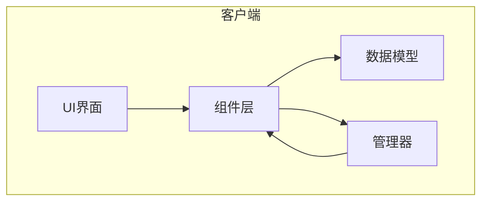
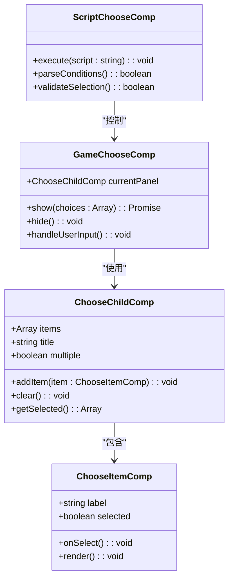
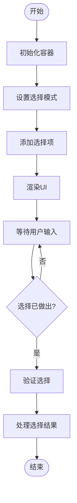
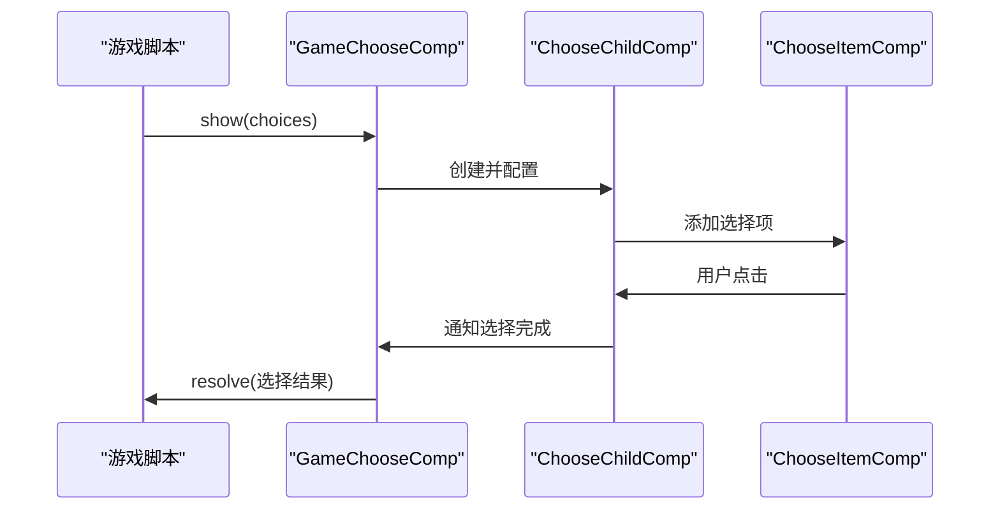
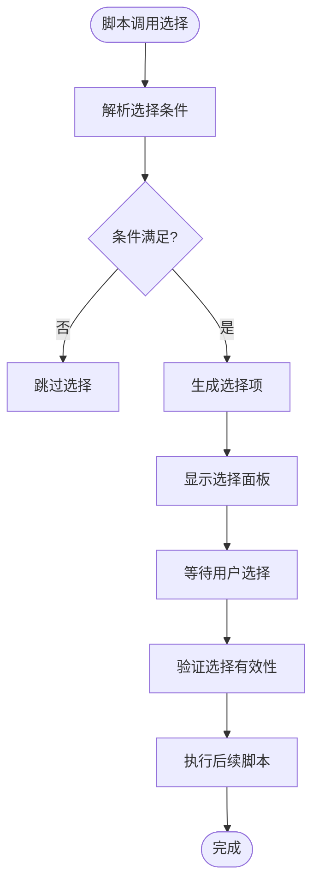
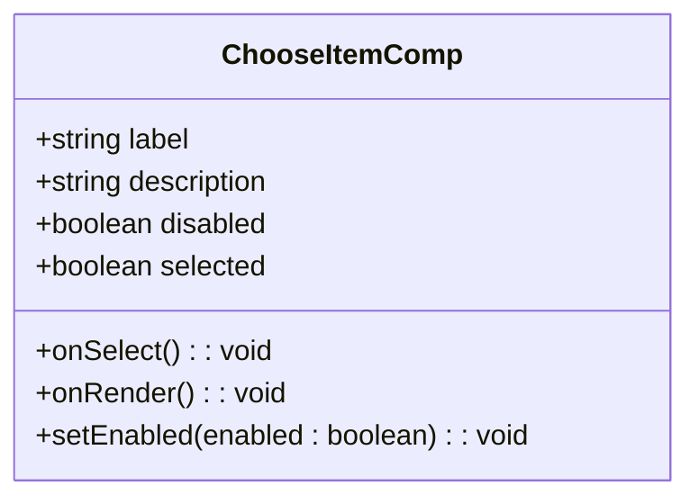
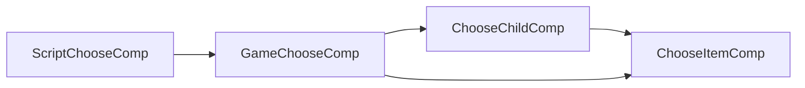

# 选择组件

<cite>
**本文档中引用的文件**  
- [ChooseChildComp.ts](file://client/src/comps/ChooseChildComp.ts)
- [GameChooseComp.ts](file://client/src/comps/GameChooseComp.ts)
- [ScriptChooseComp.ts](file://client/src/comps/ScriptChooseComp.ts)
- [ChooseItemComp.ts](file://client/src/comps/ChooseItemComp.ts)
</cite>

## 目录
1. [简介](#简介)
2. [项目结构](#项目结构)
3. [核心组件](#核心组件)
4. [架构概述](#架构概述)
5. [详细组件分析](#详细组件分析)
6. [依赖分析](#依赖分析)
7. [性能考虑](#性能考虑)
8. [故障排除指南](#故障排除指南)
9. [结论](#结论)

## 简介
本文档深入探讨了游戏客户端中选择组件的设计与实现机制。重点分析了 `ChooseChildComp`、`GameChooseComp` 和 `ScriptChooseComp` 三个核心组件在游戏流程中的作用，以及 `ChooseItemComp` 作为基础选择项的复用设计。文档详细解释了这些组件如何处理用户交互逻辑，包括单选、多选和条件选择等模式，并展示了其与UI界面和游戏逻辑层的数据交互方式。

## 项目结构
项目采用分层架构设计，前端代码位于 `client/src` 目录下，主要组件集中在 `comps` 文件夹中。选择相关的功能模块被组织为独立的可复用组件，遵循模块化开发原则。

**图示来源**
- [ChooseChildComp.ts](file://client/src/comps/ChooseChildComp.ts)
- [GameChooseComp.ts](file://client/src/comps/GameChooseComp.ts)

**本节来源**
- [client/src/comps](file://client/src/comps)

## 核心组件
选择系统由多个协同工作的组件构成，主要包括：
- **ChooseChildComp**：子选择容器，负责管理一组选择项
- **GameChooseComp**：游戏级选择控制器，协调整个选择流程
- **ScriptChooseComp**：脚本驱动的选择逻辑处理器
- **ChooseItemComp**：基础选择项，提供统一的交互接口

这些组件共同实现了灵活、可扩展的选择机制，支持复杂的游戏交互需求。

**本节来源**
- [ChooseChildComp.ts](file://client/src/comps/ChooseChildComp.ts)
- [GameChooseComp.ts](file://client/src/comps/GameChooseComp.ts)
- [ScriptChooseComp.ts](file://client/src/comps/ScriptChooseComp.ts)
- [ChooseItemComp.ts](file://client/src/comps/ChooseItemComp.ts)

## 架构概述
选择组件系统采用分层架构，从基础UI元素到高层游戏逻辑逐层封装。

**图示来源**
- [ChooseItemComp.ts](file://client/src/comps/ChooseItemComp.ts#L1-L50)
- [ChooseChildComp.ts](file://client/src/comps/ChooseChildComp.ts#L1-L60)
- [GameChooseComp.ts](file://client/src/comps/GameChooseComp.ts#L1-L40)
- [ScriptChooseComp.ts](file://client/src/comps/ScriptChooseComp.ts#L1-L35)

## 详细组件分析

### ChooseChildComp 分析
`ChooseChildComp` 作为选择项的容器组件，负责管理一组 `ChooseItemComp` 实例。它支持单选和多选模式，通过 `multiple` 属性控制选择行为。

**图示来源**
- [ChooseChildComp.ts](file://client/src/comps/ChooseChildComp.ts#L20-L80)

**本节来源**
- [ChooseChildComp.ts](file://client/src/comps/ChooseChildComp.ts#L1-L100)

### GameChooseComp 分析
`GameChooseComp` 是游戏选择流程的主控制器，负责显示选择面板、处理用户输入并返回结果。它采用 Promise 模式异步返回选择结果，便于在游戏脚本中使用。

**图示来源**
- [GameChooseComp.ts](file://client/src/comps/GameChooseComp.ts#L15-L60)
- [ChooseChildComp.ts](file://client/src/comps/ChooseChildComp.ts#L30-L50)

**本节来源**
- [GameChooseComp.ts](file://client/src/comps/GameChooseComp.ts#L1-L80)

### ScriptChooseComp 分析
`ScriptChooseComp` 负责解析和执行选择相关的脚本指令，支持条件判断和动态生成选择项。

**图示来源**
- [ScriptChooseComp.ts](file://client/src/comps/ScriptChooseComp.ts#L20-L70)

**本节来源**
- [ScriptChooseComp.ts](file://client/src/comps/ScriptChooseComp.ts#L1-L90)

### ChooseItemComp 分析
`ChooseItemComp` 作为基础选择项组件，提供了统一的外观和交互接口，支持复用和主题定制。

**图示来源**
- [ChooseItemComp.ts](file://client/src/comps/ChooseItemComp.ts#L10-L40)

**本节来源**
- [ChooseItemComp.ts](file://client/src/comps/ChooseItemComp.ts#L1-L60)

## 依赖分析
选择组件系统内部存在清晰的依赖关系，高层组件依赖低层组件，形成稳定的调用链。

**图示来源**
- [ScriptChooseComp.ts](file://client/src/comps/ScriptChooseComp.ts)
- [GameChooseComp.ts](file://client/src/comps/GameChooseComp.ts)
- [ChooseChildComp.ts](file://client/src/comps/ChooseChildComp.ts)
- [ChooseItemComp.ts](file://client/src/comps/ChooseItemComp.ts)

**本节来源**
- 所有选择组件文件

## 性能考虑
选择组件在设计时考虑了性能优化：
- 采用对象池模式复用选择项实例
- 使用虚拟滚动处理大量选择项
- 事件委托减少事件监听器数量
- 异步渲染避免界面卡顿

这些优化确保了即使在移动设备上也能流畅运行。

## 故障排除指南
常见问题及解决方案：

1. **选择项无法点击**
   - 检查 `disabled` 状态
   - 确认父容器未拦截事件

2. **多选模式失效**
   - 验证 `multiple` 属性设置
   - 检查选择逻辑是否正确实现

3. **选择结果未返回**
   - 确认 Promise 是否被正确 resolve
   - 检查异常处理逻辑

4. **界面渲染异常**
   - 验证数据绑定是否正确
   - 检查样式冲突

**本节来源**
- [GameChooseComp.ts](file://client/src/comps/GameChooseComp.ts#L50-L100)
- [ChooseChildComp.ts](file://client/src/comps/ChooseChildComp.ts#L60-L90)

## 结论
选择组件系统通过分层设计和模块化架构，实现了灵活、可扩展的选择功能。各组件职责分明，协作良好，支持复杂的游戏交互需求。建议在使用时遵循组件的设计原则，合理配置参数，以确保最佳的用户体验和性能表现。