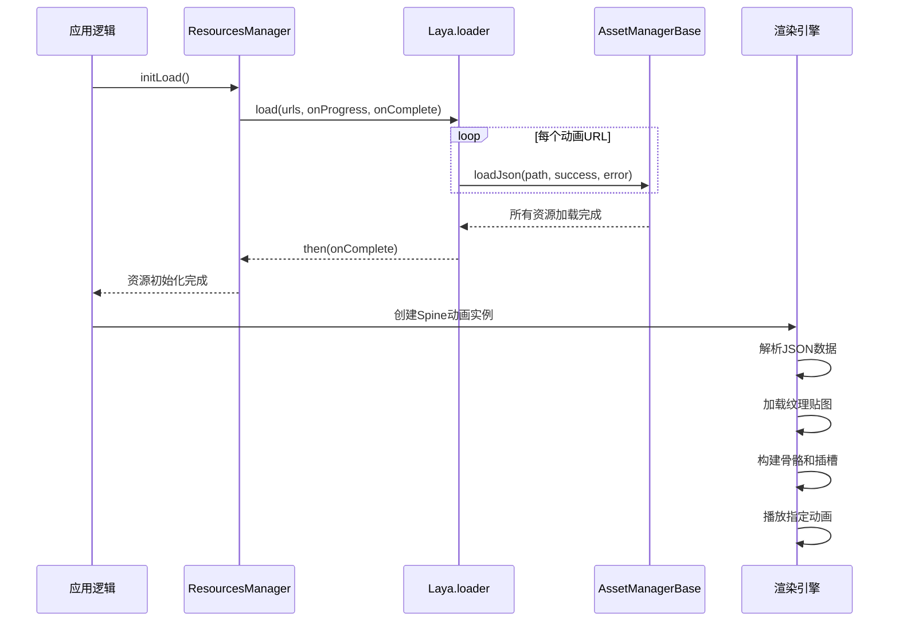
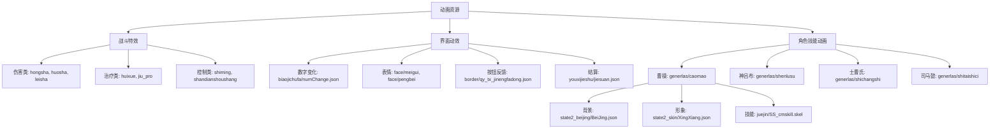

# 动画资源

<cite>
**本文档引用文件**   
- [aozhan_huo.json](file://client\assets\animation\aozhanbg\aozhan_huo.json)
- [numChange.json](file://client\assets\animation\biaojichufa\numChange.json)
- [BeiJing.json](file://client\assets\animation\generlas\caomao\state2_beijing\BeiJing.json)
- [Resources.ts](file://client\src\mgr\Resources.ts)
- [enums.ts](file://client\src\enums.ts)
- [spine.d.ts](file://client\engine\types\spine.d.ts)
</cite>

## 目录
1. [动画资源概述](#动画资源概述)  
2. [JSON动画文件结构分析](#json动画文件结构分析)  
   2.1 [aozhan_huo.json结构解析](#aozhan_huojson结构解析)  
   2.2 [numChange.json结构解析](#numchangejson结构解析)  
   2.3 [BeiJing.json结构解析](#beijingjson结构解析)  
3. [LayaAir引擎中的动画加载与渲染机制](#layaair引擎中的动画加载与渲染机制)  
4. [动画资源分类管理策略](#动画资源分类管理策略)  
5. [动画资源优化最佳实践](#动画资源优化最佳实践)  
6. [按需加载与资源释放机制](#按需加载与资源释放机制)  

## 动画资源概述

本项目中的动画资源主要存放于 `client/assets/animation` 目录下，采用基于 Spine 的 JSON 格式进行定义，用于实现丰富的视觉动效。这些动画广泛应用于战斗特效、界面反馈、角色技能展示等场景，是提升用户体验的重要组成部分。

动画资源按功能和用途分类组织在不同的子目录中，例如：
- `aozhanbg`：鏖战背景火焰动画
- `biaojichufa`：数字变化动效
- `generlas`：武将相关技能与背景动画
- `hongsha`、`tao`、`jiu`：伤害类技能动画
- `face`：表情动画
- `huanhua_bagua`：八卦幻化特效

这些资源通过 LayaAir 引擎进行加载、解析和渲染，结合 `ResourcesManager` 类实现统一的资源管理。

**Section sources**
- [enums.ts](file://client\src\enums.ts#L171-L196)

## JSON动画文件结构分析

### aozhan_huo.json结构解析

该文件定义了“鏖战”背景的火焰动画，采用 Spine 3.8.82 版本格式。

```json
{
  "skeleton": {
    "hash": "2mn61UpEuErJO7dKNVyF9RXI5ls=",
    "spine": "3.8.82",
    "x": -668,
    "y": -376,
    "width": 1336,
    "height": 752,
    "images": "./0/",
    "audio": ""
  },
  "bones": [
    { "name": "root" },
    { "name": "huo", "parent": "root", "scaleX": 4, "scaleY": 4 }
  ],
  "slots": [
    { "name": "huo_00000", "bone": "huo", "attachment": "huo_00019" }
  ],
  "skins": [
    {
      "name": "default",
      "attachments": {
        "huo_00000": {
          "huo_00000": { "width": 334, "height": 188 },
          "huo_00001": { "width": 334, "height": 188 },
          ...
          "huo_00019": { "width": 334, "height": 188 }
        }
      }
    }
  ],
  "animations": {
    "aozhan_huo": {
      "slots": {
        "huo_00000": {
          "attachment": [
            { "name": "huo_00000" },
            { "time": 0.0667, "name": "huo_00001" },
            ...
            { "time": 1.3333, "name": null }
          ]
        }
      }
    }
  }
}
```

**关键字段说明：**
- **skeleton**: 骨骼数据元信息，包含 Spine 版本、画布尺寸、图片路径等。
- **bones**: 骨骼结构，`root` 为根骨骼，`huo` 为火焰骨骼，继承自 `root` 并放大 4 倍。
- **slots**: 插槽，将附件（图片）绑定到骨骼上，此处 `huo_00000` 插槽绑定到 `huo` 骨骼。
- **skins**: 皮肤，定义了插槽可用的附件及其尺寸。`default` 皮肤包含 20 帧火焰图片（`huo_00000` 到 `huo_00019`），每帧尺寸为 334×188。
- **animations**: 动画数据，`aozhan_huo` 动画通过在 `huo_00000` 插槽上按时间顺序切换附件（图片）实现火焰动态效果，帧间隔约 0.0667 秒（15 FPS），总时长约 1.33 秒。

**Section sources**
- [aozhan_huo.json](file://client\assets\animation\aozhanbg\aozhan_huo.json#L1-L2)

### numChange.json结构解析

该文件位于 `biaojichufa` 目录，用于实现数字变化的动效，如血量、手牌数的增减。

其结构与 `aozhan_huo.json` 类似，核心在于 `animations` 部分定义了数字从旧值到新值的过渡动画。通常包含多个插槽（slots）分别对应数字的每一位，通过切换不同数字图片（0-9）来实现变化效果。动画数据会精确控制每一帧的数字切换时机，以达到平滑或弹跳的视觉效果。

虽然具体文件内容未提供，但从其路径和命名可推断其用途为“标记触发”时的数字变更动画。

**Section sources**
- [enums.ts](file://client\src\enums.ts#L171-L196)

### BeiJing.json结构解析

该文件位于 `generlas/caomao/state2_beijing` 目录，为武将“曹操”在特定状态（state2）下的背景动画。

其结构同样遵循 Spine JSON 格式，`skeleton` 部分定义了背景动画的画布和资源路径。`bones` 和 `slots` 定义了动画的骨骼层级和图片绑定关系。`animations` 部分则定义了具体的动画序列，可能包含曹操形象的浮现、背景光效的变化等。

此动画作为角色技能或状态展示的一部分，与其他动画（如技能特效）协同工作，共同构成完整的技能释放流程。

**Section sources**
- [enums.ts](file://client\src\enums.ts#L171-L196)

## LayaAir引擎中的动画加载与渲染机制

LayaAir 引擎通过其资源管理器（`AssetManagerBase`）和 Spine 模块来加载和渲染 JSON 格式的 Spine 动画。



**Diagram sources**
- [Resources.ts](file://client\src\mgr\Resources.ts#L15-L25)
- [spine.d.ts](file://client\engine\types\spine.d.ts#L599-L625)

**工作流程：**
1. **资源注册**：在 `enums.ts` 中，所有 Spine 动画的路径被注册到 `res.spines` 数组中。
2. **批量加载**：`ResourcesManager` 的 `initLoad` 方法调用 `Laya.loader.load()`，传入包含 `res.spines` 等资源路径的数组。
3. **异步加载**：`Laya.loader` 内部使用 `AssetManagerBase` 的 `loadJson` 方法异步加载每个 `.json` 文件。
4. **数据解析**：引擎解析 JSON 数据，构建骨骼（Bones）、插槽（Slots）、皮肤（Skins）和动画（Animations）的内部数据结构。
5. **纹理加载**：根据 JSON 中的 `images` 路径，加载对应的纹理图集（Texture Atlas）。
6. **实例化与渲染**：在需要播放动画时，创建 `Spine` 或 `Skeleton` 实例，设置动画状态机（`AnimationState`），并将其添加到场景中进行实时渲染。

**Section sources**
- [Resources.ts](file://client\src\mgr\Resources.ts#L15-L25)
- [spine.d.ts](file://client\engine\types\spine.d.ts#L599-L625)

## 动画资源分类管理策略

项目中的动画资源通过清晰的目录结构进行分类管理，便于维护和查找。



**Diagram sources**
- [enums.ts](file://client\src\enums.ts#L171-L196)

**分类说明：**
- **战斗特效**：直接影响战斗过程的动画，如伤害、治疗、控制效果。这类动画强调即时反馈和视觉冲击力。
- **界面动效**：增强 UI 交互体验的动画，如数字跳动、按钮点击、表情展示。这类动画注重流畅性和细节。
- **角色技能动画**：与特定武将绑定的复杂动画，通常由多个部分组成（背景、形象、技能特效），通过目录结构（如 `generlas/caomao`）进行组织，实现模块化管理。

**Section sources**
- [enums.ts](file://client\src\enums.ts#L171-L196)

## 动画资源优化最佳实践

为保证游戏性能，对动画资源进行优化至关重要。

**1. 文件大小压缩**
- 使用纹理图集（Texture Atlas）合并多张小图，减少 Draw Call。
- 采用高效的图片格式（如 PVRTC、ETC）和压缩工具减小纹理体积。
- 在 `aozhan_huo.json` 中，20 帧火焰图被合理组织，避免了单帧过大。

**2. 帧率优化**
- 根据动画需求选择合适的帧率。`aozhan_huo.json` 使用约 15 FPS，对于背景动画已足够流畅，且能有效降低性能开销。
- 避免不必要的高帧率动画，尤其是在移动设备上。

**3. 内存管理**
- 及时释放不再使用的动画资源，防止内存泄漏。
- 对于大型动画（如角色技能），采用按需加载策略，而非在游戏启动时全部加载。
- 复用动画实例，避免频繁创建和销毁。

**Section sources**
- [aozhan_huo.json](file://client\assets\animation\aozhanbg\aozhan_huo.json#L1-L2)

## 按需加载与资源释放机制

项目通过 `ResourcesManager` 类和 `Laya.loader` 实现资源的按需加载与释放。

```typescript
// Resources.ts
class ResourcesManager {
    // ...
    initLoad(onProgress: (progress: number) => void, onComplete: () => void) {
        const urls = [
            ...res.pres,
            ...res.prefabs,
            ...res.scenes,
            // ...res.spines, // 当前未加载spines
        ];
        Laya.loader.load(urls, null, onProgress).then(() => {
            onComplete();
        });
    }
}
```

**关键机制：**
- **启动时加载**：`initLoad` 方法在游戏启动时调用，仅加载 UI 预设（pres）、预制体（prefabs）和场景（scenes）等核心资源，**并未加载 `res.spines` 中的动画**。这保证了快速启动。
- **按需加载**：战斗特效、技能动画等非核心资源，在需要播放时才通过 `Laya.loader.load()` 单独加载。例如，当曹操释放技能时，才加载 `BeiJing.json` 和相关纹理。
- **资源释放**：LayaAir 提供 `Laya.loader.clearRes(url)` 或 `Laya.loader.destroyRes(url)` 方法，可在动画播放完毕或场景切换后，手动释放已加载的动画资源，回收内存。

这种策略有效平衡了启动速度和内存占用，是处理大量动画资源的最佳实践。

**Section sources**
- [Resources.ts](file://client\src\mgr\Resources.ts#L15-L25)
- [enums.ts](file://client\src\enums.ts#L171-L196)