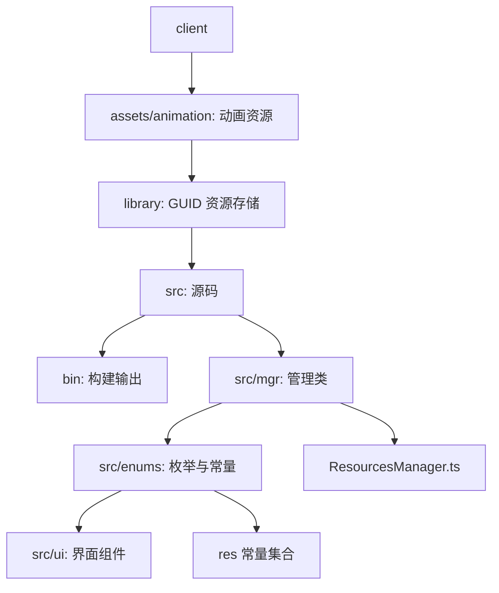
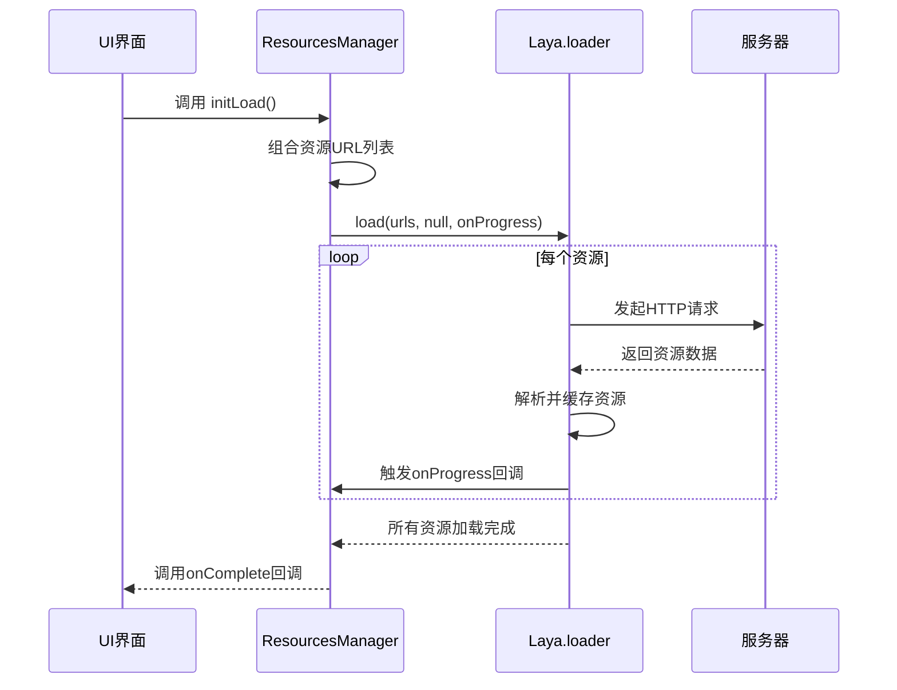
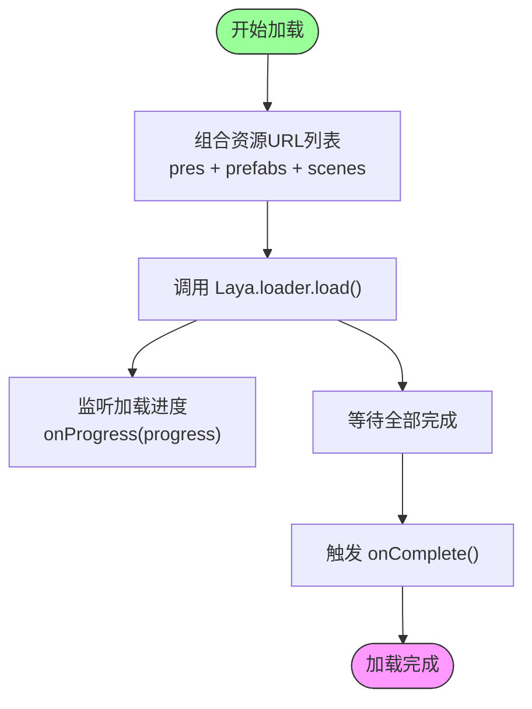
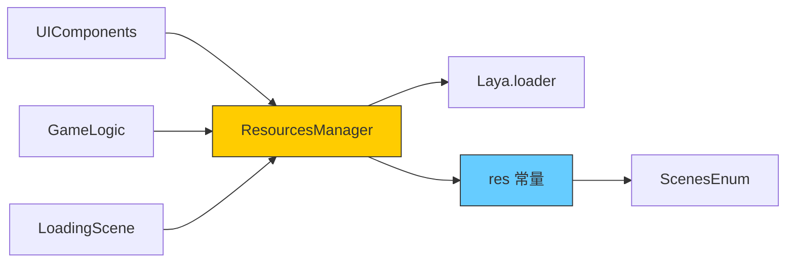

# 资源加载器

<cite>
**本文档引用的文件**  
- [Resources.ts](file://client/src/mgr/Resources.ts#L1-L31)
- [enums.ts](file://client/src/enums.ts#L1-L232)
</cite>

## 目录
1. [简介](#简介)
2. [项目结构](#项目结构)
3. [核心组件](#核心组件)
4. [架构概述](#架构概述)
5. [详细组件分析](#详细组件分析)
6. [依赖分析](#依赖分析)
7. [性能考虑](#性能考虑)
8. [故障排除指南](#故障排除指南)
9. [结论](#结论)

## 简介
本项目为一个基于 LayaAir 引擎的前端游戏客户端，核心功能之一是资源加载管理。`ResourcesManager` 类负责统一管理所有静态资源的加载流程，包括预设、场景、字体、动画等。通过枚举和路径集合的方式组织资源，实现了模块化、可维护性强的资源加载机制。本文档将深入分析资源加载器的设计架构、实现机制、加载策略以及与项目其他部分的集成方式。

## 项目结构
项目采用典型的前后端分离架构，前端位于 `client` 目录，后端位于 `server` 目录。前端资源组织清晰，主要结构如下：



**图示来源**  
- [project_structure](file://#L1-L200)

## 核心组件
资源加载的核心由 `ResourcesManager` 类和 `res` 常量集合构成。`ResourcesManager` 是一个单例模式的管理器，负责初始化加载流程；`res` 对象则集中定义了所有需要预加载的资源路径。

**组件来源**  
- [Resources.ts](file://client/src/mgr/Resources.ts#L1-L31)
- [enums.ts](file://client/src/enums.ts#L1-L232)

## 架构概述
整个资源加载系统采用“配置集中化 + 加载单例化”的设计模式。资源路径通过 `res` 对象按类型分类管理，加载逻辑由 `ResourcesManager` 统一调度，通过 LayaAir 的 `loader.load` 方法异步加载。



**图示来源**  
- [Resources.ts](file://client/src/mgr/Resources.ts#L10-L31)
- [enums.ts](file://client/src/enums.ts#L1-L232)

## 详细组件分析

### 资源管理器分析
`ResourcesManager` 类采用单例模式确保全局唯一实例，避免重复加载和资源浪费。

```mermaid
classDiagram
class ResourcesManager {
-static instance : ResourcesManager
+static getInstance() : ResourcesManager
-constructor()
+initLoad(onProgress : (number) => void, onComplete : () => void)
}
note right of ResourcesManager
单例模式确保全局唯一实例
initLoad 启动预加载流程
end
```

**图示来源**  
- [Resources.ts](file://client/src/mgr/Resources.ts#L3-L31)

#### 资源枚举与路径管理
`res` 对象在 `enums.ts` 中定义，将所有资源按类型分组，便于管理和按需加载。

```typescript
export const res = {
    pres: [ /* 预设UI组件 */ ],
    scenes: [ /* 场景文件 */ ],
    prefabs: [ /* 预制体 */ ],
    images: [ /* 图片 */ ],
    fonts: [ /* 字体 */ ],
    spines: [ /* Spine动画 */ ],
    sks: [ /* 特效资源 */ ],
    animations: [ /* Atlas图集 */ ]
};
```

这种设计优势在于：
- **可维护性**：所有路径集中管理，修改方便。
- **可读性**：按类型分组，逻辑清晰。
- **灵活性**：可通过 `...` 操作符合并不同资源组，实现按需加载。

**组件来源**  
- [enums.ts](file://client/src/enums.ts#L25-L200)

### 加载流程分析
`initLoad` 方法是资源加载的入口，接收进度和完成回调函数。



**图示来源**  
- [Resources.ts](file://client/src/mgr/Resources.ts#L10-L20)

## 依赖分析
资源加载器与其他模块存在明确的依赖关系。



**图示来源**  
- [Resources.ts](file://client/src/mgr/Resources.ts#L1-L31)
- [enums.ts](file://client/src/enums.ts#L1-L232)

## 性能考虑
- **资源分组加载**：当前 `initLoad` 只加载 `pres`、`prefabs`、`scenes`，避免一次性加载全部资源，提升启动速度。
- **异步加载**：使用 `Laya.loader.load().then()` 实现异步非阻塞加载，保证主线程流畅。
- **缓存机制**：LayaAir 内置资源缓存，相同资源不会重复请求。
- **按需加载建议**：对于 `spines`、`animations` 等大型资源，建议在进入具体场景时动态加载，而非全部预加载。

## 故障排除指南
常见问题及解决方案：

| 问题现象 | 可能原因 | 解决方案 |
|--------|--------|--------|
| 加载进度卡住 | 资源路径错误 | 检查 `res` 中路径是否正确，文件是否存在 |
| 某些UI不显示 | 预设未加载 | 确认相关 `.lh` 文件已加入 `pres` 或 `prefabs` 列表 |
| 动画不播放 | Spine资源未加载 | 检查 `spines` 路径，确保 `.json` 和纹理正确 |
| 字体显示异常 | 字体未加载 | 确认字体文件在 `fonts` 列表中，且格式支持 |

**组件来源**  
- [Resources.ts](file://client/src/mgr/Resources.ts#L10-L31)
- [enums.ts](file://client/src/enums.ts#L1-L232)

## 结论
`ResourcesManager` 实现了一个简洁高效的资源加载系统，通过单例模式和集中化配置，有效管理了游戏客户端的静态资源加载。其设计符合前端性能优化原则，具备良好的可维护性和扩展性。未来可进一步优化按需加载策略，结合资源包（Bundle）实现更精细的加载控制，提升用户体验。