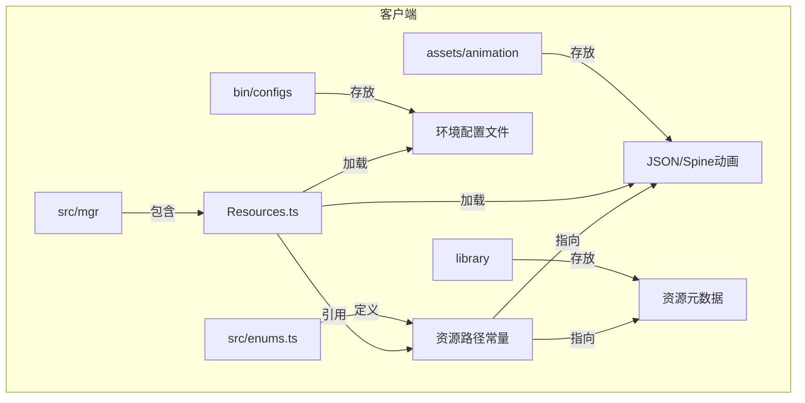
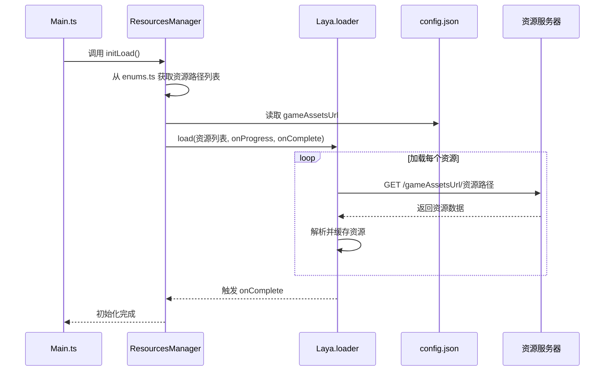
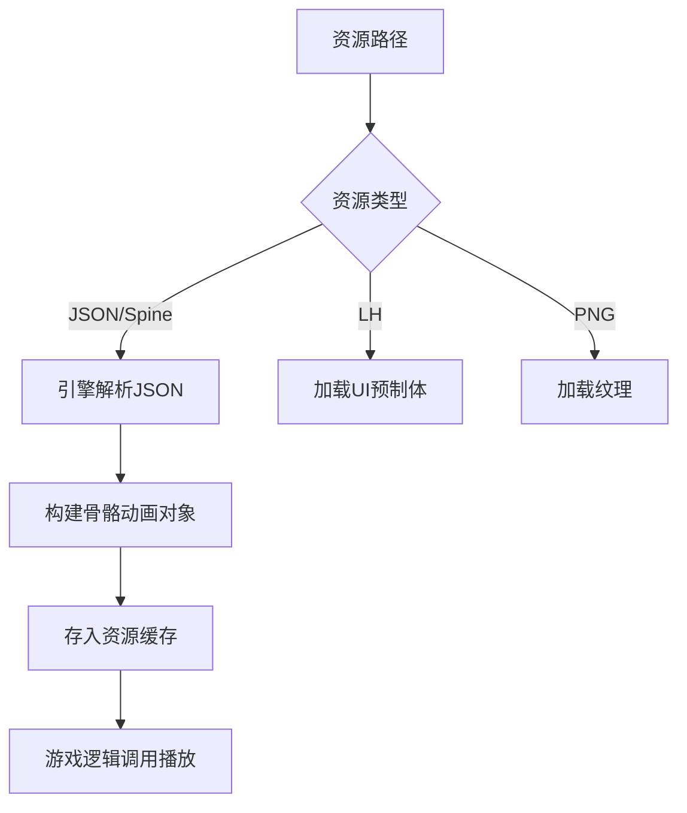
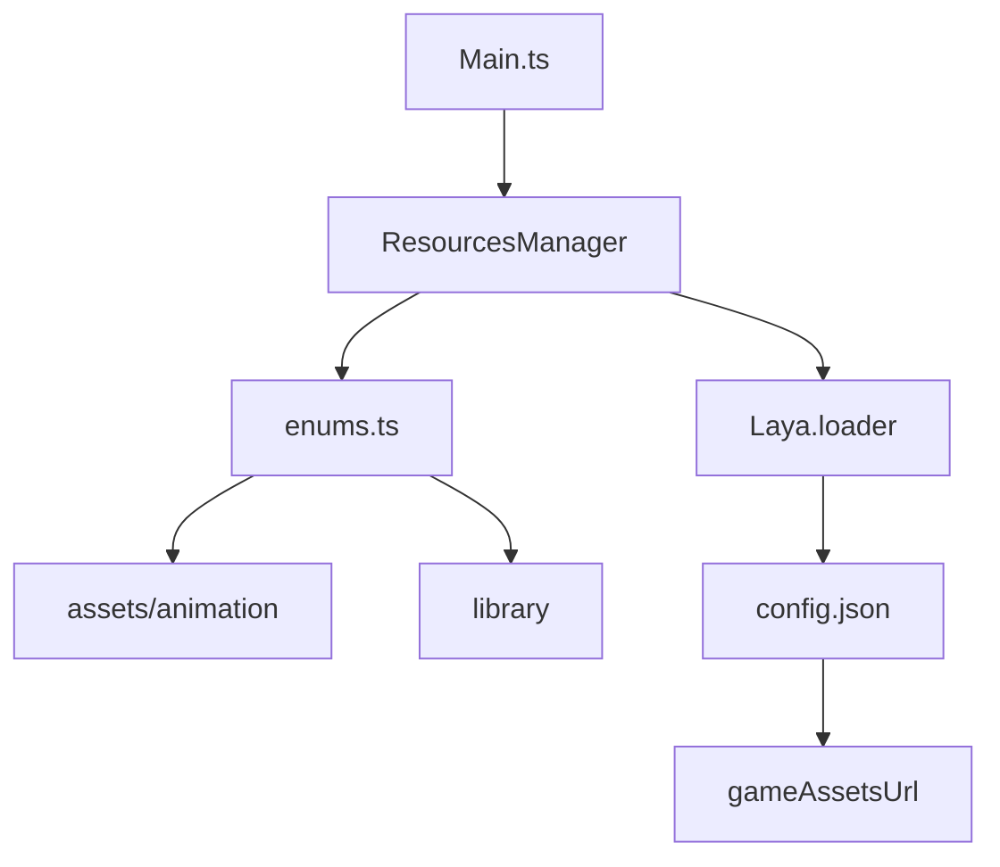

# 资源管理

<cite>
**本文档引用文件**  
- [Resources.ts](file://client/src/mgr/Resources.ts#L1-L31)
- [enums.ts](file://client/src/enums.ts#L1-L232)
- [config.development.json](file://client/bin/configs/config.development.json#L1-L6)
- [config.production.json](file://client/bin/configs/config.production.json#L1-L6)
- [Main.ts](file://client/src/Main.ts)
</cite>

## 目录
1. [简介](#简介)
2. [项目结构](#项目结构)
3. [核心组件](#核心组件)
4. [架构概览](#架构概览)
5. [详细组件分析](#详细组件分析)
6. [依赖分析](#依赖分析)
7. [性能考虑](#性能考虑)
8. [故障排除指南](#故障排除指南)
9. [结论](#结论)

## 简介
本文档详细阐述了前端资源管理系统的实现机制，涵盖资源加载器、JSON动画文件解析、环境配置管理、资源存储结构、加载策略、版本控制与热更新等核心功能。系统基于 LayaAir 引擎构建，采用模块化设计，通过统一的资源管理器协调各类资源的加载与使用，确保游戏运行的高效性与稳定性。

## 项目结构
项目采用分层结构组织资源与代码，主要分为 `client`（客户端）和 `server`（服务端）两大模块。客户端资源管理集中在 `client` 目录下，关键路径包括：
- `assets/animation`: 存放所有 Spine 和 JSON 格式的动画资源。
- `bin/configs`: 包含开发与生产环境的配置文件。
- `library`: 存储由引擎生成的资源元数据文件（.json），按哈希值前缀分目录存储。
- `src/mgr`: 包含 `Resources.ts`，是资源管理的核心逻辑。
- `src/enums.ts`: 定义了资源路径常量和枚举。

这种结构实现了资源、配置、代码的清晰分离，便于维护和部署。



**图示来源**
- [Resources.ts](file://client/src/mgr/Resources.ts#L1-L31)
- [enums.ts](file://client/src/enums.ts#L1-L232)

**本节来源**
- [Resources.ts](file://client/src/mgr/Resources.ts#L1-L31)
- [enums.ts](file://client/src/enums.ts#L1-L232)

## 核心组件
资源管理的核心是 `ResourcesManager` 类，它是一个单例模式的管理器，负责初始化加载预设资源。其主要功能是聚合来自 `enums.ts` 中定义的各类资源路径（如预制体、场景、Spine动画等），并调用 LayaAir 的 `loader.load` 方法进行批量加载。加载过程支持进度回调和完成回调，为游戏启动流程提供了良好的控制能力。

**本节来源**
- [Resources.ts](file://client/src/mgr/Resources.ts#L1-L31)
- [enums.ts](file://client/src/enums.ts#L1-L232)

## 架构概览
整个资源管理流程遵循“配置驱动、按需加载”的原则。系统启动时，`Main.ts` 会调用 `ResourcesManager` 的 `initLoad` 方法。该方法根据 `enums.ts` 中定义的资源列表，向 LayaAir 引擎的加载器发起请求。加载器会根据当前环境（开发或生产）从相应的服务器或本地路径获取资源。加载完成后，资源被缓存，后续可通过路径直接引用。



**图示来源**
- [Resources.ts](file://client/src/mgr/Resources.ts#L1-L31)
- [enums.ts](file://client/src/enums.ts#L1-L232)
- [config.development.json](file://client/bin/configs/config.development.json#L1-L6)
- [config.production.json](file://client/bin/configs/config.production.json#L1-L6)

## 详细组件分析

### 资源加载器实现机制
`ResourcesManager` 类的实现遵循单例模式，确保全局只有一个实例。其 `initLoad` 方法是资源加载的入口。

```typescript
initLoad(onProgress: (progress: number) => void, onComplete: () => void) {
    const urls = [
        ...res.pres,      // 预制体
        ...res.prefabs,   // UI组件
        ...res.scenes,    // 场景
    ];
    Laya.loader.load(urls, null, onProgress).then(() => {
        onComplete();
    });
}
```
该方法将 `enums.ts` 中定义的 `pres`, `prefabs`, `scenes` 等资源路径合并为一个数组，然后传递给 LayaAir 的加载器。加载器会异步加载这些资源，并在加载过程中调用 `onProgress` 回调更新进度条，在全部加载完成后调用 `onComplete` 回调通知主程序。

**本节来源**
- [Resources.ts](file://client/src/mgr/Resources.ts#L1-L31)
- [enums.ts](file://client/src/enums.ts#L1-L232)

### JSON动画文件加载与解析
项目中的动画资源主要以 JSON 格式（Spine）存储在 `assets/animation` 目录下。这些资源的路径被定义在 `enums.ts` 的 `res.spines` 数组中。当 `ResourcesManager` 加载这些路径时，LayaAir 引擎会自动解析 JSON 文件，还原出动画的骨骼、皮肤、插槽等信息，并将其作为可播放的动画资源存入内存。例如，`resources/animation/generlas/caomao/juejin/SS_cmskill.skel` 就是曹操的技能动画。



**图示来源**
- [enums.ts](file://client/src/enums.ts#L1-L232)
- [Resources.ts](file://client/src/mgr/Resources.ts#L1-L31)

### 环境配置文件使用与切换
项目通过 `config.development.json` 和 `config.production.json` 两个文件来区分开发和生产环境。

- **开发环境配置** (`config.development.json`):
  ```json
  {
      "serverHost": "192.168.1.3",
      "serverPort": 12699,
      "gameAssetsUrl": "."
  }
  ```
  此配置指向本地开发服务器，资源路径为当前目录 (`.`)，便于开发者快速迭代。

- **生产环境配置** (`config.production.json`):
  ```json
  {
      "serverHost": "47.93.84.143",
      "serverPort": 12699,
      "gameAssetsUrl": "http://res.resgs.com"
  }
  ```
  此配置指向线上服务器，资源路径为CDN地址，确保玩家能从最快的节点下载资源。

切换机制通常由构建脚本或启动参数决定，系统会根据当前环境选择加载对应的配置文件，从而自动连接到正确的服务器和资源地址。

**本节来源**
- [config.development.json](file://client/bin/configs/config.development.json#L1-L6)
- [config.production.json](file://client/bin/configs/config.production.json#L1-L6)

### library目录资源存储与索引
`library` 目录是 LayaAir 项目的资源库，存放所有导入资源的元数据。这些元数据文件（.json）包含了资源的UUID、类型、依赖关系等信息。目录按资源UUID的前两位（如 `00`, `01`）进行哈希分片存储，这种结构能有效避免单个目录下文件过多，提高文件系统的访问效率。当 `ResourcesManager` 加载一个资源路径时，引擎会先在 `library` 中查找该路径对应的UUID，再根据UUID找到具体的资源文件进行加载。

**本节来源**
- [project_structure](file://#project-structure)

### 资源加载最佳实践
- **预加载**: 在游戏启动或场景切换前，使用 `ResourcesManager` 的 `initLoad` 方法批量加载必需资源，确保后续流程流畅。
- **按需加载**: 对于非关键或大体积资源（如某个角色的详细模型），在需要时再单独调用 `Laya.loader.load` 进行加载，减少初始加载时间。
- **缓存策略**: LayaAir 加载器内置了内存缓存。已加载的资源会常驻内存，重复加载同一路径会直接返回缓存对象，避免重复IO开销。

### 资源版本管理与热更新
- **版本管理**: 通过 `config.production.json` 中的 `gameAssetsUrl` 指向CDN，可以方便地通过更新CDN上的文件来发布新版本资源。
- **热更新机制**: 项目中的 `client/bin/update` 目录包含 `hot_update.json` 和 `version.txt`，这表明系统实现了热更新。其基本流程是：客户端启动时检查 `version.txt` 获取当前版本号，与服务器端版本号比对，若不一致，则根据 `hot_update.json` 中的差异列表，只下载变更的资源文件，从而实现无需重新安装的更新。

### 资源路径与加载优先级管理
所有资源路径均在 `enums.ts` 的 `res` 对象中集中定义。这使得路径管理变得非常清晰和统一。加载优先级通过 `initLoad` 方法中 `urls` 数组的顺序隐式体现：数组靠前的资源会优先被加载。例如，将基础UI组件 (`pres`) 放在最前面，确保加载进度条等界面元素能尽早显示。

**本节来源**
- [enums.ts](file://client/src/enums.ts#L1-L232)
- [Resources.ts](file://client/src/mgr/Resources.ts#L1-L31)
- [project_structure](file://#project-structure)

## 依赖分析
资源管理系统的主要依赖关系如下：
- `Main.ts` 依赖 `ResourcesManager` 来启动加载流程。
- `ResourcesManager` 依赖 `enums.ts` 获取资源路径。
- `ResourcesManager` 依赖 LayaAir 引擎的 `loader` 模块进行实际加载。
- 所有资源文件依赖 `config.json` 中的 `gameAssetsUrl` 来确定加载根路径。



**图示来源**
- [Main.ts](file://client/src/Main.ts)
- [Resources.ts](file://client/src/mgr/Resources.ts#L1-L31)
- [enums.ts](file://client/src/enums.ts#L1-L232)

**本节来源**
- [Main.ts](file://client/src/Main.ts)
- [Resources.ts](file://client/src/mgr/Resources.ts#L1-L31)
- [enums.ts](file://client/src/enums.ts#L1-L232)

## 性能考虑
- **批量加载**: `initLoad` 方法将多个资源合并为一次批量请求，减少了网络连接的开销。
- **分层加载**: 通过区分预加载和按需加载，优化了启动时间和内存占用。
- **缓存利用**: 充分利用引擎的资源缓存，避免重复加载和解析。
- **CDN加速**: 生产环境使用CDN分发资源，极大提升了全球玩家的加载速度。

## 故障排除指南
- **资源加载失败**: 检查 `config.json` 中的 `gameAssetsUrl` 是否正确，确保服务器能访问对应路径下的资源文件。
- **动画不显示**: 确认 `enums.ts` 中的 Spine 资源路径是否正确，且 `.json` 和 `.atlas` 等配套文件齐全。
- **热更新不生效**: 检查 `version.txt` 的版本号是否已更新，以及 `hot_update.json` 的格式是否正确。

**本节来源**
- [config.development.json](file://client/bin/configs/config.development.json#L1-L6)
- [config.production.json](file://client/bin/configs/config.production.json#L1-L6)
- [enums.ts](file://client/src/enums.ts#L1-L232)

## 结论
本资源管理系统设计合理，通过单例管理器、集中式路径定义和环境配置分离，实现了高效、灵活的资源加载。结合 LayaAir 引擎的能力，系统支持预加载、按需加载、缓存和热更新，为游戏的稳定运行和持续迭代提供了坚实的基础。遵循本文档的最佳实践，可以进一步优化资源管理的性能和用户体验。