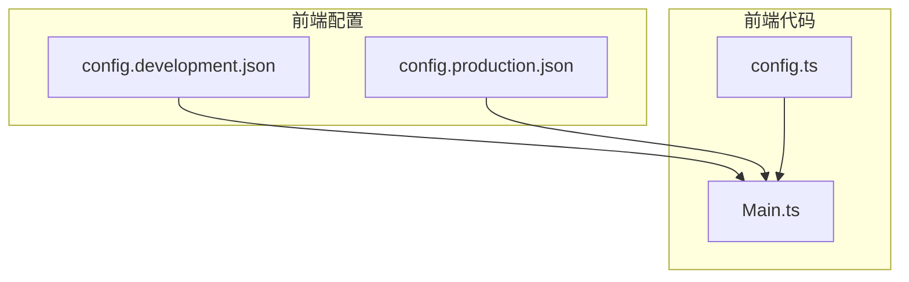
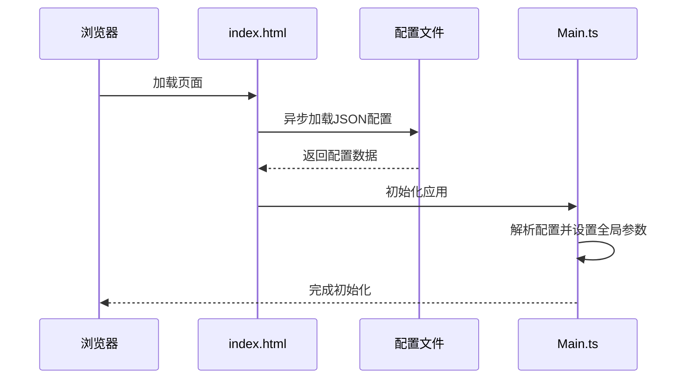
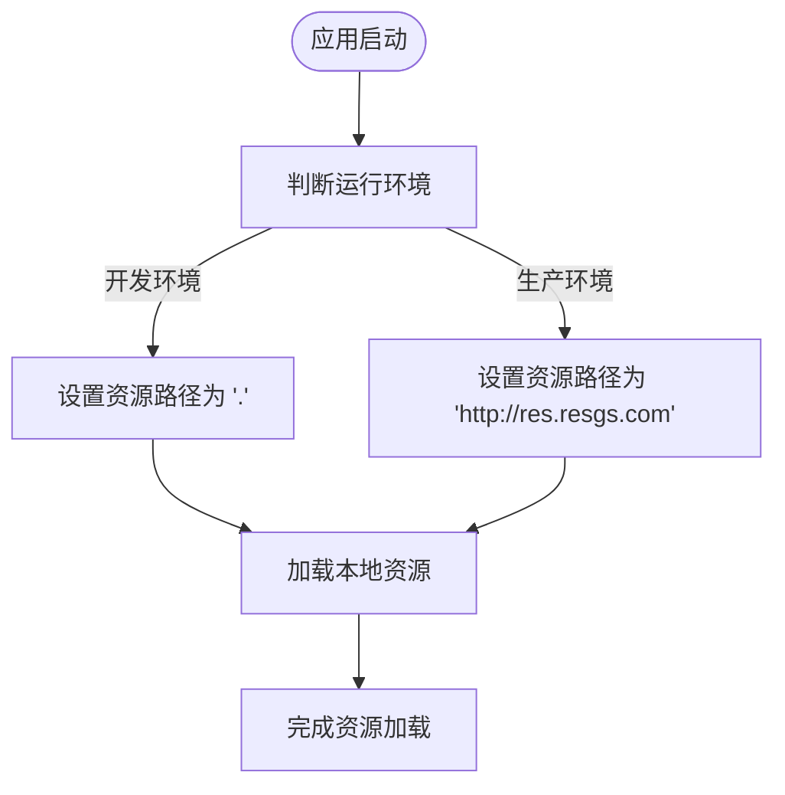
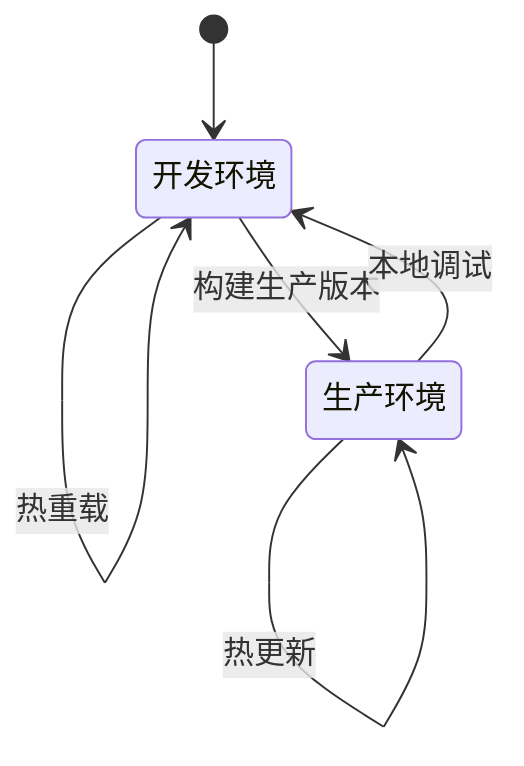

# 配置管理

<cite>
**本文档中引用的文件**   
- [config.development.json](file://client/bin/configs/config.development.json)
- [config.production.json](file://client/bin/configs/config.production.json)
- [config.ts](file://client/src/config.ts)
</cite>

## 目录
1. [项目结构分析](#项目结构分析)
2. [环境配置文件详解](#环境配置文件详解)
3. [配置加载与解析流程](#配置加载与解析流程)
4. [资源配置策略](#资源配置策略)
5. [环境切换与热更新](#环境切换与热更新)
6. [安全性考虑](#安全性考虑)
7. [最佳实践](#最佳实践)

## 项目结构分析

前端配置文件位于 `client/bin/configs/` 目录下，包含两个核心配置文件：`config.development.json`（开发环境）和 `config.production.json`（生产环境）。这些配置文件在构建过程中被前端代码读取并用于初始化应用运行参数。



**图示来源**
- [config.development.json](file://client/bin/configs/config.development.json)
- [config.production.json](file://client/bin/configs/config.production.json)
- [config.ts](file://client/src/config.ts)

**本节来源**
- [config.development.json](file://client/bin/configs/config.development.json)
- [config.production.json](file://client/bin/configs/config.production.json)

## 环境配置文件详解

### 开发环境配置 (config.development.json)

```json
{
    "serverHost": "192.168.1.3",
    "serverPort": 12699,
    "gameAssetsUrl": "."
}
```

**字段说明：**
- **serverHost**: 后端服务器IP地址，开发环境使用局域网IP `192.168.1.3`
- **serverPort**: 服务器端口，固定为 `12699`
- **gameAssetsUrl**: 游戏资源基础路径，开发环境使用相对路径 `.`

### 生产环境配置 (config.production.json)

```json
{
    "serverHost": "47.93.84.143",
    "serverPort": 12699,
    "gameAssetsUrl": "http://res.resgs.com"
}
```

**字段说明：**
- **serverHost**: 生产环境使用公网IP `47.93.84.143`
- **serverPort**: 服务器端口保持一致，为 `12699`
- **gameAssetsUrl**: 生产环境使用CDN域名 `http://res.resgs.com`

### 配置差异分析

| 配置项 | 开发环境 | 生产环境 | 用途 |
|--------|----------|----------|------|
| **serverHost** | 192.168.1.3 | 47.93.84.143 | 服务器地址 |
| **gameAssetsUrl** | . | http://res.resgs.com | 资源加载路径 |

**核心差异：**
1. **服务器地址**：开发环境使用内网IP便于本地调试，生产环境使用公网IP确保外部访问
2. **资源路径**：开发环境使用相对路径加载本地资源，生产环境使用CDN域名实现资源加速分发

**本节来源**
- [config.development.json](file://client/bin/configs/config.development.json#L1-L5)
- [config.production.json](file://client/bin/configs/config.production.json#L1-L5)

## 配置加载与解析流程

### 配置加载时序图



**图示来源**
- [config.development.json](file://client/bin/configs/config.development.json)
- [config.production.json](file://client/bin/configs/config.production.json)
- [config.ts](file://client/src/config.ts)

### 配置解析实现

在 `client/src/config.ts` 文件中定义了全局配置对象：

```typescript
export const ServerConfig = {
    host: '47.93.84.143',
    port: 12699,
    res_url: 'http://res.resgs.com',
};
```

该配置与JSON文件内容保持一致，作为TypeScript代码中的常量引用。

**配置映射关系：**
- `serverHost` → `ServerConfig.host`
- `serverPort` → `ServerConfig.port`
- `gameAssetsUrl` → `ServerConfig.res_url`

**本节来源**
- [config.development.json](file://client/bin/configs/config.development.json)
- [config.production.json](file://client/bin/configs/config.production.json)
- [config.ts](file://client/src/config.ts#L1-L10)

## 资源配置策略

### 资源路径管理

通过 `gameAssetsUrl` 配置项实现资源路径的环境适配：



**优势：**
- 开发阶段无需部署资源服务器，直接使用本地文件
- 生产环境通过CDN实现资源缓存和加速
- 代码无需修改即可适应不同环境

### 服务器地址管理

统一通过配置文件管理后端API地址，避免硬编码：

```typescript
// 示例：网络请求配置
const apiUrl = `http://${ServerConfig.host}:${ServerConfig.port}/api`;
```

**本节来源**
- [config.development.json](file://client/bin/configs/config.development.json)
- [config.production.json](file://client/bin/configs/config.production.json)
- [config.ts](file://client/src/config.ts)

## 环境切换与热更新

### 环境切换机制

通过构建脚本或手动替换配置文件实现环境切换：



### 配置热更新方案

虽然当前配置文件在构建时确定，但可通过以下方式实现热更新：

1. **远程配置服务**：启动时从服务器获取最新配置
2. **本地存储覆盖**：将用户自定义配置保存在localStorage中优先使用
3. **动态加载**：通过fetch API动态获取配置文件

**示例代码：**
```typescript
async function loadConfig() {
    const response = await fetch('/bin/configs/config.json');
    return await response.json();
}
```

**本节来源**
- [config.development.json](file://client/bin/configs/config.development.json)
- [config.production.json](file://client/bin/configs/config.production.json)

## 安全性考虑

### 敏感信息保护

当前配置文件包含服务器地址等敏感信息，建议采取以下措施：

1. **环境变量注入**：构建时通过环境变量替换敏感信息
2. **配置加密**：对配置文件进行简单加密，运行时解密
3. **分离敏感配置**：将敏感信息放在后端管理，前端仅获取必要信息

### 防篡改机制

为防止配置被恶意修改，可实施：
- **完整性校验**：计算配置文件哈希值进行验证
- **HTTPS传输**：确保配置文件传输过程安全
- **运行时校验**：检查配置值是否在合理范围内

**本节来源**
- [config.development.json](file://client/bin/configs/config.development.json)
- [config.production.json](file://client/bin/configs/config.production.json)

## 最佳实践

### 配置版本管理

1. **Git版本控制**：将配置文件纳入版本管理
2. **变更记录**：记录每次配置变更的原因和影响
3. **备份机制**：定期备份重要环境的配置文件

### 多环境部署策略

| 环境 | serverHost | gameAssetsUrl | 用途 |
|------|------------|---------------|------|
| **开发** | 192.168.1.3 | . | 本地开发调试 |
| **测试** | test.resgs.com | http://test.res.resgs.com | 测试验证 |
| **预发布** | staging.resgs.com | http://staging.res.resgs.com | 上线前验证 |
| **生产** | 47.93.84.143 | http://res.resgs.com | 正式运行 |

### 配置管理建议

1. **统一命名规范**：保持配置项命名一致性
2. **文档化**：为每个配置项添加详细说明
3. **默认值机制**：提供合理的默认配置
4. **类型安全**：使用TypeScript接口定义配置结构

```typescript
interface AppConfig {
    serverHost: string;
    serverPort: number;
    gameAssetsUrl: string;
}
```

**本节来源**
- [config.development.json](file://client/bin/configs/config.development.json)
- [config.production.json](file://client/bin/configs/config.production.json)
- [config.ts](file://client/src/config.ts)