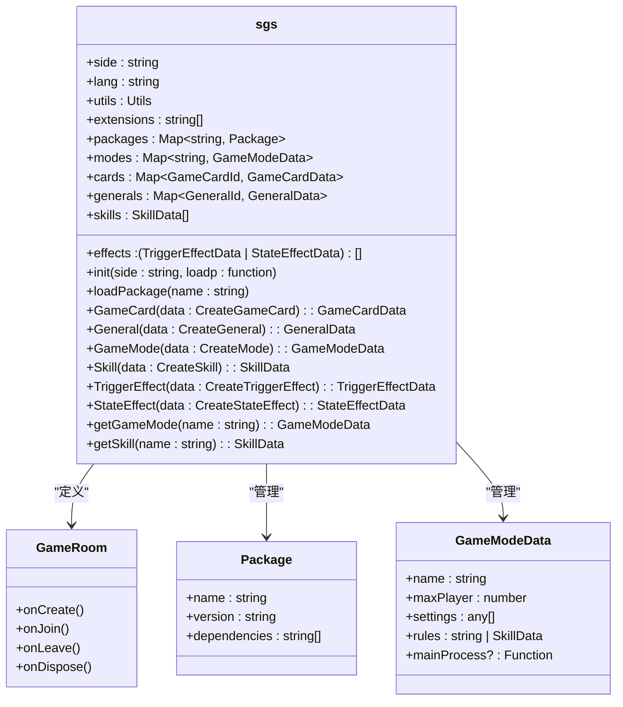
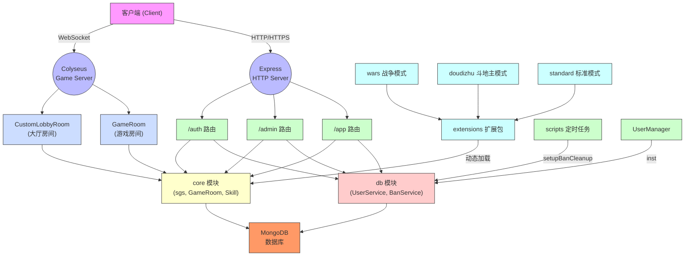
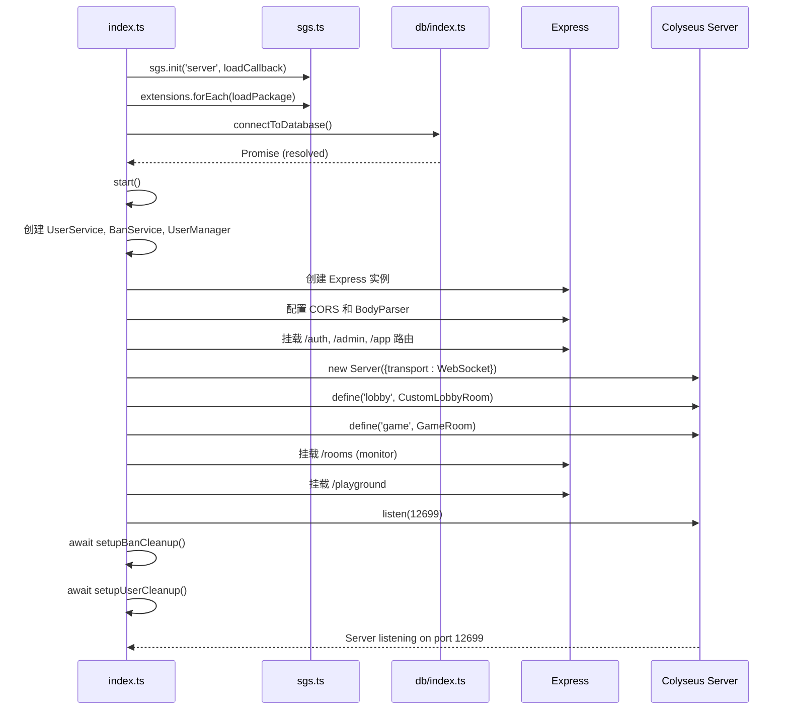

# 后端目录结构

<cite>
**本文档引用的文件**  
- [index.ts](file://server/src/index.ts#L1-L102)
- [sgs.ts](file://server/src/core/sgs.ts#L1-L991)
- [tsconfig.json](file://server/tsconfig.json#L1-L19)
- [README.md](file://server/README.md#L1-L30)
- [extensions.config.ts](file://server/src/core/extensions.config.ts)
- [game.ts](file://server/src/rooms/game.ts)
- [lobby.ts](file://server/src/rooms/lobby.ts)
- [UserManager.ts](file://server/src/UserManager.ts)
- [auth.ts](file://server/src/routes/auth.ts)
- [admin.ts](file://server/src/routes/admin.ts)
- [app.ts](file://server/src/routes/app.ts)
- [banCleanup.ts](file://server/src/scripts/banCleanup.ts)
- [userCleanup.ts](file://server/src/scripts/userCleanup.ts)
- [connectToDatabase.ts](file://server/src/db/index.ts)
</cite>

## 目录

1. [项目结构概述](#项目结构概述)  
2. [核心模块解析](#核心模块解析)  
   2.1 [core 核心逻辑模块](#core-核心逻辑模块)  
   2.2 [db 数据库模块](#db-数据库模块)  
   2.3 [extensions 扩展模块](#extensions-扩展模块)  
   2.4 [rooms 房间系统](#rooms-房间系统)  
   2.5 [routes 路由模块](#routes-路由模块)  
3. [编译输出结构](#编译输出结构)  
4. [游戏模式实现机制](#游戏模式实现机制)  
5. [TypeScript 配置解析](#typescript-配置解析)  
6. [后端架构图](#后端架构图)  
7. [启动流程与初始化顺序](#启动流程与初始化顺序)  

## 项目结构概述

本项目为基于 Colyseus 框架构建的多人在线游戏服务器，采用 TypeScript 编写，遵循模块化设计原则。项目根目录包含 `client`（前端）与 `server`（后端）两个主要部分。后端 `server` 目录结构清晰，采用典型的分层架构，包含源码、编译输出、测试、配置等子目录。

主要目录结构如下：
- `src/`：TypeScript 源代码目录
- `build/`：编译后的 JavaScript 输出目录
- `loadtest/`：负载测试脚本
- `test/`：单元测试文件
- `package.json`：项目依赖与脚本配置
- `tsconfig.json`：TypeScript 编译配置
- `ecosystem.config.js`：PM2 进程管理配置
- `README.md`：项目说明文档

后端采用 Express 作为 HTTP 服务器，Colyseus 作为 WebSocket 游戏房间服务器，MongoDB 作为持久化数据库，并通过模块化设计支持多种游戏模式扩展。

## 核心模块解析

### core 核心逻辑模块

**core** 模块是游戏服务器的核心业务逻辑层，封装了游戏规则、卡牌、武将、技能、事件等基础数据结构与处理逻辑。

#### 核心职责
- **游戏实体定义**：通过 `card/`、`general/`、`skill/` 等子模块定义卡牌、武将、技能的数据结构与行为。
- **事件系统**：`event/` 模块实现游戏事件的触发、监听与处理机制，支持 `PlayPhaseProceeding`、`UseCardEvent` 等多种事件类型。
- **房间混合功能**：`room/mixins/` 提供可复用的房间功能，如广播、玩家管理、卡牌操作等，通过 Mixin 模式注入到 `GameRoom` 类中。
- **全局状态管理**：`sgs.ts` 作为全局单例，管理所有游戏数据（卡牌、武将、技能、模式等），提供 `GameCard()`、`General()`、`Skill()` 等工厂方法创建游戏对象。

#### 关键文件分析

**Diagram sources**  
- [sgs.ts](file://server/src/core/sgs.ts#L1-L991)
- [room.ts](file://server/src/core/room/room.ts)
- [package.ts](file://server/src/core/package.ts)
- [mode.ts](file://server/src/core/mode/mode.ts)

**Section sources**  
- [sgs.ts](file://server/src/core/sgs.ts#L1-L991)
- [extensions.config.ts](file://server/src/core/extensions.config.ts)

### db 数据库模块

**db** 模块负责与 MongoDB 数据库的连接、数据模型定义及业务服务层封装。

#### 核心职责
- **数据库连接**：`index.ts` 提供 `connectToDatabase()` 函数，建立与 MongoDB 的连接。
- **数据模型**：`models/` 目录定义 Mongoose 模型，如 `User`（用户信息）、`GeneralState`（武将状态）、`SystemConfig`（系统配置）。
- **业务服务**：`services/` 目录提供数据访问层（DAL），封装对数据库的增删改查操作，如 `UserService` 管理用户数据，`BanService` 管理封禁记录。

#### 依赖关系
该模块被 `index.ts` 的启动流程调用，为 `UserManager`、`auth` 路由等提供数据支持。

**Section sources**  
- [index.ts](file://server/src/db/index.ts)
- [UserService.ts](file://server/src/db/services/UserService.ts)
- [BanService.ts](file://server/src/db/services/BanService.ts)
- [User.ts](file://server/src/db/models/User.ts)

### extensions 扩展模块

**extensions** 模块是游戏可扩展性的核心，允许以插件形式添加新的游戏内容，如卡牌、武将、游戏模式等。

#### 实现机制
每个子目录（如 `wars`、`doudizhu`、`standard`）代表一个独立的扩展包。每个包包含：
- `index.ts`：入口文件，注册该扩展包提供的内容。
- `extension.config.js`：扩展包配置，声明包名、版本、依赖等。
- `tsconfig.json` 和 `package.json`：独立的构建与依赖配置。
- 子目录 `cards/`、`generals/`：存放具体的卡牌和武将实现。

#### 动态加载流程
1. 在 `src/core/extensions.config.ts` 中声明所有可用扩展包。
2. `index.ts` 启动时，通过 `sgs.init()` 注册加载函数。
3. 遍历 `extensions.config.ts` 中的包列表，调用 `sgs.loadPackage()` 并动态 `require` 对应 `index.ts` 文件，完成注册。

#### 支持的游戏模式
- **wars 战争模式**：位于 `extensions/wars/`，可能包含国战、群雄等复杂规则。
- **doudizhu 斗地主模式**：位于 `extensions/doudizhu/`，实现斗地主玩法。
- **standard 标准模式**：位于 `extensions/standard/`，实现基础的三国杀规则。
- 其他模式：`mlongxuexuanhuang`（龙血玄黄）、`mxiuliqiankun`（修罗乾坤）、`shenhua`（神话）等自定义模式。

**Section sources**  
- [extensions.config.ts](file://server/src/core/extensions.config.ts)
- [index.ts](file://server/src/index.ts#L1-L102)
- [sgs.ts](file://server/src/core/sgs.ts#L1-L991)
- [wars/index.ts](file://server/src/extensions/wars/index.ts)
- [doudizhu/index.ts](file://server/src/extensions/doudizhu/index.ts)

### rooms 房间系统

**rooms** 模块基于 Colyseus 框架实现游戏房间的生命周期管理与实时通信。

#### 核心类
- **CustomLobbyRoom** (`lobby.ts`)：大厅房间，管理玩家的在线状态、房间列表、匹配逻辑。
- **GameRoom** (`game.ts`)：游戏房间，承载具体的对局逻辑，继承自 `core` 模块的 `GameRoom` 并混入各种功能。

#### 功能特点
- **实时同步**：利用 Colyseus Schema 自动同步房间状态到所有客户端。
- **可扩展性**：通过 `gameServer.define()` 注册不同类型的房间处理器。
- **监控集成**：内置 `/rooms` 路径的 `@colyseus/monitor`，提供房间状态可视化界面。

**Section sources**  
- [game.ts](file://server/src/rooms/game.ts)
- [lobby.ts](file://server/src/rooms/lobby.ts)
- [index.ts](file://server/src/index.ts#L1-L102)

### routes 路由模块

**routes** 模块使用 Express 框架处理传统的 HTTP RESTful 请求。

#### 路由分类
- **/auth** (`auth.ts`)：认证路由，处理用户登录、注册、Token 验证。
- **/admin** (`admin.ts`)：管理路由，提供管理员操作接口，如封禁用户、查看日志。
- **/app** (`app.ts`)：应用路由，处理客户端通用请求，如获取配置、排行榜。

#### 中间件
- `auth.ts`：JWT 或自定义 Token 认证中间件。
- `cors`：跨域资源共享配置，允许指定前端域名访问。

**Section sources**  
- [auth.ts](file://server/src/routes/auth.ts)
- [admin.ts](file://server/src/routes/admin.ts)
- [app.ts](file://server/src/routes/app.ts)
- [index.ts](file://server/src/index.ts#L1-L102)

## 编译输出结构

`build/` 目录是 `src/` 目录下 TypeScript 代码编译后的 JavaScript 输出。

#### 结构映射
- `build/core/`：编译后的核心逻辑代码。
- `build/db/`：编译后的数据库相关代码。
- `build/extensions/`：编译后的各个扩展包。
- `build/rooms/`：编译后的房间逻辑。
- `build/routes/`：编译后的路由处理函数。
- `build/UserManager.js`、`build/index.js`：编译后的主入口文件。

#### 构建流程
项目通过 `ts-node-dev` 直接运行 `src/index.ts` 进行开发，生产环境通过 `tsc` 编译到 `build` 目录，然后由 `node` 或 `pm2` 执行 `build/index.js`。

**Section sources**  
- [tsconfig.json](file://server/tsconfig.json#L1-L19)

## 游戏模式实现机制

游戏模式的实现依赖于 **extensions** 模块与 **core** 模块的协同。

#### 实现步骤
1. **定义模式**：在扩展包的 `index.ts` 中，调用 `sgs.GameMode()` 创建 `GameModeData` 对象，定义最大玩家数、规则技能等。
2. **注册内容**：在同一个 `index.ts` 中，调用 `sgs.General()`、`sgs.GameCard()`、`sgs.Skill()` 等方法注册该模式特有的武将、卡牌和技能。
3. **动态加载**：服务器启动时，`index.ts` 会遍历 `extensions.config.ts` 并 `require` 每个扩展包的 `index.ts`，从而执行其注册逻辑。
4. **房间匹配**：客户端在创建或加入房间时指定模式名称，Colyseus 会根据名称匹配到对应的 `GameRoom` 处理器，并加载该模式的规则。

#### 示例：战争模式 (wars)
`extensions/wars/` 包含了战争模式特有的卡牌（如 `GuozhanPower.ts`）、武将（分 `jin`、`kangli` 等势力）和规则（`rules.ts`）。其 `index.ts` 负责将这些内容注册到全局 `sgs` 实例中。

**Section sources**  
- [extensions.config.ts](file://server/src/core/extensions.config.ts)
- [sgs.ts](file://server/src/core/sgs.ts#L1-L991)
- [wars/index.ts](file://server/src/extensions/wars/index.ts)
- [wars/rules.ts](file://server/src/extensions/wars/rules.ts)

## TypeScript 配置解析

`tsconfig.json` 文件定义了 TypeScript 编译器的行为。

#### 关键配置项
- **"outDir": "build"**：指定编译输出目录为 `build`。
- **"target": "ESNext"**：编译目标为最新的 ECMAScript 标准。
- **"module": "CommonJS"**：使用 Node.js 的 CommonJS 模块系统。
- **"include": ["src"]**：指定需要编译的源码目录。
- **"strict": true**：启用所有严格的类型检查。
- **"esModuleInterop": true**：允许 CommonJS 和 ES 模块之间的互操作，支持 `import express from 'express'` 语法。
- **"experimentalDecorators": true**：启用实验性装饰器语法，可能用于某些库。

此配置确保了代码能够被正确编译为 Node.js 可执行的 JavaScript。

**Section sources**  
- [tsconfig.json](file://server/tsconfig.json#L1-L19)

## 后端架构图

**Diagram sources**  
- [index.ts](file://server/src/index.ts#L1-L102)
- [sgs.ts](file://server/src/core/sgs.ts#L1-L991)
- [game.ts](file://server/src/rooms/game.ts)
- [lobby.ts](file://server/src/rooms/lobby.ts)
- [auth.ts](file://server/src/routes/auth.ts)
- [UserService.ts](file://server/src/db/services/UserService.ts)

## 启动流程与初始化顺序

服务器的启动流程由 `src/index.ts` 文件的代码定义，遵循严格的初始化顺序。

#### 详细流程
1. **全局初始化**：创建 `sgs` 全局实例，并设置其初始化函数 `sgs.init()`，该函数接收一个动态加载扩展包的回调。
2. **加载扩展配置**：读取 `extensions.config.ts` 中声明的所有扩展包名称。
3. **注册扩展包**：遍历扩展包列表，调用 `sgs.loadPackage()` 并将包名存入 `sgs.extensions` 数组。
4. **连接数据库**：调用 `connectToDatabase()` 异步连接 MongoDB。
5. **启动主函数**：数据库连接成功后，调用 `start()` 异步函数。
6. **创建服务实例**：在 `start()` 中，创建 `UserService`、`BanService` 和单例 `UserManager`。
7. **配置 Express**：创建 Express 应用，配置 CORS、Body Parser 中间件。
8. **注册路由**：挂载 `/auth`、`/admin`、`/app` 路由。
9. **创建 Colyseus 服务器**：使用 Express 服务器创建 WebSocket 传输层，并实例化 `Server`。
10. **定义房间类型**：调用 `gameServer.define()` 注册 `lobby` 和 `game` 房间处理器。
11. **挂载监控工具**：挂载 `@colyseus/monitor` 和 `@colyseus/playground` 到 Express。
12. **启动监听**：调用 `gameServer.listen(port)` 启动服务器。
13. **执行定时任务**：最后，异步执行 `setupBanCleanup` 和 `setupUserCleanup` 定时任务。

**Diagram sources**  
- [index.ts](file://server/src/index.ts#L1-L102)
- [sgs.ts](file://server/src/core/sgs.ts#L1-L991)

**Section sources**  
- [index.ts](file://server/src/index.ts#L1-L102)