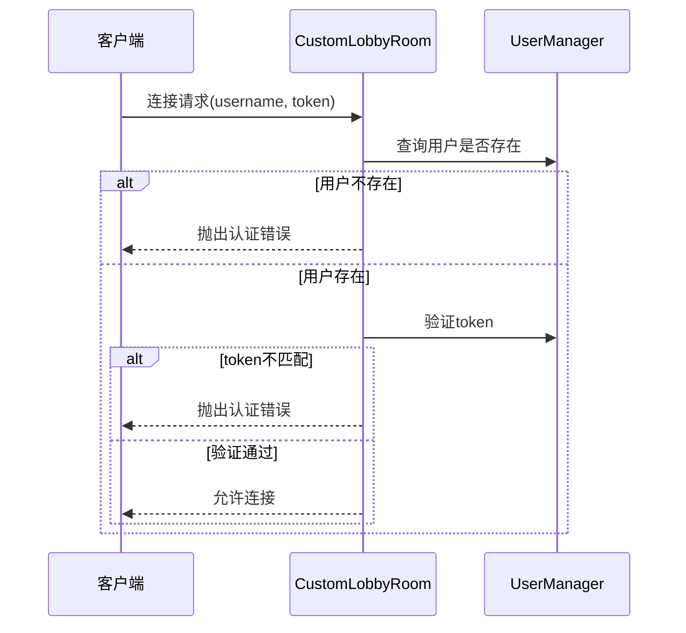
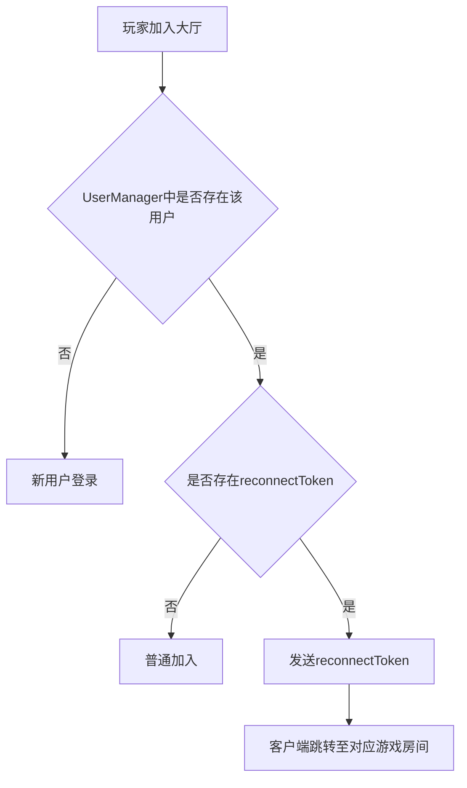
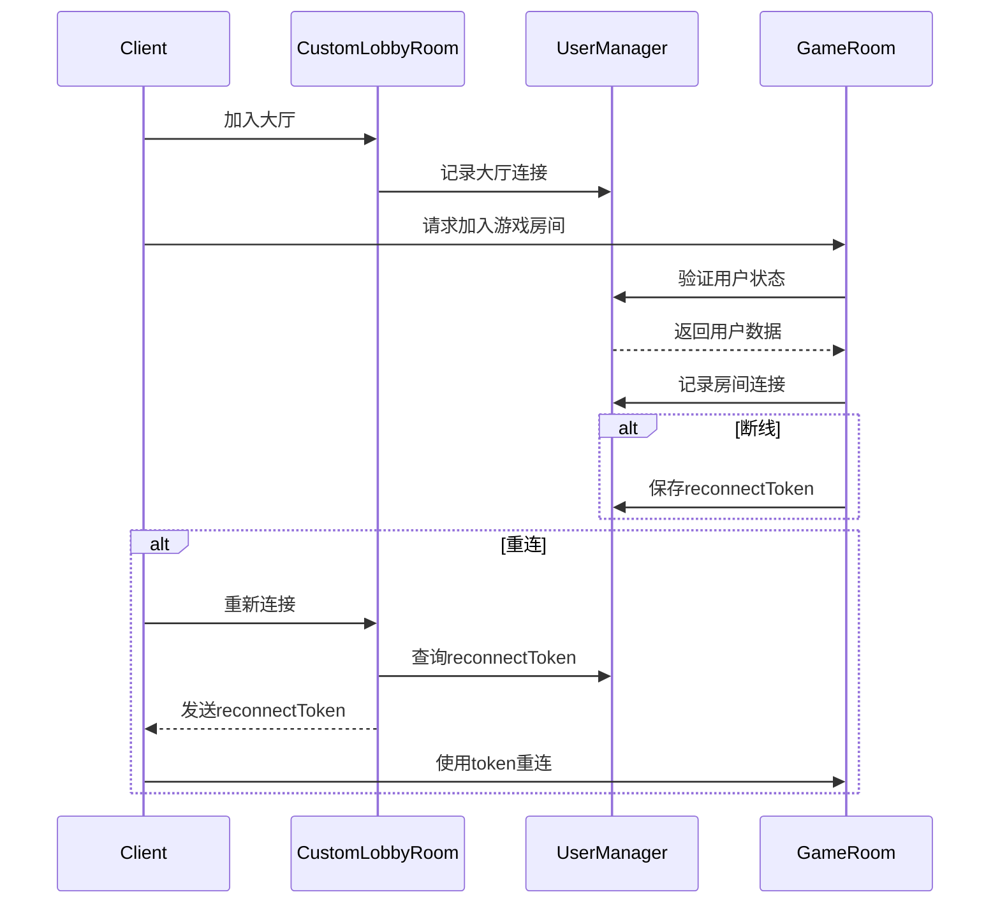

# 大厅房间

<cite>
**本文档中引用的文件**  
- [lobby.ts](file://server/src/rooms/lobby.ts)
- [LobbyState.ts](file://server/src/models/LobbyState.ts)
- [UserManager.ts](file://server/src/UserManager.ts)
- [game.ts](file://server/src/rooms/game.ts)
</cite>

## 目录
1. [简介](#简介)
2. [核心功能概述](#核心功能概述)
3. [类结构与继承关系](#类结构与继承关系)
4. [房间生命周期管理](#房间生命周期管理)
5. [玩家连接与认证机制](#玩家连接与认证机制)
6. [房间状态同步与广播](#房间状态同步与广播)
7. [玩家匹配与重连处理](#玩家匹配与重连处理)
8. [与游戏房间的交互机制](#与游戏房间的交互机制)
9. [性能优化与内存管理](#性能优化与内存管理)
10. [实际应用示例](#实际应用示例)
11. [常见场景处理](#常见场景处理)

## 简介

大厅房间是游戏系统的核心枢纽，负责管理所有在线玩家的连接状态、房间列表维护以及玩家向游戏房间的过渡。作为基于 Colyseus 框架构建的多人在线游戏服务端的重要组成部分，`CustomLobbyRoom` 类继承自 `LobbyRoom`，实现了玩家进入大厅、状态同步、重连检测和跨房间通信等关键功能。

该模块通过与 `UserManager` 单例进行交互，统一管理玩家的全局状态，确保玩家在大厅与游戏房间之间的状态一致性。同时，大厅房间还承担着广播系统消息、维护在线人数统计等职责，为整个游戏服务提供稳定的前端接入层。

**Section sources**
- [lobby.ts](file://server/src/rooms/lobby.ts#L1-L58)

## 核心功能概述

大厅房间的核心功能包括：

- **玩家连接管理**：处理玩家加入和离开大厅的事件，更新在线人数。
- **身份认证**：通过 `onAuth` 方法验证玩家身份，防止非法接入。
- **状态同步**：使用 `LobbyState` 模型同步大厅状态，如当前在线人数。
- **重连机制**：检测玩家是否为断线重连，并发送相应的重连令牌。
- **跨房间通信**：通过 `UserManager` 实现大厅与游戏房间之间的消息广播。
- **元数据设置**：为房间设置名称等元信息，便于识别和管理。

这些功能共同构成了一个稳定、高效的大厅服务，为玩家提供流畅的游戏体验。

**Section sources**
- [lobby.ts](file://server/src/rooms/lobby.ts#L1-L58)
- [LobbyState.ts](file://server/src/models/LobbyState.ts#L1-L7)

## 类结构与继承关系

```mermaid
classDiagram
class CustomLobbyRoom {
+state : LobbyState
+onCreate(options) : Promise~any~
+onAuth(client, options, context) : boolean
+onJoin(client, options, auth) : void
+onLeave(client, consented) : void | Promise~any~
+onDispose() : void
}
class LobbyRoom {
<<abstract>>
+autoDispose : boolean
+setMetadata(metadata) : Promise~void~
+broadcast(message, options) : void
}
class LobbyState {
+playerCount : number
}
class UserManager {
+inst : UserManager
+onlinePlayers : { [username : string] : PlayerSession }
+joinLobby(username, client) : void
+leaveLobby(client) : void
}
CustomLobbyRoom --|> LobbyRoom : 继承
CustomLobbyRoom --> LobbyState : 使用
CustomLobbyRoom --> UserManager : 依赖
UserManager --> Client : 管理
```

**Diagram sources**
- [lobby.ts](file://server/src/rooms/lobby.ts#L1-L58)
- [LobbyState.ts](file://server/src/models/LobbyState.ts#L1-L7)
- [UserManager.ts](file://server/src/UserManager.ts#L1-L150)

**Section sources**
- [lobby.ts](file://server/src/rooms/lobby.ts#L1-L58)

## 房间生命周期管理

大厅房间的生命周期由 Colyseus 框架管理，主要包含以下阶段：

### 创建阶段
```typescript
async onCreate(options: any): Promise<any> {
    super.onCreate(options);
    this.state = new LobbyState();
    this.setMetadata({ name: 'Main Lobby' });
    this.autoDispose = false;
}
```
在 `onCreate` 方法中，初始化房间状态、设置元数据并禁用自动销毁功能，确保大厅房间长期存在。

### 销毁阶段
```typescript
onDispose(): void {
    super.onDispose();
    // 清理资源
}
```
当房间被销毁时，执行必要的清理操作。

**Section sources**
- [lobby.ts](file://server/src/rooms/lobby.ts#L10-L17)
- [lobby.ts](file://server/src/rooms/lobby.ts#L48-L52)

## 玩家连接与认证机制

### 身份认证


**Diagram sources**
- [lobby.ts](file://server/src/rooms/lobby.ts#L19-L27)

### 玩家加入
```typescript
onJoin(client: Client, options?: any, auth?: any): void {
    super.onJoin(client, options);
    this.state.playerCount++;
    const username = options.username;
    UserManager.inst.joinLobby(username, client);
    
    // 检测重连
    const player = UserManager.inst.onlinePlayers[username];
    if (player) {
        const room = Object.values(player.rooms).find(
            (v) => !!v.reconnectToken
        );
        if (room) {
            client.send('reconnectToken', room.room.roomId);
        }
    }
}
```
玩家加入时，更新在线人数，并通过 `UserManager` 记录其大厅连接状态。同时检测是否存在待恢复的游戏房间。

**Section sources**
- [lobby.ts](file://server/src/rooms/lobby.ts#L29-L42)

## 房间状态同步与广播

大厅房间使用 `LobbyState` 类来维护可同步的状态：

```typescript
export class LobbyState extends Schema {
    @type('number')
    playerCount: number = 0;
}
```
通过 `@colyseus/schema` 的类型装饰器，`playerCount` 字段可以自动同步到所有客户端。

状态更新流程：
1. 玩家加入 → `playerCount++`
2. 状态变更自动广播给所有客户端
3. 客户端实时显示最新在线人数

此外，`UserManager` 提供了全局广播能力：
```typescript
broadcast(message: string) {
    for (const username in this.onlinePlayers) {
        const player = this.onlinePlayers[username];
        if (player.lobbyClient) {
            player.lobbyClient.send('chat', { date: Date.now(), username: '系统', message });
        }
    }
}
```

**Section sources**
- [LobbyState.ts](file://server/src/models/LobbyState.ts#L1-L7)
- [UserManager.ts](file://server/src/UserManager.ts#L137-L150)

## 玩家匹配与重连处理

### 重连检测逻辑


当玩家断线后重新连接，系统会检查其是否在某个游戏房间中有待恢复的状态。如果有，则发送 `reconnectToken` 通知客户端进行重连。

### 匹配流程
虽然大厅房间本身不直接处理匹配逻辑，但它为匹配系统提供了基础支持：
- 维护所有在线玩家列表
- 提供玩家状态查询接口
- 支持跨房间消息通信

实际的房间创建和匹配通常在游戏房间（`GameRoom`）中完成，但需要通过大厅进行初始连接。

**Section sources**
- [lobby.ts](file://server/src/rooms/lobby.ts#L37-L42)
- [UserManager.ts](file://server/src/UserManager.ts#L1-L150)

## 与游戏房间的交互机制

大厅房间与游戏房间通过 `UserManager` 进行协同管理：



这种设计实现了大厅与游戏房间之间的松耦合，同时保证了状态的一致性。

**Diagram sources**
- [lobby.ts](file://server/src/rooms/lobby.ts#L1-L58)
- [UserManager.ts](file://server/src/UserManager.ts#L1-L150)
- [game.ts](file://server/src/rooms/game.ts#L1-L861)

**Section sources**
- [UserManager.ts](file://server/src/UserManager.ts#L1-L150)

## 性能优化与内存管理

### 连接管理优化
- 使用单例模式管理 `UserManager`，避免重复创建
- 采用轻量级状态同步，仅同步必要字段
- 设置合理的断线容忍期（30秒）

### 内存使用
```typescript
private readonly DISCONNECT_GRACE_PERIOD = 30000; // 30秒
```
通过设置断线宽限期，避免频繁的连接/断开导致的状态抖动。

### 消息广播效率
- 采用增量更新而非全量同步
- 利用 Colyseus 的 patch 机制减少网络传输
- 批量处理状态变更

这些优化措施确保了即使在高并发场景下，大厅房间也能保持良好的性能表现。

**Section sources**
- [UserManager.ts](file://server/src/UserManager.ts#L13-L15)

## 实际应用示例

### 配置大厅房间
```typescript
// 在服务器入口处注册房间
gameServer.define('lobby', CustomLobbyRoom);
```

### 客户端连接
```typescript
const client = new Client('ws://localhost:2567');
const room = await client.joinOrCreate('lobby', {
    username: 'player1',
    token: 'user_token'
});
```

### 监听大厅事件
```typescript
room.onMessage('reconnectToken', (roomId) => {
    // 自动跳转到指定游戏房间
    reconnectToGame(roomId);
});
```

**Section sources**
- [lobby.ts](file://server/src/rooms/lobby.ts#L1-L58)

## 常见场景处理

### 玩家断线重连
1. 玩家断开连接
2. `GameRoom.onLeave` 生成 `reconnectToken`
3. 玩家重新连接到大厅
4. 大厅检测到 `reconnectToken` 并发送通知
5. 客户端使用 token 重新加入游戏房间

### 多设备登录
系统通过 `UserManager` 统一管理用户会话：
- 新登录会覆盖旧会话的 token
- 旧设备将因 token 失效而被强制下线
- 保证同一账号只能在一个设备上保持有效连接

### 异常处理
- 认证失败：返回明确的错误码（`ServerCode.AuthError`）
- 房间满员：拒绝加入并提示
- 网络中断：利用重连机制恢复状态

这些策略确保了系统的健壮性和用户体验的连续性。

**Section sources**
- [lobby.ts](file://server/src/rooms/lobby.ts#L19-L27)
- [game.ts](file://server/src/rooms/game.ts#L150-L200)
- [UserManager.ts](file://server/src/UserManager.ts#L1-L150)