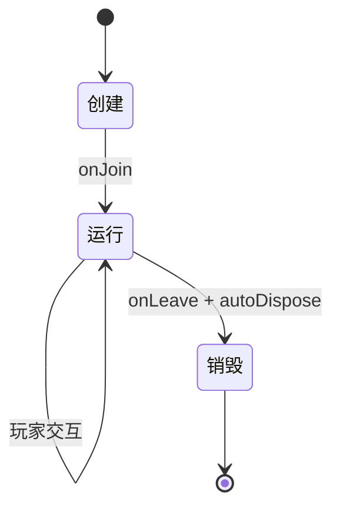
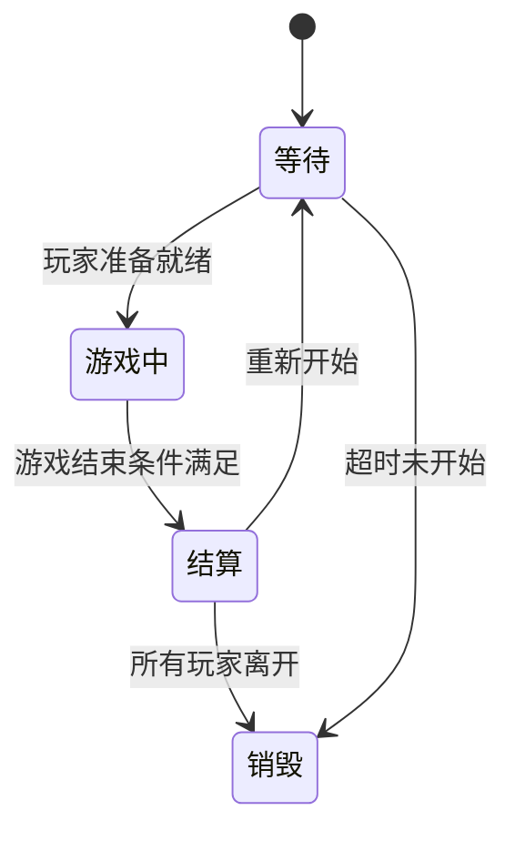
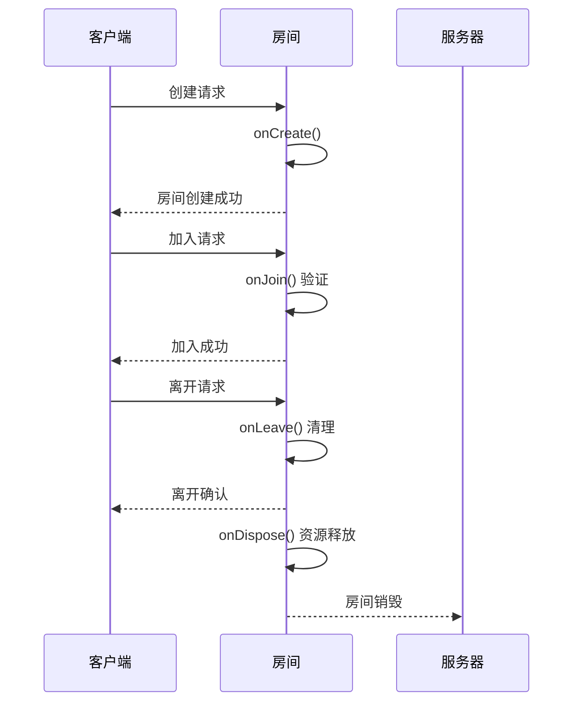

# 房间生命周期管理

<cite>
**本文档引用文件**  
- [game.ts](file://server/src/rooms/game.ts)
- [lobby.ts](file://server/src/rooms/lobby.ts)
- [room.ts](file://server/src/core/room/room.ts)
- [UIRoom.ts](file://client/src/ui/UIRoom.ts)
- [RoomGameComp.ts](file://client/src/comps/room/RoomGameComp.ts)
</cite>

## 目录
1. [简介](#简介)
2. [房间生命周期概述](#房间生命周期概述)
3. [生命周期钩子函数详解](#生命周期钩子函数详解)
4. [房间状态机设计](#房间状态机设计)
5. [自动销毁机制](#自动销毁机制)
6. [状态同步机制](#状态同步机制)
7. [生命周期时序图](#生命周期时序图)
8. [常见问题与解决方案](#常见问题与解决方案)
9. [结论](#结论)

## 简介
本文档详细阐述了游戏服务器中房间从创建到销毁的完整生命周期管理机制。通过分析核心代码文件，深入解析了房间状态转换、生命周期钩子函数、自动清理策略等关键组件的工作原理。文档旨在为开发者提供清晰的房间管理架构视图，帮助理解玩家加入、离开、房间状态变更等事件的处理流程。

**Section sources**
- [game.ts](file://server/src/rooms/game.ts#L1-L20)
- [lobby.ts](file://server/src/rooms/lobby.ts#L1-L20)

## 房间生命周期概述
房间生命周期是指一个游戏房间从创建、运行到最终销毁的完整过程。该过程由一系列预定义的生命周期钩子函数驱动，确保在特定时间点执行相应的业务逻辑。房间生命周期主要包含四个阶段：创建（onCreate）、加入（onJoin）、离开（onLeave）和销毁（onDispose）。

房间实例在服务器内存中被创建时进入生命周期，随着玩家的加入和游戏的进行维持运行状态，当满足特定条件（如所有玩家离开或游戏结束）时，房间将被自动或手动销毁，释放相关资源。



**Diagram sources**
- [room.ts](file://server/src/core/room/room.ts#L66-L107)
- [game.ts](file://server/src/rooms/game.ts#L122-L159)

**Section sources**
- [room.ts](file://server/src/core/room/room.ts#L1-L150)

## 生命周期钩子函数详解
生命周期钩子函数是房间类中预定义的回调方法，用于在特定生命周期阶段执行自定义逻辑。

### onCreate
`onCreate` 钩子在房间实例创建后立即调用。此阶段主要用于初始化房间配置和状态数据。

```typescript
public constructor(roomId: string, options: RoomOption) {
    this.roomId = roomId;
    this.options = options;
    // 初始化优先级队列
    this.trigger_effects_priority.set(PriorityType.None, []);
    this.trigger_effects_priority.set(PriorityType.General, []);
}
```

该函数负责设置房间ID、游戏选项和初始化内部数据结构，为后续玩家加入做好准备。

**Section sources**
- [room.ts](file://server/src/core/room/room.ts#L66-L107)

### onJoin
`onJoin` 钩子在玩家成功加入房间时触发。此方法包含复杂的验证逻辑，确保玩家符合加入条件。

```typescript
async onJoin(client: Client, options?: RoomJoinData): Promise<any> {
    // 验证用户是否被禁止游戏
    if (user.userdata.status.isGameBanned) {
        throw new ServerError(ServerCode.AccountIsBanGame);
    }
    // 验证房间状态
    if (this.metadata.state !== 'wait') {
        throw new ServerError(ServerCode.RoomIsStarted);
    }
    // 验证玩家数量上限
    if (this.state.players.size >= roomoptions.playerCountMax) {
        throw new ServerError(ServerCode.PlayerCountMax);
    }
}
```

该钩子执行多项检查，包括账号状态、房间游戏状态和玩家数量限制，确保游戏公平性和稳定性。

**Section sources**
- [game.ts](file://server/src/rooms/game.ts#L122-L159)

### onLeave
`onLeave` 钩子在玩家离开房间时调用。此方法负责清理玩家相关数据并更新房间状态。

```typescript
onLeave(client: Client, consented?: boolean): void | Promise<any> {
    super.onLeave(client);
    UserManager.inst.leaveLobby(client);
    this.state.playerCount--;
}
```

该函数不仅减少房间玩家计数，还通知用户管理器更新玩家状态，维护全局玩家信息的一致性。

**Section sources**
- [lobby.ts](file://server/src/rooms/lobby.ts#L36-L57)

### onDispose
`onDispose` 钩子在房间即将被销毁时调用。这是房间生命周期的最后一个阶段，用于执行最终的资源清理工作。

```typescript
onDispose(): void {
    super.onDispose();
    // 房间销毁日志
    console.log(`LobbyRoom is Disposed`);
}
```

此方法通常用于释放内存资源、关闭数据库连接或清理临时文件，确保服务器资源得到有效回收。

**Section sources**
- [lobby.ts](file://server/src/rooms/lobby.ts#L50-L57)

## 房间状态机设计
房间状态机采用枚举类型定义房间的各个状态，通过状态转换控制游戏流程。



状态机的核心是 `GameState` 枚举，包含等待（Wating）、游戏中（Playing）、结算（Settlement）等状态。状态转换由玩家行为和游戏规则共同驱动，确保游戏流程的严谨性。

**Diagram sources**
- [room.ts](file://server/src/core/room/room.ts#L32-L73)
- [UIRoom.ts](file://client/src/ui/UIRoom.ts#L0-L44)

**Section sources**
- [room.ts](file://server/src/core/room/room.ts#L32-L73)

## 自动销毁机制
自动销毁机制（autoDispose）通过配置参数控制房间的生命周期管理策略。

### 配置方法
房间选项（RoomOption）中包含 `autoDispose` 属性，用于启用或禁用自动销毁功能：

```typescript
interface RoomOption {
    autoDispose: boolean;
    playerCountMax: number;
    responseTime: number;
}
```

当 `autoDispose` 设置为 `true` 时，房间将在所有玩家离开后自动销毁。

### 玩家数量决策
系统根据房间内玩家数量动态决定是否触发自动清理：

```typescript
onLeave(client: Client) {
    super.onLeave(client);
    this.state.playerCount--;
    if (this.state.playerCount === 0 && this.options.autoDispose) {
        this.dispose(); // 触发自动销毁
    }
}
```

此机制有效防止了空房间占用服务器资源，提高了资源利用率。

**Section sources**
- [game.ts](file://server/src/rooms/game.ts#L122-L159)
- [lobby.ts](file://server/src/rooms/lobby.ts#L36-L57)

## 状态同步机制
房间状态同步通过客户端-服务器通信协议实现实时数据更新。

### 广播机制
房间使用 `broadcastCustom` 方法向所有客户端广播状态变更：

```typescript
public broadcastCustom: (data: Omit<SetMark, 'type' | 'objType' | 'objId'>) => void = (data) => {
    this.markChanges.push({
        objType: 'room',
        objId: this.roomId,
        key: data.key,
        value: data.value,
        options: data.options,
    });
};
```

### 客户端处理
客户端组件监听状态变更事件并更新UI：

```typescript
this.message.onMarkChange(marks);
this.owner.frameOnce(10, this, () => {
    // 处理标记变更
});
```

这种基于事件的同步机制确保了所有玩家客户端显示一致的游戏状态。

**Section sources**
- [room.ts](file://server/src/core/room/room.ts#L66-L107)
- [RoomGameComp.ts](file://client/src/comps/room/RoomGameComp.ts#L612-L635)

## 生命周期时序图


**Diagram sources**
- [game.ts](file://server/src/rooms/game.ts#L122-L159)
- [lobby.ts](file://server/src/rooms/lobby.ts#L36-L57)

## 常见问题与解决方案
### 玩家异常断线处理
**问题**：玩家网络中断导致状态不一致  
**解决方案**：实现重连令牌机制，允许玩家在一定时间内重新连接

```typescript
if (room.reconnectToken) {
    client.send('reconnectToken', room.roomId);
}
```

### 房间状态恢复
**问题**：服务器重启后房间状态丢失  
**解决方案**：持久化关键状态数据到数据库，启动时恢复

### 资源清理策略
**问题**：空房间占用内存资源  
**解决方案**：启用 `autoDispose` 机制，设置合理的超时时间

**Section sources**
- [lobby.ts](file://server/src/rooms/lobby.ts#L36-L57)
- [game.ts](file://server/src/rooms/game.ts#L122-L159)

## 结论
房间生命周期管理是游戏服务器架构的核心组件，通过精心设计的钩子函数、状态机和自动销毁机制，确保了游戏房间的稳定运行和资源高效利用。理解这些机制的工作原理对于开发和维护高质量的多人在线游戏至关重要。建议开发者根据具体业务需求合理配置生命周期策略，平衡用户体验和服务器性能。