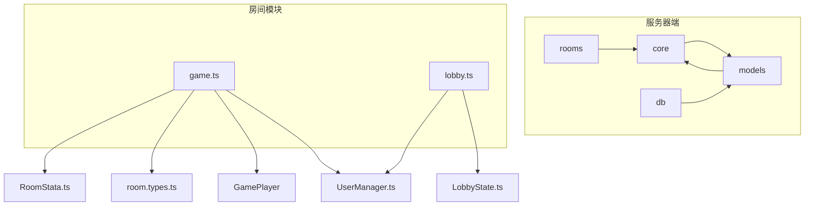
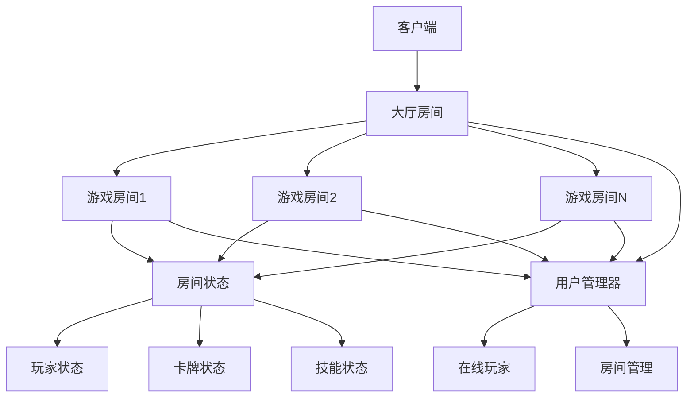
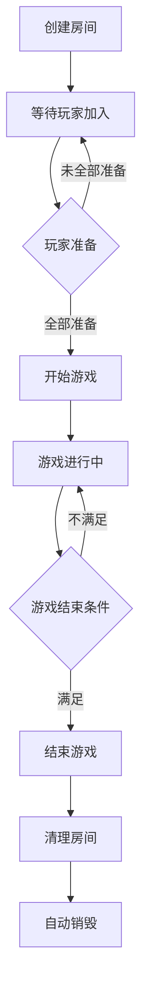
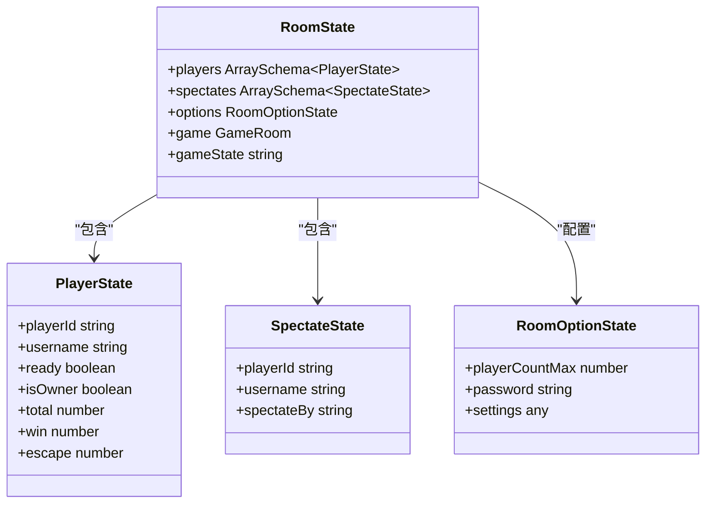
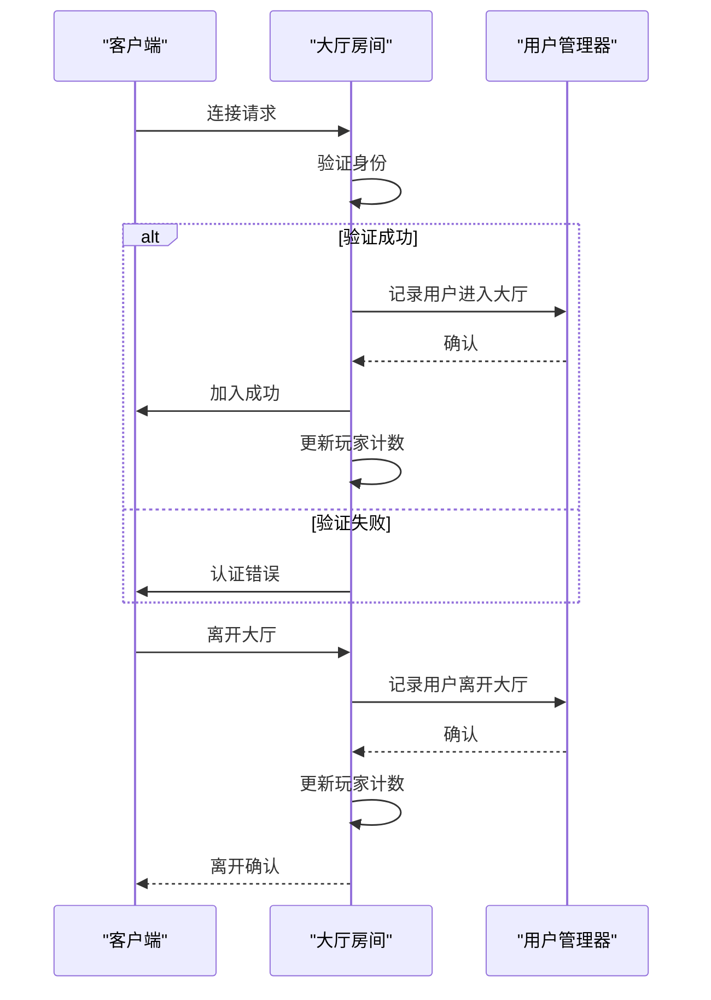
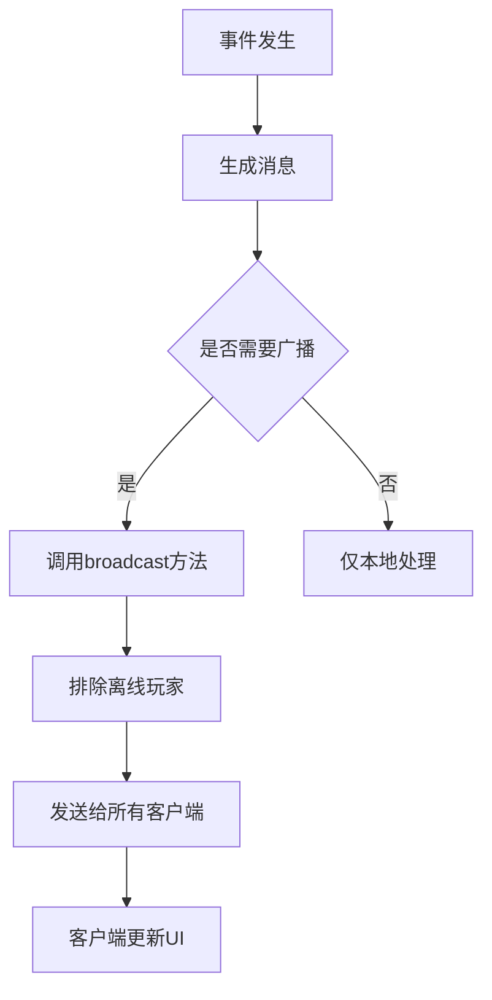
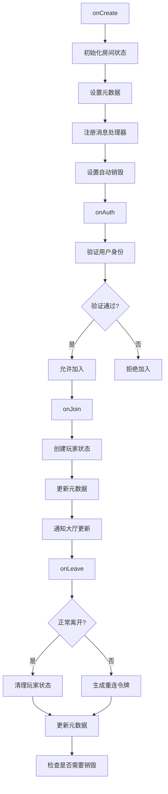
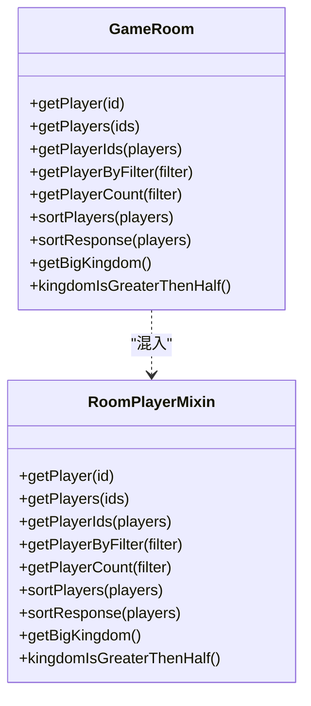
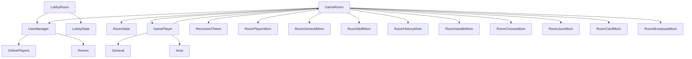

# 房间系统

<cite>
**本文档中引用的文件**   
- [game.ts](file://server/src/rooms/game.ts)
- [lobby.ts](file://server/src/rooms/lobby.ts)
- [room.ts](file://server/src/core/room/room.ts)
- [room.player.ts](file://server/src/core/room/mixins/room.player.ts)
- [player.ts](file://server/src/core/player/player.ts)
- [room.types.ts](file://server/src/core/room/room.types.ts)
</cite>

## 目录
1. [项目结构](#项目结构)
2. [核心组件](#核心组件)
3. [架构概述](#架构概述)
4. [详细组件分析](#详细组件分析)
5. [依赖分析](#依赖分析)
6. [性能考虑](#性能考虑)
7. [故障排除指南](#故障排除指南)

## 项目结构

本项目采用分层架构设计，主要分为客户端和服务器端两大部分。服务器端基于Colyseus框架构建，实现了游戏房间和大厅房间的管理功能。



**图示来源**
- [game.ts](file://server/src/rooms/game.ts)
- [lobby.ts](file://server/src/rooms/lobby.ts)
- [RoomStata.ts](file://server/src/models/RoomStata.ts)
- [room.types.ts](file://server/src/core/types.ts)

**本节来源**
- [game.ts](file://server/src/rooms/game.ts)
- [lobby.ts](file://server/src/rooms/lobby.ts)

## 核心组件

系统的核心组件包括游戏房间(GameRoom)、大厅房间(CustomLobbyRoom)和玩家管理(GamePlayer)。游戏房间负责游戏逻辑的执行和状态管理，大厅房间提供玩家匹配和房间列表功能，玩家管理类处理玩家状态和行为。

**本节来源**
- [game.ts](file://server/src/rooms/game.ts#L1-L861)
- [lobby.ts](file://server/src/rooms/lobby.ts#L1-L59)
- [player.ts](file://server/src/core/player/player.ts#L1-L1030)

## 架构概述

系统采用Colyseus框架提供的房间系统作为基础，构建了分层的房间管理架构。整个系统由大厅房间统一管理所有游戏房间的状态，并通过状态同步机制实现客户端与服务器的实时通信。



**图示来源**
- [game.ts](file://server/src/rooms/game.ts#L1-L861)
- [lobby.ts](file://server/src/rooms/lobby.ts#L1-L59)
- [UserManager.ts](file://server/src/UserManager.ts)

## 详细组件分析

### 游戏房间分析

游戏房间(GameRoom)是系统的核心，负责管理游戏的整个生命周期，包括房间创建、玩家加入、游戏开始和结束等流程。

#### 房间生命周期流程图


**图示来源**
- [game.ts](file://server/src/rooms/game.ts#L1-L861)

#### 房间状态类图


**图示来源**
- [game.ts](file://server/src/rooms/game.ts#L1-L861)
- [RoomStata.ts](file://server/src/models/RoomStata.ts)

**本节来源**
- [game.ts](file://server/src/rooms/game.ts#L1-L861)

### 大厅房间分析

大厅房间(CustomLobbyRoom)继承自Colyseus的LobbyRoom，负责管理所有游戏房间的元数据，并处理玩家进入和离开大厅的逻辑。

#### 大厅房间序列图


**图示来源**
- [lobby.ts](file://server/src/rooms/lobby.ts#L1-L59)
- [UserManager.ts](file://server/src/UserManager.ts)

**本节来源**
- [lobby.ts](file://server/src/rooms/lobby.ts#L1-L59)

### 房间核心类分析

GameRoom类是游戏逻辑的核心，实现了状态管理、消息广播和生命周期钩子等功能。

#### 状态管理机制
```mermaid
classDiagram
class GameRoom {
+roomState RoomState
+messages Message[]
+propertyChanges [][]
+markChanges {}
+players GamePlayer[]
+areas Map~string, Area~
+skills Skill[]
+effects Effect[]
}
class GamePlayer {
+playerId string
+username string
+seat number
+hp number
+maxhp number
+kingdom string
+role string
+handArea Area
+equipArea Area
+judgeArea Area
}
class Area {
+cards GameCard[]
+areaId string
+player GamePlayer
}
class GameCard {
+id GameCardId
+name string
+type CardType
+subtype CardSubType
+put CardPut
}
GameRoom --> GamePlayer : "管理"
GameRoom --> Area : "包含"
GameRoom --> GameCard : "包含"
GamePlayer --> Area : "拥有"
Area --> GameCard : "包含"
```

**图示来源**
- [room.ts](file://server/src/core/room/room.ts#L1-L1522)
- [player.ts](file://server/src/core/player/player.ts#L1-L1030)
- [room.types.ts](file://server/src/core/room/room.types.ts)

#### 消息广播机制


**图示来源**
- [room.ts](file://server/src/core/room/room.ts#L1-L1522)

#### 生命周期钩子


**图示来源**
- [game.ts](file://server/src/rooms/game.ts#L1-L861)

**本节来源**
- [room.ts](file://server/src/core/room/room.ts#L1-L1522)
- [game.ts](file://server/src/rooms/game.ts#L1-L861)

### 玩家管理混入模式分析

房间系统采用了混入(Mixin)设计模式来组织玩家管理功能，将相关方法分离到独立的类中。

#### 混入模式类图


**图示来源**
- [room.player.ts](file://server/src/core/room/mixins/room.player.ts)
- [room.ts](file://server/src/core/room/room.ts)

**本节来源**
- [room.player.ts](file://server/src/core/room/mixins/room.player.ts#L1-L111)

## 依赖分析

系统各组件之间的依赖关系清晰，遵循了高内聚低耦合的设计原则。



**图示来源**
- [game.ts](file://server/src/rooms/game.ts)
- [lobby.ts](file://server/src/rooms/lobby.ts)
- [room.ts](file://server/src/core/room/room.ts)
- [player.ts](file://server/src/core/player/player.ts)
- [UserManager.ts](file://server/src/UserManager.ts)

**本节来源**
- [game.ts](file://server/src/rooms/game.ts)
- [lobby.ts](file://server/src/rooms/lobby.ts)
- [room.ts](file://server/src/core/room/room.ts)

## 性能考虑

### 房间配置选项

房间系统提供了多种配置选项来优化性能和用户体验：

- **maxClients**: 最大客户端连接数，控制房间容量
- **autoDispose**: 自动销毁标志，当房间为空时自动清理
- **patchRate**: 状态同步频率，平衡流畅性和网络负载
- **autoDispose**: 自动销毁设置，避免资源泄漏

### 高并发场景最佳实践

1. **连接池管理**: 重用数据库连接，减少创建开销
2. **状态压缩**: 只发送变化的状态数据，减少网络传输
3. **异步处理**: 将耗时操作放入异步队列，避免阻塞主线程
4. **缓存机制**: 缓存频繁访问的数据，减少重复计算
5. **负载均衡**: 使用多个服务器实例分担连接压力

## 故障排除指南

### 常见问题及解决方案

1. **玩家无法加入房间**
   - 检查认证令牌是否有效
   - 确认房间密码是否正确
   - 验证玩家是否已在其他房间

2. **状态同步延迟**
   - 检查patchRate设置是否合理
   - 确认网络连接质量
   - 查看服务器负载情况

3. **房间未自动销毁**
   - 验证autoDispose设置是否启用
   - 检查是否有残留的客户端连接
   - 确认onLeave钩子是否正确执行

4. **消息广播失败**
   - 检查客户端连接状态
   - 验证消息格式是否正确
   - 确认广播范围设置

**本节来源**
- [game.ts](file://server/src/rooms/game.ts#L1-L861)
- [lobby.ts](file://server/src/rooms/lobby.ts#L1-L59)