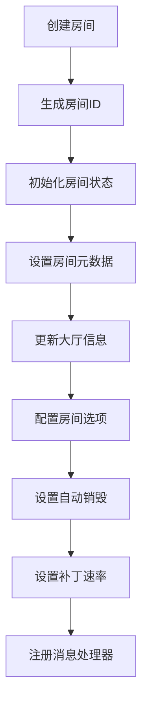
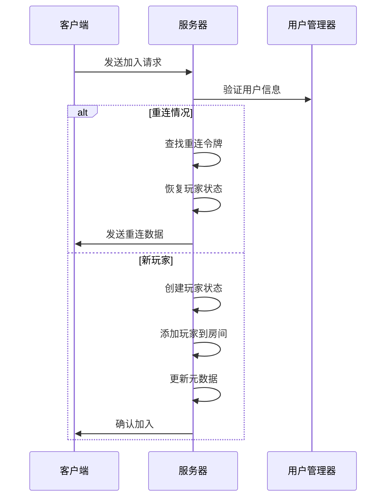
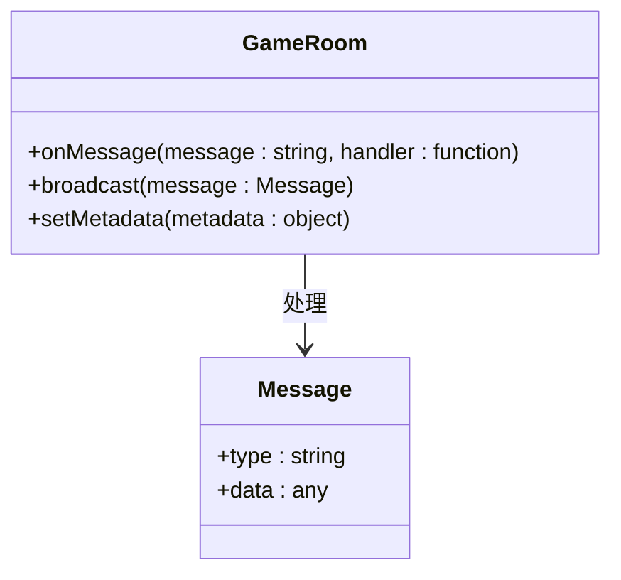
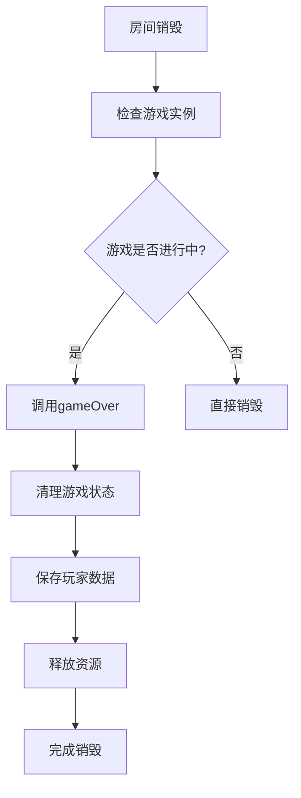
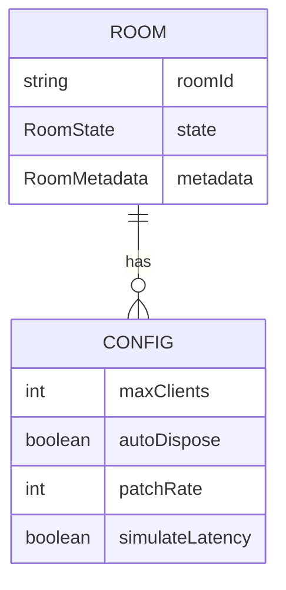
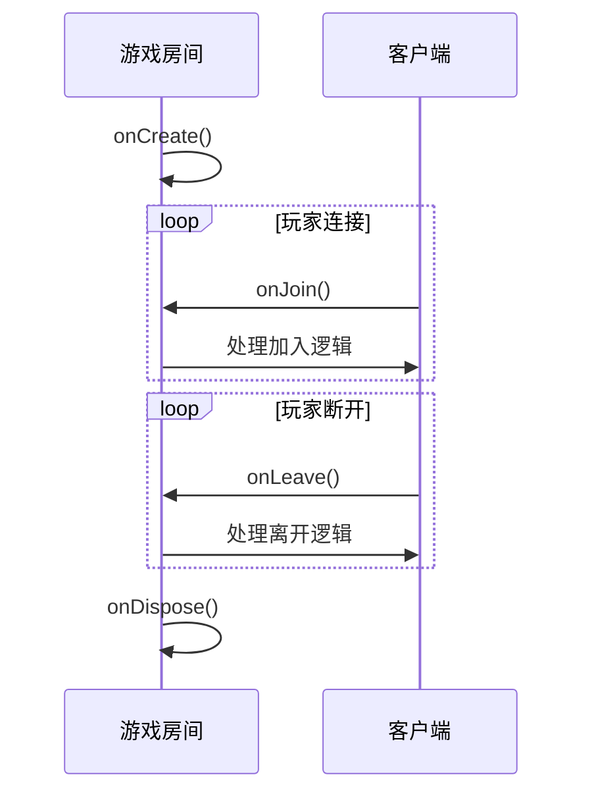
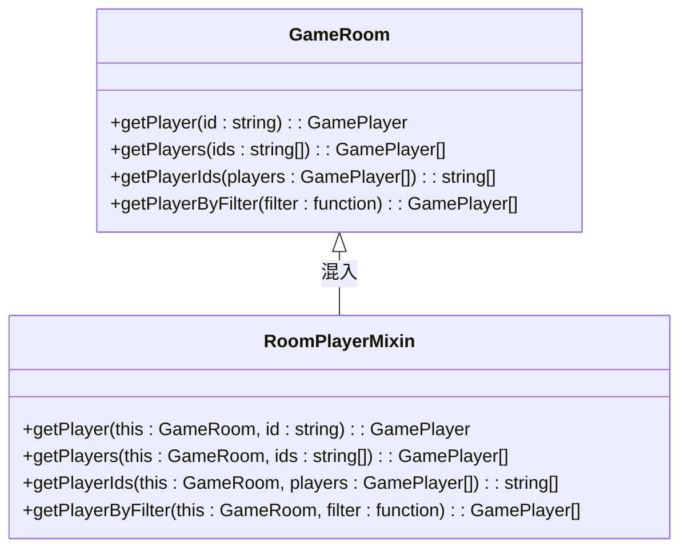
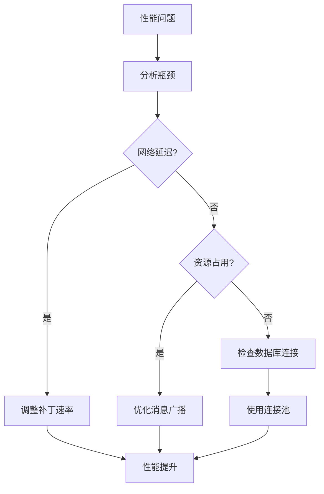

# 游戏房间

<cite>
**本文档引用的文件**   
- [game.ts](file://server/src/rooms/game.ts)
- [room.ts](file://server/src/core/room/room.ts)
- [room.player.ts](file://server/src/core/room/mixins/room.player.ts)
</cite>

## 目录
1. [游戏房间概述](#游戏房间概述)
2. [游戏房间创建流程](#游戏房间创建流程)
3. [玩家加入机制](#玩家加入机制)
4. [游戏状态管理](#游戏状态管理)
5. [房间销毁逻辑](#房间销毁逻辑)
6. [房间配置参数](#房间配置参数)
7. [生命周期钩子函数](#生命周期钩子函数)
8. [玩家管理混入模式](#玩家管理混入模式)
9. [代码示例](#代码示例)
10. [性能优化建议](#性能优化建议)

## 游戏房间概述

游戏房间是游戏系统的核心组件，负责管理玩家连接、游戏状态和房间生命周期。它基于Colyseus框架实现，通过继承`Room`类来提供实时多人游戏功能。游戏房间不仅处理玩家的加入和离开，还管理游戏的开始、进行和结束等关键状态。

**Section sources**
- [game.ts](file://server/src/rooms/game.ts#L21-L859)

## 游戏房间创建流程

游戏房间的创建流程始于`onCreate`方法的调用。当新房间被创建时，系统会生成唯一的房间ID，并初始化房间状态。房间的元数据包括选项、玩家数量、旁观者数量和房间状态，这些信息会被设置并更新到大厅。



**Diagram sources**
- [game.ts](file://server/src/rooms/game.ts#L36-L69)

**Section sources**
- [game.ts](file://server/src/rooms/game.ts#L36-L69)

## 玩家加入机制

玩家加入机制通过`onJoin`方法实现。当玩家尝试加入房间时，系统会检查其重连令牌，以确定是否为重新连接的玩家。如果是重新连接，系统会恢复玩家的游戏状态并发送重连数据。对于新加入的玩家，系统会创建新的玩家状态并将其添加到房间中。



**Diagram sources**
- [game.ts](file://server/src/rooms/game.ts#L149-L245)

**Section sources**
- [game.ts](file://server/src/rooms/game.ts#L149-L245)

## 游戏状态管理

游戏状态管理是游戏房间的核心功能之一。房间通过`onMessage`方法注册各种消息处理器，以响应客户端发送的游戏相关消息。这些消息包括准备、开始游戏、聊天、投降等。游戏状态的变更会通过广播机制通知所有客户端。



**Diagram sources**
- [game.ts](file://server/src/rooms/game.ts#L50-L65)

**Section sources**
- [game.ts](file://server/src/rooms/game.ts#L50-L65)

## 房间销毁逻辑

房间销毁逻辑在`onDispose`方法中实现。当房间被销毁时，系统会调用游戏实例的`gameOver`方法，以确保游戏能够正常结束。这个过程包括清理游戏状态、保存玩家数据和释放资源。



**Diagram sources**
- [game.ts](file://server/src/rooms/game.ts#L856-L858)

**Section sources**
- [game.ts](file://server/src/rooms/game.ts#L856-L858)

## 房间配置参数

游戏房间支持多种配置参数，以满足不同的游戏需求。这些参数包括最大客户端数、自动销毁设置、补丁速率等。配置参数在房间创建时通过`options`对象传递，并在`onCreate`方法中进行处理。

**关键配置参数：**
- **maxClients**: 最大客户端连接数
- **autoDispose**: 是否在所有玩家离开后自动销毁房间
- **patchRate**: 状态更新的频率（毫秒）
- **simulateLatency**: 是否模拟网络延迟



**Diagram sources**
- [game.ts](file://server/src/rooms/game.ts#L44-L45)

**Section sources**
- [game.ts](file://server/src/rooms/game.ts#L44-L45)

## 生命周期钩子函数

游戏房间提供了多个生命周期钩子函数，允许开发者在特定时刻执行自定义逻辑。这些钩子函数包括`onCreate`、`onJoin`、`onLeave`和`onDispose`，它们分别在房间创建、玩家加入、玩家离开和房间销毁时被调用。



**Diagram sources**
- [game.ts](file://server/src/rooms/game.ts#L36-L339)

**Section sources**
- [game.ts](file://server/src/rooms/game.ts#L36-L339)

## 玩家管理混入模式

玩家管理混入模式在`room.player.ts`文件中实现。该模式通过`RoomPlayerMixin`类提供了一系列玩家管理方法，包括根据ID获取玩家、获取玩家ID数组、根据条件获取玩家等。这些方法被混入到`GameRoom`类中，以增强其玩家管理能力。



**Diagram sources**
- [room.player.ts](file://server/src/core/room/mixins/room.player.ts#L4-L109)

**Section sources**
- [room.player.ts](file://server/src/core/room/mixins/room.player.ts#L4-L109)

## 代码示例

以下是一个创建和配置游戏房间的代码示例：

```typescript
import { GameRoom } from './game';

// 创建房间实例
const room = new GameRoom();

// 配置房间选项
room.maxClients = 4;
room.autoDispose = true;
room.patchRate = 50;

// 注册消息处理器
room.onMessage('ready', (client, message) => {
    console.log(`${client.sessionId} 准备好了`);
});

room.onMessage('chat', (client, message) => {
    room.broadcast('chat', {
        user: client.sessionId,
        message: message
    });
});

// 启动房间
await room.onCreate({
    options: {
        name: '测试房间',
        maxPlayers: 4
    }
});
```

**Section sources**
- [game.ts](file://server/src/rooms/game.ts)

## 性能优化建议

在高并发场景下，游戏房间的性能优化至关重要。以下是一些建议：

1. **合理设置补丁速率**：根据游戏类型调整`patchRate`，平衡实时性和网络负载。
2. **使用自动销毁**：启用`autoDispose`以及时释放空闲房间的资源。
3. **优化消息广播**：只向需要的客户端发送消息，减少不必要的网络传输。
4. **批量状态更新**：将多个状态变更合并为一次更新，减少服务器压力。
5. **连接池管理**：合理管理数据库连接，避免频繁创建和销毁连接。



**Diagram sources**
- [game.ts](file://server/src/rooms/game.ts#L44-L45)

**Section sources**
- [game.ts](file://server/src/rooms/game.ts#L44-L45)