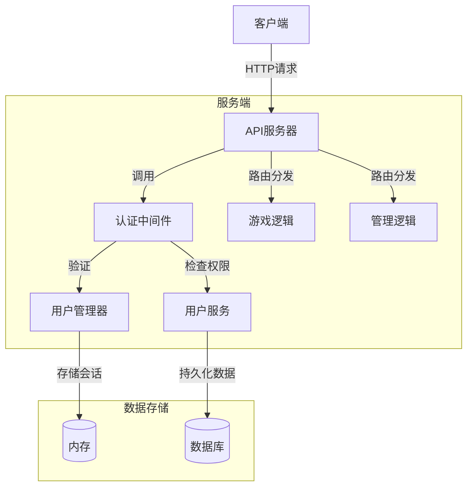
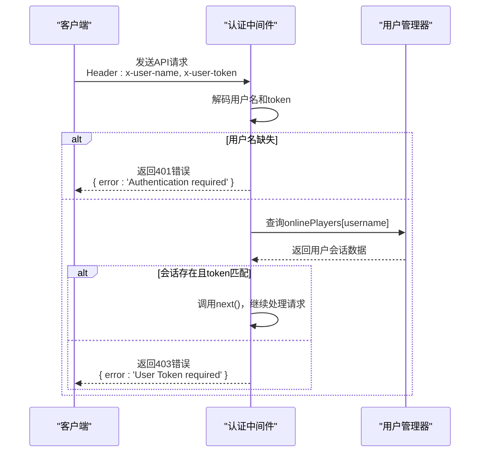
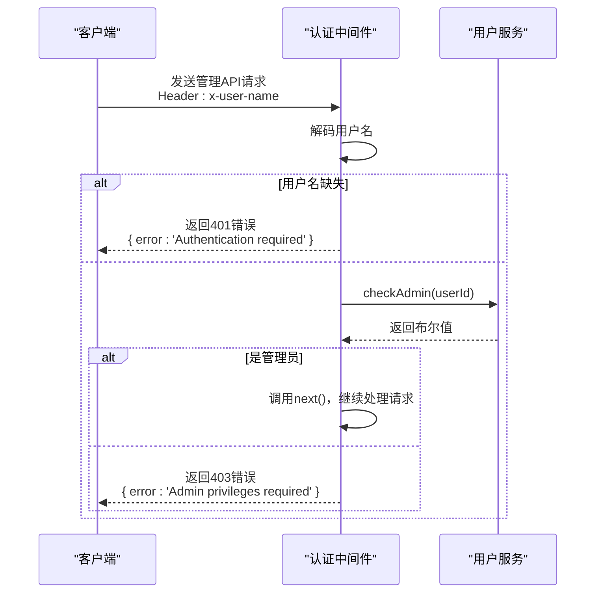

# 中间件系统

<cite>
**本文档引用的文件**  
- [auth.ts](file://server/src/middleware/auth.ts)
- [UserManager.ts](file://server/src/UserManager.ts)
- [UserService.ts](file://server/src/db/services/UserService.ts)
- [auth.ts](file://server/src/routes/auth.ts)
</cite>

## 目录
1. [简介](#简介)
2. [项目结构](#项目结构)
3. [核心组件](#核心组件)
4. [架构概览](#架构概览)
5. [详细组件分析](#详细组件分析)
6. [依赖分析](#依赖分析)
7. [性能考虑](#性能考虑)
8. [故障排除指南](#故障排除指南)
9. [结论](#结论)

## 简介
本文档深入分析了基于Node.js和Express框架的中间件系统架构，重点解析JWT认证中间件的实现机制。文档详细说明了`auth.ts`中token验证、用户身份识别和权限控制的完整流程，阐述了认证中间件在请求处理管道中的位置和执行顺序，并解释了认证信息如何与`UserManager`用户管理系统集成。同时提供了中间件调用流程图，展示从HTTP请求进入、认证验证到路由分发的完整过程，并包含会话管理、token刷新和安全防护的最佳实践。

## 项目结构
该项目采用典型的前后端分离架构，服务端（server）使用TypeScript编写，基于Express框架构建RESTful API，并利用Colyseus库处理实时通信。核心功能模块包括用户管理、数据库服务、中间件、路由和房间逻辑。

服务端的主要目录结构如下：
- `core/`: 核心游戏逻辑，如卡牌、角色、事件等。
- `db/`: 数据库相关代码，包含数据模型（models）和服务（services）。
- `extensions/`: 游戏扩展包。
- `middleware/`: Express中间件，用于处理请求的预处理逻辑，如身份验证。
- `models/`: 应用级别的状态模型。
- `routes/`: 定义API路由。
- `rooms/`: Colyseus房间逻辑。
- `scripts/`: 辅助脚本。
- `utils/`: 工具函数。
- `UserManager.ts`: 全局用户状态管理器。
- `index.ts`: 应用入口文件。

**Section sources**
- [server/src](file://server/src)

## 核心组件
本系统的核心安全组件由`auth.ts`（中间件）、`UserManager.ts`（用户状态管理）和`UserService.ts`（数据库服务）三部分构成。

`auth.ts`中的`authenticateUser`和`authenticateAdmin`函数是保护API端点的关键中间件。它们通过检查HTTP请求头中的`x-user-name`和`x-user-token`来验证用户身份和权限。

`UserManager`类负责维护所有在线用户的会话状态，包括用户数据、token、最后活跃时间以及他们在大厅和游戏房间中的客户端连接。它使用内存对象`onlinePlayers`来存储这些信息，实现了用户登录、加入/离开大厅和房间等核心会话管理功能。

`UserService`类则负责与数据库交互，处理用户注册、登录、权限检查和封禁等持久化操作。

**Section sources**
- [auth.ts](file://server/src/middleware/auth.ts)
- [UserManager.ts](file://server/src/UserManager.ts)
- [UserService.ts](file://server/src/db/services/UserService.ts)

## 架构概览


**Diagram sources**
- [auth.ts](file://server/src/middleware/auth.ts)
- [UserManager.ts](file://server/src/UserManager.ts)
- [UserService.ts](file://server/src/db/services/UserService.ts)

## 详细组件分析

### JWT认证中间件分析
`auth.ts`文件中定义了两个关键的中间件函数：`authenticateUser`和`authenticateAdmin`。它们都采用了工厂函数模式，接收一个服务实例作为参数并返回一个Express中间件函数。

#### 用户认证流程


**Diagram sources**
- [auth.ts](file://server/src/middleware/auth.ts#L20-L38)
- [UserManager.ts](file://server/src/UserManager.ts#L10-L25)

#### 管理员认证流程


**Diagram sources**
- [auth.ts](file://server/src/middleware/auth.ts#L1-L18)
- [UserService.ts](file://server/src/db/services/UserService.ts#L340-L345)

### 用户管理系统分析
`UserManager`是一个单例类，通过`_inst`静态实例和`get inst()`访问器确保全局唯一性。它使用一个名为`onlinePlayers`的字典对象来存储在线用户的状态。

#### 核心数据结构
```mermaid
classDiagram
class UserManager {
+static inst : UserManager
-_inst : UserManager
+onlinePlayers : { [username] : PlayerSession }
-DISCONNECT_GRACE_PERIOD : number
+login(user : DbUser) : string
+joinLobby(username, client)
+leaveLobby(client)
+joinRoom(username, room, client)
+leaveRoom(username, roomId, reconnectToken)
+getPlayerRooms(username) : Array
+findPlayerByClinet(sessionId) : PlayerSession
+broadcast(message : string)
}
class PlayerSession {
+userdata : DbUser
+token : string
+lastActive : Date
+lobbyClient : Client | null
+rooms : { [roomId] : RoomConnection }
}
class RoomConnection {
+room : GameRoom
+client : Client
+reconnectToken? : string
}
UserManager --> PlayerSession : "包含"
PlayerSession --> RoomConnection : "包含"
```

**Diagram sources**
- [UserManager.ts](file://server/src/UserManager.ts#L10-L150)

#### 登录与会话管理流程
当用户通过`/auth/login`接口登录时，系统执行以下流程：
1.  `UserService`验证用户名和密码。
2.  `UserManager.login()`方法被调用。
3.  如果是新会话，生成一个新的JWT token并存储在`onlinePlayers`中。
4.  如果是已有会话，则更新其`userdata`和`token`。
5.  新的token返回给客户端。

此机制允许用户在不同设备上登录，后登录的会话会覆盖前一个会话的token，从而实现单点登录（SSO）的效果。

**Section sources**
- [UserManager.ts](file://server/src/UserManager.ts#L40-L65)
- [auth.ts](file://server/src/routes/auth.ts#L15-L40)

### 认证信息集成分析
认证中间件与`UserManager`的集成是通过在应用启动时将`UserManager.inst`实例注入到中间件工厂函数中实现的。

在`routes/auth.ts`中，`createAuthRouter`函数接收`userService`和`userManager`作为参数。虽然该路由本身不直接使用`userManager`进行认证，但它在登录成功后调用`userManager.login(user)`来创建会话并生成token。这个token随后被客户端存储，并在后续的所有API请求中作为`x-user-token`头发送。

```mermaid
flowchart TD
A[客户端发起登录请求] --> B{路由: /auth/login}
B --> C[调用registerOrLogin]
C --> D{用户存在?}
D --> |否| E[创建新用户]
D --> |是| F[验证密码]
F --> G{密码正确?}
G --> |否| H[返回错误]
G --> |是| I[调用userManager.login()]
I --> J[生成JWT Token]
J --> K[返回Token给客户端]
K --> L[客户端存储Token]
L --> M[后续请求携带Token]
M --> N{路由: /api/protected}
N --> O[调用authenticateUser中间件]
O --> P[在UserManager中验证Token]
P --> Q{Token有效?}
Q --> |是| R[继续处理请求]
Q --> |否| S[返回403错误]
```

**Diagram sources**
- [routes/auth.ts](file://server/src/routes/auth.ts#L15-L40)
- [auth.ts](file://server/src/middleware/auth.ts#L20-L38)
- [UserManager.ts](file://server/src/UserManager.ts#L40-L65)

## 依赖分析
系统各组件之间的依赖关系清晰，遵循了良好的分层架构原则。

```mermaid
graph TD
A[auth.ts (中间件)] --> B[UserManager.ts]
A --> C[UserService.ts]
D[auth.ts (路由)] --> B
D --> C
B --> C
E[index.ts] --> A
E --> D
E --> B
E --> C
```

- **`middleware/auth.ts`** 依赖于 `UserManager` 和 `UserService` 来完成认证逻辑。
- **`routes/auth.ts`** 依赖于 `UserService` 进行用户注册/登录，依赖于 `UserManager` 来创建用户会话。
- **`UserManager.ts`** 依赖于 `UserService` 的 `DbUser` 类型定义，但不直接调用其方法，体现了松耦合。
- **`index.ts`** 作为应用入口，负责创建这些服务的实例并将其注入到中间件和路由中。

这种依赖注入模式使得代码更易于测试和维护。

**Diagram sources**
- [auth.ts](file://server/src/middleware/auth.ts)
- [UserManager.ts](file://server/src/UserManager.ts)
- [UserService.ts](file://server/src/db/services/UserService.ts)
- [auth.ts](file://server/src/routes/auth.ts)

**Section sources**
- [server/src/index.ts](file://server/src/index.ts)

## 性能考虑
该认证系统在设计上具有良好的性能特性：
1.  **内存会话存储**：`UserManager`将用户会话存储在内存中，使得token验证速度极快（O(1)时间复杂度），避免了每次请求都查询数据库的开销。
2.  **JWT Token**：使用JWT生成的token包含了用户ID和用户名，无需在每次请求时解密后查询数据库。
3.  **单例模式**：`UserManager`的单例模式确保了全局状态的一致性，避免了重复创建实例的开销。

潜在的性能瓶颈在于内存使用。随着在线用户数量的增加，`onlinePlayers`对象会占用大量内存。对于大规模应用，可以考虑将此会话状态迁移到Redis等内存数据库中，以实现分布式部署和更好的内存管理。

## 故障排除指南
### 常见问题
1.  **401 Unauthorized (未授权)**：
    *   **原因**：请求头中缺少`x-user-name`。
    *   **解决方案**：确保客户端在请求中正确设置了`x-user-name`头。

2.  **403 Forbidden (禁止访问)**：
    *   **原因A**：`x-user-token`与`UserManager`中存储的token不匹配。
    *   **解决方案A**：用户需要重新登录以获取新的token。
    *   **原因B**：用户尝试访问管理员接口但不是管理员。
    *   **解决方案B**：检查数据库中该用户的`privileges.admin`字段是否为`true`。

3.  **登录失败**：
    *   **原因**：密码错误、IP被封禁或达到IP注册限制。
    *   **解决方案**：检查`UserService.registerOrLogin`方法中的错误信息，根据具体原因处理。

### 安全最佳实践
1.  **Token安全**：确保JWT密钥（`resgs.PrivateKey`）是强随机字符串，并存储在环境变量中，而非硬编码在代码里。
2.  **HTTPS**：所有包含认证信息的通信必须通过HTTPS进行，以防止token被窃听。
3.  **输入验证**：在`routes/auth.ts`中，应对`username`和`password`进行严格的输入验证和清理，防止注入攻击。
4.  **会话超时**：`UserManager`目前没有主动清理过期会话的机制。建议添加一个定时任务，定期扫描`lastActive`时间，清理长时间不活跃的会话，以防止内存泄漏。

**Section sources**
- [auth.ts](file://server/src/middleware/auth.ts)
- [UserManager.ts](file://server/src/UserManager.ts)
- [UserService.ts](file://server/src/db/services/UserService.ts)

## 结论
该中间件系统通过`auth.ts`、`UserManager.ts`和`UserService.ts`的协同工作，构建了一个高效、安全的身份验证和会话管理机制。系统利用内存存储和JWT技术实现了快速的认证流程，同时通过清晰的分层和依赖注入保证了代码的可维护性。尽管当前设计适用于中小型应用，但对于需要水平扩展的大型系统，建议将会话状态从内存迁移到Redis等分布式缓存中。