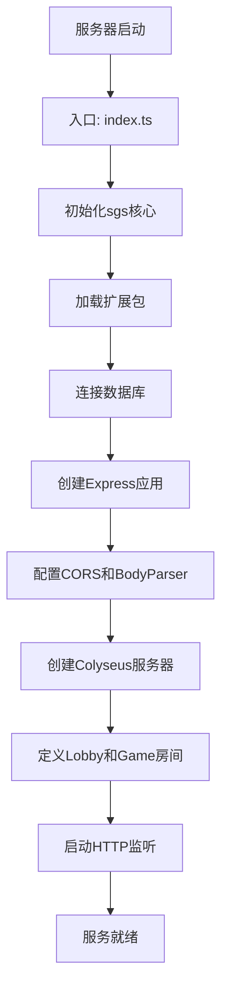
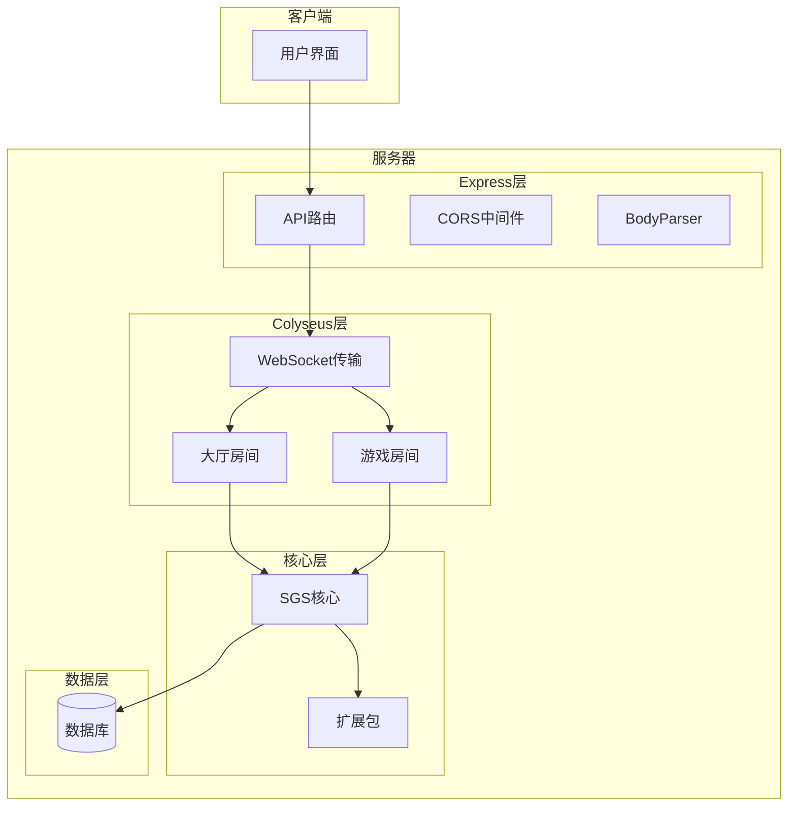
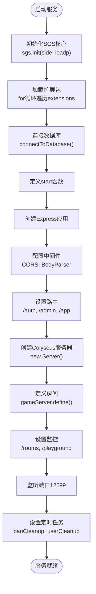
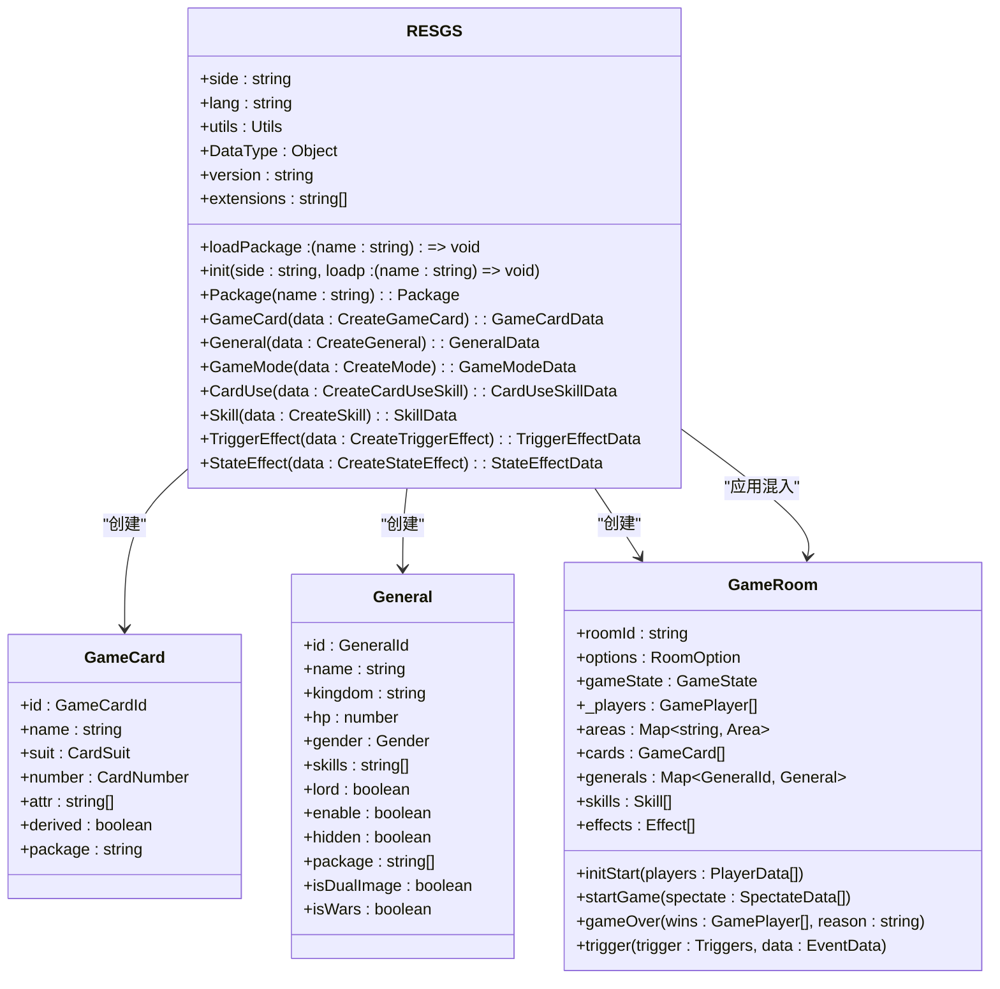
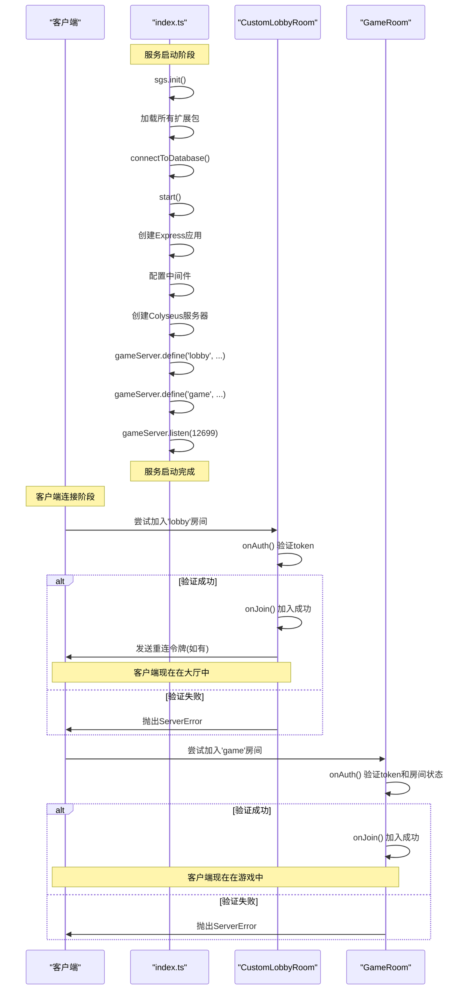
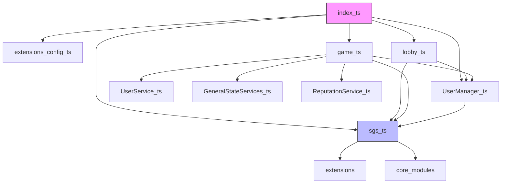

# 服务启动流程

<cite>
**本文档引用的文件**   
- [index.ts](file://server/src/index.ts)
- [sgs.ts](file://server/src/core/sgs.ts)
- [lobby.ts](file://server/src/rooms/lobby.ts)
- [game.ts](file://server/src/rooms/game.ts)
- [extensions.config.ts](file://server/src/core/extensions.config.ts)
</cite>

## 目录
1. [简介](#简介)
2. [项目结构](#项目结构)
3. [核心组件](#核心组件)
4. [架构概述](#架构概述)
5. [详细组件分析](#详细组件分析)
6. [依赖分析](#依赖分析)
7. [性能考虑](#性能考虑)
8. [故障排除指南](#故障排除指南)
9. [结论](#结论)

## 简介
本文档详细解析了基于Node.js和Colyseus框架的服务器启动流程。从`index.ts`入口文件开始，逐步描述了服务初始化、Colyseus房间注册、WebSocket连接建立的完整过程。重点分析了`sgs.ts`核心游戏逻辑的加载时机与依赖关系，以及lobby和game房间的注册顺序对客户端连接的影响。文档包含启动时序图，展示模块加载、端口监听、房间实例化和服务就绪的完整生命周期，并涵盖环境变量配置、错误处理和启动失败恢复机制。

## 项目结构
项目采用分层架构，主要分为客户端（client）和服务器端（server）两大模块。服务器端是本分析的重点，其`src`目录下包含核心逻辑、数据库、扩展包、中间件、模型、房间、路由、脚本和工具等子模块。`index.ts`作为服务的唯一入口，负责协调所有模块的初始化和启动。

**图示来源**
- [index.ts](file://server/src/index.ts)

**本节来源**
- [index.ts](file://server/src/index.ts)

## 核心组件
服务器的核心组件包括`sgs`全局实例、Colyseus房间（LobbyRoom和GameRoom）、数据库服务和用户管理器。`sgs`实例在`index.ts`中通过`sgs.init()`方法初始化，它作为整个游戏逻辑的中央控制器，负责管理所有扩展包、游戏模式、卡牌和武将数据。Colyseus房间是WebSocket连接的载体，`CustomLobbyRoom`处理玩家大厅的加入和离开，而`GameRoom`则承载实际的游戏逻辑。

**本节来源**
- [index.ts](file://server/src/index.ts)
- [sgs.ts](file://server/src/core/sgs.ts)
- [lobby.ts](file://server/src/rooms/lobby.ts)
- [game.ts](file://server/src/rooms/game.ts)

## 架构概述
系统采用微内核架构，`sgs`作为核心内核，通过插件化的方式加载`extensions`目录下的各个扩展包。Colyseus框架提供WebSocket通信和房间管理能力，Express框架处理RESTful API请求。数据流从客户端发起，经由Express中间件和Colyseus传输层，最终到达具体的房间实例进行处理。

**图示来源**
- [index.ts](file://server/src/index.ts)
- [sgs.ts](file://server/src/core/sgs.ts)

## 详细组件分析

### 入口点分析
`index.ts`是整个服务器的启动入口。它首先导入所有必要的依赖，包括Express、Colyseus、WebSocket传输层以及自定义的`sgs`核心和房间类。

#### 启动流程分析

**图示来源**
- [index.ts](file://server/src/index.ts#L1-L102)

**本节来源**
- [index.ts](file://server/src/index.ts#L1-L102)

### SGS核心分析
`sgs.ts`文件定义了`RESGS`类，该类通过单例模式提供全局访问点。`init`方法是核心初始化的起点，它执行以下关键操作：
1.  **设置全局实例**：将`sgs`实例挂载到`globalThis`，使其在任何地方都可访问。
2.  **应用混入（Mixins）**：使用`Utils.mixins`方法为`GameCard`、`General`、`GameRoom`等核心类动态添加功能，如`Custom`、`RoomPlayerMixin`等，实现了功能的灵活组合。
3.  **注册默认模式**：创建一个名为`default`的游戏模式，并将其存入`modes`映射中。
4.  **设置加载器**：将传入的`loadp`函数赋值给`this.loadPackage`，用于后续加载扩展包。

**图示来源**
- [sgs.ts](file://server/src/core/sgs.ts#L1-L799)
- [room.ts](file://server/src/core/room/room.ts#L1-L799)

**本节来源**
- [sgs.ts](file://server/src/core/sgs.ts#L1-L799)

### 房间注册与连接分析
房间的注册顺序对客户端连接有直接影响。在`index.ts`中，`gameServer.define('lobby', CustomLobbyRoom)`必须在`gameServer.define('game', GameRoom)`之前执行，因为客户端通常会先连接到`lobby`房间以获取可用的游戏房间列表。

#### 房间注册与连接时序图

**图示来源**
- [index.ts](file://server/src/index.ts#L1-L102)
- [lobby.ts](file://server/src/rooms/lobby.ts#L1-L58)
- [game.ts](file://server/src/rooms/game.ts#L1-L799)

**本节来源**
- [index.ts](file://server/src/index.ts#L1-L102)
- [lobby.ts](file://server/src/rooms/lobby.ts#L1-L58)
- [game.ts](file://server/src/rooms/game.ts#L1-L799)

## 依赖分析
系统的依赖关系清晰，`index.ts`是顶层入口，它直接依赖`sgs.ts`、`extensions.config.ts`和`rooms`模块。`sgs.ts`作为核心，被`rooms`和`extensions`中的各个模块所依赖。数据库服务（`UserService`, `BanService`）和用户管理器（`UserManager`）在`start`函数中被实例化，并注入到各个路由中。

**图示来源**
- [index.ts](file://server/src/index.ts)
- [sgs.ts](file://server/src/core/sgs.ts)
- [extensions.config.ts](file://server/src/core/extensions.config.ts)

**本节来源**
- [index.ts](file://server/src/index.ts)
- [sgs.ts](file://server/src/core/sgs.ts)
- [extensions.config.ts](file://server/src/core/extensions.config.ts)

## 性能考虑
服务启动时的性能主要受数据库连接和扩展包加载的影响。`connectToDatabase()`使用`catch`和`then`链式调用，确保了数据库连接失败时能优雅退出。扩展包的加载在`sgs.init()`中通过`require`同步进行，这可能会阻塞主线程，但对于启动阶段来说是可接受的。Colyseus的`patchRate`设置为50ms，平衡了网络流量和实时性。

## 故障排除指南
### 启动失败
*   **数据库连接失败**：检查`connectToDatabase()`函数的实现和数据库配置。日志会输出`Database connection failed`并调用`process.exit(1)`。
*   **端口被占用**：日志会显示`Error: listen EADDRINUSE`。检查12699端口是否已被其他进程占用。
*   **扩展包加载失败**：确保`extensions.config.ts`中列出的包名在`server/src/extensions/`目录下存在。

### 客户端连接问题
*   **认证失败**：客户端必须在`onAuth`时提供正确的`username`和`token`，否则会收到`ServerError`。
*   **无法加入游戏**：检查房间状态（是否已开始）、密码是否正确、玩家是否已满或被禁止旁观。

**本节来源**
- [index.ts](file://server/src/index.ts#L1-L102)
- [lobby.ts](file://server/src/rooms/lobby.ts#L1-L58)
- [game.ts](file://server/src/rooms/game.ts#L1-L799)

## 结论
服务器的启动流程设计清晰，模块化程度高。从`index.ts`入口开始，依次完成核心初始化、扩展包加载、数据库连接、Web服务器和WebSocket服务器的配置，最终进入监听状态。`sgs`核心作为数据和逻辑的中心，通过混入模式为房间和实体类提供丰富的功能。房间的注册顺序确保了客户端能够按预期流程连接。整个系统具备良好的错误处理和可维护性，为游戏的稳定运行奠定了坚实的基础。