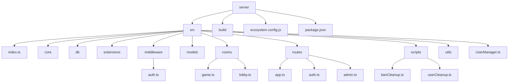
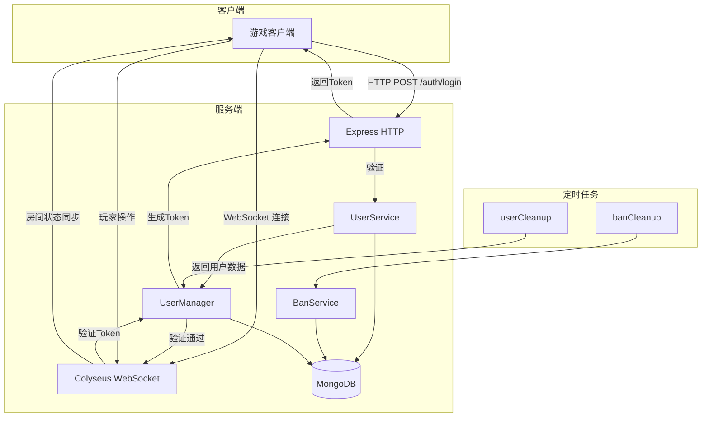
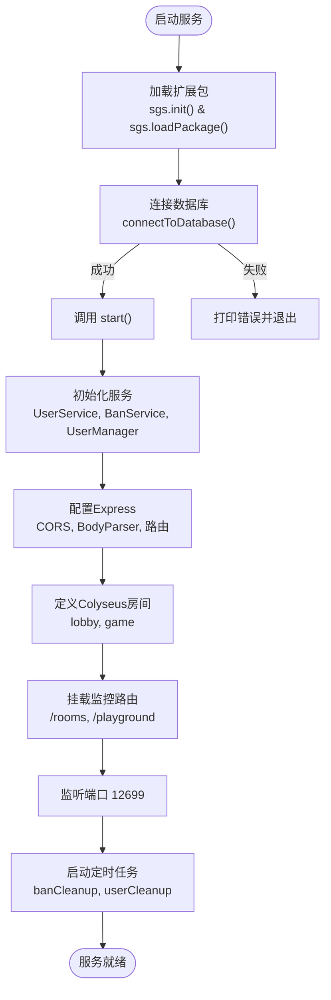
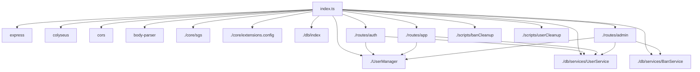
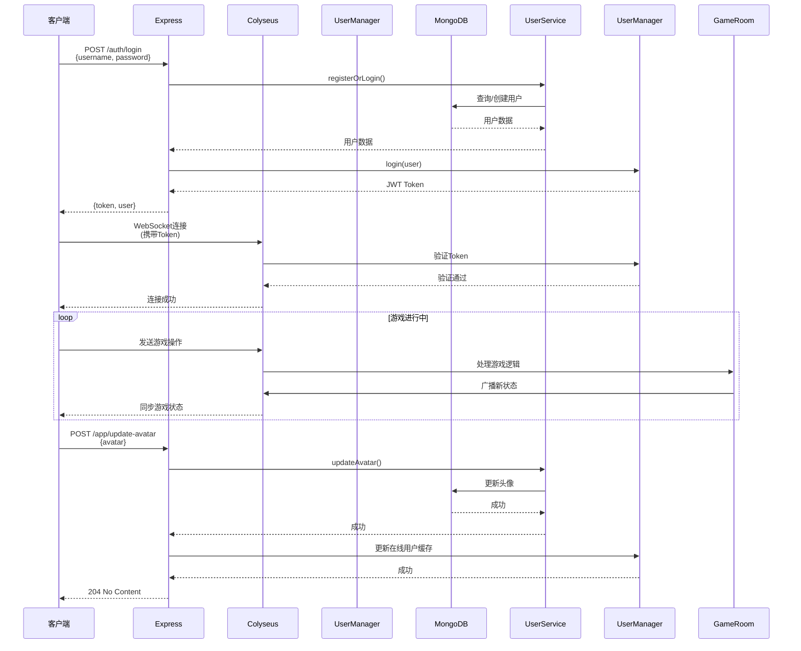

# 服务架构

<cite>
**本文档引用的文件**  
- [index.ts](file://server/src/index.ts)
- [ecosystem.config.js](file://server/ecosystem.config.js)
- [app.ts](file://server/src/routes/app.ts)
- [auth.ts](file://server/src/routes/auth.ts)
- [UserManager.ts](file://server/src/UserManager.ts)
- [UserService.ts](file://server/src/db/services/UserService.ts)
- [BanService.ts](file://server/src/db/services/BanService.ts)
- [game.ts](file://server/src/rooms/game.ts)
- [lobby.ts](file://server/src/rooms/lobby.ts)
- [auth.ts](file://server/src/middleware/auth.ts)
- [banCleanup.ts](file://server/src/scripts/banCleanup.ts)
- [userCleanup.ts](file://server/src/scripts/userCleanup.ts)
- [connectToDatabase.ts](file://server/src/db/index.ts)
</cite>

## 目录
1. [简介](#简介)
2. [项目结构](#项目结构)
3. [核心组件](#核心组件)
4. [架构概览](#架构概览)
5. [详细组件分析](#详细组件分析)
6. [依赖分析](#依赖分析)
7. [性能与部署](#性能与部署)
8. [错误处理与日志](#错误处理与日志)
9. [最佳实践与故障恢复](#最佳实践与故障恢复)
10. [附录](#附录)

## 简介
本文档详细解析基于Node.js和Colyseus框架的后端服务架构。系统为一个多人在线卡牌游戏提供实时对战与大厅服务，采用模块化设计，支持扩展包机制。核心功能包括用户认证、房间管理、状态同步、数据库交互与后台管理。文档将深入分析服务启动流程、中间件集成、房间注册、PM2部署配置及整体生命周期管理。

## 项目结构
项目分为`client`（前端）与`server`（后端）两大模块。后端服务位于`server`目录，采用TypeScript编写，通过`ts-node`或编译后运行。核心结构如下：



**Diagram sources**  
- [src/index.ts](file://server/src/index.ts#L1-L103)
- [src/rooms](file://server/src/rooms)
- [src/routes](file://server/src/routes)

**Section sources**  
- [server/src/index.ts](file://server/src/index.ts#L1-L103)
- [server/ecosystem.config.js](file://server/ecosystem.config.js#L1-L24)

## 核心组件
系统核心由Express HTTP服务、Colyseus WebSocket服务器、数据库连接、用户管理器及定时任务构成。`index.ts`为唯一入口，协调各模块初始化与启动。

**Section sources**  
- [index.ts](file://server/src/index.ts#L1-L103)

## 架构概览
系统采用分层架构，前端通过HTTP与WebSocket与后端交互。Express处理REST API请求，Colyseus处理实时房间通信。JWT认证贯穿HTTP与WebSocket层，确保安全。数据库使用MongoDB存储用户状态与系统配置。



**Diagram sources**  
- [index.ts](file://server/src/index.ts#L15-L103)
- [UserManager.ts](file://server/src/UserManager.ts)
- [UserService.ts](file://server/src/db/services/UserService.ts)
- [banCleanup.ts](file://server/src/scripts/banCleanup.ts)
- [userCleanup.ts](file://server/src/scripts/userCleanup.ts)

## 详细组件分析

### 服务器启动流程分析
`index.ts`是服务的启动入口，负责初始化所有依赖并启动HTTP与WebSocket服务。

#### 启动流程图


**Diagram sources**  
- [index.ts](file://server/src/index.ts#L15-L103)

**Section sources**  
- [index.ts](file://server/src/index.ts#L1-L103)

### 端口配置与中间件加载
服务监听在固定端口`12699`。通过`cors`中间件配置了严格的跨域策略，仅允许特定的开发与生产域名访问，并支持凭证传递。

```typescript
const port = 12699;
app.use(cors({
    origin: [
        'http://192.168.1.3:18090',
        'http://192.168.1.3:8000',
        'http://resgs.com/',
        'http://resgs.com/game/',
        'http://resgs.com',
        'http://resgs.com/game',
    ],
    credentials: true,
}));
```

`bodyParser.json()`中间件用于解析POST请求的JSON体。自定义的JWT认证中间件`authenticateUser`被应用于`/app`等受保护路由。

**Section sources**  
- [index.ts](file://server/src/index.ts#L40-L55)
- [app.ts](file://server/src/routes/app.ts#L5-L7)

### 房间注册机制
Colyseus房间通过`gameServer.define()`方法注册。系统定义了两种房间：
- `lobby`: `CustomLobbyRoom`，用于大厅，玩家在此创建或加入游戏房间。
- `game`: `GameRoom`，代表一个具体的游戏对局，处理游戏逻辑与状态同步。

`enableRealtimeListing()`方法为`game`房间启用了实时列表功能，可通过`@colyseus/monitor`监控。

```typescript
gameServer.define('lobby', CustomLobbyRoom);
gameServer.define('game', GameRoom).enableRealtimeListing();
```

**Section sources**  
- [index.ts](file://server/src/index.ts#L84-L86)

### Express路由与Colyseus集成
系统巧妙地将Express与Colyseus集成。`WebSocketTransport`使用Express创建的HTTP服务器作为底层传输，实现HTTP与WebSocket共用同一端口。

```typescript
const gameServer = new Server({
    transport: new WebSocketTransport({
        server: createServer(app), // 复用Express的HTTP服务器
    }),
});
```

Express路由处理认证、用户资料更新等REST API：
- `/auth/login`: 用户登录/注册
- `/app/update-avatar`: 更新头像
- `/admin`: 管理员接口

Colyseus则处理实时游戏状态同步。

**Section sources**  
- [index.ts](file://server/src/index.ts#L75-L77)
- [auth.ts](file://server/src/routes/auth.ts#L1-L60)
- [app.ts](file://server/src/routes/app.ts#L1-L42)

### JWT认证机制分析
认证流程分为两步：
1.  **HTTP认证**：客户端调用`/auth/login`，服务端验证用户名密码后，由`UserManager.login()`生成一个JWT Token并返回。
2.  **WebSocket认证**：客户端连接WebSocket时，Colyseus会验证该Token。`UserManager`负责验证Token的有效性。

`middleware/auth.ts`中的`authenticateUser`中间件用于保护Express路由，它从请求头`x-user-name`和`x-user-token`中提取信息并验证。

```typescript
// auth.ts
const token = userManager.login(user); // 生成Token
res.status(200).json({ token, user }); // 返回Token
```

**Section sources**  
- [auth.ts](file://server/src/routes/auth.ts#L1-L60)
- [UserManager.ts](file://server/src/UserManager.ts)
- [middleware/auth.ts](file://server/src/middleware/auth.ts)

### 服务生命周期管理
服务的生命周期由`index.ts`中的`start()`函数管理：
1.  **启动前**：加载扩展包，连接数据库。
2.  **启动中**：初始化服务实例，配置Express，定义房间，启动监听。
3.  **运行中**：处理客户端连接与请求。
4.  **关闭时**：通过`gameServer.onShutdown()`注册关闭回调，可在此处执行清理工作（当前为空）。

**Section sources**  
- [index.ts](file://server/src/index.ts#L57-L103)

### 错误处理机制
系统采用统一的try-catch模式进行错误处理，主要在Express路由处理器中：

```typescript
router.post('/update-avatar', async (req, res) => {
    try {
        // ... 业务逻辑
        res.status(204).end();
    } catch (error: any) {
        res.status(400).json({ error: error.message });
    }
});
```

- 成功操作返回`204 No Content`或`200 OK`。
- 客户端错误（如参数无效）返回`400 Bad Request`。
- 认证失败返回`401 Unauthorized`。
- 数据库连接失败等严重错误在顶层捕获，打印日志并退出进程。

**Section sources**  
- [app.ts](file://server/src/routes/app.ts#L15-L40)
- [auth.ts](file://server/src/routes/auth.ts#L15-L58)
- [index.ts](file://server/src/index.ts#L35-L38)

### 日志记录策略
日志记录主要通过`console.log`实现：
- 服务启动时打印监听端口信息。
- 数据库连接失败时打印错误堆栈。
- 服务关闭时打印提示信息。

```typescript
console.log(`Server is listening on port ${port}`);
console.error('Database connection failed', err);
console.log(`Server is Closed`);
```

**Section sources**  
- [index.ts](file://server/src/index.ts#L95-L97)

## 依赖分析
系统依赖关系清晰，`index.ts`作为核心协调者，依赖所有其他模块。



**Diagram sources**  
- [index.ts](file://server/src/index.ts#L1-L103)
- [routes/auth.ts](file://server/src/routes/auth.ts)
- [routes/app.ts](file://server/src/routes/app.ts)
- [routes/admin.ts](file://server/src/routes/admin.ts)

## 性能与部署
### PM2进程管理配置分析
`ecosystem.config.js`配置了PM2进程管理器，用于生产环境部署。

```javascript
module.exports = {
  apps : [{
    name: "colyseus-app",
    script: 'build/index.js', // 启动编译后的文件
    time: true, // 记录启动时间
    watch: false, // 不启用热重载
    instances: os.cpus().length, // 启动与CPU核心数相同的实例
    exec_mode: 'fork', // 使用fork模式
    wait_ready: true, // 等待应用就绪
    env_production: {
      NODE_ENV: 'production'
    }
  }],
};
```

**关键配置说明**：
- **多实例**：`instances: os.cpus().length` 启用多进程集群，充分利用多核CPU，提升并发处理能力。
- **Fork模式**：`exec_mode: 'fork'` 为每个实例创建独立的Node.js进程，进程间内存隔离，稳定性高。
- **生产环境变量**：自动设置`NODE_ENV=production`，可触发框架的生产模式优化。

**Section sources**  
- [ecosystem.config.js](file://server/ecosystem.config.js#L1-L24)

## 错误处理与日志
（已在“错误处理机制”和“日志记录策略”中详细阐述）

## 最佳实践与故障恢复

### 性能监控最佳实践
1.  **启用Colyseus Monitor**：已通过`app.use('/rooms', monitor())`启用，可通过`/rooms`路径实时查看房间状态、客户端连接数等。
2.  **使用PM2监控**：PM2提供内置的进程监控、内存/CPU使用率统计和日志查看。
3.  **添加应用级监控**：建议集成Prometheus或Datadog等工具，监控数据库查询延迟、房间创建速率等业务指标。

### 故障恢复最佳实践
1.  **进程守护**：PM2能自动重启崩溃的进程，保证服务高可用。
2.  **数据库重连**：当前代码在数据库连接失败时直接退出。**强烈建议**修改为自动重连机制，避免单点故障。
3.  **客户端断线重连**：Colyseus原生支持断线重连。服务端应妥善管理`ReconnectToken`，确保玩家能无缝恢复游戏状态。
4.  **定期备份**：对MongoDB进行定期备份，防止数据丢失。
5.  **健康检查**：增加`/health`端点，供负载均衡器或K8s探针使用。

## 附录

### 服务架构流程图
展示客户端连接、请求处理、状态同步和数据库交互的整体流程。



**Diagram sources**  
- [index.ts](file://server/src/index.ts)
- [auth.ts](file://server/src/routes/auth.ts)
- [app.ts](file://server/src/routes/app.ts)
- [game.ts](file://server/src/rooms/game.ts)
- [UserManager.ts](file://server/src/UserManager.ts)
- [UserService.ts](file://server/src/db/services/UserService.ts)