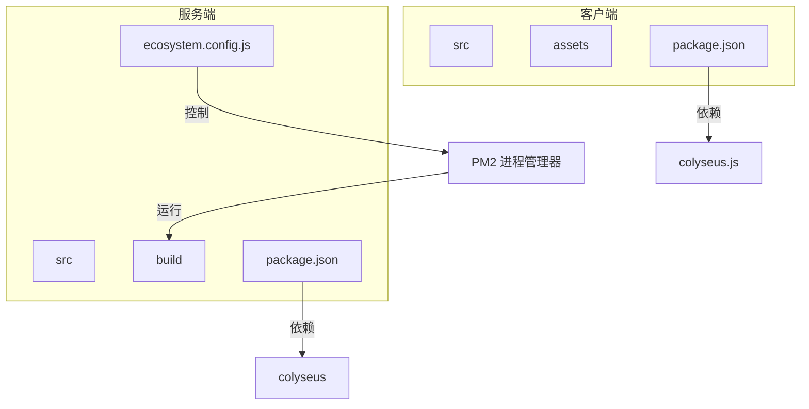
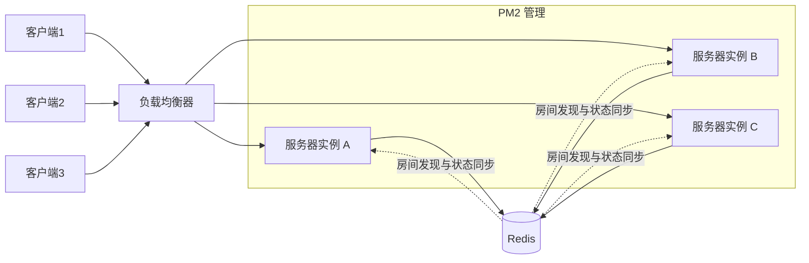
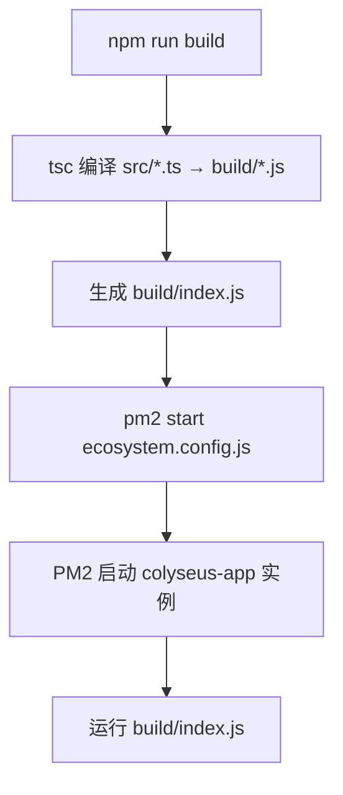
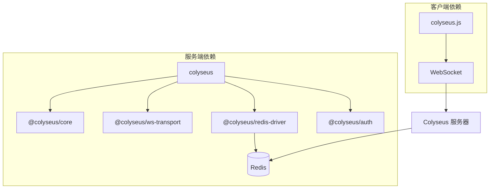

# 进程管理

<cite>
**本文档中引用的文件**   
- [ecosystem.config.js](file://server/ecosystem.config.js#L1-L23)
- [package.json](file://server/package.json#L1-L59)
- [package.json](file://client/package.json#L1-L22)
</cite>

## 目录
1. [简介](#简介)
2. [项目结构](#项目结构)
3. [核心组件](#核心组件)
4. [架构概述](#架构概述)
5. [详细组件分析](#详细组件分析)
6. [依赖分析](#依赖分析)
7. [性能考虑](#性能考虑)
8. [故障排除指南](#故障排除指南)
9. [结论](#结论)

## 简介
本文档全面解析基于 PM2 的进程管理配置，重点围绕 `ecosystem.config.js` 文件中的各项参数进行深入说明。文档涵盖实例数量、内存限制、自动重启策略和日志配置等关键设置，并分析多实例部署对 Colyseus 房间状态同步的影响。同时，阐述开发环境与生产环境的配置差异，解释 `package.json` 中启动脚本与 PM2 配置的关联机制，并提供进程监控、故障转移和性能调优的实践指南。

## 项目结构
项目由客户端（client）和服务端（server）两大部分组成。客户端主要包含资源文件（如动画、配置）、源码及构建产物；服务端则包含核心逻辑、数据库模型、房间管理、中间件等模块，并使用 TypeScript 编写，通过 `tsc` 编译为 JavaScript。

服务端根目录下包含：
- `src/`: 源代码目录
- `build/`: 编译后的代码目录
- `ecosystem.config.js`: PM2 进程管理配置文件
- `package.json`: 项目依赖和脚本定义

客户端和服务端均使用 `package.json` 管理依赖，其中服务端依赖 Colyseus 框架及其相关插件（如 Redis 驱动、认证模块等），而客户端依赖 `colyseus.js` 用于连接服务器。



**图示来源**
- [ecosystem.config.js](file://server/ecosystem.config.js#L1-L23)
- [package.json](file://server/package.json#L1-L59)

**本节来源**
- [ecosystem.config.js](file://server/ecosystem.config.js#L1-L23)
- [package.json](file://server/package.json#L1-L59)

## 核心组件
系统的核心组件包括：
- **Colyseus 服务器**: 基于 Node.js 的实时游戏服务器框架，负责房间管理、状态同步和客户端通信。
- **PM2**: 生产级 Node.js 进程管理器，用于守护进程、负载均衡、日志管理和自动重启。
- **Redis**: 用于分布式环境下的房间发现和状态共享（通过 `@colyseus/redis-driver` 和 `@colyseus/redis-presence`）。
- **TypeScript + tsx**: 开发环境使用 `tsx` 实现热重载，提升开发效率。

`ecosystem.config.js` 是 PM2 的核心配置文件，定义了应用的运行模式、实例数量、环境变量等。

**本节来源**
- [ecosystem.config.js](file://server/ecosystem.config.js#L1-L23)
- [package.json](file://server/package.json#L1-L59)

## 架构概述
系统采用客户端-服务器架构，服务端通过 PM2 启动多个工作进程，利用 Node.js 的集群能力实现 CPU 多核利用。Colyseus 使用 `@colyseus/redis-driver` 实现多实例间的房间状态同步，确保客户端无论连接到哪个实例都能访问正确的房间数据。



**图示来源**
- [ecosystem.config.js](file://server/ecosystem.config.js#L1-L23)
- [package.json](file://server/package.json#L1-L59)

## 详细组件分析

### PM2 配置分析
`ecosystem.config.js` 文件定义了应用的运行配置，其主要参数如下：

```javascript
module.exports = {
  apps: [{
    name: "colyseus-app",           // 应用名称
    script: 'build/index.js',       // 启动脚本路径
    time: true,                     // 启用日志时间戳
    watch: false,                   // 关闭文件监听（生产环境）
    instances: os.cpus().length,    // 实例数量 = CPU 核心数
    exec_mode: 'fork',              // 执行模式：fork（非集群模式）
    wait_ready: true,               // 等待应用就绪再接受流量
    env_production: {               // 生产环境变量
      NODE_ENV: 'production'
    }
  }]
};
```

#### 参数详解
- **name**: 进程名称，在 PM2 列表中显示为 `colyseus-app`。
- **script**: 指定入口文件为编译后的 `build/index.js`。
- **time**: 启用日志时间戳，便于排查问题。
- **watch**: 是否监听文件变化并自动重启。生产环境中设为 `false`，开发环境可通过 `pm2 start ecosystem.config.js --watch` 手动开启。
- **instances**: 实例数量。`os.cpus().length` 表示根据 CPU 核心数启动相应数量的进程，实现负载均衡。
- **exec_mode**: 执行模式。`fork` 表示每个进程独立运行，不共享内存；若使用 `cluster` 模式可实现内置负载均衡，但需配合 Redis 实现状态共享。
- **wait_ready**: 设置为 `true` 时，PM2 会等待应用调用 `pm2-ready` 事件后再将其加入负载均衡，避免请求被发送到未初始化完成的实例。
- **env_production**: 定义生产环境变量，此处设置 `NODE_ENV=production`，用于区分环境配置。

**本节来源**
- [ecosystem.config.js](file://server/ecosystem.config.js#L1-L23)

### 启动脚本与 PM2 关联机制
`package.json` 中的 `scripts` 定义了开发和构建命令：

```json
"scripts": {
  "start": "tsx watch src/index.ts",
  "build": "npm run clean && tsc",
  "clean": "rimraf build"
}
```

- `npm run start`: 开发环境下使用 `tsx` 直接运行 TypeScript 文件，支持热重载。
- `npm run build`: 清理 `build` 目录并使用 `tsc` 编译 TypeScript 到 JavaScript。
- PM2 使用编译后的 `build/index.js` 启动应用，因此必须先执行 `npm run build` 才能正确部署。

部署流程：
1. `npm run build` → 生成 `build/index.js`
2. `pm2 start ecosystem.config.js --env production` → 启动 PM2 进程



**图示来源**
- [package.json](file://server/package.json#L1-L59)
- [ecosystem.config.js](file://server/ecosystem.config.js#L1-L23)

**本节来源**
- [package.json](file://server/package.json#L1-L59)
- [ecosystem.config.js](file://server/ecosystem.config.js#L1-L23)

## 依赖分析
项目依赖分为客户端和服务端两部分：



关键依赖说明：
- `@colyseus/redis-driver`: 实现多实例房间发现和状态同步。
- `@colyseus/auth`: 提供认证支持。
- `@colyseus/monitor`: 提供 Web 监控界面。
- `colyseus.js`: 客户端 SDK，用于连接服务器。

**图示来源**
- [package.json](file://server/package.json#L1-L59)
- [package.json](file://client/package.json#L1-L22)

**本节来源**
- [package.json](file://server/package.json#L1-L59)
- [package.json](file://client/package.json#L1-L22)

## 性能考虑
- **多实例部署**: 通过 `instances: os.cpus().length` 充分利用多核 CPU，提升并发处理能力。
- **Redis 驱动**: 使用 Redis 作为共享存储，确保多实例间状态一致，但会引入网络延迟。
- **内存管理**: PM2 可配置内存限制（`max_memory_restart`），防止内存泄漏导致服务崩溃。
- **日志优化**: 生产环境中应关闭 `watch`，避免文件监听带来的性能开销。

建议配置：
```js
module.exports = {
  apps: [{
    // ...
    instances: "max", // 或指定数字
    max_memory_restart: '1G',
    log_date_format: 'YYYY-MM-DD HH:mm:ss',
    error_file: './logs/app-err.log',
    out_file: './logs/app-out.log'
  }]
};
```

## 故障排除指南
常见问题及解决方案：

| 问题 | 原因 | 解决方案 |
|------|------|----------|
| PM2 启动失败 | 未执行 `npm run build` | 先运行 `npm run build` 生成 `build/index.js` |
| 多实例无法同步房间 | 未配置 Redis 驱动 | 确保 `@colyseus/redis-driver` 已安装并正确初始化 |
| 内存持续增长 | 存在内存泄漏 | 使用 `pm2 monit` 监控内存，结合 `max_memory_restart` 自动重启 |
| 客户端连接超时 | 实例未就绪即接收请求 | 设置 `wait_ready: true` 并在应用就绪后发送 `process.send('ready')` |

**本节来源**
- [ecosystem.config.js](file://server/ecosystem.config.js#L1-L23)
- [package.json](file://server/package.json#L1-L59)

## 结论
本文档详细解析了 PM2 进程管理配置，阐明了 `ecosystem.config.js` 中各参数的作用及其与 `package.json` 启动脚本的协同机制。通过合理配置实例数量、执行模式和环境变量，可实现高性能、高可用的 Colyseus 服务器部署。结合 Redis 驱动，多实例部署可有效提升系统并发能力和容错性。建议在生产环境中启用日志管理、内存监控和自动重启策略，以保障服务稳定性。