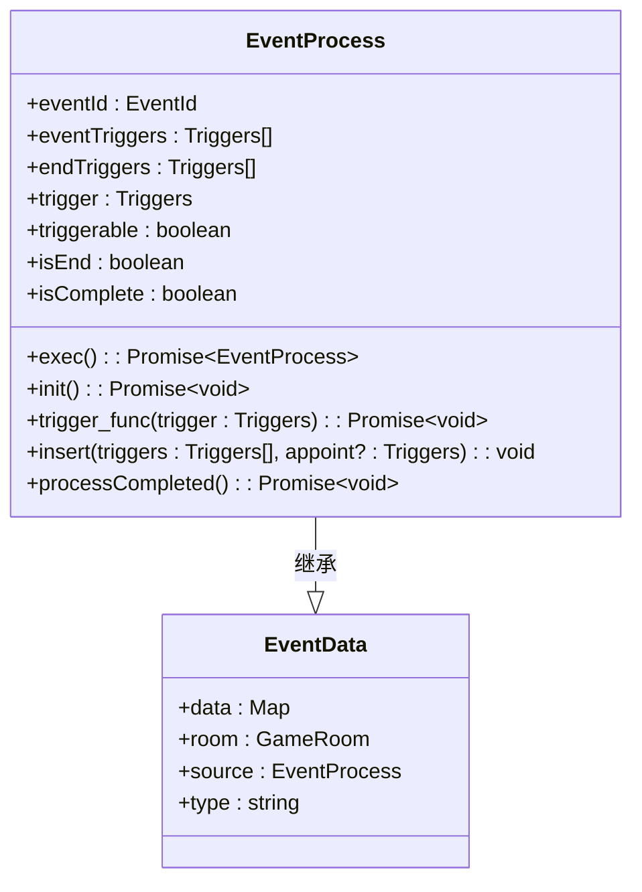
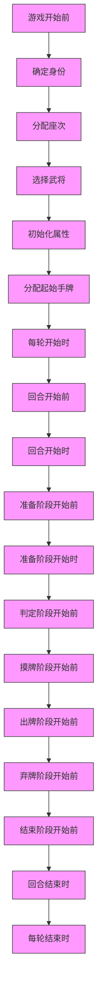
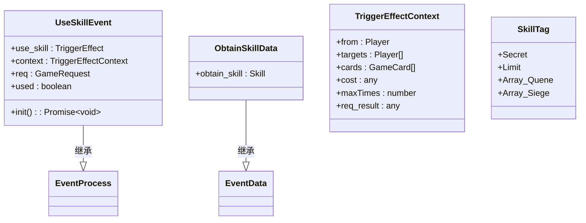
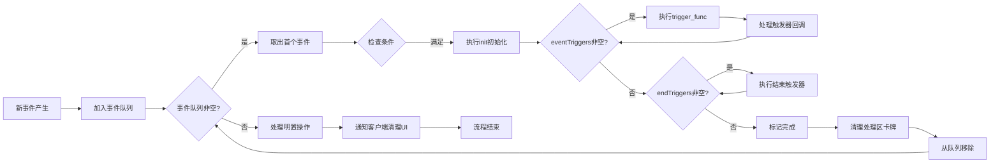
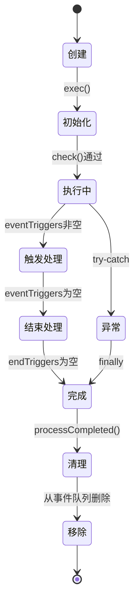
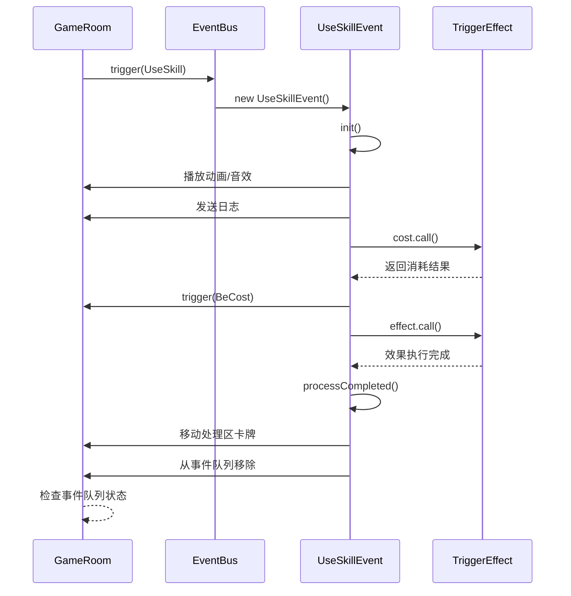

# 事件驱动架构

<cite>
**本文档引用文件**   
- [event.ts](file://server/src/core/event/event.ts#L0-L168)
- [triggers.ts](file://server/src/core/event/triggers.ts#L0-L171)
- [event.skill.ts](file://server/src/core/event/types/event.skill.ts#L0-L284)
</cite>

## 目录
1. [事件总线设计与实现](#事件总线设计与实现)
2. [事件触发器机制](#事件触发器机制)
3. [技能事件类型与数据结构](#技能事件类型与数据结构)
4. [事件队列管理策略](#事件队列管理策略)
5. [事件监听器生命周期管理](#事件监听器生命周期管理)
6. [事件流时序图](#事件流时序图)
7. [性能监控与调试工具](#性能监控与调试工具)

## 事件总线设计与实现

事件总线是整个系统的核心调度机制，负责协调游戏过程中各类事件的产生、传播和处理。`EventProcess` 类作为所有事件的基础抽象类，定义了事件处理的标准流程。

该类继承自 `EventData`，并封装了事件ID、触发时机、执行流程等核心属性。每个事件实例在创建时会自动注册到游戏房间的事件队列中，并在 `exec()` 方法中按顺序执行其生命周期。

事件执行采用异步迭代模式，通过 `eventTriggers` 和 `endTriggers` 两个触发器队列分别管理事件进行中和结束后的处理流程。这种设计实现了事件流程的可插拔性和动态调整能力。

**图示来源**
- [event.ts](file://server/src/core/event/event.ts#L0-L168)

**本节来源**
- [event.ts](file://server/src/core/event/event.ts#L0-L168)

## 事件触发器机制

事件触发器系统通过 `EventTriggers` 枚举类型定义了游戏中所有可能的触发时机，形成了一个完整的事件生命周期管理体系。

该系统将游戏流程划分为多个阶段，包括游戏准备、回合相关、各阶段（准备/判定/摸牌/出牌/弃牌/结束）、移动事件、使用事件、打出事件、拼点事件、状态改变、判定事件、伤害事件、体力变化、濒死死亡等，并为每个阶段设置了前后多个触发点。

这种精细化的时机划分使得技能效果可以精确地插入到游戏流程的任意位置，实现了高度灵活的规则扩展能力。例如，在"出牌阶段开始前"、"出牌阶段开始时"、"出牌阶段"、"出牌阶段结束时"四个连续时机，允许不同技能按优先级依次响应。

**图示来源**
- [triggers.ts](file://server/src/core/event/triggers.ts#L0-L171)

**本节来源**
- [triggers.ts](file://server/src/core/event/triggers.ts#L0-L171)

## 技能事件类型与数据结构

技能相关事件通过 `UseSkillEvent` 类实现，该类继承自 `EventProcess`，专门用于处理技能发动的完整流程。

`UseSkillEvent` 包含以下核心属性：
- **use_skill**: 触发的技能效果实例
- **context**: 技能触发上下文，包含目标、卡牌、来源等信息
- **req**: 技能发动时的询问请求
- **used**: 是否成功发动

在 `init()` 方法中，系统会自动初始化上下文数据，包括从请求结果中提取目标玩家和卡牌，设置默认值，进行目标排序等。同时，系统还会处理技能发动的视觉反馈，包括播放动画、音效、日志记录等。

对于特殊类型的技能（如限定技、阵法技），系统会触发相应的全局动画和标记更新。对于化身技能，还会处理化身牌的展示和回收逻辑。

**图示来源**
- [event.skill.ts](file://server/src/core/event/types/event.skill.ts#L0-L284)

**本节来源**
- [event.skill.ts](file://server/src/core/event/types/event.skill.ts#L0-L284)

## 事件队列管理策略

事件队列采用先进先出（FIFO）与优先级插入相结合的混合管理策略。所有事件按产生顺序加入主事件队列，并在 `exec()` 方法中依次处理。

每个事件内部维护两个触发器队列：
- **eventTriggers**: 事件进行中的触发时机队列
- **endTriggers**: 事件结束后的触发时机队列

通过 `insert()` 方法，其他系统可以在指定时机后插入新的触发点，实现事件流程的动态调整。该方法支持在特定触发器之后插入，若指定的参照触发器不存在则插入失败，确保了流程的稳定性。

事件完成后，系统会自动清理处理区的卡牌，将其移至弃牌堆，并更新相关状态。当事件队列为空时，系统会处理所有待明置的操作，并通知客户端清理UI处理区。

**图示来源**
- [event.ts](file://server/src/core/event/event.ts#L0-L168)

**本节来源**
- [event.ts](file://server/src/core/event/event.ts#L0-L168)

## 事件监听器生命周期管理

事件监听器的生命周期与事件实例紧密绑定。每个事件在 `init()` 阶段被推入房间的事件历史记录，并在 `processCompleted()` 阶段从活动队列中移除。

系统通过弱引用和自动清理机制防止内存泄漏：
1. 事件完成后自动从 `room.events` 队列中移除
2. 清理相关的处理区卡牌引用
3. 更新历史记录的结束索引
4. 当事件队列为空时，批量处理所有待办事项

对于异步操作，系统采用 `Promise` 链式调用确保所有异步任务完成后再进行清理。错误处理通过 `try-catch-finally` 结构保证，即使发生异常也能正确标记事件完成状态。

**图示来源**
- [event.ts](file://server/src/core/event/event.ts#L0-L168)

**本节来源**
- [event.ts](file://server/src/core/event/event.ts#L0-L168)

## 事件流时序图

以下时序图展示了从技能发动到处理完成的完整路径：

**图示来源**
- [event.ts](file://server/src/core/event/event.ts#L0-L168)
- [event.skill.ts](file://server/src/core/event/types/event.skill.ts#L0-L284)

**本节来源**
- [event.ts](file://server/src/core/event/event.ts#L0-L168)
- [event.skill.ts](file://server/src/core/event/types/event.skill.ts#L0-L284)

## 性能监控与调试工具

系统内置了多层次的性能监控和调试机制：

1. **日志系统**: 通过 `room.log()` 记录关键事件和流程节点
2. **错误捕获**: 在 `exec()` 方法中使用 `try-catch` 捕获并记录异常
3. **流程追踪**: 通过 `insertHistory()` 记录事件历史，便于回溯分析
4. **异步控制**: 使用 `async/await` 确保异步操作的顺序性和完整性

调试建议：
- 监控事件队列长度，避免积压
- 检查触发器插入逻辑，防止无限循环
- 跟踪处理区卡牌的生命周期，确保及时清理
- 记录技能发动的性能数据，优化复杂效果

**本节来源**
- [event.ts](file://server/src/core/event/event.ts#L0-L168)
- [event.skill.ts](file://server/src/core/event/types/event.skill.ts#L0-L284)