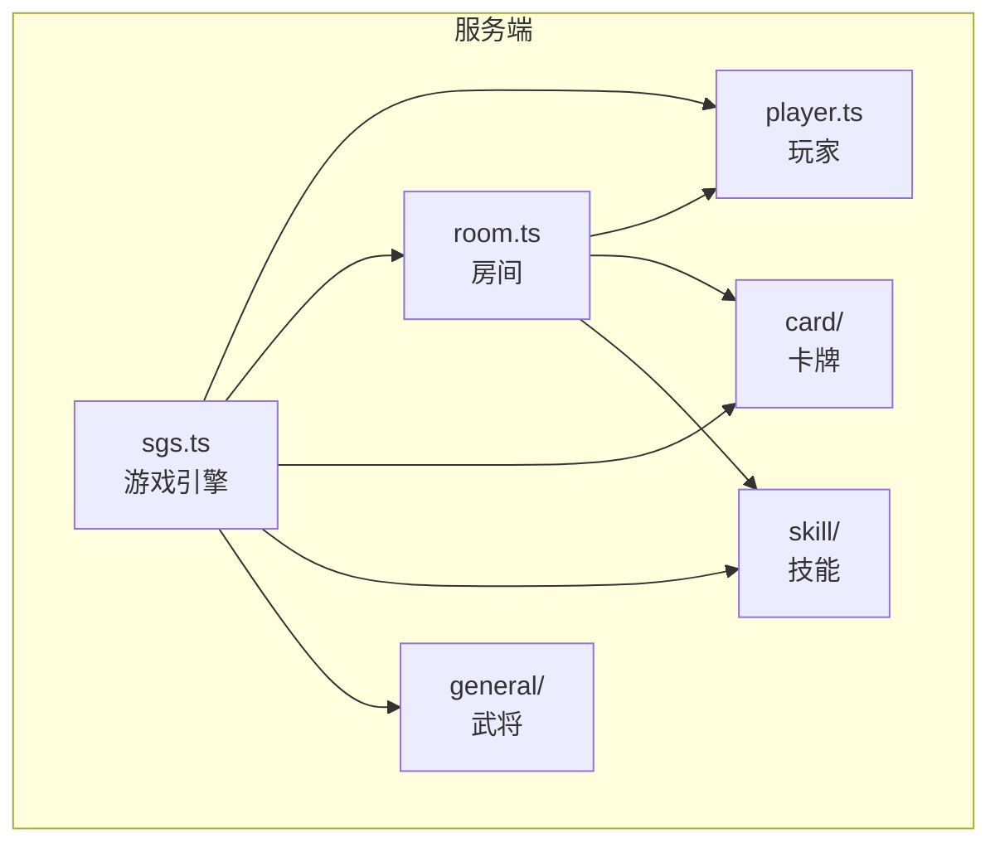
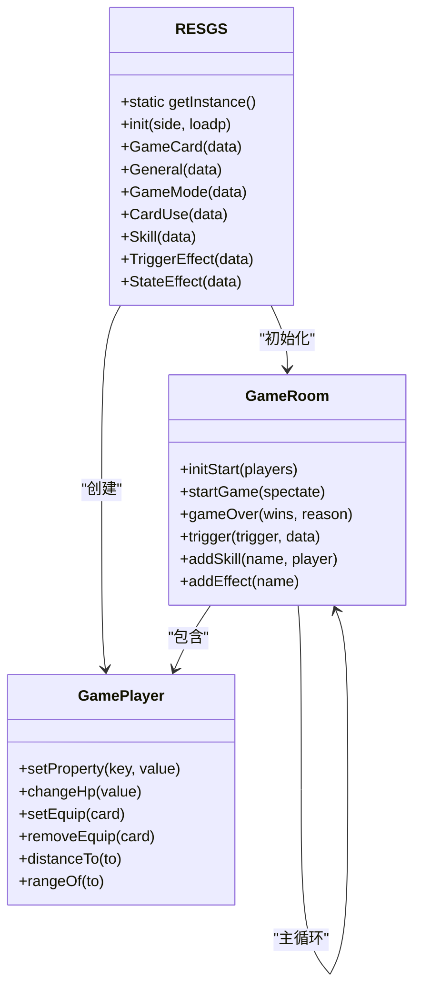
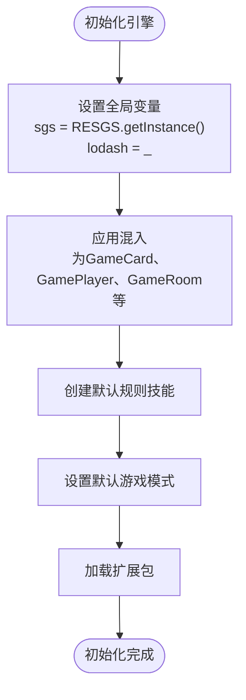
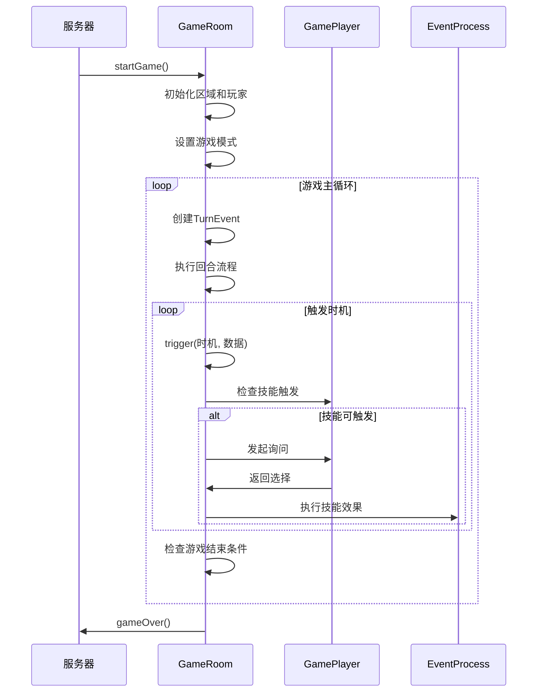
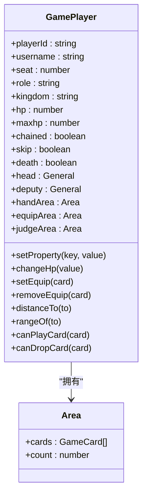
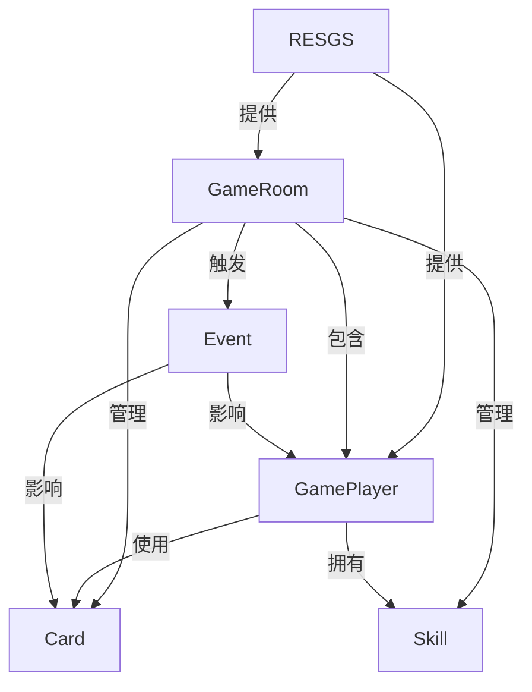

# 核心游戏系统

<cite>
**本文档中引用的文件**   
- [sgs.ts](file://server/src/core/sgs.ts)
- [player.ts](file://server/src/core/player/player.ts)
- [room.ts](file://server/src/core/room/room.ts)
</cite>

## 目录
1. [项目结构](#项目结构)  
2. [核心组件](#核心组件)  
3. [架构概述](#架构概述)  
4. [详细组件分析](#详细组件分析)  
5. [依赖分析](#依赖分析)  
6. [性能考虑](#性能考虑)  
7. [故障排除指南](#故障排除指南)  
8. [结论](#结论)

## 项目结构

项目采用分层模块化设计，主要分为客户端（client）和服务端（server）两大部分。服务端核心逻辑位于 `server/src/core` 目录下，包含游戏引擎、玩家、房间、卡牌、技能等核心模块。客户端负责UI渲染和用户交互，通过网络与服务端通信。

核心游戏逻辑集中在 `server/src/core` 目录：
- `sgs.ts`：游戏引擎主类，负责全局初始化和核心对象管理。
- `player/player.ts`：玩家对象定义，管理玩家状态和行为。
- `room/room.ts`：游戏房间类，管理游戏生命周期和主循环。
- `card/`：卡牌系统，包括卡牌类型和使用逻辑。
- `skill/`：技能系统，包含技能和效果的定义与执行。
- `general/`：武将系统，定义武将属性和技能。

**图示来源**  
- [sgs.ts](file://server/src/core/sgs.ts)
- [player.ts](file://server/src/core/player/player.ts)
- [room.ts](file://server/src/core/room/room.ts)

**本节来源**  
- [sgs.ts](file://server/src/core/sgs.ts)
- [player.ts](file://server/src/core/player/player.ts)
- [room.ts](file://server/src/core/room/room.ts)

## 核心组件

核心组件包括游戏引擎（`RESGS`）、玩家（`GamePlayer`）和房间（`GameRoom`）。`RESGS` 类是全局单例，负责初始化所有核心对象和数据。`GamePlayer` 类封装了玩家的所有状态和行为，如体力、装备、技能等。`GameRoom` 类管理游戏的整个生命周期，包括房间创建、玩家加入、游戏开始和结束。

**本节来源**  
- [sgs.ts](file://server/src/core/sgs.ts#L1-L100)
- [player.ts](file://server/src/core/player/player.ts#L1-L50)
- [room.ts](file://server/src/core/room/room.ts#L1-L50)

## 架构概述

系统采用面向对象设计，以 `GameRoom` 为核心运行环境，`GamePlayer` 为参与者，`RESGS` 为全局资源管理器。游戏流程由 `GameRoom` 的 `startGame` 方法驱动，通过事件触发机制（`trigger` 方法）协调玩家和技能的交互。

**图示来源**  
- [sgs.ts](file://server/src/core/sgs.ts#L150-L300)
- [room.ts](file://server/src/core/room/room.ts#L100-L200)
- [player.ts](file://server/src/core/player/player.ts#L50-L100)

## 详细组件分析

### 游戏引擎初始化分析

`RESGS` 类的 `init` 方法是游戏引擎的入口点。它通过 `Utils.mixins` 方法为各个核心类（如 `GameCard`、`GamePlayer`、`GameRoom`）混入 `Custom` 和其他功能混入（Mixin），实现功能扩展。初始化时会加载默认游戏模式和扩展包。

**图示来源**  
- [sgs.ts](file://server/src/core/sgs.ts#L250-L300)

**本节来源**  
- [sgs.ts](file://server/src/core/sgs.ts#L249-L301)

### 游戏房间生命周期管理

`GameRoom` 类的 `initStart` 方法负责房间的初始化，包括创建区域（牌堆、弃牌堆、玩家区域等）和玩家对象。`startGame` 方法启动游戏主循环，通过 `do-while` 循环执行回合，直到游戏结束。

**图示来源**  
- [room.ts](file://server/src/core/room/room.ts#L300-L400)
- [room.ts](file://server/src/core/room/room.ts#L600-L700)

**本节来源**  
- [room.ts](file://server/src/core/room/room.ts#L301-L369)
- [room.ts](file://server/src/core/room/room.ts#L600-L700)

### 玩家状态与行为验证

`GamePlayer` 类通过属性和方法管理玩家状态。例如，`hp` 和 `maxhp` 属性表示当前体力和体力上限，`changeHp` 方法用于修改体力。`rangeOf` 方法计算攻击范围，考虑了技能效果的影响。

**图示来源**  
- [player.ts](file://server/src/core/player/player.ts#L50-L100)

**本节来源**  
- [player.ts](file://server/src/core/player/player.ts#L1-L799)

## 依赖分析

系统依赖关系清晰，`RESGS` 是顶层管理器，`GameRoom` 是运行容器，`GamePlayer` 是参与者。`GameRoom` 依赖 `RESGS` 来获取游戏模式、卡牌和技能数据。`GamePlayer` 的行为（如使用卡牌）会触发 `GameRoom` 中的事件处理流程。

**图示来源**  
- [sgs.ts](file://server/src/core/sgs.ts)
- [room.ts](file://server/src/core/room/room.ts)
- [player.ts](file://server/src/core/player/player.ts)

**本节来源**  
- [sgs.ts](file://server/src/core/sgs.ts)
- [room.ts](file://server/src/core/room/room.ts)
- [player.ts](file://server/src/core/player/player.ts)

## 性能考虑

游戏主循环在 `startGame` 方法中实现，使用 `do-while` 循环持续执行回合。为避免阻塞，关键操作如 `delay` 使用异步等待。事件处理通过优先级队列（`trigger_effects_priority`）优化，确保高优先级技能（如规则技能）优先处理。

## 故障排除指南

常见问题包括初始化失败和游戏循环卡死。初始化失败通常因 `coreLoaded` 标志未正确设置，需确保 `init` 方法只调用一次。游戏循环卡死可能因 `gameState` 未正确更新，需检查 `gameOver` 方法是否被正确调用。

**本节来源**  
- [sgs.ts](file://server/src/core/sgs.ts#L280-L290)
- [room.ts](file://server/src/core/room/room.ts#L650-L700)

## 结论

本文档详细解析了核心游戏系统的架构和实现。`RESGS` 作为全局引擎，`GameRoom` 作为游戏容器，`GamePlayer` 作为参与者，三者协同工作，通过事件驱动机制实现了复杂的游戏逻辑。系统设计模块化，易于扩展和维护。