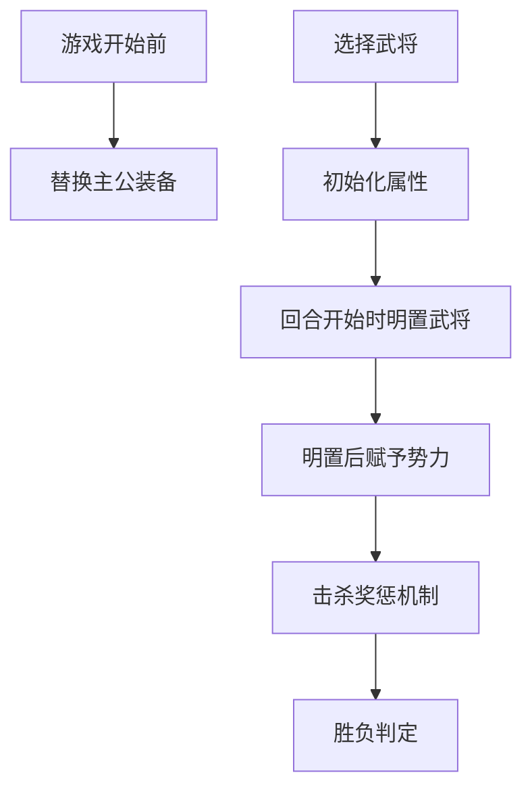
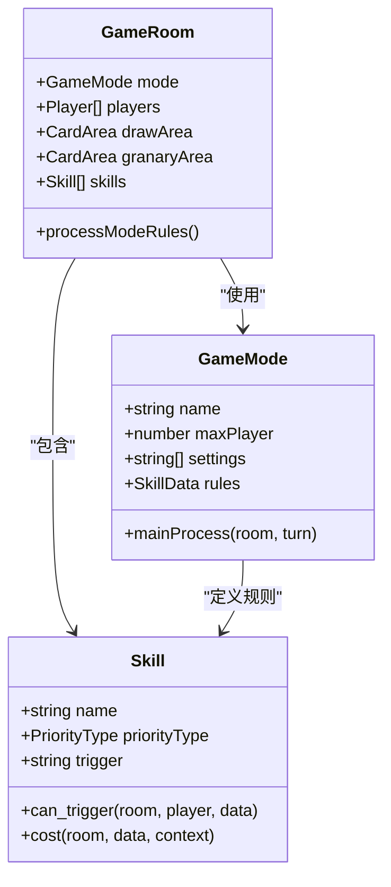
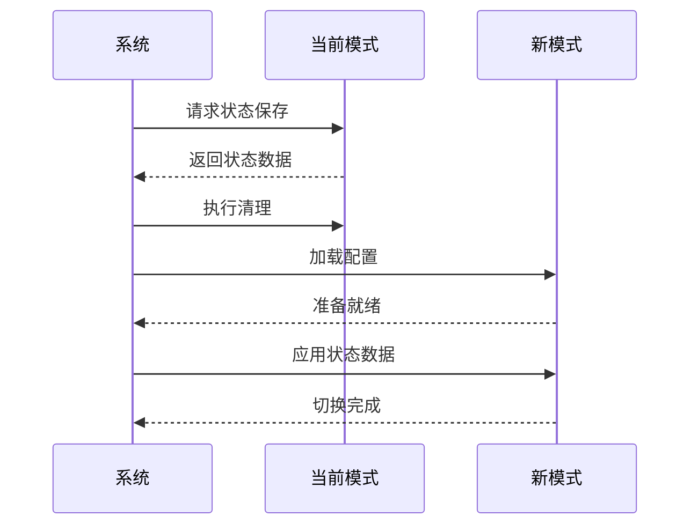

# 游戏模式管理

<cite>
**本文档引用文件**  
- [mode.ts](file://server/src/core/mode/mode.ts)
- [extensions.config.ts](file://server/src/core/extensions.config.ts)
- [wars/index.ts](file://server/src/extensions/wars/index.ts)
</cite>

## 目录
1. [引言](#引言)
2. [游戏模式注册与加载机制](#游戏模式注册与加载机制)
3. [扩展配置解析与模式发现](#扩展配置解析与模式发现)
4. [战争模式实现分析](#战争模式实现分析)
5. [多模式共存与资源隔离](#多模式共存与资源隔离)
6. [模式间数据共享与通信](#模式间数据共享与通信)
7. [游戏模式配置示例](#游戏模式配置示例)
8. [模式切换与状态迁移](#模式切换与状态迁移)

## 引言
本文档深入解析游戏系统中游戏模式的管理机制，重点分析`mode.ts`中的模式注册与加载流程、`extensions.config.ts`的扩展配置解析逻辑，以及`wars/index.ts`中战争模式的具体实现。通过详细的技术分析和代码示例，全面阐述游戏模式的生命周期管理、规则定义、状态迁移和多模式共存策略，为开发者提供完整的模式开发与维护指南。

## 游戏模式注册与加载机制

### 模式数据结构定义
游戏模式通过`GameModeData`接口定义其核心属性，包括模式名称、最大玩家数、额外设置项和专属规则技能。该接口还支持自定义主流程逻辑，允许开发者重写默认的回合交替机制。

```typescript
export interface GameModeData {
    /** 模式名 */
    name: string;
    /** 玩家数 */
    maxPlayer: number;
    /** 额外设置项 */
    settings: string[];
    /** 不通用的规则技能 */
    rules: string;
    /** 主流程逻辑 */
    mainProcess?: (room: GameRoom, turn: TurnEvent) => Promise<void>;
}
```

### 模式创建机制
系统通过`CreateMode`类型定义模式创建的参数结构，该类型继承自`GameModeData`但对`name`和`rules`字段进行了特殊处理，允许`rules`字段接受字符串或技能数据对象，提供了更大的灵活性。

**Section sources**
- [mode.ts](file://server/src/core/mode/mode.ts#L1-L30)

## 扩展配置解析与模式发现

### 扩展配置文件结构
`extensions.config.ts`文件定义了系统支持的所有扩展模块及其版本信息，采用数组形式存储扩展标识符。每个标识符由扩展名称和版本号组成，格式为`name@version`。

```typescript
export default [
    'standard@1.0',
    'shenhua@1.0',
    'yijiang@1.0',
    'mlongxuexuanhuang@1.0',
    'mxiuliqiankun@1.0',
    'wars@1.0',
    'doudizhu@1.0',
    'lang@1.0',
];
```

### 模式发现与加载流程
系统启动时会读取`extensions.config.ts`文件，遍历其中定义的扩展列表，动态加载对应的扩展模块。当遇到`wars@1.0`时，系统会加载`wars`扩展并注册其定义的游戏模式。这种机制实现了插件化的模式管理，支持热插拔和动态扩展。

**Section sources**
- [extensions.config.ts](file://server/src/core/extensions.config.ts#L1-L11)

## 战争模式实现分析

### 战争模式规则体系
战争模式通过`game_wars_rules`技能对象定义其核心规则体系，该对象包含多个触发效果，共同构成了完整的国战游戏逻辑。



**Diagram sources**
- [wars/index.ts](file://server/src/extensions/wars/index.ts#L7-L779)

### 核心规则实现
#### 主公装备替换
当游戏开始前，系统会根据主公身份自动替换其专属装备。例如，刘备主公会获得"飞龙夺凤"，张角主公会获得"太平要术"。

```typescript
game_wars_rules.addEffect(
    sgs.TriggerEffect({
        name: 'lord_equips',
        trigger: EventTriggers.GameStartBefore,
        can_trigger(room, player, data) {
            return room.options.settings.lordEquip;
        },
        async effect(room, data, context) {
            // 装备替换逻辑
        }
    })
);
```

#### 武将选择机制
玩家需要选择两张势力相同的武将牌作为主将和副将。系统通过选择器（selector）机制实现这一功能，确保选择过程符合游戏规则。

```typescript
game_wars_rules.addEffect(
    sgs.TriggerEffect({
        name: 'gamerule_choose_general',
        trigger: EventTriggers.ChooseGeneral,
        getSelectors(room, context) {
            return {
                choose_general: () => {
                    return {
                        selectors: {
                            general: {
                                type: 'general',
                                step: 1,
                                count: 2,
                                filter: function (item, selected) {
                                    // 势力相同过滤逻辑
                                }
                            }
                        }
                    };
                }
            };
        }
    })
);
```

#### 胜负判定规则
系统实现了两种胜负判定机制，当满足以下条件时游戏结束：
1. 所有存活玩家势力相同
2. 所有玩家的休息状态为0

```typescript
game_wars_rules.addEffect(
    sgs.TriggerEffect({
        name: 'gamerule_gameover1',
        trigger: EventTriggers.StateChanged,
        can_trigger(room, player, data) {
            return (
                room.playerAlives.every((v) =>
                    room.sameAsKingdom(v, room.playerAlives[0])
                ) && room.players.every((v) => v.rest === 0)
            );
        },
        async cost(room, data, context) {
            await room.gameOver(
                room.getPlayerByFilter(
                    (v) => room.sameAsKingdom(v, room.playerAlives[0]),
                    true
                ),
                this.name
            );
        }
    })
);
```

**Section sources**
- [wars/index.ts](file://server/src/extensions/wars/index.ts#L7-L779)

## 多模式共存与资源隔离

### 模式隔离策略
系统通过以下机制实现多模式共存：
1. **命名空间隔离**：每个模式使用独立的命名空间，避免资源冲突
2. **数据隔离**：不同模式的游戏数据存储在独立的数据库集合中
3. **规则隔离**：每个模式拥有独立的规则技能集合

### 资源管理机制


**Diagram sources**
- [mode.ts](file://server/src/core/mode/mode.ts#L1-L30)
- [wars/index.ts](file://server/src/extensions/wars/index.ts#L7-L779)

## 模式间数据共享与通信

### 数据共享机制
系统通过全局事件总线实现模式间通信，支持以下数据共享方式：
1. **事件广播**：通过`room.sendLog`向指定玩家发送日志信息
2. **状态共享**：通过`room.setData`和`room.getData`实现跨模式状态共享
3. **技能继承**：基础规则技能（如`base_selectors`）可在多个模式间复用

### 通信示例
```typescript
// 观看下家副将
game_wars_rules.addEffect(
    sgs.TriggerEffect({
        name: 'gamerule_watchnext',
        trigger: EventTriggers.GameStarted,
        can_trigger(room, player, data) {
            return room.options.settings.watchNext;
        },
        async cost(room, data, context) {
            await room.doRequestAll(
                room.playerAlives.map((v) => {
                    return {
                        player: v,
                        get_selectors: {
                            selectorId: room.base_selectors.getSelectorName('watch_general'),
                            context: {
                                targets: [v.next],
                                pos: 'deputy',
                                generals: room.getGeneralIds([v.next.deputy]),
                            },
                        },
                    };
                })
            );
        }
    })
);
```

**Section sources**
- [wars/index.ts](file://server/src/extensions/wars/index.ts#L7-L779)

## 游戏模式配置示例

### 自定义模式定义
以下示例展示如何定义一个新的游戏模式：

```typescript
// mymode/index.ts
import { sgs } from '../../core/export';

export const mymode_rules = sgs.Skill({
    name: 'mymode_rules',
});

// 添加自定义规则
mymode_rules.addEffect('base_selectors');
mymode_rules.addEffect(
    sgs.TriggerEffect({
        name: 'custom_rule',
        trigger: 'GameStart',
        can_trigger(room, player, data) {
            return true;
        },
        async cost(room, data, context) {
            // 自定义逻辑
            return true;
        }
    })
);

export const mode_mymode = sgs.GameMode({
    name: 'mymode',
    maxPlayer: 8,
    settings: ['enableSpecialRule'],
    rules: mymode_rules,
});

// 在 extensions.config.ts 中添加
// 'mymode@1.0',
```

**Section sources**
- [wars/index.ts](file://server/src/extensions/wars/index.ts#L7-L779)

## 模式切换与状态迁移

### 状态迁移策略
系统在模式切换时执行以下状态迁移操作：
1. **数据清理**：清除当前模式的临时数据
2. **状态保存**：保存玩家在当前模式中的关键状态
3. **资源释放**：释放模式专属资源
4. **新状态初始化**：根据新模式要求初始化游戏状态

### 兼容性处理


**Diagram sources**
- [mode.ts](file://server/src/core/mode/mode.ts#L1-L30)
- [wars/index.ts](file://server/src/extensions/wars/index.ts#L7-L779)