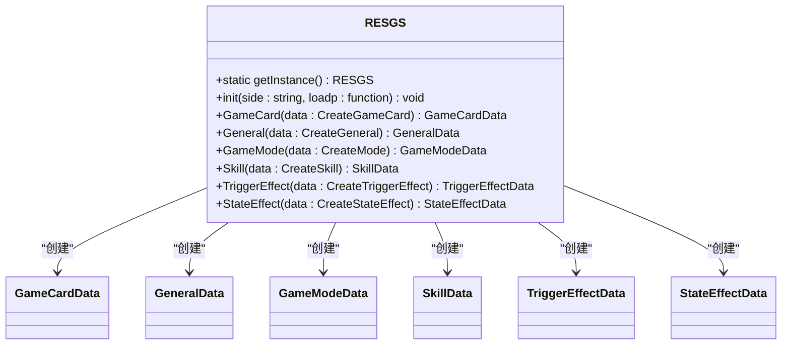
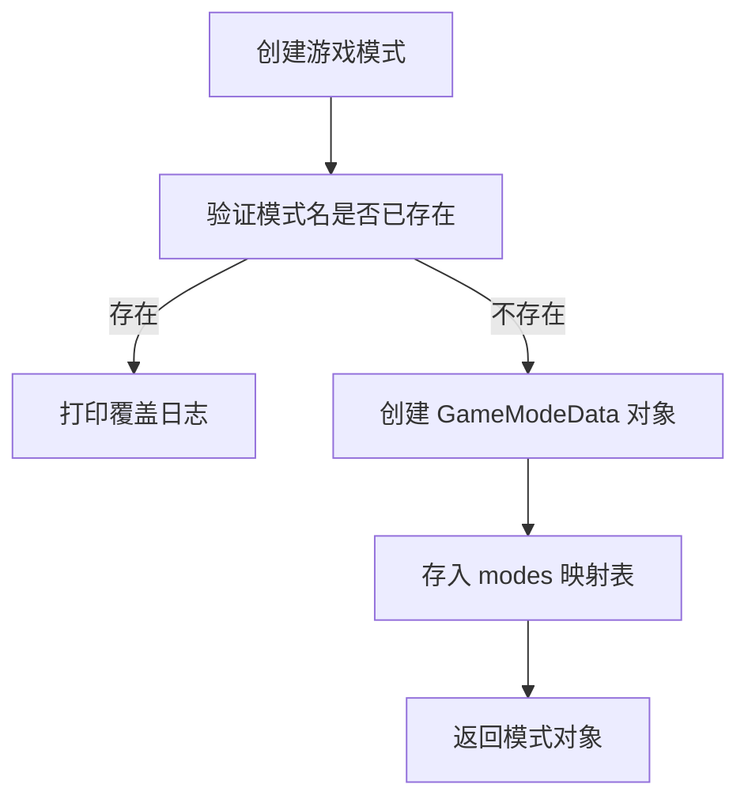
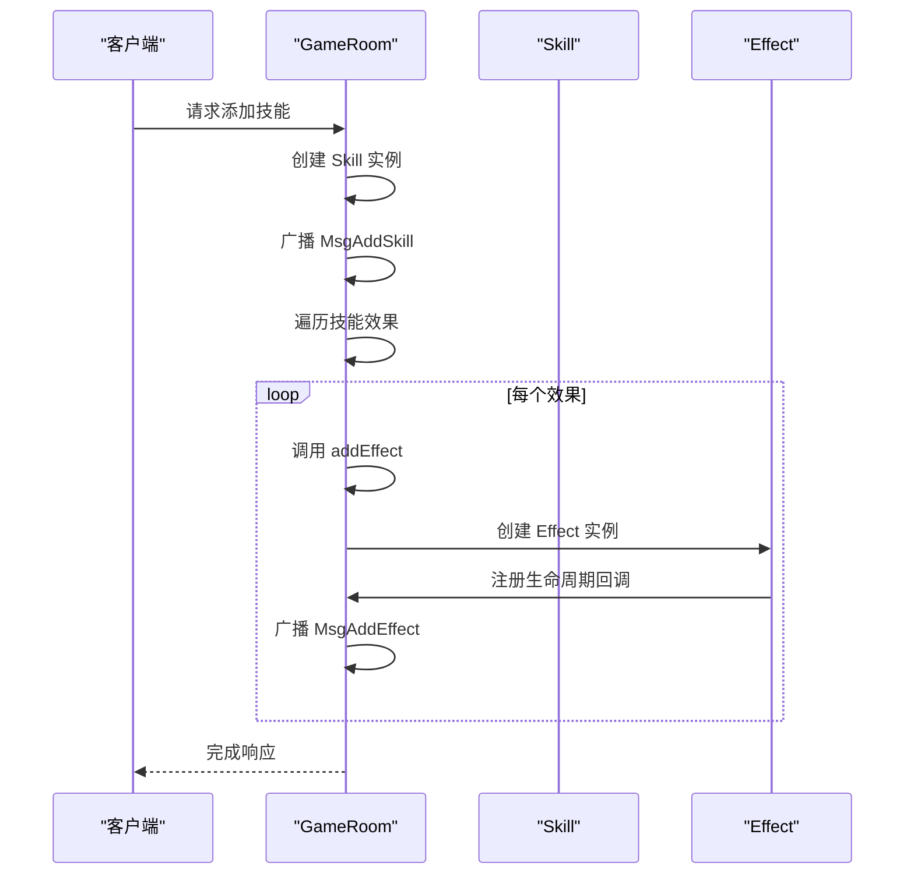
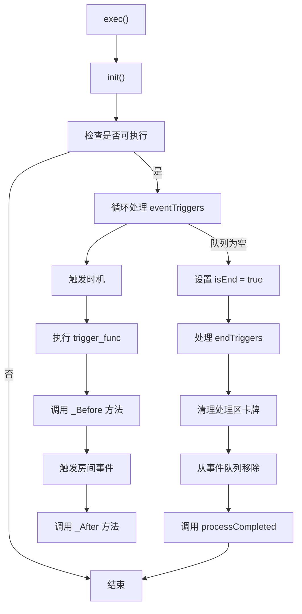
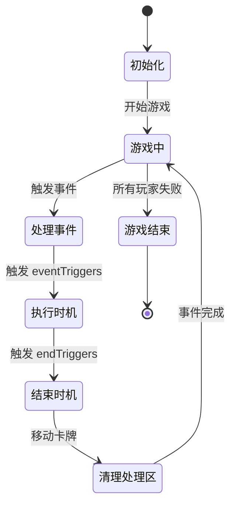
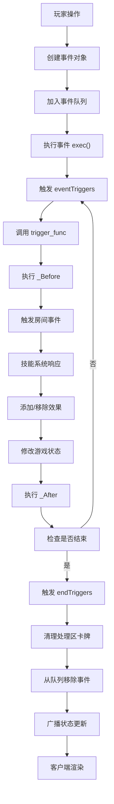

# 游戏逻辑

<cite>
**本文档引用的文件**  
- [sgs.ts](file://server/src/core/sgs.ts)
- [mode/mode.ts](file://server/src/core/mode/mode.ts)
- [room/mixins/room.skill.ts](file://server/src/core/room/mixins/room.skill.ts)
- [event/event.ts](file://server/src/core/event/event.ts)
</cite>

## 目录
1. [项目结构](#项目结构)
2. [核心系统设计](#核心系统设计)
3. [游戏模式配置与切换](#游戏模式配置与切换)
4. [技能系统实现](#技能系统实现)
5. [事件驱动架构](#事件驱动架构)
6. [回合制逻辑与状态验证](#回合制逻辑与状态验证)
7. [游戏逻辑流程图](#游戏逻辑流程图)
8. [平衡性与防作弊机制](#平衡性与防作弊机制)

## 项目结构

项目采用前后端分离架构，核心游戏逻辑位于服务器端 `server/src/core` 目录下。主要模块包括：

- **card**: 卡牌数据与类型定义
- **general**: 武将数据与类型定义
- **mode**: 游戏模式配置
- **room**: 房间逻辑与混入（mixin）系统
- **skill**: 技能与效果系统
- **event**: 事件驱动架构
- **player**: 玩家状态管理

客户端资源包含动画、UI、配置文件等，通过网络与服务器通信实现游戏交互。

**Section sources**
- [sgs.ts](file://server/src/core/sgs.ts#L0-L799)

## 核心系统设计

游戏核心由 `RESGS` 类实现，采用单例模式全局管理游戏数据与系统。该类负责初始化所有核心组件，包括卡牌、武将、技能、模式等，并通过 `init` 方法完成系统装配。



**Diagram sources**
- [sgs.ts](file://server/src/core/sgs.ts#L100-L200)

**Section sources**
- [sgs.ts](file://server/src/core/sgs.ts#L0-L799)

## 游戏模式配置与切换

### 模式定义

游戏模式通过 `GameModeData` 接口定义，包含模式名称、最大玩家数、规则技能和主流程逻辑。主流程 `mainProcess` 可自定义回合顺序，若未定义则使用默认轮转机制。

```typescript
interface GameModeData {
    name: string;
    maxPlayer: number;
    settings: string[];
    rules: string;
    mainProcess?: (room: GameRoom, turn: TurnEvent) => Promise<void>;
}
```

### 模式创建与获取

通过 `RESGS` 的 `GameMode` 方法创建新模式，并存入 `modes` 映射表中。可通过 `getGameMode` 方法按名称获取模式，若未找到则返回默认模式。



**Diagram sources**
- [mode/mode.ts](file://server/src/core/mode/mode.ts#L5-L30)
- [sgs.ts](file://server/src/core/sgs.ts#L300-L320)

**Section sources**
- [mode/mode.ts](file://server/src/core/mode/mode.ts#L5-L30)
- [sgs.ts](file://server/src/core/sgs.ts#L300-L320)

## 技能系统实现

### 技能与效果

技能系统采用“技能-效果”两级结构。技能（`Skill`）作为容器，包含多个效果（`Effect`），效果分为触发式（`TriggerEffect`）和状态式（`StateEffect`）。效果通过事件触发器（`EventTriggers`）绑定到特定游戏时机。

### 技能管理

`RoomSkillMixin` 提供技能与效果的增删管理：

- `addSkill`: 添加技能并广播消息，同时为其添加所有关联效果
- `removeSkill`: 移除技能及其所有效果
- `addEffect`: 添加效果并注册其生命周期
- `removeEffect`: 移除效果并清理生命周期回调



**Diagram sources**
- [room.skill.ts](file://server/src/core/room/mixins/room.skill.ts#L10-L100)
- [sgs.ts](file://server/src/core/sgs.ts#L400-L450)

**Section sources**
- [room.skill.ts](file://server/src/core/room/mixins/room.skill.ts#L10-L404)

## 事件驱动架构

### 事件处理流程

事件系统基于 `EventProcess` 抽象类实现，采用“时机-执行-结束”三阶段模型：

1. **初始化**：将事件加入房间事件队列
2. **执行**：按顺序触发 `eventTriggers` 中的时机
3. **结束**：触发 `endTriggers` 并清理处理区卡牌



### 事件生命周期

事件通过 `insert` 方法动态插入新时机，支持在指定时机后插入，实现复杂的时机控制。例如，某些技能效果可在“使用卡牌前”插入“判定”时机。

**Diagram sources**
- [event.ts](file://server/src/core/event/event.ts#L10-L100)

**Section sources**
- [event.ts](file://server/src/core/event/event.ts#L0-L168)

## 回合制逻辑与状态验证

### 回合流程

游戏主循环通过 `TurnEvent` 驱动，每个回合包含多个阶段（`PhaseEvent`）。默认流程从1号位开始，顺时针轮转。自定义模式可通过 `mainProcess` 改写此逻辑。

### 状态验证

系统通过以下机制确保状态一致性：

- **事件完整性**：每个事件必须完成所有时机处理
- **处理区清理**：事件结束后自动将处理区卡牌移至弃牌堆
- **事件队列管理**：仅当事件队列为空时才允许新操作
- **状态标记**：`isComplete` 和 `isEnd` 标记防止重复执行



**Diagram sources**
- [event.ts](file://server/src/core/event/event.ts#L100-L150)
- [mode/mode.ts](file://server/src/core/mode/mode.ts#L10-L20)

**Section sources**
- [event.ts](file://server/src/core/event/event.ts#L0-L168)
- [mode/mode.ts](file://server/src/core/mode/mode.ts#L5-L30)

## 游戏逻辑流程图



**Diagram sources**
- [event.ts](file://server/src/core/event/event.ts#L50-L150)
- [room.skill.ts](file://server/src/core/room/mixins/room.skill.ts#L10-L100)

## 平衡性与防作弊机制

### 平衡性设计

- **优先级系统**：效果通过 `PriorityType` 控制触发顺序，避免冲突
- **条件检查**：每个技能和效果都有 `condition` 函数进行前置判断
- **资源消耗**：`cost` 函数实现技能使用代价，防止滥用
- **动态配置**：支持通过 `settings` 字段为模式添加平衡性参数

### 防作弊机制

- **服务端权威**：所有游戏逻辑在服务器执行，客户端仅负责展示
- **状态验证**：关键操作前检查玩家状态（如血量、手牌）
- **事件溯源**：完整事件历史记录，支持回放与审计
- **输入验证**：对客户端输入进行严格校验，拒绝非法请求
- **防重放**：事件ID与房间状态绑定，防止重复提交

**Section sources**
- [sgs.ts](file://server/src/core/sgs.ts#L400-L500)
- [event.ts](file://server/src/core/event/event.ts#L100-L150)