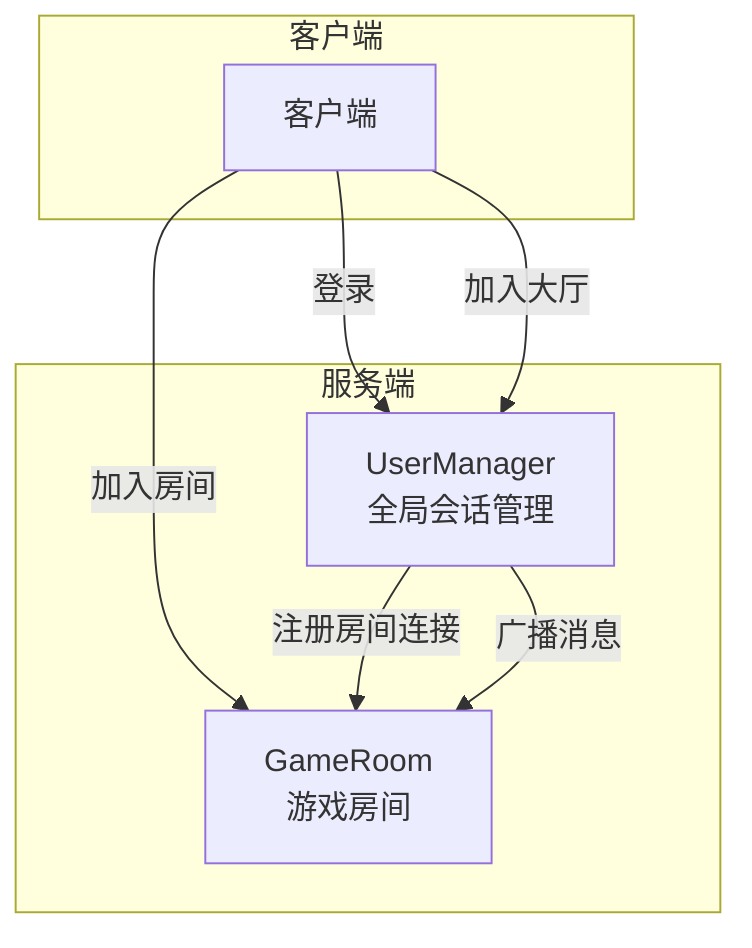
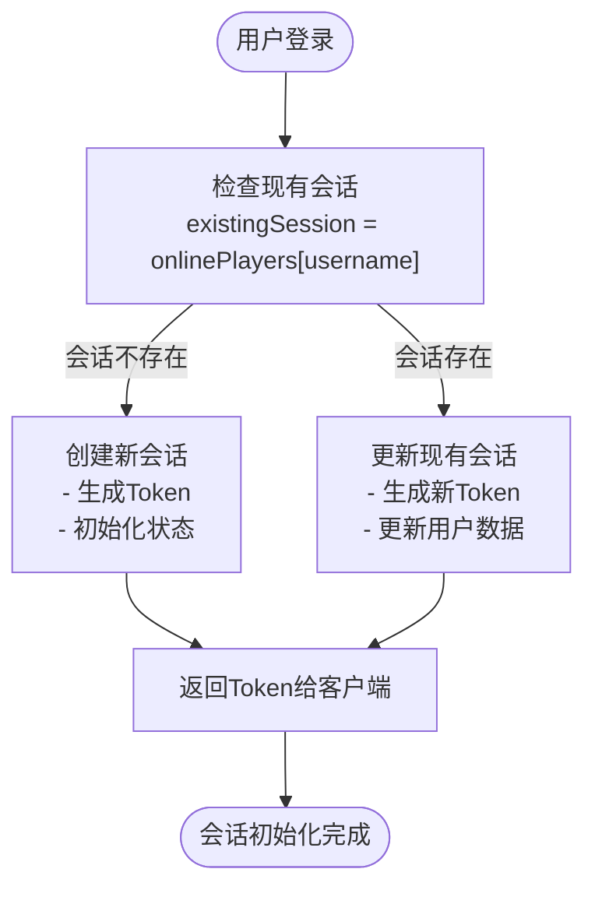
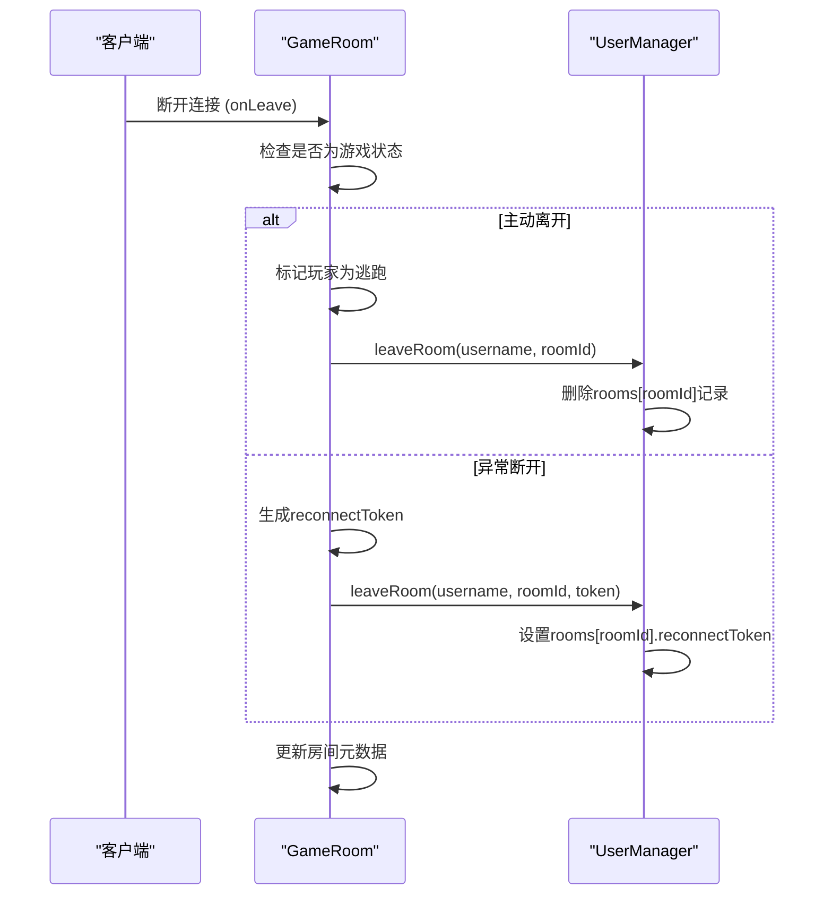
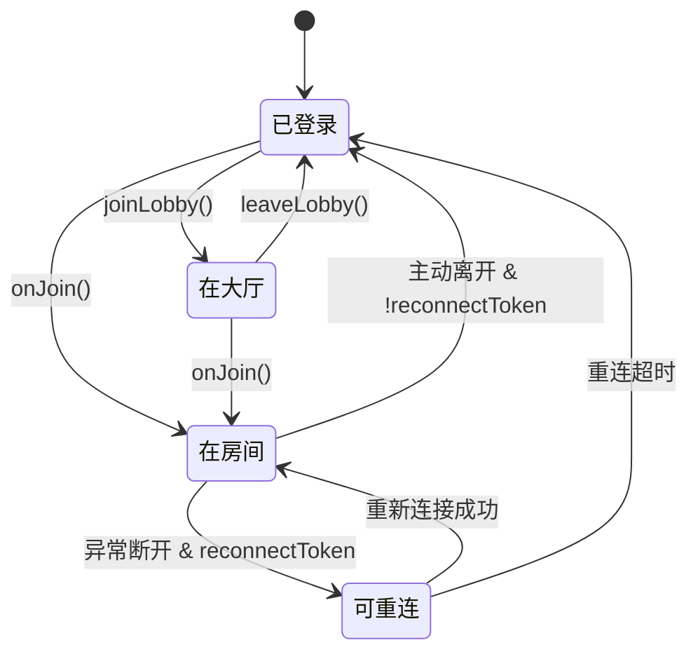

# 会话生命周期

<cite>
**本文档引用的文件**  
- [UserManager.ts](file://server/src/UserManager.ts#L1-L150)
- [game.ts](file://server/src/rooms/game.ts#L1-L861)
</cite>

## 目录
1. [简介](#简介)
2. [项目结构](#项目结构)
3. [核心组件](#核心组件)
4. [架构概览](#架构概览)
5. [详细组件分析](#详细组件分析)
6. [依赖分析](#依赖分析)
7. [性能考虑](#性能考虑)
8. [故障排除指南](#故障排除指南)
9. [结论](#结论)

## 简介
本文档详细解析了用户会话的完整生命周期，重点分析了`UserManager.ts`中用户连接与断开的处理逻辑。文档涵盖用户登录、大厅连接、房间加入、状态管理、资源分配与清理等核心流程，并结合`game.ts`中的房间逻辑，全面展示会话从创建到销毁的全过程。通过状态图、序列图和代码分析，为开发者提供清晰的系统行为理解。

## 项目结构
项目分为客户端（client）和服务端（server）两大部分。服务端是会话管理的核心，其`src`目录下包含`UserManager.ts`（用户会话管理）和`rooms/game.ts`（游戏房间逻辑）等关键文件。`UserManager`作为全局单例，负责维护所有在线用户的会话状态，是整个会话生命周期的控制中心。

**Section sources**
- [UserManager.ts](file://server/src/UserManager.ts#L1-L150)
- [game.ts](file://server/src/rooms/game.ts#L1-L861)

## 核心组件
`UserManager`类是会话管理的核心，它通过一个名为`onlinePlayers`的内存对象来存储所有在线用户的状态。每个用户会话包含其用户数据（`userdata`）、认证令牌（`token`）、最后活跃时间（`lastActive`）、大厅客户端连接（`lobbyClient`）以及该用户加入的所有房间信息（`rooms`）。这种设计将用户的所有连接状态集中管理，便于进行广播、查找和清理。

**Section sources**
- [UserManager.ts](file://server/src/UserManager.ts#L1-L150)

## 架构概览
系统采用基于Colyseus框架的房间（Room）模型。用户首先通过`UserManager`进行登录认证，然后可以加入大厅（Lobby）或直接加入游戏房间（GameRoom）。`UserManager`负责全局状态，而`GameRoom`则负责具体的房间内游戏逻辑和玩家状态。两者通过`UserManager.inst.joinRoom`等方法进行交互，形成一个分层的会话管理体系。



**Diagram sources**
- [UserManager.ts](file://server/src/UserManager.ts#L1-L150)
- [game.ts](file://server/src/rooms/game.ts#L1-L861)

## 详细组件分析

### 用户连接与初始化流程
当用户成功登录时，`UserManager.login`方法被调用。如果这是用户的首次连接，系统会为其生成一个JWT令牌并创建一个新的会话对象，存储在`onlinePlayers`字典中。如果用户已存在会话（例如重新登录），则更新其用户数据和令牌。此过程完成了用户会话的初始化，为后续连接大厅或房间做好准备。



**Diagram sources**
- [UserManager.ts](file://server/src/UserManager.ts#L43-L89)

### 会话创建与状态注册
用户连接的完整流程分为两个阶段：连接大厅和加入房间。
1.  **连接大厅**：当用户进入大厅时，客户端调用`joinLobby`。`UserManager`会将`lobbyClient`对象（代表WebSocket连接）注册到该用户的会话中，并更新最后活跃时间。
2.  **加入房间**：当用户加入一个游戏房间时，`GameRoom.onJoin`方法会调用`UserManager.inst.joinRoom`。这会在用户会话的`rooms`字典中添加一条新记录，关联房间实例和客户端连接。

这种设计将用户的连接状态与具体的房间实例解耦，允许用户同时在大厅和多个房间中保持连接。

**Section sources**
- [UserManager.ts](file://server/src/UserManager.ts#L89-L110)
- [game.ts](file://server/src/rooms/game.ts#L151-L180)

### 断开连接与清理机制
用户断开连接的处理主要由`GameRoom.onLeave`方法触发，其行为取决于断开是**主动**（`consented=true`）还是**被动**（异常断开）。
- **主动断开**：用户正常离开房间。系统会从房间状态中移除玩家，并根据情况（如游戏已开始）标记玩家为“逃跑”（`__escape`），然后调用`UserManager.inst.leaveRoom`清理用户会话中的房间记录。
- **被动断开**（异常）：用户网络中断。系统会生成一个`reconnectToken`，并将其存储在`UserManager`的会话中。这允许用户在短时间内重新连接并恢复游戏状态，而不会被视为完全离开。

`UserManager.leaveRoom`方法是清理的核心。如果提供了`reconnectToken`，它会更新会话中的重连令牌；否则，它会直接从`rooms`字典中删除该房间的记录，完成资源释放。



**Diagram sources**
- [game.ts](file://server/src/rooms/game.ts#L230-L290)
- [UserManager.ts](file://server/src/UserManager.ts#L110-L120)

### 会话状态流转图
下图展示了用户从连接到断开的完整状态流转。



**Diagram sources**
- [UserManager.ts](file://server/src/UserManager.ts#L1-L150)
- [game.ts](file://server/src/rooms/game.ts#L1-L861)

### 会话存储与集群环境
当前会话数据（`onlinePlayers`）存储在`UserManager`实例的内存中。这是一种简单高效的方案，适用于单机部署。然而，在集群环境下，这种方案存在局限性：
- **会话不共享**：不同服务器实例上的`UserManager`无法共享会话状态，导致用户无法在服务器间迁移。
- **数据易失**：服务器重启会导致所有会话丢失。

**优化建议**：在集群环境中，应将会话状态（如`onlinePlayers`）迁移到分布式缓存（如Redis）中。这可以实现会话共享、提高可用性，并支持水平扩展。

## 依赖分析
`UserManager`与`GameRoom`之间存在紧密的依赖关系。`GameRoom`在`onJoin`和`onLeave`时依赖`UserManager`来注册和注销用户的房间连接。同时，`UserManager`也依赖`GameRoom`的`roomId`和`client`对象来维护其状态。这种双向依赖通过清晰的接口（`joinRoom`, `leaveRoom`）实现，保证了模块间的松耦合。

```mermaid
classDiagram
class UserManager {
+onlinePlayers : { [username] : PlayerSession }
+login(user) : string
+joinLobby(username, client)
+leaveLobby(client)
+joinRoom(username, room, client)
+leaveRoom(username, roomId, token)
}
class GameRoom {
+onJoin(client, options)
+onLeave(client, consented)
+onAuth(client, options, context)
}
UserManager --> GameRoom : "在onJoin/onLeave时<br/>传递room和client"
GameRoom --> UserManager : "调用joinRoom/leaveRoom<br/>管理用户会话"
```

**Diagram sources**
- [UserManager.ts](file://server/src/UserManager.ts#L1-L150)
- [game.ts](file://server/src/rooms/game.ts#L1-L861)

## 性能考虑
- **内存使用**：`onlinePlayers`对象会随着在线用户数线性增长。对于大规模应用，需监控内存使用情况。
- **查找效率**：`findPlayerByClinet`方法通过遍历所有用户和房间来查找客户端，时间复杂度为O(n*m)。在高并发场景下，可考虑建立`sessionId`到`player`的反向索引以优化为O(1)。
- **广播性能**：`broadcast`方法会遍历所有在线用户并向其大厅和房间客户端发送消息。在用户量巨大时，应考虑消息队列或更精细的广播策略。

## 故障排除指南
- **用户无法登录**：检查`UserManager.login`方法，确认`DbUser`数据是否正确，JWT密钥是否匹配。
- **用户无法加入房间**：检查`GameRoom.onAuth`方法，确认用户令牌、房间密码、测试资格等认证逻辑。
- **重连失败**：检查`reconnectToken`的生成和验证逻辑，确保`UserManager`中的令牌与`GameRoom`中的令牌匹配，且未过期。
- **内存泄漏**：监控`onlinePlayers`字典的大小。确保在用户完全断开后，其会话能被正确清理（`leaveRoom`被调用且`reconnectToken`未被设置）。

**Section sources**
- [UserManager.ts](file://server/src/UserManager.ts#L1-L150)
- [game.ts](file://server/src/rooms/game.ts#L1-L861)

## 结论
`UserManager`通过一个中心化的内存数据结构，高效地管理了用户的整个会话生命周期。其设计清晰地分离了登录、大厅连接和房间连接三个层次。虽然当前的内存存储方案简单有效，但在生产环境的集群部署中，建议将会话状态持久化到Redis等分布式缓存中，以提升系统的可扩展性和可靠性。对`onJoin`和`onLeave`事件的精心处理，确保了在各种网络条件下用户状态的正确性和一致性。