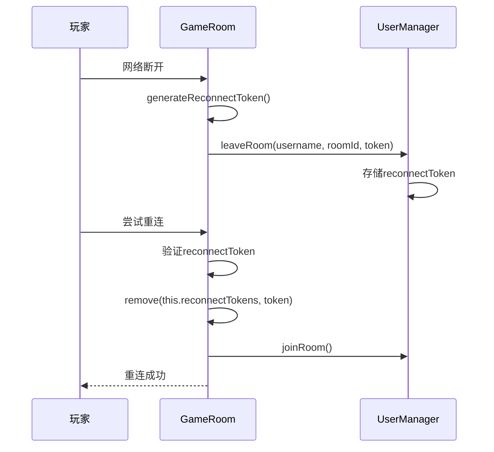
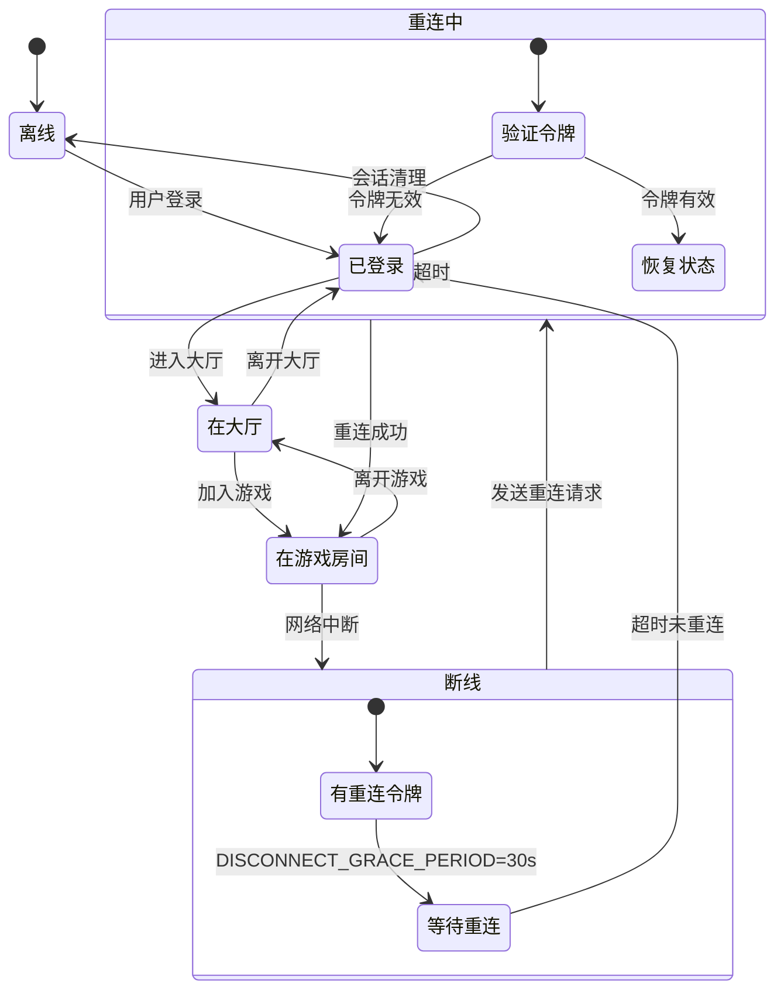

# 会话管理

<cite>
**本文档引用的文件**
- [UserManager.ts](file://server/src/UserManager.ts)
- [ReconnectToken.ts](file://server/src/models/ReconnectToken.ts)
- [userCleanup.ts](file://server/src/scripts/userCleanup.ts)
- [game.ts](file://server/src/rooms/game.ts)
- [lobby.ts](file://server/src/rooms/lobby.ts)
- [auth.ts](file://server/src/routes/auth.ts)
</cite>

## 目录
1. [简介](#简介)
2. [核心组件概述](#核心组件概述)
3. [用户会话管理机制](#用户会话管理机制)
4. [断线重连令牌设计](#断线重连令牌设计)
5. [用户在线状态维护与广播](#用户在线状态维护与广播)
6. [会话状态流转图](#会话状态流转图)
7. [会话存储与性能优化](#会话存储与性能优化)

## 简介
本文档详细解析游戏服务器中的会话管理机制，重点分析用户连接、断线重连、会话超时等关键流程。通过深入解读 `UserManager` 和 `ReconnectToken` 等核心模块，阐述系统如何维护用户在线状态、处理网络中断以及保障用户体验。文档涵盖会话生命周期、安全设计、状态同步及清理策略，为理解系统会话架构提供全面指导。

## 核心组件概述
会话管理主要由以下核心组件构成：
- **UserManager**: 全局单例，负责管理所有在线用户的会话状态
- **ReconnectToken**: 断线重连令牌接口，用于安全恢复游戏连接
- **GameRoom**: 游戏房间，处理玩家进出及重连逻辑
- **CustomLobbyRoom**: 大厅房间，管理用户在大厅的连接状态
- **userCleanup**: 用户清理脚本，定期清理无效会话

这些组件协同工作，构建了完整的会话管理体系。

**Section sources**
- [UserManager.ts](file://server/src/UserManager.ts#L1-L150)
- [ReconnectToken.ts](file://server/src/models/ReconnectToken.ts#L1-L9)
- [userCleanup.ts](file://server/src/scripts/userCleanup.ts#L1-L30)

## 用户会话管理机制

### 用户连接与登录
用户通过认证接口 `/auth/login` 登录系统。`UserManager` 的 `login` 方法处理登录逻辑：
1. 检查用户是否已存在在线会话
2. 若不存在，生成新的 JWT 令牌并创建会话记录
3. 若已存在，更新用户数据并刷新令牌

```typescript
login(user: DbUser) {
    const existingSession = this.onlinePlayers[user.username];
    if (!existingSession) {
        const token = this.generateToken(user);
        this.onlinePlayers[user.username] = {
            userdata: user,
            lastActive: new Date(),
            token,
            lobbyClient: null,
            rooms: {},
        };
        return token;
    }
    // 更新现有会话
    const newToken = this.generateToken(user);
    existingSession.token = newToken;
    existingSession.userdata = user;
    return newToken;
}
```

### 断线重连处理
当用户网络中断时，系统提供断线重连机制：
1. 玩家断开连接时，`GameRoom` 生成重连令牌
2. 令牌存储在 `UserManager` 的会话中
3. 玩家在规定时间内可使用令牌恢复连接
4. 重连成功后，令牌被立即销毁

### 会话超时与清理
系统通过 `userCleanup` 脚本定期清理无效会话：
- 清理间隔：每小时执行一次（3600000毫秒）
- 清理条件：用户既不在大厅连接，也不在任何游戏房间中
- 清理操作：从 `onlinePlayers` 映射中删除该用户会话

```typescript
Object.keys(userManager.onlinePlayers).forEach((v) => {
    const user = userManager.onlinePlayers[v];
    if (user && !user.lobbyClient && Object.keys(user.rooms).length === 0) {
        delete userManager.onlinePlayers[v];
    }
});
```

**Section sources**
- [UserManager.ts](file://server/src/UserManager.ts#L43-L89)
- [userCleanup.ts](file://server/src/scripts/userCleanup.ts#L10-L25)
- [auth.ts](file://server/src/routes/auth.ts#L1-L58)

## 断线重连令牌设计

### 令牌结构
`ReconnectToken` 接口定义了重连令牌的数据结构：

```typescript
export interface ReconnectToken {
    token: string;           // 令牌字符串
    roomId: string;          // 房间ID
    playerId: string;        // 玩家ID
    username: string;        // 用户名
    createdAt: number;       // 创建时间戳
    expiresAt: number;       // 过期时间戳（当前未使用）
}
```

### 安全性考虑
1. **令牌生成**: 使用 `Math.random().toString(36)` 生成随机字符串，长度为13-14位
2. **作用域限制**: 令牌与特定房间、玩家ID和用户名绑定
3. **一次性使用**: 重连成功后立即从系统中移除
4. **无长期存储**: 令牌仅在内存中临时存在，不持久化到数据库
5. **时效性**: 虽然接口定义了过期时间字段，但当前实现中未强制执行

### 令牌生命周期


**Diagram sources**
- [ReconnectToken.ts](file://server/src/models/ReconnectToken.ts#L1-L9)
- [game.ts](file://server/src/rooms/game.ts#L284-L317)
- [UserManager.ts](file://server/src/UserManager.ts#L78-L89)

## 用户在线状态维护与广播

### 在线状态结构
`UserManager` 使用 `onlinePlayers` 对象维护所有在线用户的状态：

```typescript
public onlinePlayers: {
    [username: string]: {
        userdata: DbUser;
        token: string;
        lastActive: Date;
        lobbyClient: Client | null;
        rooms: {
            [roomId: string]: {
                room: GameRoom;
                client: Client;
                reconnectToken?: string;
            };
        };
    };
}
```

### 状态维护机制
1. **大厅连接**: 通过 `joinLobby` 和 `leaveLobby` 方法维护
2. **房间连接**: 通过 `joinRoom` 和 `leaveRoom` 方法维护
3. **最后活跃时间**: 每次连接状态变化时更新 `lastActive`

### 广播机制
`broadcast` 方法实现全局消息广播，向所有在线用户发送系统消息：

```typescript
broadcast(message: string) {
    for (const username in this.onlinePlayers) {
        const player = this.onlinePlayers[username];
        // 向大厅客户端发送消息
        if (player.lobbyClient) {
            player.lobbyClient.send('chat', {
                date: Date.now(),
                username: '系统',
                message,
            });
        }
        // 向所有房间内的客户端发送消息
        for (const roomId in player.rooms) {
            if (player.rooms[roomId].client) {
                player.rooms[roomId].client.send('chat', {
                    date: Date.now(),
                    username: '系统',
                    message,
                });
            }
        }
    }
}
```

该机制确保系统公告能够触达所有在线用户，无论其处于大厅还是游戏房间中。

**Section sources**
- [UserManager.ts](file://server/src/UserManager.ts#L126-L148)
- [lobby.ts](file://server/src/rooms/lobby.ts#L36-L57)

## 会话状态流转图



**Diagram sources**
- [UserManager.ts](file://server/src/UserManager.ts#L15-L20)
- [game.ts](file://server/src/rooms/game.ts#L284-L317)
- [UserManager.ts](file://server/src/UserManager.ts#L78-L89)

## 会话存储与性能优化

### 存储策略
当前系统采用**内存存储**策略：
- **优点**: 访问速度快，延迟低
- **缺点**: 服务器重启后会话丢失，不支持集群环境

`onlinePlayers` 对象直接存储在应用内存中，通过单例模式全局访问。

### 集群环境挑战
当前实现存在以下集群环境下的问题：
1. **会话不同步**: 用户连接到不同服务器实例时，会话状态无法共享
2. **重连失败**: 断线后可能连接到其他实例，导致重连令牌验证失败
3. **广播不完整**: 消息只能广播给同一实例的用户

### 性能优化建议
1. **引入Redis**: 将会话状态存储到Redis，实现：
   - 数据持久化
   - 集群环境下的会话共享
   - 高可用性
   - 自动过期机制

2. **优化清理策略**:
   - 增加实时清理：在玩家离开房间时立即检查是否可清理
   - 实现更精细的过期策略：为不同状态设置不同的过期时间

3. **内存优化**:
   - 限制单个用户的会话数据大小
   - 实现会话数据压缩
   - 添加最大在线用户数限制

4. **安全性增强**:
   - 为重连令牌添加明确的过期时间
   - 实现令牌使用次数限制
   - 增加IP地址验证

**Section sources**
- [UserManager.ts](file://server/src/UserManager.ts#L1-L150)
- [userCleanup.ts](file://server/src/scripts/userCleanup.ts#L1-L30)