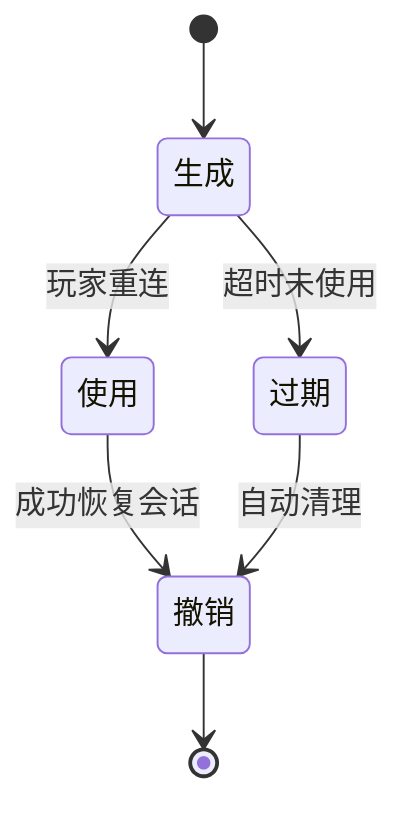
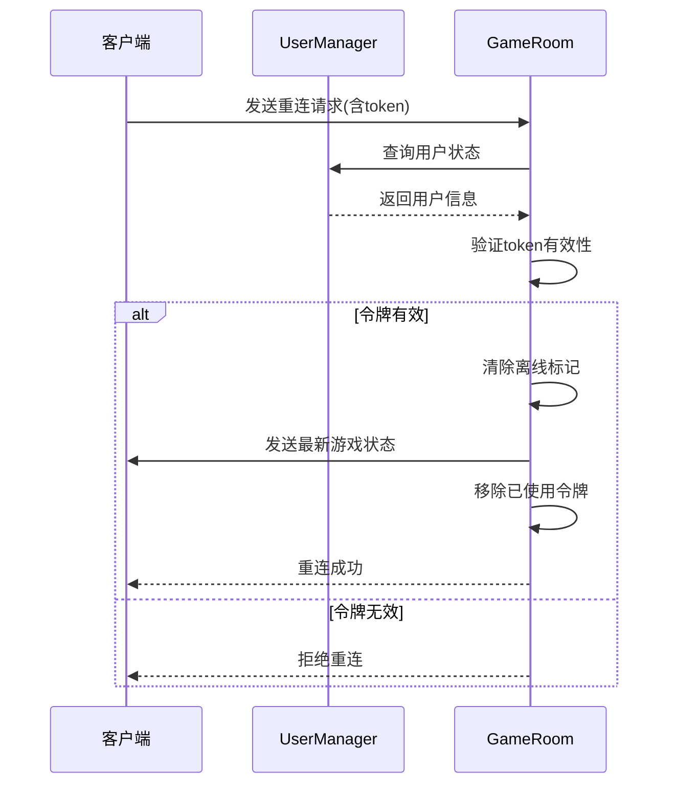

# 断线重连机制

<cite>
**本文档引用文件**  
- [ReconnectToken.ts](file://server/src/models/ReconnectToken.ts)
- [UserManager.ts](file://server/src/UserManager.ts)
- [game.ts](file://server/src/rooms/game.ts)
- [Client.ts](file://client/src/mgr/Client.ts)
</cite>

## 目录
1. [引言](#引言)
2. [断线重连令牌设计](#断线重连令牌设计)
3. [令牌生成与验证机制](#令牌生成与验证机制)
4. [会话恢复流程](#会话恢复流程)
5. [安全性考虑](#安全性考虑)
6. [异常处理与用户体验](#异常处理与用户体验)
7. [性能影响评估](#性能影响评估)
8. [结论](#结论)

## 引言

在多人在线游戏中，网络连接的稳定性至关重要。当玩家因网络波动或设备问题与服务器断开连接时，断线重连机制能够有效提升用户体验，避免游戏进度丢失。本文档详细分析了基于 `ReconnectToken` 的断线重连机制，涵盖令牌的设计、生成、验证、过期与撤销流程，以及如何通过该机制恢复会话状态和权限。同时，文档还探讨了相关的安全策略、防重放攻击措施、性能影响及异常处理方案。

**Section sources**  
- [ReconnectToken.ts](file://server/src/models/ReconnectToken.ts#L0-L7)
- [game.ts](file://server/src/rooms/game.ts#L25)

## 断线重连令牌设计

### 令牌数据结构

断线重连令牌（`ReconnectToken`）是一个接口定义，用于描述重连所需的关键信息。其结构如下：

```typescript
export interface ReconnectToken {
    token: string;           // 令牌字符串，用于身份验证
    roomId: string;          // 房间ID，标识玩家所在的房间
    playerId: string;        // 玩家ID，标识具体玩家
    username: string;        // 用户名，用于权限校验
    createdAt: number;       // 创建时间戳（毫秒）
    expiresAt: number;       // 过期时间戳（毫秒，可为空）
}
```

该结构确保了令牌具备足够的信息以验证玩家身份并恢复其在房间中的状态。

### 令牌生命周期

令牌的生命周期包括生成、使用、过期和撤销四个阶段：
- **生成**：玩家离开房间时，若游戏正在进行，则生成一个临时令牌。
- **使用**：玩家在规定时间内重新连接时，使用该令牌恢复会话。
- **过期**：令牌在一定时间后自动失效，防止长期占用资源。
- **撤销**：一旦令牌被成功使用或玩家主动退出，令牌立即被移除。

**Diagram sources**  
- [ReconnectToken.ts](file://server/src/models/ReconnectToken.ts#L0-L7)



## 令牌生成与验证机制

### 令牌生成流程

当玩家在游戏过程中断开连接时，服务器会调用 `generateReconnectToken` 方法生成一个唯一的重连令牌。该方法位于 `GameRoom` 类中，代码如下：

```typescript
private generateReconnectToken(playerId: string, username: string): ReconnectToken {
    const token = {
        token: Math.random().toString(36).substring(2, 15),
        roomId: this.roomId,
        playerId,
        username,
        createdAt: Date.now(),
        expiresAt: null,
    };
    return token;
}
```

- **随机性**：使用 `Math.random().toString(36)` 生成伪随机字符串，确保令牌难以预测。
- **无过期时间**：当前实现中未设置 `expiresAt`，依赖后续逻辑进行超时管理。

生成的令牌会被存储在房间的 `reconnectTokens` 数组中，并与玩家的房间记录关联。

### 令牌验证流程

令牌的验证发生在玩家尝试重新加入房间时，通过 `onAuth` 钩子函数完成。核心逻辑如下：

```typescript
if (user.rooms[this.roomId] && user.rooms[this.roomId].reconnectToken) {
    const rtoken = this.reconnectTokens.find(
        (v) =>
            v.token === user.rooms[this.roomId].reconnectToken &&
            v.username === user.userdata.username
    );
    if (rtoken) {
        return true;
    }
    return false;
}
```

验证过程包含以下步骤：
1. 检查用户是否持有有效的重连令牌。
2. 在房间的 `reconnectTokens` 列表中查找匹配的令牌。
3. 核对用户名是否一致，防止冒用。
4. 若匹配成功，允许玩家重新加入。

**Section sources**  
- [game.ts](file://server/src/rooms/game.ts#L79-L83)
- [game.ts](file://server/src/rooms/game.ts#L153-L158)

## 会话恢复流程

### 状态同步机制

当玩家使用有效令牌成功重连后，服务器会执行状态同步操作，确保客户端恢复到断线前的游戏状态。关键代码位于 `onJoin` 方法中：

```typescript
if (reconnectToken) {
    if (this.state.game) {
        const player = this.state.game.getPlayer(rtoken.playerId);
        if (player) {
            player.removeMark('__offline');
            player.removeMark('__offline__escape');
            if (needData) {
                this.sendReconnectData(client, player.playerId);
            }
        }
    }
    lodash.remove(this.reconnectTokens, rtoken);
    if (user.rooms[this.roomId]) {
        user.rooms[this.roomId].reconnectToken = null;
    }
}
```

- **状态标记清除**：移除 `__offline` 和 `__offline__escape` 标记，表示玩家已在线。
- **数据推送**：调用 `sendReconnectData` 向客户端发送最新的游戏状态。
- **令牌清理**：立即从 `reconnectTokens` 中移除已使用的令牌，防止重复使用。

### 权限验证

在重连过程中，系统会再次验证用户的登录状态和权限：
- 通过 `UserManager.inst.onlinePlayers[username]` 检查用户是否仍处于在线状态。
- 比对 `token` 是否与当前会话一致，确保身份未被篡改。
- 检查房间密码、测试资格等限制条件，维持原有安全策略。

只有通过所有验证，玩家才能成功恢复会话。

**Diagram sources**  
- [game.ts](file://server/src/rooms/game.ts#L80-L83)
- [game.ts](file://server/src/rooms/game.ts#L153-L161)



## 安全性考虑

### 加密与随机性

虽然当前令牌使用 `Math.random()` 生成，但其安全性依赖于 JavaScript 引擎的随机数质量。建议未来升级为加密安全的随机数生成器（如 Node.js 的 `crypto.randomBytes`），以增强抗猜测能力。

### 防重放攻击

系统通过以下机制防止重放攻击：
- **一次性使用**：每个令牌仅能使用一次，使用后立即从 `reconnectTokens` 数组中移除。
- **绑定上下文**：令牌与特定 `roomId`、`playerId` 和 `username` 绑定，无法跨房间或用户复用。
- **时效性控制**：尽管当前未显式设置过期时间，但实际重连窗口受客户端重试机制限制（最多5次，指数退避）。

### 权限最小化

重连令牌仅用于恢复会话，不赋予额外权限。所有敏感操作（如发言、出牌）仍需通过主登录令牌（JWT）进行认证，确保权限边界清晰。

**Section sources**  
- [game.ts](file://server/src/rooms/game.ts#L249-L291)
- [Client.ts](file://client/src/mgr/Client.ts#L157-L158)

## 异常处理与用户体验

### 客户端重连策略

客户端（`Client` 类）实现了智能重连机制，提升用户体验：

```typescript
private maxReconnectAttempts = 5;
private reconnectDelay = 1000;

public attempReconnect() {
    if (this.reconnectAttempts >= this.maxReconnectAttempts) {
        S.ui.toast('网络异常，请刷新重试');
        return;
    }
    this.reconnectAttempts++;
    const delay = this.reconnectDelay * Math.pow(2, this.reconnectAttempts - 1);
    S.ui.toast(`与服务器断开连接，将在${delay / 1000}秒后尝试重连（${this.reconnectAttempts}/${this.maxReconnectAttempts}）`);
    setTimeout(async () => {
        const lobby = await this.client.joinOrCreate('lobby', { username: this.username });
        if (lobby) {
            this.reconnectAttempts = 0;
            // 成功重连后尝试加入原房间
        } else {
            this.attempReconnect();
        }
    }, delay);
}
```

- **指数退避**：每次重连延迟翻倍，避免频繁请求。
- **最大尝试次数**：限制为5次，防止无限循环。
- **用户提示**：实时显示重连进度和剩余次数。

### 错误处理与反馈

系统对各类错误进行了分类处理，并向用户展示友好提示：

| 错误码 | 提示信息 |
|--------|--------|
| AuthError | 登录状态失效，请刷新重试 |
| AlreadyJoined | 您已经在房间中 |
| RoomIsStarted | 房间已经开始游戏 |
| PasswordError | 密码错误 |
| PlayerCountMax | 房间座位已满 |

此外，当重连失败时，系统会提示“网络异常，请刷新重试”，引导用户采取进一步操作。

**Section sources**  
- [Client.ts](file://client/src/mgr/Client.ts#L41-L42)
- [Client.ts](file://client/src/mgr/Client.ts#L157-L158)
- [Client.ts](file://client/src/mgr/Client.ts#L30-L35)

## 性能影响评估

### 内存开销

- **令牌存储**：每个进行中的房间维护一个 `reconnectTokens` 数组，存储未使用的令牌。在典型场景下（每房间8人），内存占用极小。
- **在线状态管理**：`UserManager` 中的 `onlinePlayers` 对象记录所有在线用户及其房间信息，规模与并发用户数成正比。

### 时间复杂度

- **令牌查找**：使用 `Array.find()` 在 `reconnectTokens` 中查找令牌，时间复杂度为 O(n)，其中 n 为断线玩家数。由于通常 n < 10，性能影响可忽略。
- **状态同步**：`sendReconnectData` 推送完整游戏状态，数据量取决于游戏进度，但仅在重连时触发一次。

### 可扩展性建议

- **引入过期机制**：为令牌添加 `expiresAt` 字段，并定期清理过期令牌，避免内存泄漏。
- **使用 Set 或 Map**：将 `reconnectTokens` 改为以 `token` 为键的 `Map`，将查找复杂度降至 O(1)。
- **分布式支持**：在集群环境下，需将令牌存储于共享缓存（如 Redis），确保多实例间一致性。

## 结论

本文档全面分析了基于 `ReconnectToken` 的断线重连机制，展示了其在提升用户体验、保障会话连续性方面的核心价值。该机制通过精心设计的令牌结构、严格的验证流程和高效的状态同步，实现了安全可靠的会话恢复功能。同时，客户端的智能重连策略进一步增强了系统的健壮性。

未来优化方向包括增强令牌生成的安全性、引入显式过期策略以及提升查找效率。整体而言，当前实现已具备良好的实用性与稳定性，为在线游戏服务提供了坚实的基础支撑。