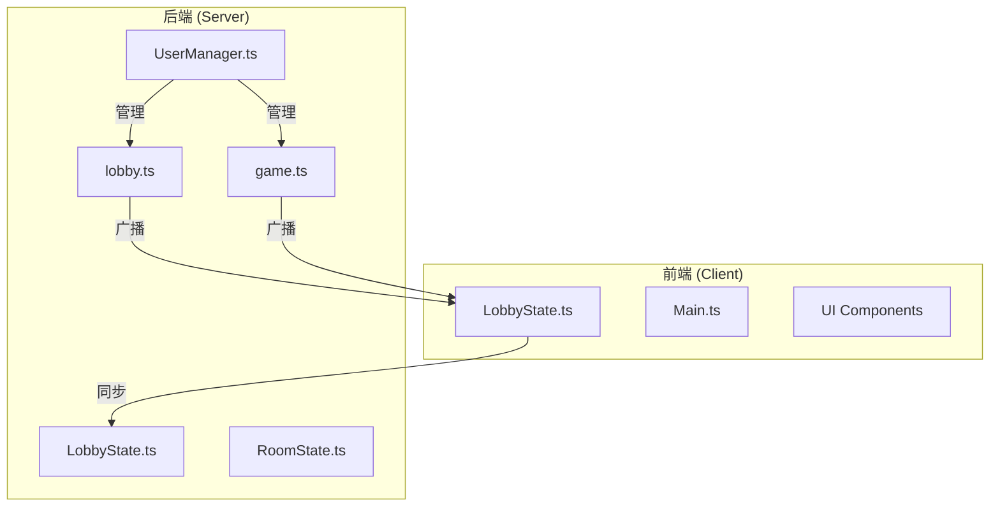
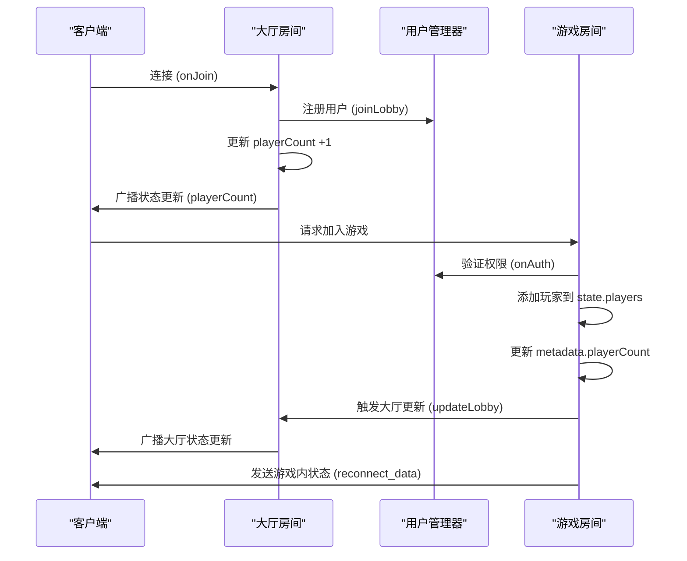
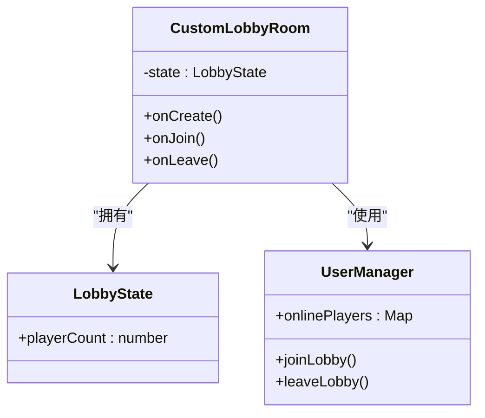
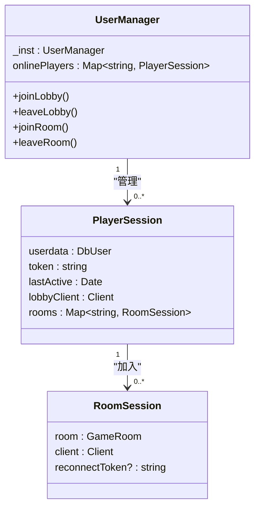
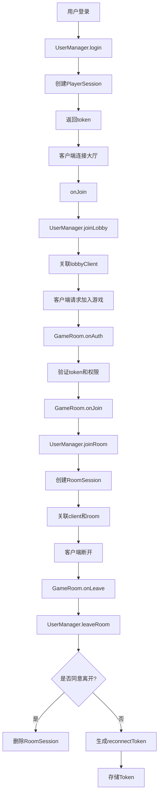
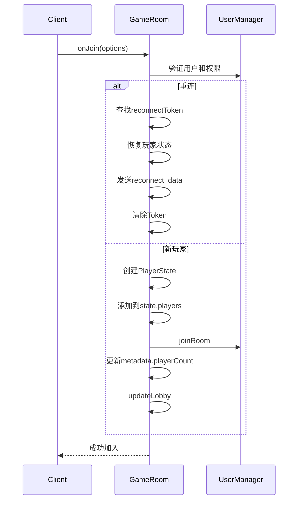
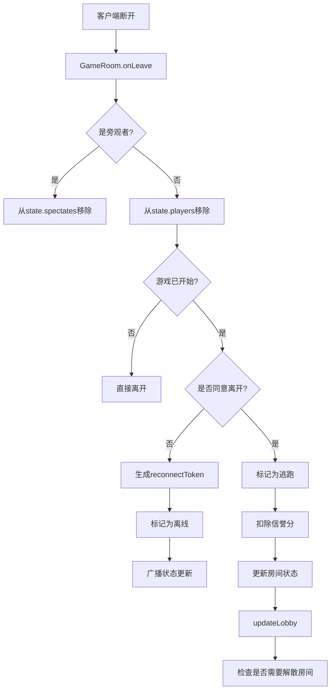
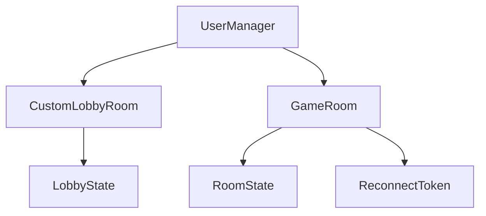

# 状态同步

<cite>
**本文档引用文件**  
- [LobbyState.ts](file://server/src/models/LobbyState.ts)
- [UserManager.ts](file://server/src/UserManager.ts)
- [game.ts](file://server/src/rooms/game.ts)
- [lobby.ts](file://server/src/rooms/lobby.ts)
- [client/LobbyState.ts](file://client/src/models/LobbyState.ts)
</cite>

## 目录
1. [引言](#引言)
2. [项目结构](#项目结构)
3. [核心组件](#核心组件)
4. [架构概览](#架构概览)
5. [详细组件分析](#详细组件分析)
6. [依赖分析](#依赖分析)
7. [性能考虑](#性能考虑)
8. [故障排除指南](#故障排除指南)
9. [结论](#结论)

## 引言

本文档详细阐述了基于 Colyseus 框架的在线游戏服务器中用户在线状态的维护与广播机制。重点分析了用户状态数据结构的设计、状态变更检测、实时同步策略以及服务器向客户端推送状态更新的实现方式。文档还探讨了批量更新与增量更新的权衡、性能优化技巧（如节流、防抖和差异计算），并通过实际代码示例展示了在大厅房间（lobby room）中的具体实现，以及在高并发场景下的稳定性保障措施。

## 项目结构

项目采用前后端分离的架构。`client` 目录包含前端资源、配置和源代码，`server` 目录包含后端逻辑、模型、房间管理和用户管理。状态同步的核心逻辑主要位于 `server/src/rooms` 和 `server/src/models` 目录下，而客户端的状态接收和处理逻辑则在 `client/src/models` 中定义。



**图示来源**
- [LobbyState.ts](file://server/src/models/LobbyState.ts)
- [lobby.ts](file://server/src/rooms/lobby.ts)
- [game.ts](file://server/src/rooms/game.ts)

**本节来源**
- [LobbyState.ts](file://server/src/models/LobbyState.ts)
- [game.ts](file://server/src/rooms/game.ts)

## 核心组件

状态同步的核心由以下几个组件构成：
1.  **`LobbyState`**: 定义了大厅房间共享状态的数据结构，核心是 `playerCount` 字段。
2.  **`UserManager`**: 全局单例，负责管理所有在线用户的会话、登录状态和房间归属。
3.  **`CustomLobbyRoom`**: 继承自 Colyseus 的 `LobbyRoom`，负责管理大厅的连接、断开和状态广播。
4.  **`GameRoom`**: 游戏房间，处理玩家加入、离开、游戏内状态同步等复杂逻辑。

**本节来源**
- [LobbyState.ts](file://server/src/models/LobbyState.ts)
- [UserManager.ts](file://server/src/UserManager.ts)
- [lobby.ts](file://server/src/rooms/lobby.ts)
- [game.ts](file://server/src/rooms/game.ts)

## 架构概览

系统采用基于 WebSocket 的实时通信架构。Colyseus 服务器作为中心枢纽，维护着所有房间的 `state` 对象。当房间状态（如玩家数量）发生变化时，服务器会自动将差异（patch）发送给所有订阅该房间的客户端。客户端通过监听 `state` 的变化来更新本地 UI。



**图示来源**
- [lobby.ts](file://server/src/rooms/lobby.ts#L30-L50)
- [game.ts](file://server/src/rooms/game.ts#L222-L261)
- [UserManager.ts](file://server/src/UserManager.ts#L50-L55)

## 详细组件分析

### 大厅状态同步分析

大厅状态同步的核心是 `LobbyState` 类和 `CustomLobbyRoom` 类。`LobbyState` 定义了共享数据，而 `CustomLobbyRoom` 负责管理连接生命周期并更新状态。

#### 类图


**图示来源**
- [LobbyState.ts](file://server/src/models/LobbyState.ts)
- [lobby.ts](file://server/src/rooms/lobby.ts)

#### 状态变更流程
```mermaid
flowchart TD
A[客户端连接] --> B[onJoin事件]
B --> C[UserManager.joinLobby]
C --> D[state.playerCount++]
D --> E[updateLobby(this)]
E --> F[广播状态更新]
F --> G[所有客户端收到新playerCount]
H[客户端断开] --> I[onLeave事件]
I --> J[UserManager.leaveLobby]
J --> K[state.playerCount--]
K --> L[updateLobby(this)]
L --> M[广播状态更新]
M --> N[所有客户端收到新playerCount]
```

**图示来源**
- [lobby.ts](file://server/src/rooms/lobby.ts#L30-L57)

**本节来源**
- [LobbyState.ts](file://server/src/models/LobbyState.ts)
- [lobby.ts](file://server/src/rooms/lobby.ts)

### 用户状态管理分析

`UserManager` 是全局状态管理的核心，它通过一个 `onlinePlayers` 映射来跟踪所有在线用户。

#### 类图


**图示来源**
- [UserManager.ts](file://server/src/UserManager.ts)

#### 用户连接与房间管理流程


**图示来源**
- [UserManager.ts](file://server/src/UserManager.ts#L70-L110)
- [game.ts](file://server/src/rooms/game.ts#L157-L224)

**本节来源**
- [UserManager.ts](file://server/src/UserManager.ts)

### 游戏房间状态同步分析

游戏房间 (`GameRoom`) 的状态同步更为复杂，涉及玩家加入、离开、游戏开始和重连等场景。

#### 玩家加入流程


**图示来源**
- [game.ts](file://server/src/rooms/game.ts#L157-L224)

#### 玩家离开流程


**图示来源**
- [game.ts](file://server/src/rooms/game.ts#L284-L356)

**本节来源**
- [game.ts](file://server/src/rooms/game.ts)

## 依赖分析

系统各组件间存在明确的依赖关系。`CustomLobbyRoom` 和 `GameRoom` 依赖 `UserManager` 来验证用户状态。`UserManager` 本身不依赖房间，但房间通过调用其方法来管理用户。`LobbyState` 和 `RoomState` 是纯数据模型，被房间类所拥有。



**图示来源**
- [UserManager.ts](file://server/src/UserManager.ts)
- [lobby.ts](file://server/src/rooms/lobby.ts)
- [game.ts](file://server/src/rooms/game.ts)

**本节来源**
- [UserManager.ts](file://server/src/UserManager.ts)
- [lobby.ts](file://server/src/rooms/lobby.ts)
- [game.ts](file://server/src/rooms/game.ts)

## 性能考虑

1.  **增量更新**: Colyseus 框架默认使用增量更新（patch），只发送状态变化的部分，极大减少了网络流量。
2.  **状态精简**: `LobbyState` 只包含必要的 `playerCount`，避免了传输冗余数据。
3.  **防抖与节流**: 在 `handleReady` 方法中，对房主的准备超时设置了防抖机制（`clearTimeout`），避免了频繁的超时广播。
4.  **批量操作**: `updateLobby` 函数在状态变化后被调用，它会将大厅状态的变更批量广播给所有客户端。
5.  **内存管理**: `UserManager` 使用映射来高效地查找用户，`reconnectTokens` 数组在使用后会被及时清理。

## 故障排除指南

*   **问题**: 客户端未收到状态更新。
  *   **检查**: 确认客户端已成功连接到房间并订阅了 `state` 变化。
  *   **检查**: 确认服务器端的 `state` 字段使用了 `@type` 装饰器（如 `@type('number')`），这是 Colyseus 进行状态同步所必需的。
*   **问题**: 玩家重连失败。
  *   **检查**: 确认 `UserManager` 中存储的 `reconnectToken` 是否正确。
  *   **检查**: 确认 `GameRoom.onAuth` 方法中的重连验证逻辑是否正常执行。
*   **问题**: 大厅玩家数量显示不正确。
  *   **检查**: 确认 `onJoin` 和 `onLeave` 事件中是否都调用了 `updateLobby(this)`。
  *   **检查**: 确认 `UserManager.leaveLobby` 是否在 `onLeave` 时被正确调用。

**本节来源**
- [LobbyState.ts](file://server/src/models/LobbyState.ts)
- [game.ts](file://server/src/rooms/game.ts)
- [UserManager.ts](file://server/src/UserManager.ts)

## 结论

该系统通过 Colyseus 框架实现了高效、可靠的状态同步。通过精心设计的 `LobbyState` 数据结构、`UserManager` 的全局会话管理以及 `GameRoom` 的复杂状态处理，系统能够实时、准确地向所有客户端广播用户在线状态。结合增量更新、防抖等优化策略，确保了在高并发场景下的性能和稳定性。整个机制清晰、模块化，为构建实时多人在线游戏提供了坚实的基础。