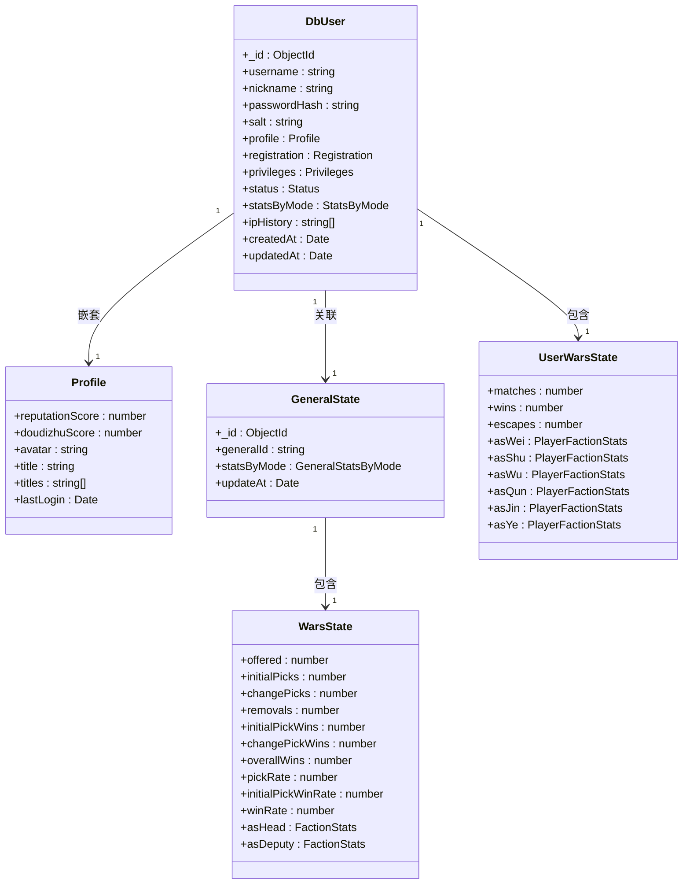
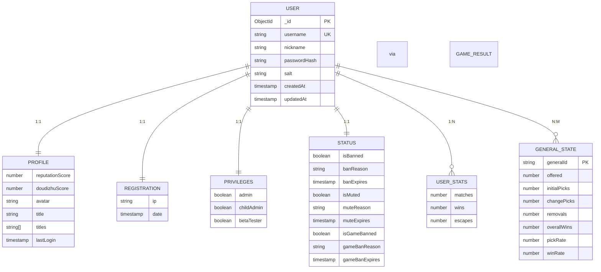
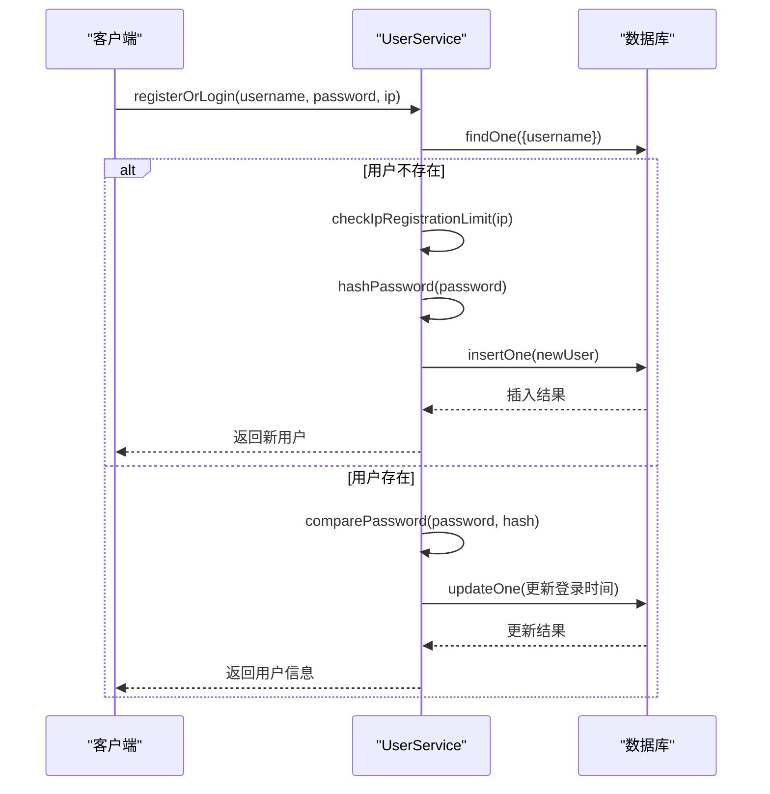

# 用户数据模型

<cite>
**本文档引用文件**  
- [User.ts](file://server/src/db/models/User.ts#L1-L103)
- [GeneralState.ts](file://server/src/db/models/GeneralState.ts#L1-L88)
- [UserService.ts](file://server/src/db/services/UserService.ts#L1-L381)
- [GeneralStateServices.ts](file://server/src/db/services/GeneralStateServices.ts#L1-L239)
- [db/index.ts](file://server/src/db/index.ts#L1-L33)
</cite>

## 目录
1. [用户实体设计](#用户实体设计)
2. [字段定义与数据类型](#字段定义与数据类型)
3. [验证规则与索引策略](#验证规则与索引策略)
4. [用户状态与武将状态关系](#用户状态与武将状态关系)
5. [数据库Schema设计](#数据库schema设计)
6. [ER图：用户相关实体关系](#er图用户相关实体关系)
7. [数据访问模式与查询优化](#数据访问模式与查询优化)
8. [数据生命周期管理](#数据生命周期管理)

## 用户实体设计

用户实体（User）是系统核心数据模型，定义了用户账户的完整信息结构。该实体采用分层嵌套设计，将用户信息划分为基础信息、权限、状态、统计等多个逻辑模块，确保数据组织清晰且易于维护。

**Section sources**
- [User.ts](file://server/src/db/models/User.ts#L1-L103)

## 字段定义与数据类型

用户实体包含以下主要字段及其数据类型：

### 基础字段
- **_id**: `ObjectId` - MongoDB自动生成的唯一标识符
- **username**: `string` - 用户名（唯一）
- **nickname**: `string` - 昵称（默认与用户名一致）
- **passwordHash**: `string` - 密码哈希值
- **salt**: `string` - 加密盐值

### 嵌套对象字段
#### profile（用户档案）
- **reputationScore**: `number` - 信誉分（初始100）
- **doudizhuScore**: `number` - 斗地主积分（初始3000）
- **avatar**: `string` - 头像URL
- **title**: `string` - 当前显示称号
- **titles**: `string[]` - 拥有称号列表
- **lastLogin**: `Date` - 最后登录时间

#### registration（注册信息）
- **ip**: `string` - 注册IP地址
- **date**: `Date` - 注册时间

#### privileges（权限）
- **admin**: `boolean` - 是否管理员
- **childAdmin**: `boolean` - 是否子管理员
- **betaTester**: `boolean` - 是否测试白名单用户

#### status（状态）
- **isBanned**: `boolean` - 是否被封禁
- **banReason**: `string` - 封禁原因
- **banExpires**: `Date` - 封禁到期时间
- **isMuted**: `boolean` - 是否被禁言
- **muteReason**: `string` - 禁言原因
- **muteExpires**: `Date` - 禁言过期时间
- **isGameBanned**: `boolean` - 是否禁止游戏
- **gameBanReason**: `string` - 游戏封禁原因
- **gameBanExpires**: `Date` - 游戏封禁过期时间

#### statsByMode（模式统计数据）
- **wars_temp_jin**: `UserWarsState` - 国战模式（晋）统计
- **wars_temp_xl**: `UserWarsState` - 国战模式（星露）统计
- **doudizhu**: `DouDiZhuStats` - 斗地主模式统计

#### 其他字段
- **ipHistory**: `string[]` - IP历史记录
- **createdAt**: `Date` - 创建时间
- **updatedAt**: `Date` - 更新时间

**Section sources**
- [User.ts](file://server/src/db/models/User.ts#L1-L103)

## 验证规则与索引策略

### 验证规则
1. **用户名唯一性**：通过数据库唯一索引确保用户名不重复
2. **密码安全**：使用bcrypt进行密码哈希处理，包含salt字段
3. **IP注册限制**：同一IP最多注册1个账号
4. **状态过期检查**：登录时自动检查封禁/禁言状态是否已过期
5. **信誉分初始化**：新用户自动初始化信誉分为100

### 索引策略
```typescript
// 在 db/index.ts 中定义的索引初始化
await initializeIndexes(db);

// 预期的索引配置（基于业务逻辑推断）
{
  "users": [
    { "key": { "username": 1 }, "unique": true }, // 用户名唯一索引
    { "key": { "registration.ip": 1 } }, // 注册IP索引
    { "key": { "status.isBanned": 1, "status.banExpires": 1 } }, // 封禁状态复合索引
    { "key": { "profile.reputationScore": 1 } }, // 信誉分索引
    { "key": { "createdAt": -1 } } // 创建时间倒序索引
  ],
  "generals": [
    { "key": { "generalId": 1 }, "unique": true } // 武将ID唯一索引
  ]
}
```

**Section sources**
- [UserService.ts](file://server/src/db/services/UserService.ts#L1-L381)
- [db/index.ts](file://server/src/db/index.ts#L1-L33)

## 用户状态与武将状态关系

用户状态与武将状态通过游戏行为数据进行关联，形成完整的玩家-武将行为分析体系。

### 关系解析
1. **数据分离设计**：
   - `User` 存储玩家账户信息和玩家级统计数据
   - `GeneralState` 存储武将使用情况和胜率等统计信息

2. **数据联动机制**：
   - 当用户完成一局游戏时，同时更新 `User.statsByMode` 和 `GeneralState.statsByMode`
   - 使用 `MatchResult` 接口作为数据传递桥梁

3. **统计维度差异**：
   - **用户统计**：关注玩家的游戏参与度（总局数、胜场、逃跑）
   - **武将统计**：关注武将的平衡性（出场率、选择率、胜率）



**Diagram sources**
- [User.ts](file://server/src/db/models/User.ts#L1-L103)
- [GeneralState.ts](file://server/src/db/models/GeneralState.ts#L1-L88)

**Section sources**
- [User.ts](file://server/src/db/models/User.ts#L1-L103)
- [GeneralState.ts](file://server/src/db/models/GeneralState.ts#L1-L88)

## 数据库Schema设计

### 主键与外键
- **主键**：MongoDB默认使用 `_id` 作为主键
- **外键模拟**：通过 `generalId` 字段关联武将数据
- **引用完整性**：应用层保证数据一致性

### 约束设计
1. **唯一性约束**：
   - `username` 字段唯一
   - `generalId` 在 `generals` 集合中唯一

2. **非空约束**：
   - 所有基础字段均为必填
   - 嵌套对象在创建时初始化

3. **默认值约束**：
   - `nickname` 默认等于 `username`
   - `reputationScore` 默认为100
   - `doudizhuScore` 默认为3000
   - 各种状态默认为 `false`

4. **集合设计**：
   - `users` 集合：存储用户数据
   - `generals` 集合：存储武将状态数据

### 设计决策
1. **文档嵌套 vs 引用**：
   - 将频繁访问的关联数据（如profile）嵌套存储
   - 将独立统计的数据（如武将状态）分离存储

2. **性能优化**：
   - 将高频更新字段（如lastLogin）与低频更新字段分离
   - 使用批量写入（bulkWrite）提高统计更新效率

**Section sources**
- [User.ts](file://server/src/db/models/User.ts#L1-L103)
- [GeneralState.ts](file://server/src/db/models/GeneralState.ts#L1-L88)

## ER图：用户相关实体关系



**Diagram sources**
- [User.ts](file://server/src/db/models/User.ts#L1-L103)
- [GeneralState.ts](file://server/src/db/models/GeneralState.ts#L1-L88)

## 数据访问模式与查询优化

### 主要访问模式
1. **用户认证**：
   ```typescript
   collection.findOne({ username })
   ```

2. **状态检查**：
   ```typescript
   collection.findOne({
     username,
     'status.isBanned': true,
     'status.banExpires': { $gt: new Date() }
   })
   ```

3. **统计查询**：
   ```typescript
   collection.find(
     { 'statsByMode.wars_temp_jin.matches': { $gt: 100 } },
     { projection: { username: 1, 'statsByMode.wars_temp_jin': 1 } }
   )
   ```

### 查询优化策略
1. **索引优化**：
   - 为 `username` 创建唯一索引
   - 为状态字段创建复合索引
   - 为统计字段创建范围查询索引

2. **批量操作**：
   - 使用 `bulkWrite` 批量更新多用户统计
   - 减少数据库往返次数

3. **投影优化**：
   - 查询时仅返回必要字段
   - 避免传输大量嵌套数据

4. **缓存策略**：
   - 高频访问的用户基本信息可缓存
   - 统计数据可定时聚合计算



**Diagram sources**
- [UserService.ts](file://server/src/db/services/UserService.ts#L1-L381)

**Section sources**
- [UserService.ts](file://server/src/db/services/UserService.ts#L1-L381)

## 数据生命周期管理

### 数据创建
- 用户首次登录时自动创建账户
- 初始化默认头像、信誉分、积分等

### 数据更新
1. **常规更新**：
   - 每次登录更新 `lastLogin` 和 `ipHistory`
   - 游戏结束后更新统计信息

2. **状态更新**：
   - 封禁/解封操作
   - 禁言/解除禁言
   - 游戏权限管理

### 数据备份策略
1. **定期备份**：
   - 每日全量备份
   - 每小时增量备份

2. **备份内容**：
   - `users` 集合（用户数据）
   - `generals` 集合（武将状态）

3. **恢复机制**：
   - 支持按时间点恢复
   - 数据一致性校验

### 迁移方案
1. **版本控制**：
   - 使用迁移脚本管理Schema变更
   - 记录迁移历史

2. **零停机迁移**：
   - 双写模式确保数据一致性
   - 逐步切换读取源

3. **数据验证**：
   - 迁移后完整性检查
   - 统计数据核对

**Section sources**
- [UserService.ts](file://server/src/db/services/UserService.ts#L1-L381)
- [GeneralStateServices.ts](file://server/src/db/services/GeneralStateServices.ts#L1-L239)