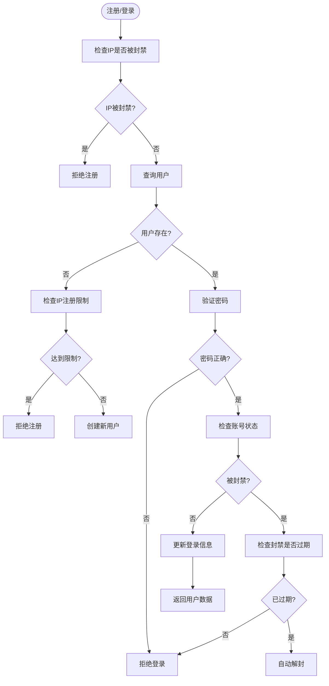
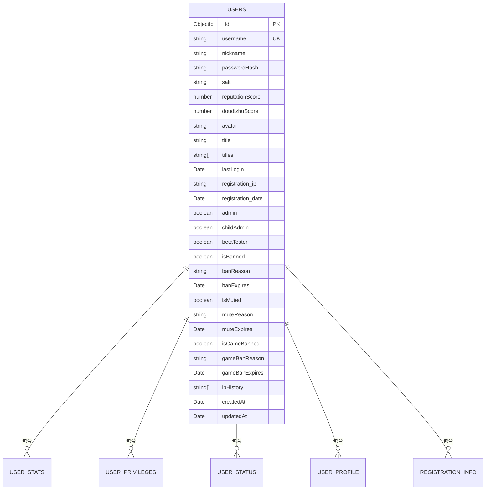
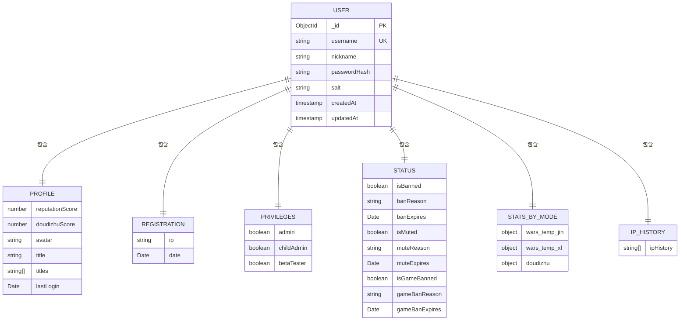
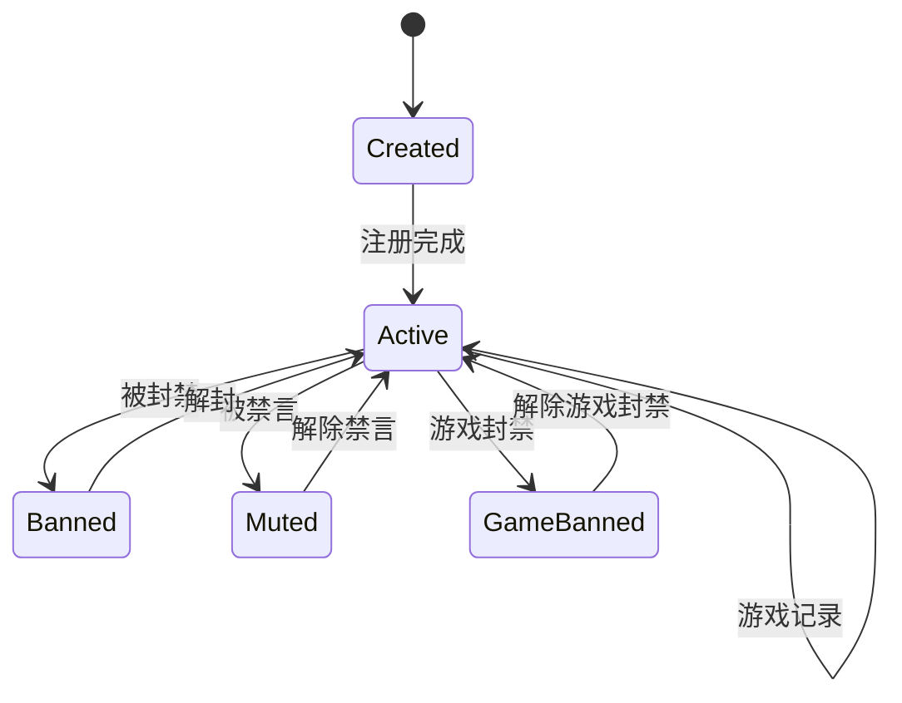

# 用户数据结构

<cite>
**本文档引用文件**  
- [User.ts](file://server/src/db/models/User.ts#L0-L102)
- [UserService.ts](file://server/src/db/services/UserService.ts#L0-L380)
- [UserManager.ts](file://server/src/UserManager.ts#L0-L149)
- [indexes.ts](file://server/src/db/indexes.ts#L0-L85)
- [index.ts](file://server/src/db/index.ts#L0-L33)
</cite>

## 目录
1. [用户实体设计](#用户实体设计)
2. [字段定义与数据类型](#字段定义与数据类型)
3. [验证规则与约束](#验证规则与约束)
4. [索引策略](#索引策略)
5. [ER图：用户实体属性关系](#er图用户实体属性关系)
6. [数据访问模式与查询优化](#数据访问模式与查询优化)
7. [数据生命周期管理](#数据生命周期管理)
8. [备份策略与迁移方案](#备份策略与迁移方案)

## 用户实体设计

用户实体是系统核心数据模型，采用MongoDB文档结构设计，包含用户身份、权限、状态、统计等多维度信息。实体通过`DbUser`接口定义，支持嵌套对象结构，实现高内聚的数据组织。

**Section sources**
- [User.ts](file://server/src/db/models/User.ts#L0-L102)

## 字段定义与数据类型

用户实体包含以下主要字段：

```json
{
  "_id": "ObjectId",
  "username": "string",
  "nickname": "string",
  "passwordHash": "string",
  "salt": "string",
  "profile": {
    "reputationScore": "number",
    "doudizhuScore": "number",
    "avatar": "string",
    "title": "string",
    "titles": "string[]",
    "lastLogin": "Date"
  },
  "registration": {
    "ip": "string",
    "date": "Date"
  },
  "privileges": {
    "admin": "boolean",
    "childAdmin": "boolean",
    "betaTester": "boolean"
  },
  "status": {
    "isBanned": "boolean",
    "banReason": "string",
    "banExpires": "Date",
    "isMuted": "boolean",
    "muteReason": "string",
    "muteExpires": "Date",
    "isGameBanned": "boolean",
    "gameBanReason": "string",
    "gameBanExpires": "Date"
  },
  "statsByMode": {
    "wars_temp_jin": "UserWarsState",
    "wars_temp_xl": "UserWarsState",
    "doudizhu": {
      "matches": "number",
      "wins": "number",
      "escapes": "number",
      "asLandLord": { "matches": "number", "wins": "number", "escapes": "number" },
      "asFarmer": { "matches": "number", "wins": "number", "escapes": "number" }
    }
  },
  "ipHistory": "string[]",
  "createdAt": "Date",
  "updatedAt": "Date"
}
```

**Section sources**
- [User.ts](file://server/src/db/models/User.ts#L0-L102)

## 验证规则与约束

### 唯一性约束
- `username` 字段设置唯一索引，确保用户名全局唯一
- `ipHistory` 数组字段通过 `$addToSet` 操作避免重复IP记录

### 数据完整性验证
- **注册限制**：单个IP最多注册1个账号（通过 `checkIpRegistrationLimit` 方法实现）
- **密码安全**：使用 `bcryptjs` 进行密码哈希存储，盐值长度为10
- **状态检查**：
  - 登录时验证账号是否被封禁
  - 封禁到期后自动解封
  - IP被封禁时禁止注册

### 业务规则
- 新用户默认信誉分为100，斗地主分数为3000
- 昵称默认与用户名一致
- 头像URL有默认值
- 注册时自动记录IP和时间



**Diagram sources**
- [UserService.ts](file://server/src/db/services/UserService.ts#L0-L380)

**Section sources**
- [UserService.ts](file://server/src/db/services/UserService.ts#L0-L380)

## 索引策略

### 用户集合索引


**Diagram sources**
- [indexes.ts](file://server/src/db/indexes.ts#L0-L85)

**Section sources**
- [indexes.ts](file://server/src/db/indexes.ts#L0-L85)

### 索引详情
| 索引名称 | 字段 | 类型 | 说明 |
|---------|------|------|------|
| username_unique | username | 唯一索引 | 确保用户名唯一 |
| online_status | profile.online, profile.lastLogin | 复合索引 | 在线状态查询 |
| ban_status | status.isBanned, status.banExpires | 复合索引 | 封禁状态查询 |
| ip_history | ipHistory | 普通索引 | IP历史记录查询 |

### 索引创建代码
```typescript
await db.collection('users').createIndexes([
  {
    key: { username: 1 },
    unique: true,
    name: 'username_unique',
  },
  {
    key: { 'profile.online': 1, 'profile.lastLogin': -1 },
    name: 'online_status',
  },
  {
    key: { 'status.isBanned': 1, 'status.banExpires': 1 },
    name: 'ban_status',
  },
  {
    key: { ipHistory: 1 },
    name: 'ip_history',
  },
]);
```

**Section sources**
- [indexes.ts](file://server/src/db/indexes.ts#L0-L85)

## ER图：用户实体属性关系



**Diagram sources**
- [User.ts](file://server/src/db/models/User.ts#L0-L102)

**Section sources**
- [User.ts](file://server/src/db/models/User.ts#L0-L102)

## 数据访问模式与查询优化

### 主要访问模式
1. **用户认证**：通过用户名查询用户数据
2. **状态检查**：查询封禁、禁言状态
3. **统计查询**：获取游戏模式统计数据
4. **IP验证**：检查IP注册限制和封禁状态

### 查询优化策略
- **高频查询字段建立索引**：如 `username`、`status.isBanned` 等
- **复合索引优化排序查询**：如 `profile.online` 和 `profile.lastLogin` 组合索引
- **数组字段索引**：`ipHistory` 字段建立索引支持快速IP查询
- **部分索引**：对高频使用的统计数据建立部分索引

### 性能关键查询
```typescript
// 用户登录查询
await this.collection.findOne({ username });

// 封禁状态检查
await this.collection.findOne({
  username,
  'privileges.admin': true,
});

// 批量更新游戏结果
await this.collection.bulkWrite(bulkOps);
```

**Section sources**
- [UserService.ts](file://server/src/db/services/UserService.ts#L0-L380)
- [indexes.ts](file://server/src/db/indexes.ts#L0-L85)

## 数据生命周期管理

### 数据创建
- 用户注册时创建用户文档
- 初始化默认值：信誉分、分数、头像、昵称等
- 记录注册IP和时间

### 数据更新
- **登录更新**：更新最后登录时间和IP历史
- **状态更新**：封禁、解封、禁言等操作
- **统计更新**：游戏结果记录
- **资料更新**：头像、昵称等个人信息

### 数据删除
- 系统未实现用户删除功能，采用封禁机制替代
- 数据永久保留，支持审计和统计分析

### 数据归档
- 无自动归档机制
- 历史数据完整保留



**Diagram sources**
- [UserService.ts](file://server/src/db/services/UserService.ts#L0-L380)

**Section sources**
- [UserService.ts](file://server/src/db/services/UserService.ts#L0-L380)

## 备份策略与迁移方案

### 备份策略
- **数据库连接**：通过 `connectToDatabase` 函数管理MongoDB连接
- **连接池**：使用MongoDB原生连接池管理
- **错误处理**：连接失败时抛出异常

```typescript
export async function connectToDatabase(): Promise<Db> {
    if (db) return db;
    client = new MongoClient(uri);
    await client.connect();
    db = client.db(dbName);
    console.log('Successfully connected to MongoDB');
    await initializeIndexes(db);
    return db;
}
```

### 迁移方案
1. **索引初始化**：系统启动时自动创建所有必要索引
2. **数据迁移**：通过 `bulkWrite` 支持批量数据更新
3. **版本兼容**：使用可选字段支持向后兼容

### 高可用设计
- **单例模式**：`UserManager` 使用单例模式管理在线用户
- **内存缓存**：在线用户数据缓存在内存中，提高访问速度
- **断线重连**：支持游戏房间断线重连机制

```mermaid
classDiagram
class UserManager {
+static inst : UserManager
+onlinePlayers : { [username : string] : PlayerSession }
+login(user : DbUser) : string
+joinLobby(username : string, client : Client) : void
+leaveLobby(client : Client) : void
+joinRoom(username : string, room : GameRoom, client : Client) : void
+leaveRoom(username : string, roomId : string, token? : string) : void
+findPlayerByClinet(sessionId : string) : PlayerSession
+broadcast(message : string) : void
}
class PlayerSession {
+userdata : DbUser
+token : string
+lastActive : Date
+lobbyClient : Client
+rooms : { [roomId : string] : RoomSession }
}
class RoomSession {
+room : GameRoom
+client : Client
+reconnectToken? : string
}
class UserService {
+registerOrLogin(username : string, password : string, ip : string) : Promise~DbUser~
+banUser(username : string, reason : string, times? : number, banIp? : boolean) : Promise~void~
+banMuted(username : string, reason : string, times? : number) : Promise~void~
+banGame(username : string, reason : string, times? : number) : Promise~void~
+unBanUser(username : string) : Promise~void~
+recordGameResult(result : MatchUserResult) : Promise~void~
}
UserManager --> PlayerSession : "包含"
PlayerSession --> RoomSession : "包含"
UserManager --> UserService : "依赖"
```

**Diagram sources**
- [UserManager.ts](file://server/src/UserManager.ts#L0-L149)
- [UserService.ts](file://server/src/db/services/UserService.ts#L0-L380)

**Section sources**
- [UserManager.ts](file://server/src/UserManager.ts#L0-L149)
- [UserService.ts](file://server/src/db/services/UserService.ts#L0-L380)