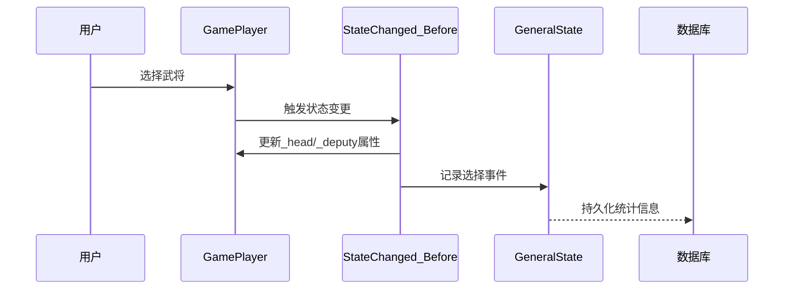
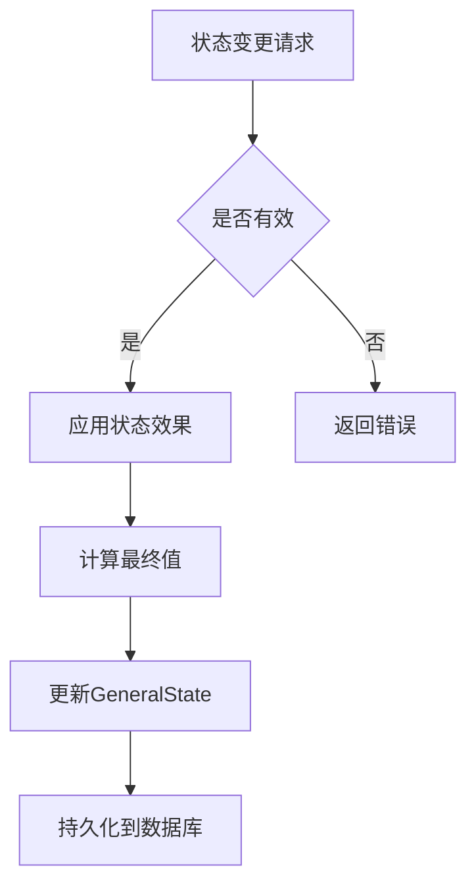
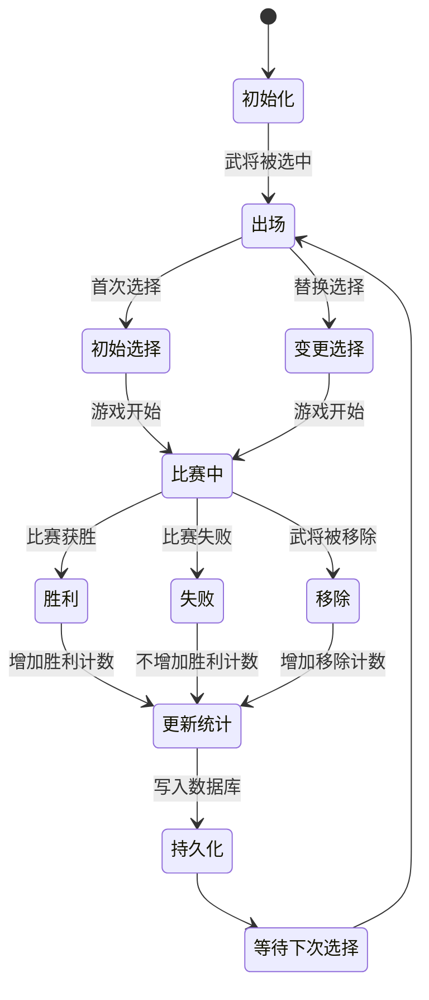

# 用户状态管理

<cite>
**本文档引用文件**  
- [GeneralState.ts](file://server/src/db/models/GeneralState.ts#L1-L87)
- [player.ts](file://server/src/core/player/player.ts#L211-L253)
- [event.state.ts](file://server/src/core/event/types/event.state.ts#L261-L296)
- [skill.types.ts](file://server/src/core/skill/skill.types.ts#L309-L347)
- [room.ts](file://server/src/core/room/room.ts#L1083-L1150)
</cite>

## 目录
1. [引言](#引言)
2. [武将状态数据结构](#武将状态数据结构)
3. [字段定义与数据类型](#字段定义与数据类型)
4. [统计模式与状态分类](#统计模式与状态分类)
5. [用户状态与武将状态关系](#用户状态与武将状态关系)
6. [状态管理设计决策](#状态管理设计决策)
7. [状态转换规则与约束](#状态转换规则与约束)
8. [状态流转图](#状态流转图)
9. [状态查询模式与性能优化](#状态查询模式与性能优化)
10. [一致性保证机制](#一致性保证机制)

## 引言

本文档详细阐述了游戏系统中用户状态管理的核心机制，重点分析`GeneralState.ts`文件中定义的武将状态模型。通过解析字段定义、数据类型、验证规则和索引策略，揭示用户状态与武将状态之间的关联。同时，深入探讨状态管理的设计理念、状态转换逻辑以及性能优化策略，为开发者提供全面的技术参考。

## 武将状态数据结构

武将状态模型（GeneralState）是记录每位武将在不同游戏模式下表现的核心数据结构，存储于MongoDB数据库中。该模型以武将ID为唯一标识，包含多维度的统计信息，支持对武将性能的全面分析。

```mermaid
classDiagram
class GeneralState {
+_id : ObjectId
+generalId : string
+statsByMode : {
wars_temp_jin : WarsState,
wars_temp_xl : WarsState,
doudizhu : DouDiZhuState
}
+updateAt : Date
}
class WarsState {
+offered : number
+initialPicks : number
+changePicks : number
+removals : number
+initialPickWins : number
+changePickWins : number
+overallWins : number
+pickRate : number
+initialPickWinRate : number
+winRate : number
+asHead : WarsSubState
+asDeputy : WarsSubState
}
class WarsSubState {
+initialPicks : number
+changePicks : number
+removels : number
+initialPickWins : number
+changePicksWins : number
+overallWins : number
+pickRate : number
+initialPickWinRate : number
+winRate : number
}
class DouDiZhuState {
+offered : number
+picks : number
+wins : number
+pickRate : number
+winRate : number
+asLandLord : DouDiZhuRoleState
+asFarmer : DouDiZhuRoleState
}
class DouDiZhuRoleState {
+offered : number
+picks : number
+wins : number
+pickRate : number
+winRate : number
}
GeneralState --> WarsState : "包含"
GeneralState --> DouDiZhuState : "包含"
WarsState --> WarsSubState : "作为主将"
WarsState --> WarsSubState : "作为副将"
DouDiZhuState --> DouDiZhuRoleState : "作为地主"
DouDiZhuState --> DouDiZhuRoleState : "作为农民"
```

**图表来源**  
- [GeneralState.ts](file://server/src/db/models/GeneralState.ts#L1-L87)

**本节来源**  
- [GeneralState.ts](file://server/src/db/models/GeneralState.ts#L1-L87)

## 字段定义与数据类型

### 基础字段
- **_id**: ObjectId类型，MongoDB自动生成的文档唯一标识符。
- **generalId**: string类型，对应武将的唯一ID，用于关联武将实体。
- **updateAt**: Date类型，记录该状态数据最后一次更新的时间戳。

### 模式统计字段
- **statsByMode**: 对象类型，包含不同游戏模式下的状态数据，目前支持：
  - `wars_temp_jin`: 战争模式（金）状态
  - `wars_temp_xl`: 战争模式（XL）状态
  - `doudizhu`: 斗地主模式状态

### 战争模式状态（WarsState）
- **offered**: 出场次数，number类型。
- **initialPicks**: 初始选择次数，number类型。
- **changePicks**: 变更选择次数，number类型。
- **removals**: 移除次数，number类型。
- **initialPickWins**: 初始选择胜利次数，number类型。
- **changePickWins**: 变更选择胜利次数，number类型。
- **overallWins**: 总胜利次数，number类型。
- **pickRate**: 选择率，计算公式为 `initialPicks / offered`，number类型。
- **initialPickWinRate**: 初始选择胜率，计算公式为 `initialPickWins / initialPicks`，number类型。
- **winRate**: 综合胜率，计算公式为 `overallWins / (initialPicks + changePicks)`，number类型。

### 斗地主模式状态（DouDiZhuState）
- **offered**: 出场次数，number类型。
- **picks**: 选择次数，number类型。
- **wins**: 获胜次数，number类型。
- **pickRate**: 选择率，计算公式为 `picks / offered`，number类型。
- **winRate**: 胜率，计算公式为 `wins / picks`，number类型。

**本节来源**  
- [GeneralState.ts](file://server/src/db/models/GeneralState.ts#L1-L87)

## 统计模式与状态分类

系统根据游戏模式对武将状态进行分类统计，确保数据的针对性和可比性。

### 战争模式（Wars）
战争模式下，武将状态细分为作为主将和副将的表现。每个角色位置都有独立的统计数据，包括选择次数、移除次数和胜利次数，从而精确评估武将在不同位置的性能。

### 斗地主模式（DouDiZhu）
斗地主模式下，状态按角色（地主/农民）划分。系统分别记录武将作为地主和农民时的出场、选择和胜利数据，以分析其在不同阵营中的表现差异。

这种分类方式使得数据分析更加精细化，能够为游戏平衡性调整提供有力支持。

**本节来源**  
- [GeneralState.ts](file://server/src/db/models/GeneralState.ts#L1-L87)

## 用户状态与武将状态关系

用户状态与武将状态通过游戏行为紧密关联。当用户在游戏中选择或使用某位武将时，系统会更新该武将的状态数据。

### 关联机制
1. **玩家选择武将**：在`player.ts`中，`GamePlayer`类通过`_head`和`_deputy`属性记录主将和副将ID。
2. **状态变更事件**：当武将状态变更时，`event.state.ts`中的`StateChanged_Before`事件会触发，更新玩家的武将属性。
3. **数据持久化**：游戏结束后，系统根据比赛结果更新`GeneralState`中的统计信息。



**图表来源**  
- [player.ts](file://server/src/core/player/player.ts#L211-L253)
- [event.state.ts](file://server/src/core/event/types/event.state.ts#L261-L296)
- [GeneralState.ts](file://server/src/db/models/GeneralState.ts#L1-L87)

**本节来源**  
- [player.ts](file://server/src/core/player/player.ts#L211-L253)
- [event.state.ts](file://server/src/core/event/types/event.state.ts#L261-L296)

## 状态管理设计决策

### 分层状态结构
采用分层的数据结构，将通用统计与模式特定统计分离，提高了数据的可扩展性和可维护性。新增游戏模式时，只需扩展`statsByMode`对象即可。

### 计算字段预存储
关键指标如胜率、选择率等在数据写入时即计算并存储，避免了查询时的实时计算开销，提升了读取性能。

### 时间戳更新
每次状态变更都更新`updateAt`字段，便于实现数据缓存失效和增量同步。

### 状态效果系统
通过`StateEffect`机制（见`skill.types.ts`），实现了动态状态修改。例如，距离修正、手牌上限调整等效果可通过状态技叠加应用。



**图表来源**  
- [skill.types.ts](file://server/src/core/skill/skill.types.ts#L309-L347)
- [room.ts](file://server/src/core/room/room.ts#L1083-L1150)

**本节来源**  
- [skill.types.ts](file://server/src/core/skill/skill.types.ts#L309-L347)
- [room.ts](file://server/src/core/room/room.ts#L1083-L1150)

## 状态转换规则与约束

### 数据完整性约束
- 所有计数字段必须为非负整数。
- 胜率和选择率范围为0.0到1.0。
- `initialPicks`和`changePicks`之和不能超过`offered`。

### 业务逻辑约束
- 武将被选择后，`initialPicks`或`changePicks`相应增加。
- 比赛胜利后，对应的胜利计数器增加。
- 武将被移除时，`removals`计数器增加。

### 状态一致性
通过事务性操作确保统计数据的一致性。例如，当一场比赛结束时，同时更新出场次数和胜利次数，避免数据不一致。

**本节来源**  
- [GeneralState.ts](file://server/src/db/models/GeneralState.ts#L1-L87)

## 状态流转图



**图表来源**  
- [GeneralState.ts](file://server/src/db/models/GeneralState.ts#L1-L87)
- [event.state.ts](file://server/src/core/event/types/event.state.ts#L261-L296)

## 状态查询模式与性能优化

### 查询模式
1. **单武将查询**：通过`generalId`精确查询某位武将的全部状态。
2. **模式统计查询**：获取特定模式下所有武将的排行榜。
3. **时间范围查询**：结合`updateAt`字段查询近期数据。

### 性能优化策略
- **索引策略**：在`generalId`和`updateAt`字段上建立索引，加速查询。
- **数据分片**：按游戏模式对`statsByMode`进行逻辑分片，减少单次查询的数据量。
- **缓存机制**：高频访问的统计信息（如排行榜）可缓存于Redis，降低数据库压力。
- **批量更新**：采用批量操作（bulk write）更新多条状态记录，减少I/O开销。

**本节来源**  
- [GeneralState.ts](file://server/src/db/models/GeneralState.ts#L1-L87)

## 一致性保证机制

### 事务性更新
关键状态变更操作使用MongoDB的事务机制，确保相关字段的原子性更新。

### 幂等性设计
状态更新接口设计为幂等，重复请求不会导致数据重复累加。

### 数据校验
在写入数据库前进行严格的数据校验，包括：
- 字段类型检查
- 数值范围验证
- 逻辑关系校验（如胜率≤1.0）

### 监控与告警
建立数据监控系统，对异常状态（如负值、超大值）进行实时告警，确保数据质量。

**本节来源**  
- [GeneralState.ts](file://server/src/db/models/GeneralState.ts#L1-L87)
- [room.ts](file://server/src/core/room/room.ts#L1083-L1150)