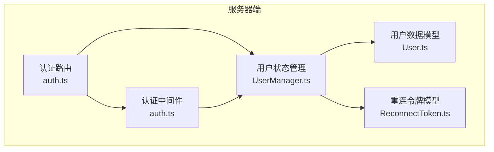
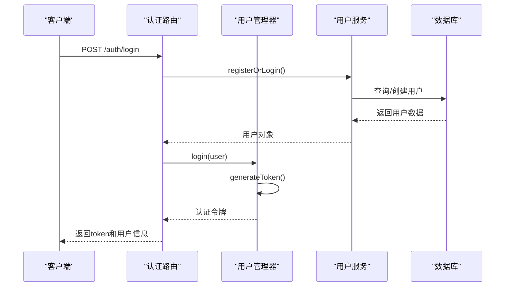
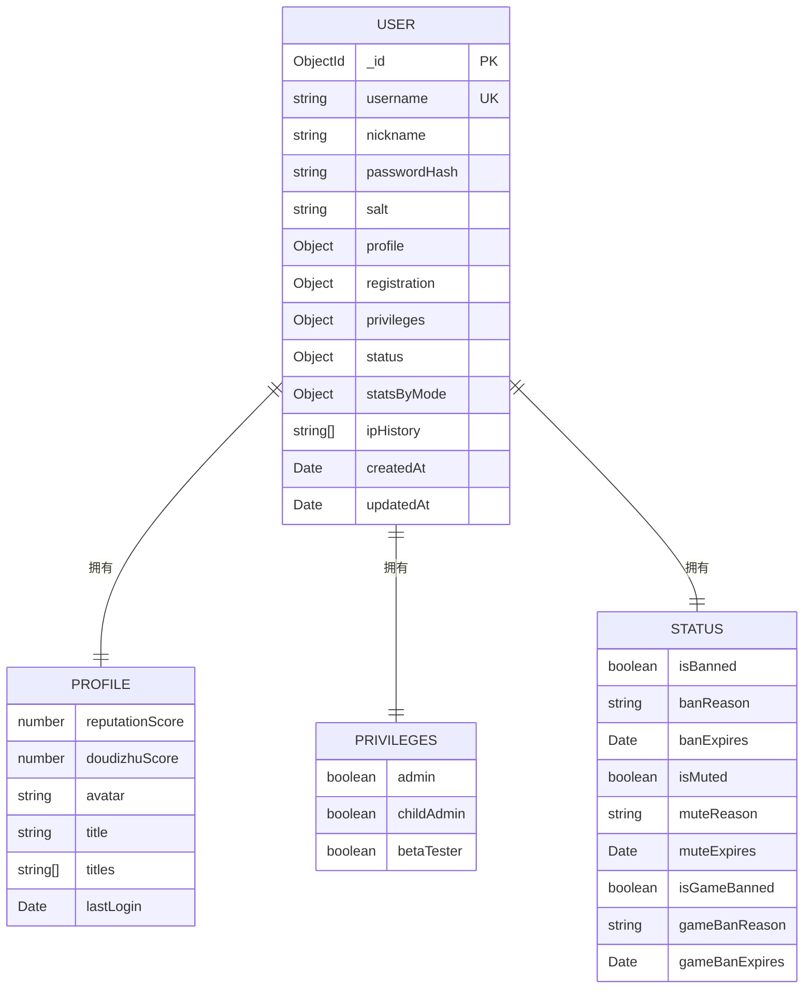
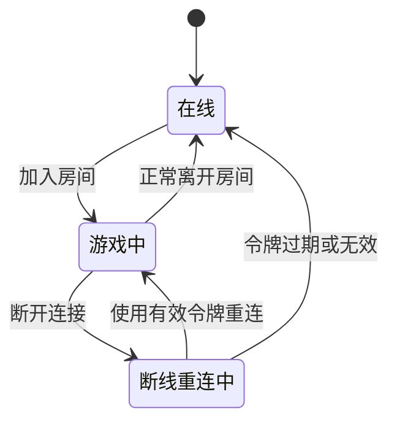
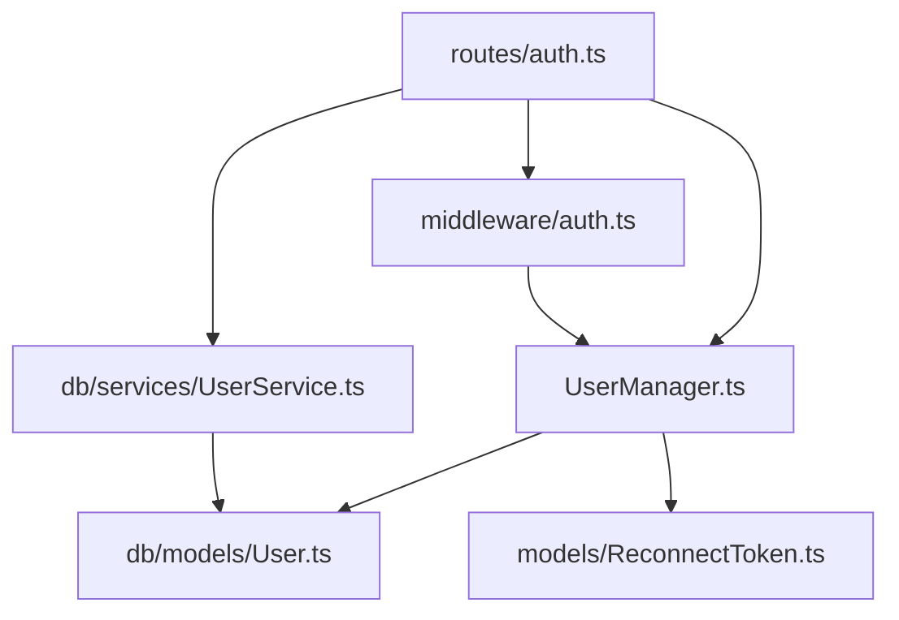

# 用户管理

<cite>
**本文档引用文件**  
- [UserManager.ts](file://server/src/UserManager.ts#L1-L150)
- [User.ts](file://server/src/db/models/User.ts#L1-L103)
- [auth.ts](file://server/src/middleware/auth.ts#L1-L53)
- [auth.ts](file://server/src/routes/auth.ts#L1-L60)
- [ReconnectToken.ts](file://server/src/models/ReconnectToken.ts#L1-L9)
</cite>

## 目录
1. [简介](#简介)
2. [项目结构](#项目结构)
3. [核心组件](#核心组件)
4. [架构概览](#架构概览)
5. [详细组件分析](#详细组件分析)
6. [依赖分析](#依赖分析)
7. [性能考虑](#性能考虑)
8. [故障排除指南](#故障排除指南)
9. [结论](#结论)

## 简介
本文档详细解析用户管理系统的设计与实现，涵盖用户状态管理、数据模型、认证机制、断线重连及安全控制等核心功能。系统基于Node.js与Express构建，采用MongoDB存储用户数据，通过Colyseus实现实时通信。重点分析`UserManager.ts`中的用户状态管理逻辑、`User.ts`的数据结构设计、`auth.ts`中的认证流程以及`ReconnectToken.ts`的断线重连机制。

## 项目结构
用户管理相关代码位于`server/src`目录下，主要分为以下几个模块：
- `db/models/User.ts`：定义用户数据模型
- `UserManager.ts`：管理在线用户状态
- `middleware/auth.ts`：提供认证中间件
- `routes/auth.ts`：处理登录注册路由
- `models/ReconnectToken.ts`：定义重连令牌结构



**图示来源**
- [UserManager.ts](file://server/src/UserManager.ts#L1-L150)
- [User.ts](file://server/src/db/models/User.ts#L1-L103)
- [auth.ts](file://server/src/middleware/auth.ts#L1-L53)
- [auth.ts](file://server/src/routes/auth.ts#L1-L60)
- [ReconnectToken.ts](file://server/src/models/ReconnectToken.ts#L1-L9)

**本节来源**
- [UserManager.ts](file://server/src/UserManager.ts#L1-L150)
- [User.ts](file://server/src/db/models/User.ts#L1-L103)

## 核心组件
系统核心组件包括用户数据模型、用户状态管理器、认证路由和中间件。`UserManager`作为单例模式实现，维护所有在线用户的会话状态；`DbUser`接口定义了完整的用户数据结构，包含基础信息、权限、状态统计等；认证系统通过JWT令牌实现安全验证。

**本节来源**
- [UserManager.ts](file://server/src/UserManager.ts#L1-L150)
- [User.ts](file://server/src/db/models/User.ts#L1-L103)

## 架构概览
系统采用分层架构设计，从前端请求到后端处理形成清晰的数据流。



**图示来源**
- [UserManager.ts](file://server/src/UserManager.ts#L1-L150)
- [routes/auth.ts](file://server/src/routes/auth.ts#L1-L60)

## 详细组件分析

### 用户状态管理分析
`UserManager`类负责维护所有在线用户的完整会话状态，采用单例模式确保全局唯一实例。

```mermaid
classDiagram
class UserManager {
+static inst : UserManager
+onlinePlayers : { [username] : PlayerSession }
-DISCONNECT_GRACE_PERIOD : number
+login(user : DbUser) : string
+joinLobby(username, client)
+leaveLobby(client)
+joinRoom(username, room, client)
+leaveRoom(username, roomId, token)
+getPlayerRooms(username) : RoomInfo[]
+findPlayerByClinet(sessionId) : PlayerSession
+broadcast(message)
-generateToken(user) : string
}
class PlayerSession {
+userdata : DbUser
+token : string
+lastActive : Date
+lobbyClient : Client
+rooms : { [roomId] : RoomConnection }
}
class RoomConnection {
+room : GameRoom
+client : Client
+reconnectToken? : string
}
UserManager --> PlayerSession : "包含"
PlayerSession --> RoomConnection : "包含"
```

**图示来源**
- [UserManager.ts](file://server/src/UserManager.ts#L1-L150)

**本节来源**
- [UserManager.ts](file://server/src/UserManager.ts#L1-L150)

### 用户数据模型分析
`DbUser`接口定义了用户数据的完整结构，包含多个嵌套的对象字段。



**图示来源**
- [User.ts](file://server/src/db/models/User.ts#L1-L103)

**本节来源**
- [User.ts](file://server/src/db/models/User.ts#L1-L103)

### 认证机制分析
认证系统由路由和中间件两部分组成，实现登录注册和权限验证功能。

```mermaid
flowchart TD
A["/auth/login POST请求"] --> B{验证客户端版本}
B --> |版本无效| C[返回错误]
B --> |版本有效| D[调用UserService注册/登录]
D --> E{用户存在?}
E --> |否| F[返回认证失败]
E --> |是| G[调用UserManager.login()]
G --> H[生成JWT令牌]
H --> I[返回token和用户信息]
J["API请求"] --> K{包含x-user-name?}
K --> |否| L[返回401]
K --> |是| M{管理员验证?}
M --> |是| N[检查admin权限]
N --> O{是管理员?}
O --> |否| P[返回403]
O --> |是| Q[调用next()]
M --> |否| R{令牌匹配?}
R --> |否| S[返回403]
R --> |是| Q
```

**图示来源**
- [routes/auth.ts](file://server/src/routes/auth.ts#L1-L60)
- [middleware/auth.ts](file://server/src/middleware/auth.ts#L1-L53)

**本节来源**
- [routes/auth.ts](file://server/src/routes/auth.ts#L1-L60)
- [middleware/auth.ts](file://server/src/middleware/auth.ts#L1-L53)

### 断线重连机制分析
`ReconnectToken`接口定义了断线重连所需的关键信息，支持玩家在短暂断开后重新连接到游戏房间。



**图示来源**
- [ReconnectToken.ts](file://server/src/models/ReconnectToken.ts#L1-L9)

**本节来源**
- [ReconnectToken.ts](file://server/src/models/ReconnectToken.ts#L1-L9)

## 依赖分析
系统各组件之间存在明确的依赖关系，形成清晰的调用链。



**图示来源**
- [UserManager.ts](file://server/src/UserManager.ts#L1-L150)
- [User.ts](file://server/src/db/models/User.ts#L1-L103)
- [auth.ts](file://server/src/middleware/auth.ts#L1-L53)
- [auth.ts](file://server/src/routes/auth.ts#L1-L60)
- [ReconnectToken.ts](file://server/src/models/ReconnectToken.ts#L1-L9)

**本节来源**
- [UserManager.ts](file://server/src/UserManager.ts#L1-L150)
- [User.ts](file://server/src/db/models/User.ts#L1-L103)

## 性能考虑
- `UserManager`使用内存对象存储在线用户状态，读写效率高
- 用户数据通过索引优化查询性能（username为唯一索引）
- JWT令牌验证避免了频繁的数据库查询
- 断线重连机制减少因网络波动导致的游戏中断

## 故障排除指南
常见问题及解决方案：
- **登录失败**：检查客户端版本号是否匹配，确认用户名密码正确
- **权限不足**：确保用户具有相应权限（管理员、测试员等）
- **无法重连**：检查重连令牌是否过期（默认30秒宽限期）
- **状态不同步**：确认`UserManager`单例在集群环境中正确共享

**本节来源**
- [UserManager.ts](file://server/src/UserManager.ts#L1-L150)
- [routes/auth.ts](file://server/src/routes/auth.ts#L1-L60)

## 结论
用户管理系统通过`UserManager`集中管理在线用户状态，结合JWT令牌实现安全认证，利用`ReconnectToken`支持断线重连。数据模型设计全面，涵盖用户信息、权限、状态统计等多个维度。认证流程严格，包含版本验证、权限检查等安全措施。系统架构清晰，组件职责分明，为游戏服务器提供了稳定可靠的用户管理基础。