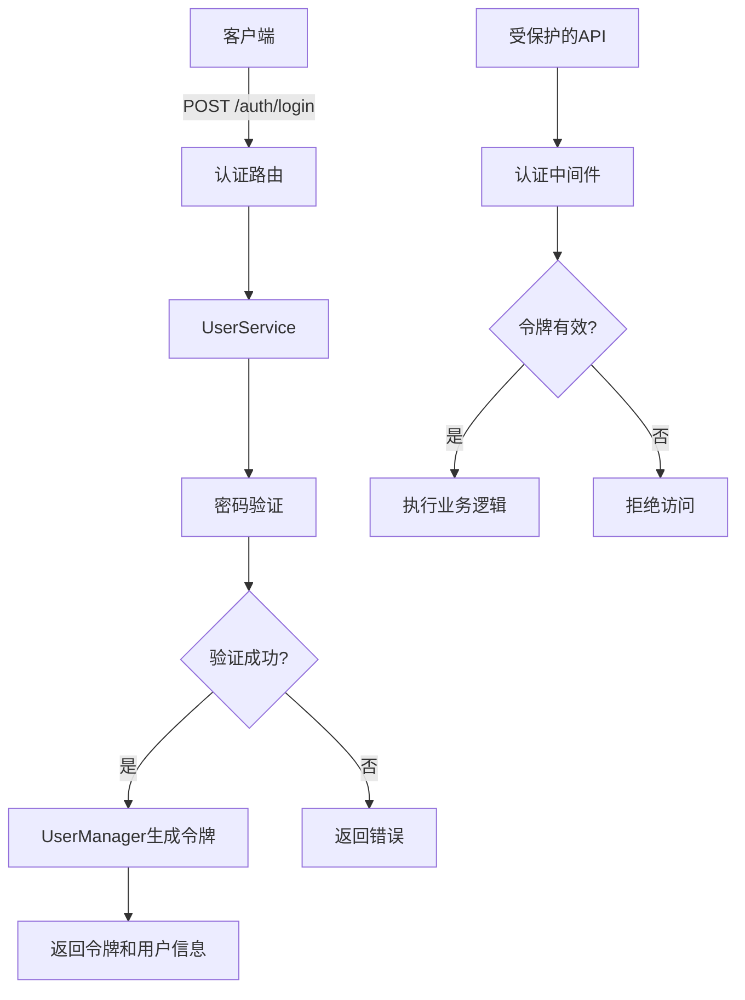
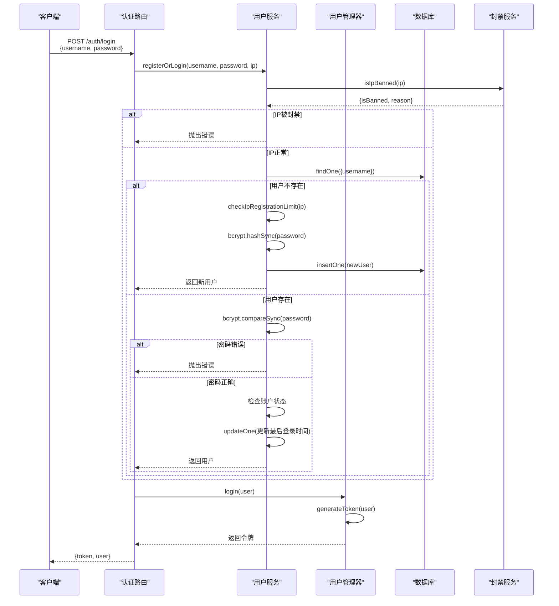
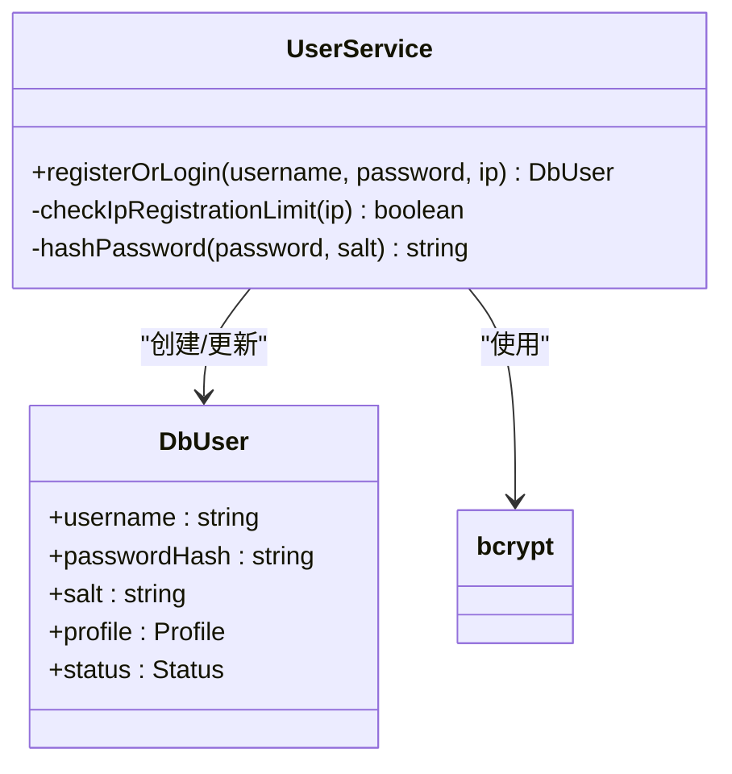
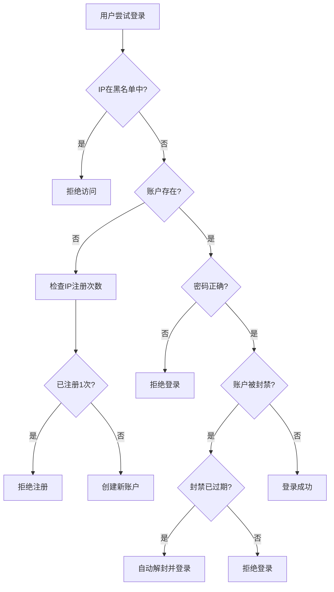
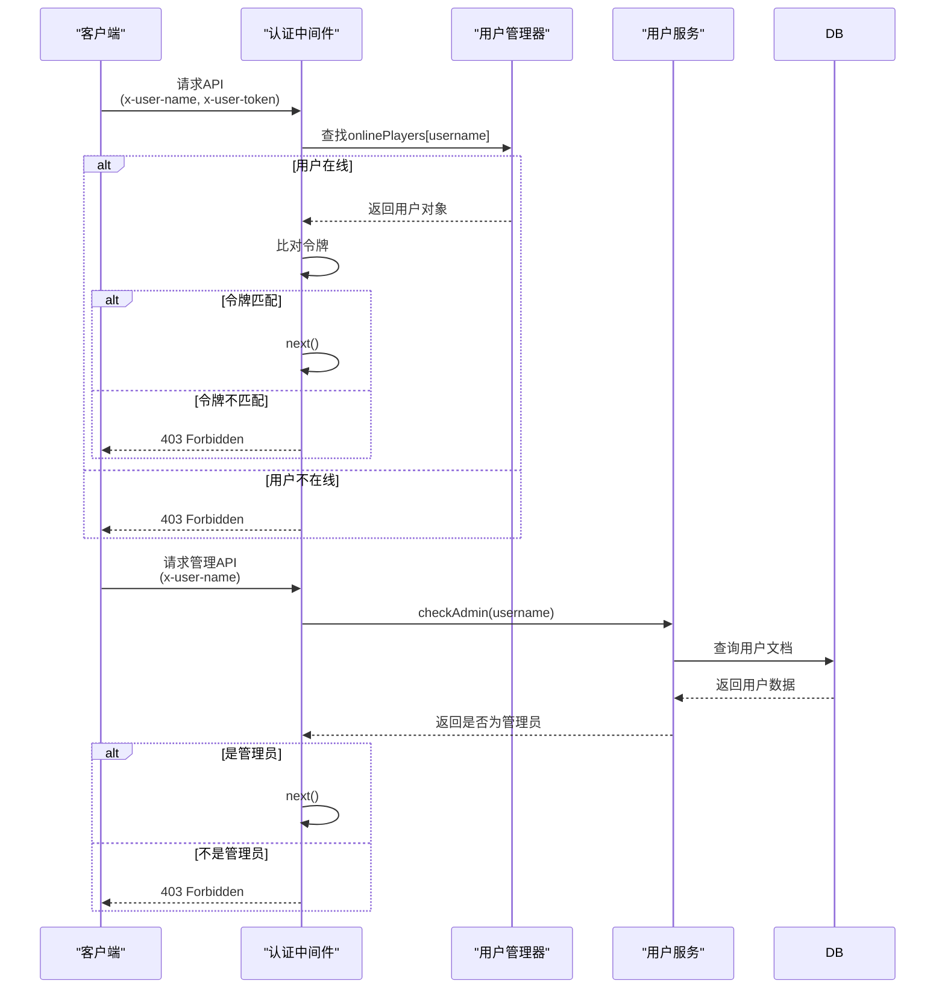

# 安全策略

<cite>
**本文档中引用的文件**  
- [auth.ts](file://server/src/middleware/auth.ts)
- [auth.ts](file://server/src/routes/auth.ts)
- [UserManager.ts](file://server/src/UserManager.ts)
- [UserService.ts](file://server/src/db/services/UserService.ts)
- [User.ts](file://server/src/db/models/User.ts)
- [BanService.ts](file://server/src/db/services/BanService.ts)
</cite>

## 目录
1. [简介](#简介)
2. [项目结构](#项目结构)
3. [核心安全机制](#核心安全机制)
4. [身份验证与授权流程](#身份验证与授权流程)
5. [用户密码存储策略](#用户密码存储策略)
6. [防暴力破解机制](#防暴力破解机制)
7. [会话与令牌管理](#会话与令牌管理)
8. [中间件权限检查](#中间件权限检查)
9. [整体安全架构分析](#整体安全架构分析)
10. [结论](#结论)

## 简介
本文件详细阐述了“resgsv1”服务器端实现的安全策略。重点分析了用户身份验证、密码存储、会话管理、权限控制以及防滥用机制。文档旨在为开发者和安全审计人员提供一个全面、深入的技术参考，确保系统安全性的透明度和可维护性。

## 项目结构
服务器端代码位于`server/src`目录下，采用模块化设计。核心安全功能分散在`middleware`、`routes`、`db/services`和`UserManager`等模块中。`middleware/auth.ts`负责权限检查，`routes/auth.ts`处理登录注册，`UserService`管理用户数据和密码，`UserManager`则负责在线会话和令牌的生命周期。

**Section sources**
- [auth.ts](file://server/src/middleware/auth.ts)
- [auth.ts](file://server/src/routes/auth.ts)
- [UserManager.ts](file://server/src/UserManager.ts)
- [UserService.ts](file://server/src/db/services/UserService.ts)

## 核心安全机制
系统实现了多层安全防护，包括基于令牌的身份验证、严格的密码哈希、IP和账户封禁机制，以及细粒度的权限控制。这些机制协同工作，保护用户账户和系统资源。

**Diagram sources**
- [auth.ts](file://server/src/routes/auth.ts#L10-L60)
- [auth.ts](file://server/src/middleware/auth.ts#L1-L53)
- [UserManager.ts](file://server/src/UserManager.ts#L1-L150)

## 身份验证与授权流程
系统的身份验证流程始于`/auth/login`端点。该流程不仅处理登录，还负责新用户的注册。

### 登录/注册流程
当用户提交用户名和密码时，系统会执行以下步骤：
1.  **客户端版本检查**：首先验证客户端版本号，防止旧版或恶意客户端接入。
2.  **IP封禁检查**：调用`BanService`检查用户IP是否在黑名单中。
3.  **用户查找**：在数据库中查找该用户名。
4.  **注册逻辑**：如果用户不存在，则检查该IP的注册次数限制（目前为1次），然后创建新用户。
5.  **登录逻辑**：如果用户存在，则使用`bcrypt`验证密码。
6.  **状态检查**：检查账户是否被封禁，若封禁已过期则自动解封。
7.  **令牌生成**：调用`UserManager.login()`生成新的JWT令牌。
8.  **响应返回**：将令牌和用户信息（不含密码）返回给客户端。

**Diagram sources**
- [auth.ts](file://server/src/routes/auth.ts#L10-L60)
- [UserService.ts](file://server/src/db/services/UserService.ts#L1-L381)
- [UserManager.ts](file://server/src/UserManager.ts#L1-L150)

**Section sources**
- [auth.ts](file://server/src/routes/auth.ts#L10-L60)
- [UserService.ts](file://server/src/db/services/UserService.ts#L1-L381)

## 用户密码存储策略
系统采用行业标准的`bcrypt`算法来安全地存储用户密码，有效抵御彩虹表和暴力破解攻击。

### Bcrypt实现细节
- **盐值生成**：每次注册新用户时，系统都会调用`bcrypt.genSaltSync(10)`生成一个唯一的、高强度的盐值（salt）。盐值的轮数（rounds）设置为10，这是一个在安全性和性能之间取得良好平衡的值。
- **密码哈希**：使用`bcrypt.hashSync(password, salt)`将用户的明文密码与生成的盐值结合，生成一个不可逆的哈希值（passwordHash）。
- **数据存储**：数据库中的`DbUser`模型同时存储`passwordHash`和`salt`。在验证密码时，系统会使用存储的盐值对用户输入的密码进行哈希，然后将结果与存储的`passwordHash`进行比较。

**Diagram sources**
- [UserService.ts](file://server/src/db/services/UserService.ts#L1-L381)
- [User.ts](file://server/src/db/models/User.ts#L1-L103)

**Section sources**
- [UserService.ts](file://server/src/db/services/UserService.ts#L1-L381)
- [User.ts](file://server/src/db/models/User.ts#L1-L103)

## 防暴力破解机制
系统实施了多层次的防暴力破解策略，从IP层面到账户层面进行防护。

### IP封禁与注册限制
- **IP黑名单**：通过`BanService`类管理一个全局的IP黑名单（`ipBlacklist`）。管理员可以封禁特定IP，或在用户被封禁时选择连带封禁其IP历史记录中的所有IP。
- **注册限制**：`UserService`中的`checkIpRegistrationLimit`方法限制了单个IP地址的注册数量（目前为1个），有效防止了自动化脚本批量注册垃圾账号。

### 账户封禁
- **永久/临时封禁**：`UserService`提供了`banUser`方法，可以永久或临时封禁用户账户。封禁信息（原因、过期时间）存储在用户文档的`status`字段中。
- **自动解封**：在登录流程中，系统会检查封禁的过期时间。如果封禁已过期，系统会自动调用`unBanUser`方法解封账户。

**Diagram sources**
- [UserService.ts](file://server/src/db/services/UserService.ts#L1-L381)
- [BanService.ts](file://server/src/db/services/BanService.ts#L1-L96)

**Section sources**
- [UserService.ts](file://server/src/db/services/UserService.ts#L1-L381)
- [BanService.ts](file://server/src/db/services/BanService.ts#L1-L96)

## 会话与令牌管理
系统使用自定义的JWT令牌机制来管理用户会话，令牌存储在内存中，而非传统的HTTP-only Cookie。

### JWT令牌机制
- **令牌生成**：`UserManager`类中的`generateToken`方法使用`jsonwebtoken`库生成JWT。令牌的载荷（payload）包含`userId`和`username`，使用一个硬编码的密钥`resgs.PrivateKey`进行签名，有效期为7天。
- **令牌存储**：生成的令牌并非通过Cookie返回，而是直接作为JSON响应的一部分返回给客户端。客户端有责任安全地存储此令牌（例如，在本地存储中）。
- **令牌验证**：在后续请求中，客户端需在请求头`x-user-token`中携带令牌。`authenticateUser`中间件会检查该令牌是否与`UserManager`内存中存储的令牌完全匹配。

### 会话管理
`UserManager`维护一个名为`onlinePlayers`的内存对象，用于跟踪所有在线用户。每个在线用户的条目都包含其用户数据、当前令牌、最后活跃时间以及与游戏房间的连接信息。这种设计使得会话管理非常高效，但也意味着服务器重启会导致所有会话丢失。

**Section sources**
- [UserManager.ts](file://server/src/UserManager.ts#L1-L150)
- [auth.ts](file://server/src/middleware/auth.ts#L1-L53)

## 中间件权限检查
系统通过Express中间件实现了两种级别的权限检查：普通用户认证和管理员认证。

### authenticateUser中间件
该中间件用于保护所有需要用户登录的API端点。
1.  从请求头`x-user-name`和`x-user-token`中提取用户名和令牌。
2.  在`UserManager`的`onlinePlayers`对象中查找该用户。
3.  比对内存中存储的令牌与请求头中的令牌是否一致。
4.  如果用户在线且令牌匹配，则调用`next()`放行；否则返回403错误。

### authenticateAdmin中间件
该中间件用于保护管理员专用的API端点。
1.  从请求头`x-user-name`中提取用户名。
2.  调用`UserService.checkAdmin(username)`方法查询数据库，检查该用户是否具有管理员权限。
3.  如果是管理员，则放行；否则返回403错误。

**Diagram sources**
- [auth.ts](file://server/src/middleware/auth.ts#L1-L53)
- [UserManager.ts](file://server/src/UserManager.ts#L1-L150)
- [UserService.ts](file://server/src/db/services/UserService.ts#L1-L381)

**Section sources**
- [auth.ts](file://server/src/middleware/auth.ts#L1-L53)

## 整体安全架构分析
系统的安全架构围绕“验证、授权、防护”三大核心原则构建。

### 架构特点
- **分层验证**：结合了客户端版本、IP地址、账户状态和密码的多层验证。
- **内存会话**：使用内存对象管理会话，性能高但缺乏持久性。令牌的验证是基于内存中的精确匹配，而非解密JWT，这简化了流程但也意味着无法在不重启服务的情况下强制所有用户重新登录。
- **硬编码密钥**：JWT签名密钥`resgs.PrivateKey`是硬编码在源代码中的，这是一个潜在的安全风险。最佳实践是将其作为环境变量注入。
- **细粒度封禁**：提供了IP、账户、发言、游戏参与等多个维度的封禁能力，便于管理员进行精细化管理。

### 潜在风险与建议
- **风险**：硬编码的JWT密钥一旦泄露，攻击者可以伪造任意用户的令牌。
- **建议**：将密钥移至环境变量，并考虑使用更复杂的密钥管理方案。
- **风险**：内存会话在服务器重启后丢失，影响用户体验。
- **建议**：可以考虑引入Redis等内存数据库来持久化会话状态。

## 结论
“resgsv1”系统实现了一套功能完备的安全策略，涵盖了身份验证、密码安全、会话管理和权限控制等关键领域。通过使用`bcrypt`和JWT，系统在密码存储和会话管理上遵循了现代安全实践。其防暴力破解和封禁机制也较为健全。主要的改进空间在于将JWT密钥从源代码中移出，并考虑会话状态的持久化，以进一步提升系统的安全性和可靠性。