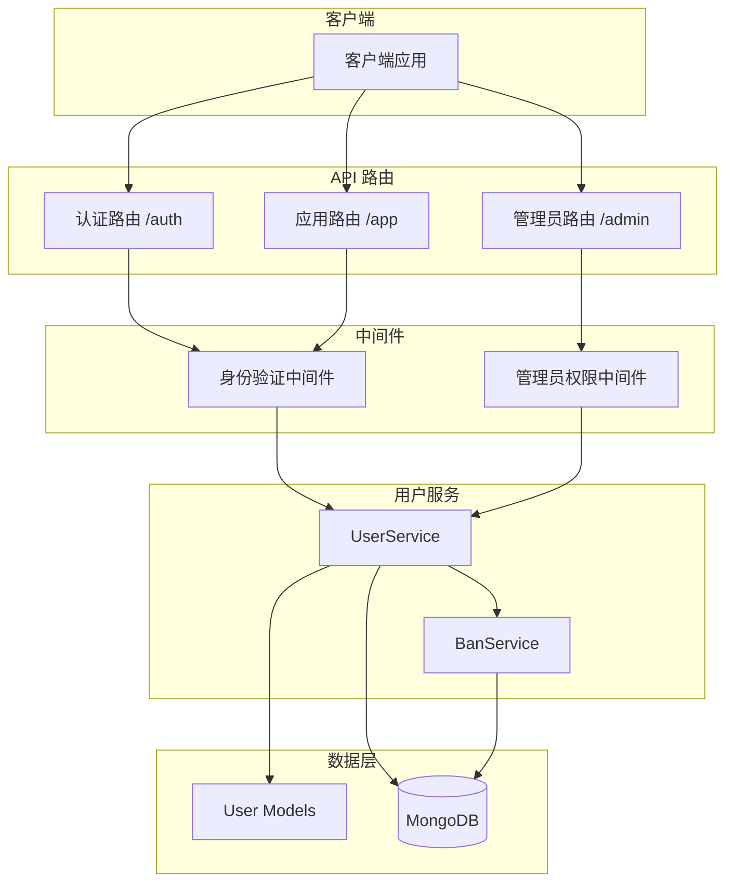
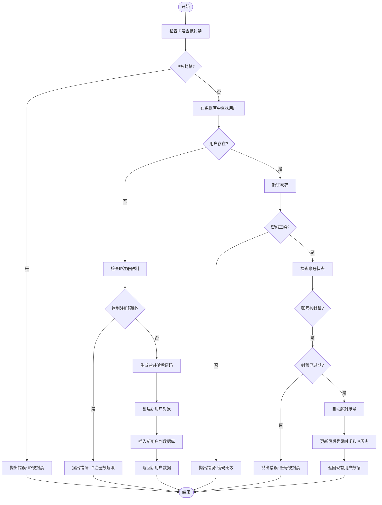
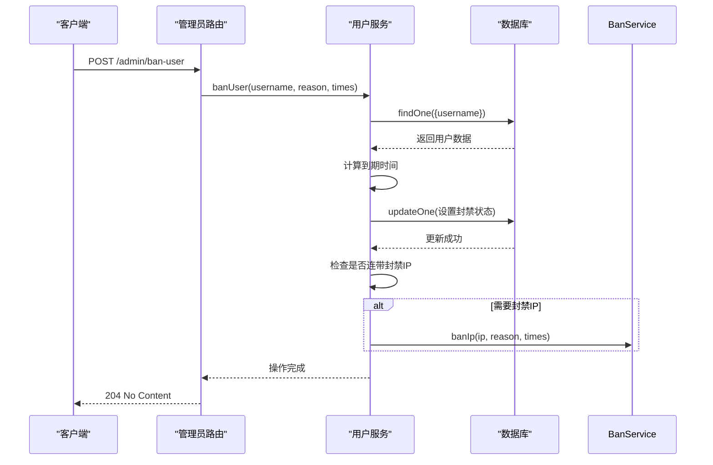
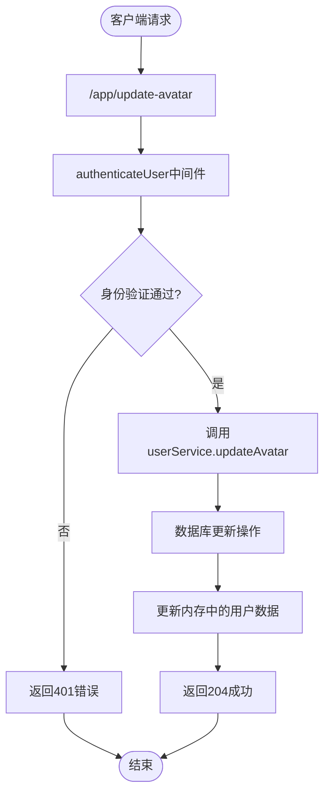
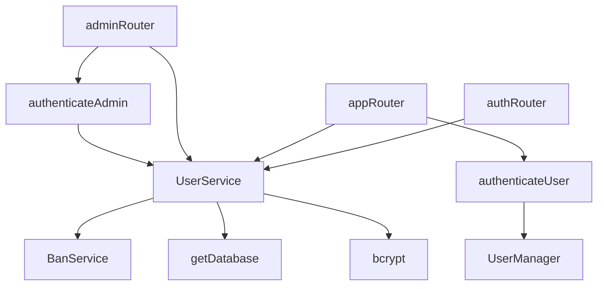

# 用户服务

<cite>
**本文档中引用的文件**   
- [UserService.ts](file://server/src/db/services/UserService.ts)
- [User.ts](file://server/src/db/models/User.ts)
- [auth.ts](file://server/src/routes/auth.ts)
- [app.ts](file://server/src/routes/app.ts)
- [admin.ts](file://server/src/routes/admin.ts)
- [BanService.ts](file://server/src/db/services/BanService.ts)
</cite>

## 目录
1. [简介](#简介)
2. [项目结构](#项目结构)
3. [核心组件](#核心组件)
4. [架构概览](#架构概览)
5. [详细组件分析](#详细组件分析)
6. [依赖分析](#依赖分析)
7. [性能考虑](#性能考虑)
8. [故障排除指南](#故障排除指南)
9. [结论](#结论)

## 简介
本文档详细介绍了用户服务（UserService）的核心功能和实现逻辑，重点解析了用户注册、登录、状态管理、权限控制和数据持久化等关键流程。文档基于 `UserService.ts` 和 `User.ts` 文件的代码分析，结合相关路由和中间件，全面展示了用户数据处理的完整生命周期。该服务是游戏系统中用户管理的核心组件，负责处理所有与用户账户相关的操作。

## 项目结构
用户服务位于服务器端代码库的 `server/src/db/services/` 目录下，是数据库访问层（Data Access Layer）的一部分。它与数据模型（`models/User.ts`）紧密协作，并通过 `getDatabase()` 函数与 MongoDB 数据库交互。服务的调用入口主要通过 Express 路由（`routes/` 目录）暴露为 HTTP API，由中间件（`middleware/` 目录）进行身份验证和权限控制。



**图示来源**
- [UserService.ts](file://server/src/db/services/UserService.ts#L1-L380)
- [User.ts](file://server/src/db/models/User.ts#L1-L103)
- [auth.ts](file://server/src/routes/auth.ts#L1-L58)
- [app.ts](file://server/src/routes/app.ts#L1-L40)
- [admin.ts](file://server/src/routes/admin.ts#L1-L180)

## 核心组件
用户服务（`UserService`）是处理用户数据的核心类，封装了所有与用户账户相关的业务逻辑。其主要职责包括：
- **用户注册与登录**：通过 `registerOrLogin` 方法统一处理新用户注册和现有用户登录。
- **密码安全**：使用 `bcryptjs` 库对用户密码进行哈希处理，确保密码以加密形式存储。
- **状态管理**：管理用户的封禁、禁言和禁止游戏等状态。
- **数据持久化**：与 MongoDB 数据库交互，执行用户数据的增删改查操作。
- **游戏数据记录**：记录用户在不同游戏模式下的战绩和统计数据。

**本节来源**
- [UserService.ts](file://server/src/db/services/UserService.ts#L1-L380)
- [User.ts](file://server/src/db/models/User.ts#L1-L103)

## 架构概览
用户服务采用分层架构，将业务逻辑与数据访问分离。`UserService` 类作为业务逻辑的中心，依赖于 `BanService` 处理 IP 封禁，并通过 `getDatabase()` 获取数据库连接。外部系统（如 Express 路由）通过调用 `UserService` 的公共方法来执行操作，而具体的数据库操作（如 `findOne`, `updateOne`, `insertOne`）则由服务内部封装。

```mermaid
classDiagram
class UserService {
+registerOrLogin(username, password, ip) Promise~DbUser~
+banUser(username, reason, times, banIp) Promise~void~
+banMuted(username, reason, times) Promise~void~
+banGame(username, reason, times) Promise~void~
+unBanUser(username) Promise~void~
+unBanMuted(username) Promise~void~
+unBanGame(username) Promise~void~
+checkAdmin(username) Promise~DbUser | null~
+updateAvatar(username, avatar) Promise~void~
+recordGameResult(matchResult) Promise~void~
-collection : Collection~DbUser~
-banService : BanService
}
class BanService {
+banIp(ip, reason, times) Promise~void~
+isIpBanned(ip) Promise~{isBanned : boolean, reason? : string}~
}
class DbUser {
+_id? : ObjectId
+username : string
+nickname : string
+passwordHash : string
+salt : string
+profile : Profile
+registration : Registration
+privileges : Privileges
+status : Status
+statsByMode : StatsByMode
+ipHistory : string[]
+createdAt : Date
+updatedAt : Date
}
class Profile {
+reputationScore : number
+doudizhuScore : number
+avatar : string
+title? : string
+titles : string[]
+lastLogin : Date
}
class Status {
+isBanned : boolean
+banReason? : string
+banExpires? : Date
+isMuted : boolean
+muteReason? : string
+muteExpires? : Date
+isGameBanned : boolean
+gameBanReason? : string
+gameBanExpires? : Date
}
UserService --> BanService : "使用"
UserService --> DbUser : "操作"
DbUser --> Profile : "包含"
DbUser --> Status : "包含"
```

**图示来源**
- [UserService.ts](file://server/src/db/services/UserService.ts#L1-L380)
- [User.ts](file://server/src/db/models/User.ts#L1-L103)
- [BanService.ts](file://server/src/db/services/BanService.ts#L1-L50)

## 详细组件分析

### 用户注册与登录流程分析
`registerOrLogin` 方法是用户进入系统的入口，它根据用户名是否存在来决定是创建新用户还是验证现有用户。

#### 流程图


#### 关键代码逻辑
```typescript
async registerOrLogin(
    username: string,
    password: string,
    ip: string
): Promise<DbUser> {
    // 1. 检查IP是否被封
    const ipCheck = await this.banService.isIpBanned(ip);
    if (ipCheck.isBanned) {
        throw new Error(`IP address is banned:${ipCheck.reason}`);
    }

    let user = await this.collection.findOne({ username });

    if (!user) {
        // 2. 检查IP注册限制
        const ipLimit = await this.checkIpRegistrationLimit(ip);
        if (!ipLimit) {
            throw new Error(`IP has reached the registration limit(${1})`);
        }
        // 3. 生成盐和哈希密码
        const salt = bcrypt.genSaltSync(10);
        const passwordHash = bcrypt.hashSync(password, salt);
        // 4. 创建新用户
        const newUser: DbUser = {
            username,
            nickname: username,
            passwordHash,
            salt,
            profile: {
                reputationScore: 100,
                doudizhuScore: 3000,
                avatar: 'http://res.resgs.com/generals/shibingn/image.png',
                titles: [],
                lastLogin: new Date(),
            },
            registration: {
                ip,
                date: new Date(),
            },
            privileges: {
                admin: false,
                childAdmin: false,
                betaTester: false,
            },
            status: {
                isBanned: false,
                isMuted: false,
                isGameBanned: false,
            },
            ipHistory: [ip],
            statsByMode: {},
            createdAt: new Date(),
            updatedAt: new Date(),
        };
        const result = await this.collection.insertOne(newUser);
        return { ...newUser, _id: result.insertedId };
    }

    // 5. 验证密码
    if (!bcrypt.compareSync(password, user.passwordHash)) {
        throw new Error('Invalid password');
    }

    // 6. 检查账号状态
    if (user.status.isBanned) {
        if (
            !user.status.banExpires ||
            user.status.banExpires > new Date()
        ) {
            throw new Error('Account is banned');
        } else {
            await this.unBanUser(username);
        }
    }

    // 7. 更新登录信息
    await this.collection.updateOne(
        { _id: user._id },
        {
            $set: {
                'profile.lastLogin': new Date(),
                updatedAt: new Date(),
            },
            $addToSet: { ipHistory: ip },
        }
    );

    return user;
}
```

**本节来源**
- [UserService.ts](file://server/src/db/services/UserService.ts#L1-L74)
- [auth.ts](file://server/src/routes/auth.ts#L1-L58)

### 用户状态管理分析
用户服务提供了对用户状态的全面管理，包括封禁、禁言和禁止游戏三种状态，每种状态都支持设置原因和有效期。

#### 状态管理方法
以下表格总结了用户状态管理的关键方法：

| 方法名称 | 功能描述 | 关键参数 | 数据库操作 |
| :--- | :--- | :--- | :--- |
| `banUser` | 封禁用户账号 | `username`, `reason`, `times`, `banIp` | 设置 `status.isBanned` 为 `true`，并可选地连带封禁IP |
| `banMuted` | 禁言用户 | `username`, `reason`, `times` | 设置 `status.isMuted` 为 `true` |
| `banGame` | 禁止用户参与游戏 | `username`, `reason`, `times` | 设置 `status.isGameBanned` 为 `true` |
| `unBanUser` | 解封用户账号 | `username` | 清除 `status.isBanned`, `banReason`, `banExpires` |
| `unBanMuted` | 解除用户禁言 | `username` | 清除 `status.isMuted`, `muteReason`, `muteExpires` |
| `unBanGame` | 恢复用户游戏权限 | `username` | 清除 `status.isGameBanned`, `gameBanReason`, `gameBanExpires` |

#### 状态变更序列图


**本节来源**
- [UserService.ts](file://server/src/db/services/UserService.ts#L76-L222)
- [admin.ts](file://server/src/routes/admin.ts#L1-L180)

### 用户信息查询与更新分析
用户服务提供了更新用户信息的方法，目前主要支持更新用户头像。

#### 更新头像流程


#### 关键代码示例
```typescript
// UserService.ts
async updateAvatar(username: string, avatar: string) {
    await this.collection.findOneAndUpdate(
        { username },
        { $set: { 'profile.avatar': avatar } }
    );
}

// app.ts 路由
router.post('/update-avatar', async (req, res) => {
    try {
        const { avatar } = req.body;
        const username = decodeURIComponent(req.headers['x-user-name'].toString());
        await userService.updateAvatar(username, avatar);

        // 同时更新内存中的用户数据，确保实时性
        if (userManager.onlinePlayers[username]) {
            userManager.onlinePlayers[username].userdata.profile.avatar = avatar;
        }

        res.status(204).end();
    } catch (error: any) {
        res.status(400).json({ error: error.message });
    }
});
```

**本节来源**
- [UserService.ts](file://server/src/db/services/UserService.ts#L224-L232)
- [app.ts](file://server/src/routes/app.ts#L1-L40)

## 依赖分析
用户服务的依赖关系清晰，遵循了单一职责原则和依赖倒置原则。



**图示来源**
- [UserService.ts](file://server/src/db/services/UserService.ts#L1-L380)
- [auth.ts](file://server/src/routes/auth.ts#L1-L58)
- [app.ts](file://server/src/routes/app.ts#L1-L40)
- [admin.ts](file://server/src/routes/admin.ts#L1-L180)
- [middleware/auth.ts](file://server/src/middleware/auth.ts#L1-L39)

## 性能考虑
- **数据库索引**：`username` 字段是查询的主要依据，应确保其在数据库中有唯一索引以保证查询效率。
- **批量操作**：`recordGameResult` 方法使用 `bulkWrite` 批量更新多条记录，显著提高了处理游戏结果的性能。
- **密码哈希**：使用 `bcrypt.genSaltSync(10)` 进行同步哈希，虽然安全但可能阻塞事件循环。在高并发场景下，可考虑使用异步版本 `genSalt` 和 `hash`。
- **缓存**：对于频繁读取但不常更改的数据（如用户头像、权限），可以引入缓存层（如 Redis）来减轻数据库压力。

## 故障排除指南
- **用户无法注册**：检查 IP 是否已被封禁或达到注册限制。可通过 `BanService` 查询 IP 状态。
- **用户无法登录**：确认用户名和密码是否正确。如果账号被封禁，需检查封禁是否已过期。
- **状态更新不生效**：确认路由调用是否正确，以及中间件（如 `authenticateAdmin`）是否已正确应用。
- **头像更新后未显示**：检查 `appRouter` 是否在更新数据库后同步更新了 `UserManager` 内存中的用户数据。
- **游戏数据未记录**：确认 `recordGameResult` 方法接收到的 `matchResult` 对象格式是否正确，特别是 `mode` 字段。

**本节来源**
- [UserService.ts](file://server/src/db/services/UserService.ts#L1-L380)
- [auth.ts](file://server/src/routes/auth.ts#L1-L58)
- [app.ts](file://server/src/routes/app.ts#L1-L40)
- [admin.ts](file://server/src/routes/admin.ts#L1-L180)

## 结论
用户服务（`UserService`）是一个功能完整、结构清晰的服务类，它有效地管理了用户生命周期中的核心操作。通过与 `User` 数据模型和 `BanService` 的协作，实现了安全的用户注册登录、灵活的状态管理和高效的数据持久化。该服务的设计充分考虑了安全性（密码哈希、IP封禁）、可维护性（分层架构）和性能（批量操作）。未来可考虑引入缓存和异步密码处理来进一步提升系统性能。