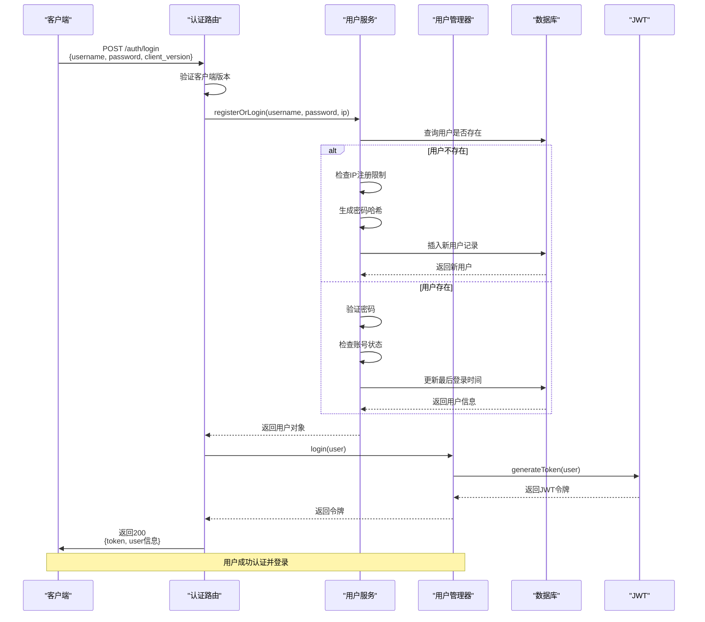

# 认证接口

<cite>
**本文档引用的文件**  
- [auth.ts](file://server/src/routes/auth.ts#L0-L58)
- [auth.ts](file://server/src/middleware/auth.ts#L0-L52)
- [UserManager.ts](file://server/src/UserManager.ts#L0-L149)
- [UserService.ts](file://server/src/db/services/UserService.ts#L0-L380)
</cite>

## 目录
1. [简介](#简介)
2. [核心认证接口](#核心认证接口)
3. [认证中间件](#认证中间件)
4. [用户管理服务](#用户管理服务)
5. [登录流程序列图](#登录流程序列图)
6. [错误处理机制](#错误处理机制)

## 简介
本文档详细说明了游戏服务器中的认证接口设计与实现。系统通过RESTful API提供登录/注册功能，并使用JWT令牌进行会话管理。认证流程涉及客户端版本验证、IP封禁检查、用户状态验证等多个安全环节，确保系统的安全性与稳定性。

**Section sources**
- [auth.ts](file://server/src/routes/auth.ts#L0-L58)

## 核心认证接口

### 登录/注册接口
该接口同时处理新用户注册和现有用户登录。

**接口信息**
- **HTTP方法**: `POST`
- **URL路径**: `/auth/login`
- **内容类型**: `application/json`

**请求参数**
```json
{
  "username": "player1",
  "password": "securePassword123",
  "client_version": "1.0.92"
}
```

**请求参数说明**
- **username**: 用户名，字符串类型
- **password**: 密码，字符串类型
- **client_version**: 客户端版本号，必须为"1.0.92"

**成功响应 (HTTP 200)**
```json
{
  "token": "eyJhbGciOiJIUzI1NiIsInR5cCI6IkpXVCJ9...",
  "user": {
    "username": "player1",
    "profile": {
      "avatar": "http://res.resgs.com/generals/shibingn/image.png",
      "title": null
    },
    "privileges": {
      "admin": false,
      "tester": false
    }
  }
}
```

**错误响应 (HTTP 401)**
```json
{
  "error": "Invalid password"
}
```

**错误类型说明**
- `Client Version Invalid`: 客户端版本不匹配
- `IP address is banned`: IP地址已被封禁
- `IP has reached the registration limit(1)`: IP注册数量已达上限
- `Invalid password`: 密码错误
- `Account is banned`: 账号已被封禁

**接口处理流程**
1. 验证客户端版本号
2. 检查IP是否被封禁
3. 查询用户是否存在
4. 若用户不存在，则创建新用户（注册）
5. 若用户存在，则验证密码
6. 检查账号状态（是否被封禁）
7. 生成JWT令牌
8. 返回认证结果

**Section sources**
- [auth.ts](file://server/src/routes/auth.ts#L0-L58)
- [UserService.ts](file://server/src/db/services/UserService.ts#L0-L380)
- [UserManager.ts](file://server/src/UserManager.ts#L0-L149)

## 认证中间件

### 用户认证中间件
用于保护需要用户身份验证的API端点。

```typescript
export function authenticateUser(userManager: UserManager) {
    return async (req: Request, res: Response, next: NextFunction) => {
        const userId = decodeURIComponent(
            req.headers['x-user-name'].toString()
        );
        const token = decodeURIComponent(
            req.headers['x-user-token'].toString()
        );
        if (!userId) {
            return res.status(401).json({ error: 'Authentication required' });
        }

        try {
            if (
                userManager.onlinePlayers[userId] &&
                userManager.onlinePlayers[userId].token === token
            ) {
                next();
            } else {
                return res.status(403).json({ error: 'User Token required' });
            }
        } catch (error: any) {
            res.status(500).json({ error: error.message });
        }
    };
}
```

**使用方式**
```typescript
router.get('/profile', authenticateUser(userManager), (req, res) => {
    // 只有通过认证的用户才能访问
});
```

### 管理员认证中间件
用于保护需要管理员权限的API端点。

```typescript
export function authenticateAdmin(userService: UserService) {
    return async (req: Request, res: Response, next: NextFunction) => {
        const userId = decodeURIComponent(
            req.headers['x-user-name'].toString()
        );
        if (!userId) {
            return res.status(401).json({ error: 'Authentication required' });
        }

        try {
            if (!userService.checkAdmin(userId)) {
                return res
                    .status(403)
                    .json({ error: 'Admin privileges required' });
            }
            next();
        } catch (error: any) {
            res.status(500).json({ error: error.message });
        }
    };
}
```

**认证头信息**
- `x-user-name`: 经URL解码的用户名
- `x-user-token`: 经URL解码的JWT令牌

**Section sources**
- [auth.ts](file://server/src/middleware/auth.ts#L0-L52)

## 用户管理服务

### UserService - 用户服务
负责用户数据的持久化操作和业务逻辑处理。

**核心功能**
- `registerOrLogin()`: 注册或登录
- `banUser()`: 封禁用户
- `banMuted()`: 禁言用户
- `banGame()`: 禁止游戏
- `checkAdmin()`: 检查管理员权限
- `updateAvatar()`: 更新头像

**注册逻辑**
1. 检查IP是否被封禁
2. 检查IP注册限制（每个IP最多1个账号）
3. 生成密码哈希
4. 创建新用户记录
5. 设置默认用户属性

**新用户默认属性**
```json
{
  "profile": {
    "reputationScore": 100,
    "doudizhuScore": 3000,
    "avatar": "http://res.resgs.com/generals/shibingn/image.png",
    "titles": [],
    "lastLogin": "当前时间"
  },
  "privileges": {
    "admin": false,
    "childAdmin": false,
    "betaTester": false
  },
  "status": {
    "isBanned": false,
    "isMuted": false,
    "isGameBanned": false
  }
}
```

### UserManager - 用户管理器
负责在线用户的会话管理和状态跟踪。

**核心功能**
- `login()`: 用户登录，生成令牌
- `joinLobby()`: 加入大厅
- `leaveLobby()`: 离开大厅
- `joinRoom()`: 加入游戏房间
- `leaveRoom()`: 离开游戏房间
- `broadcast()`: 广播消息

**令牌生成**
使用JWT生成有效期为7天的令牌：
```typescript
private generateToken(user: DbUser): string {
    return jwt.sign(
        { userId: user._id, username: user.username },
        'resgs.PrivateKey',
        { expiresIn: '7d' }
    );
}
```

**在线用户数据结构**
```typescript
onlinePlayers: {
    [username: string]: {
        userdata: DbUser;
        token: string;
        lastActive: Date;
        lobbyClient: Client | null;
        rooms: {
            [roomId: string]: {
                room: GameRoom;
                client: Client;
                reconnectToken?: string;
            };
        };
    };
}
```

**Section sources**
- [UserService.ts](file://server/src/db/services/UserService.ts#L0-L380)
- [UserManager.ts](file://server/src/UserManager.ts#L0-L149)

## 登录流程序列图



**Diagram sources**
- [auth.ts](file://server/src/routes/auth.ts#L0-L58)
- [UserService.ts](file://server/src/db/services/UserService.ts#L0-L380)
- [UserManager.ts](file://server/src/UserManager.ts#L0-L149)

## 错误处理机制

### HTTP状态码规范
- **200 OK**: 请求成功
- **401 Unauthorized**: 认证失败
- **403 Forbidden**: 权限不足
- **500 Internal Server Error**: 服务器内部错误

### 错误类型分类
**客户端错误 (401)**
- 客户端版本无效
- IP地址被封禁
- 密码错误
- 账号被封禁

**权限错误 (403)**
- 缺少管理员权限
- 用户令牌无效

**服务器错误 (500)**
- 数据库连接失败
- 服务内部异常

### 异常处理策略
1. 所有异常都被捕获并转换为JSON格式的错误响应
2. 敏感错误信息不会暴露给客户端
3. 错误日志记录在服务器端
4. 不同类型的错误返回相应的HTTP状态码

**Section sources**
- [auth.ts](file://server/src/routes/auth.ts#L0-L58)
- [auth.ts](file://server/src/middleware/auth.ts#L0-L52)