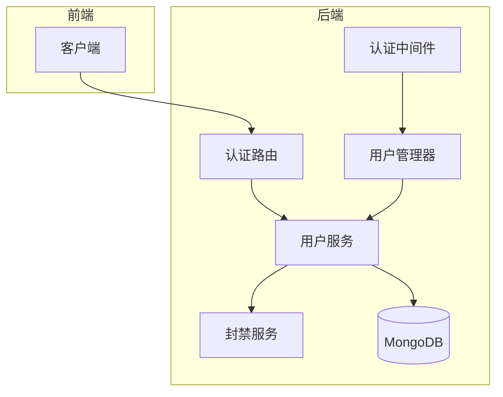
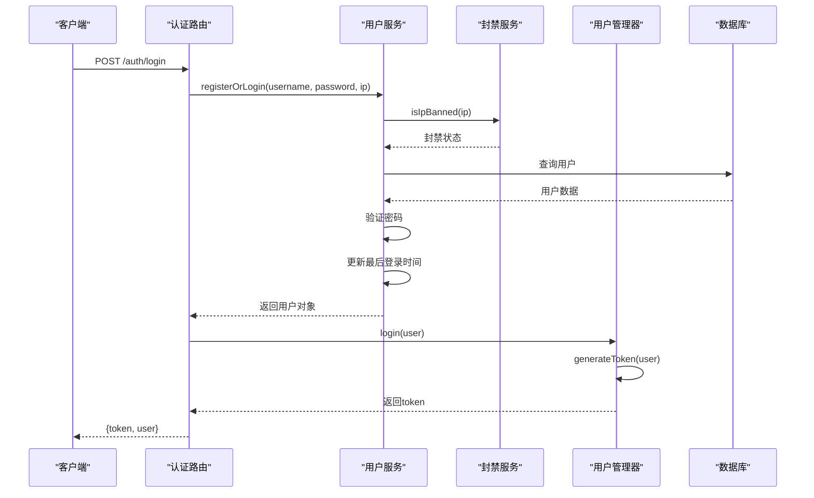
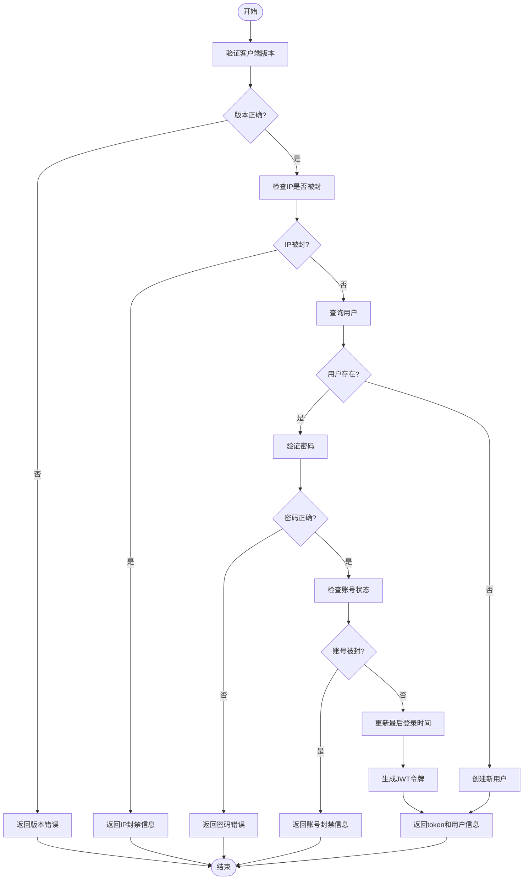

# 认证系统

<cite>
**本文档引用的文件**  
- [auth.ts](file://server/src/routes/auth.ts#L1-L60)
- [auth.ts](file://server/src/middleware/auth.ts#L1-L53)
- [UserManager.ts](file://server/src/UserManager.ts#L1-L150)
- [UserService.ts](file://server/src/db/services/UserService.ts#L1-L381)
- [User.ts](file://server/src/db/models/User.ts#L1-L103)
- [BanService.ts](file://server/src/db/services/BanService.ts#L1-L96)
- [SystemConfig.ts](file://server/src/db/models/SystemConfig.ts#L1-L15)
- [index.ts](file://server/src/index.ts#L1-L103)
- [admin.ts](file://server/src/routes/admin.ts#L1-L230)
</cite>

## 目录
1. [简介](#简介)
2. [项目结构](#项目结构)
3. [核心组件](#核心组件)
4. [架构概览](#架构概览)
5. [详细组件分析](#详细组件分析)
6. [依赖分析](#依赖分析)
7. [性能考虑](#性能考虑)
8. [故障排除指南](#故障排除指南)
9. [结论](#结论)

## 简介
本系统为一个基于Node.js和Express的后端认证系统，支持用户登录、注册、权限管理、封禁机制及管理员操作。系统采用JWT令牌进行会话管理，使用bcrypt进行密码加密，并通过MongoDB存储用户数据。认证流程结合了客户端版本校验、IP封禁检查、账号状态验证等多重安全措施，确保系统的安全性与稳定性。

## 项目结构
系统主要分为前端（client）与后端（server）两大部分。后端采用模块化设计，包含核心服务、数据库操作、中间件、路由、房间管理等模块。认证相关逻辑集中在`server/src/routes/auth.ts`、`server/src/middleware/auth.ts`以及`server/src/UserManager.ts`中。



**图示来源**  
- [auth.ts](file://server/src/routes/auth.ts#L1-L60)
- [UserManager.ts](file://server/src/UserManager.ts#L1-L150)
- [UserService.ts](file://server/src/db/services/UserService.ts#L1-L381)

**本节来源**  
- [auth.ts](file://server/src/routes/auth.ts#L1-L60)
- [index.ts](file://server/src/index.ts#L1-L103)

## 核心组件
系统的核心认证功能由以下几个组件构成：
- **AuthRouter**：处理登录/注册请求
- **UserService**：负责用户数据的持久化与业务逻辑
- **UserManager**：管理在线用户状态与会话
- **BanService**：实现IP与账号封禁机制
- **Middleware**：提供管理员与普通用户的认证中间件

这些组件协同工作，确保用户能够安全地登录、注册并维持会话状态。

**本节来源**  
- [auth.ts](file://server/src/routes/auth.ts#L1-L60)
- [UserManager.ts](file://server/src/UserManager.ts#L1-L150)
- [UserService.ts](file://server/src/db/services/UserService.ts#L1-L381)

## 架构概览
整个认证系统的架构采用分层设计，从前端请求到数据库存储，各层职责清晰。



**图示来源**  
- [auth.ts](file://server/src/routes/auth.ts#L1-L60)
- [UserService.ts](file://server/src/db/services/UserService.ts#L1-L381)
- [UserManager.ts](file://server/src/UserManager.ts#L1-L150)

## 详细组件分析

### 认证路由分析
`auth.ts`中的`createAuthRouter`函数创建了一个Express路由，用于处理用户登录/注册请求。

#### 请求格式
- **HTTP方法**: POST
- **路径**: `/auth/login`
- **请求体**:
```json
{
  "username": "player1",
  "password": "securePassword123",
  "client_version": "1.0.92"
}
```

#### 响应格式
- **成功响应 (200)**:
```json
{
  "token": "jwt-token-string",
  "user": {
    "username": "player1",
    "profile": {
      "avatar": "http://res.resgs.com/generals/shibingn/image.png",
      "title": null
    },
    "privileges": {
      "admin": false,
      "tester": false
    }
  }
}
```
- **失败响应 (401)**:
```json
{
  "error": "Invalid"
}
```

#### 错误处理
- 客户端版本不匹配 → "Client Version Invalid"
- 用户名或密码错误 → "Invalid"
- IP被封禁 → "IP address is banned:..."
- 密码错误 → "Invalid password"
- 账号被封 → "Account is banned"



**图示来源**  
- [auth.ts](file://server/src/routes/auth.ts#L1-L60)
- [UserService.ts](file://server/src/db/services/UserService.ts#L1-L381)

**本节来源**  
- [auth.ts](file://server/src/routes/auth.ts#L1-L60)
- [UserService.ts](file://server/src/db/services/UserService.ts#L1-L381)

### 用户服务分析
`UserService`类负责所有与用户相关的数据库操作和业务逻辑。

#### 密码加密策略
使用`bcryptjs`库进行密码哈希：
- 盐值长度：10
- 存储字段：`passwordHash` 和 `salt`

#### 安全防护措施
- **IP注册限制**：每个IP最多注册1个账号
- **IP封禁机制**：通过`BanService`检查并封禁恶意IP
- **账号封禁**：支持永久或定时封禁账号、禁言、禁止游戏
- **IP历史记录**：记录用户所有登录IP，用于关联封禁

#### 接口方法
- `registerOrLogin()`：注册或登录
- `banUser()`：封禁用户
- `unBanUser()`：解封用户
- `banMuted()`：禁言用户
- `banGame()`：禁止用户参与游戏
- `checkAdmin()`：检查是否为管理员

**本节来源**  
- [UserService.ts](file://server/src/db/services/UserService.ts#L1-L381)
- [User.ts](file://server/src/db/models/User.ts#L1-L103)

### 用户管理器分析
`UserManager`类负责管理在线用户的状态和会话。

#### JWT令牌机制
- **密钥**: `resgs.PrivateKey`
- **有效期**: 7天
- **载荷**: `{ userId: user._id, username: user.username }`

#### 在线用户状态
维护一个`onlinePlayers`对象，记录：
- 用户数据
- 当前令牌
- 最后活跃时间
- 会话客户端（大厅与房间）
- 所在房间列表

#### 会话刷新机制
当用户重新登录时，系统会生成新的JWT令牌并更新`onlinePlayers`中的记录，旧令牌自动失效。

**本节来源**  
- [UserManager.ts](file://server/src/UserManager.ts#L1-L150)

### 中间件认证分析
系统提供了两个认证中间件：

#### authenticateUser
用于普通用户认证，检查请求头中的：
- `x-user-name`: 用户名
- `x-user-token`: JWT令牌

验证逻辑：
1. 解码用户名和令牌
2. 检查`UserManager`中是否存在该用户
3. 验证令牌是否匹配

#### authenticateAdmin
用于管理员权限认证，在`authenticateUser`基础上额外检查：
- 用户是否具有`admin`权限

**本节来源**  
- [middleware/auth.ts](file://server/src/middleware/auth.ts#L1-L53)
- [admin.ts](file://server/src/routes/admin.ts#L1-L230)

## 依赖分析
系统各组件之间的依赖关系如下：

```mermaid
classDiagram
class AuthRouter {
+createAuthRouter(userService, userManager)
}
class UserService {
+registerOrLogin(username, password, ip)
+banUser(username, reason, times, banIp)
+checkAdmin(username)
}
class UserManager {
+login(user)
+generateToken(user)
+onlinePlayers
}
class BanService {
+banIp(ip, reason, times)
+isIpBanned(ip)
}
class AuthMiddleware {
+authenticateUser(userManager)
+authenticateAdmin(userService)
}
AuthRouter --> UserService : "使用"
AuthRouter --> UserManager : "使用"
UserService --> BanService : "使用"
UserManager --> "jsonwebtoken" : "依赖"
UserService --> "bcryptjs" : "依赖"
AuthMiddleware --> UserManager : "使用"
AuthMiddleware --> UserService : "使用"
```

**图示来源**  
- [auth.ts](file://server/src/routes/auth.ts#L1-L60)
- [UserManager.ts](file://server/src/UserManager.ts#L1-L150)
- [UserService.ts](file://server/src/db/services/UserService.ts#L1-L381)
- [middleware/auth.ts](file://server/src/middleware/auth.ts#L1-L53)

**本节来源**  
- [auth.ts](file://server/src/routes/auth.ts#L1-L60)
- [UserManager.ts](file://server/src/UserManager.ts#L1-L150)
- [UserService.ts](file://server/src/db/services/UserService.ts#L1-L381)
- [middleware/auth.ts](file://server/src/middleware/auth.ts#L1-L53)

## 性能考虑
- **密码哈希**：使用bcrypt的同步方法，可能阻塞事件循环，建议在高并发场景下改用异步版本
- **IP封禁检查**：每次登录都查询全局配置，可考虑缓存`ipBlacklist`
- **用户状态更新**：使用`$addToSet`避免重复IP记录，优化数据库写入
- **批量操作**：在记录游戏结果时使用`bulkWrite`提高性能

## 故障排除指南
### 常见问题
1. **登录失败但无具体错误**
   - 检查客户端版本是否为`1.0.92`
   - 确认用户名密码正确
   - 检查IP是否被封禁

2. **管理员接口403错误**
   - 确认用户具有`admin`权限
   - 检查请求头是否包含`x-user-name`和`x-user-token`

3. **JWT令牌无效**
   - 检查密钥是否匹配
   - 确认令牌未过期（7天有效期）

4. **无法封禁IP**
   - 确认`system_config`集合中存在`name: 'global'`的文档

**本节来源**  
- [auth.ts](file://server/src/routes/auth.ts#L1-L60)
- [UserService.ts](file://server/src/db/services/UserService.ts#L1-L381)
- [UserManager.ts](file://server/src/UserManager.ts#L1-L150)
- [admin.ts](file://server/src/routes/admin.ts#L1-L230)

## 结论
本认证系统实现了完整的用户生命周期管理，包括注册、登录、权限控制、封禁机制等核心功能。系统设计合理，安全性较高，通过JWT实现无状态会话管理，结合bcrypt密码加密和多层验证机制保障用户账户安全。建议后续可增加密码重置、多因素认证、OAuth2.0集成等功能以进一步提升用户体验和安全性。