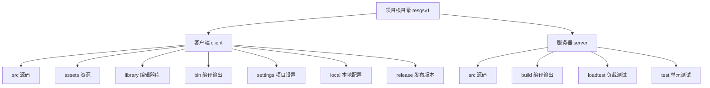
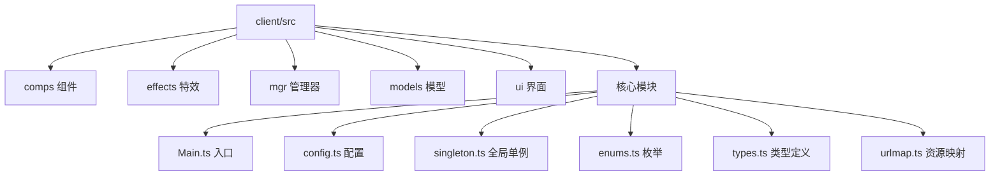
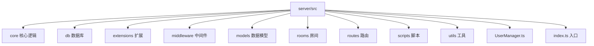
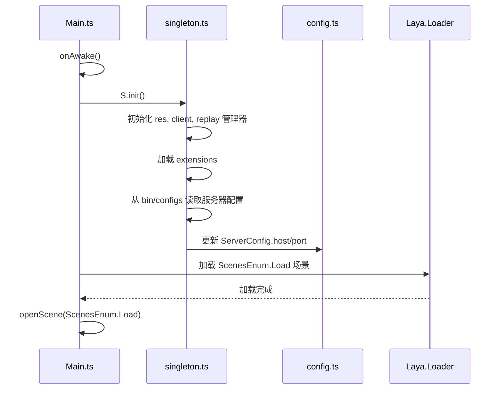
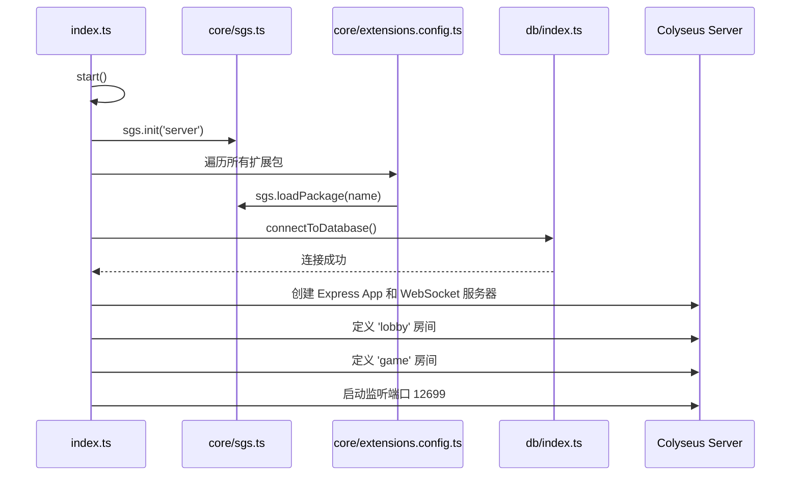

# 目录结构详解

<cite>
**本文档中引用的文件**   
- [Main.ts](file://client/src/Main.ts)
- [index.ts](file://server/src/index.ts)
- [config.ts](file://client/src/config.ts)
- [singleton.ts](file://client/src/singleton.ts)
- [PlayerComp.ts](file://client/src/comps/player/PlayerComp.ts)
- [enums.ts](file://client/src/enums.ts)
- [types.ts](file://client/src/types.ts)
- [urlmap.ts](file://client/src/urlmap.ts)
- [extensions.config.js](file://client/src/core/extensions.config.js)
- [sgs.ts](file://client/src/core/sgs.ts)
- [UserManager.ts](file://server/src/UserManager.ts)
- [rooms/game.ts](file://server/src/rooms/game.ts)
- [rooms/lobby.ts](file://server/src/rooms/lobby.ts)
- [routes/auth.ts](file://server/src/routes/auth.ts)
- [routes/app.ts](file://server/src/routes/app.ts)
- [routes/admin.ts](file://server/src/routes/admin.ts)
- [db/index.ts](file://server/src/db/index.ts)
- [core/sgs.ts](file://server/src/core/sgs.ts)
- [core/extensions.config.ts](file://server/src/core/extensions.config.ts)
</cite>

## 目录结构

本项目 `resgsv1` 采用前后端分离的架构，主要分为 `client`（客户端）和 `server`（服务器）两大目录。这种结构清晰地划分了用户界面逻辑与业务逻辑，便于团队协作和独立部署。

**目录来源**
- [项目结构](file://workspace_path)

### 客户端结构分析

客户端目录 `client` 包含了所有与用户界面、游戏逻辑和资源相关的代码与文件。

#### 源码目录 (client/src)

`src` 目录是客户端的核心，包含了所有 TypeScript 源代码。

**目录来源**
- [项目结构](file://client/src)

**comps (组件)**
该目录存放了游戏中的各种 UI 组件，这些组件是构成游戏界面的基本单元。
- `choose`: 与选择相关的组件，如 `GameChooseComp.ts`。
- `player`: 玩家相关的组件，如 `PlayerComp.ts` 和 `SeatComp.ts`，负责渲染玩家信息、血量、装备等。
- `room`: 房间和游戏相关的组件，如 `RoomGameComp.ts` 和 `GameCardComp.ts`，管理游戏状态和交互。
- 这些组件通过继承 Laya 框架的 `Script` 类，实现了与 UI 元素的绑定和逻辑控制。

**effects (特效)**
存放与武将技能相关的特效脚本。每个武将（如 `caomao`, `shenlusu`）都有对应的 `.ts` 和 `.generated.ts` 文件。`.generated.ts` 文件通常由工具自动生成，包含从 Spine 动画导出的数据，而 `.ts` 文件则包含自定义的逻辑。

**mgr (管理器)**
存放全局的管理类，采用单例模式。
- `Client.ts`: 网络客户端管理器，负责与服务器的 WebSocket 通信。
- `Replay.ts`: 回放管理器，用于处理游戏回放逻辑。
- `Resources.ts`: 资源管理器，负责游戏资源的加载和缓存。

**models (模型)**
存放与游戏状态相关的数据模型。
- `LobbyState.ts`: 大厅状态模型。
- `RoomStata.ts`: 房间状态模型。这些模型定义了客户端如何存储和同步来自服务器的游戏数据。

**ui (界面)**
存放所有 UI 界面的脚本。每个 UI 界面（如 `UIMain`, `UILobby`, `UIRoom`）都有一对 `.ts` 和 `.generated.ts` 文件。`.generated.ts` 文件由编辑器生成，负责 UI 元素的初始化和引用，而 `.ts` 文件则包含该界面的业务逻辑。

**核心模块**
- `Main.ts`: 客户端的主入口脚本，继承自 `Laya.Script`。它负责初始化全局单例、加载初始场景（如加载界面）和管理 UI 栈。
- `config.ts`: 配置文件，定义了服务器地址、端口、资源 URL 以及游戏内的各种配置，如玩家位置、房间选项等。
- `singleton.ts`: 全局单例管理类 `S`，通过静态属性暴露 `ui`, `res`, `client` 等核心管理器，方便项目中任何地方访问。
- `enums.ts`: 枚举定义，如场景枚举 `ScenesEnum` 和实体类型枚举 `EntityTypeEnum`。
- `types.ts`: 类型定义，如 `ObjectPoolItem`，用于对象池。
- `urlmap.ts`: 资源路径映射，将程序中的逻辑标识（如花色）映射到具体的资源文件路径。

**Section sources**
- [Main.ts](file://client/src/Main.ts#L1-L161)
- [config.ts](file://client/src/config.ts#L1-L799)
- [singleton.ts](file://client/src/singleton.ts#L1-L57)
- [enums.ts](file://client/src/enums.ts#L1-L231)
- [types.ts](file://client/src/types.ts#L1-L4)
- [urlmap.ts](file://client/src/urlmap.ts#L1-L28)

#### 资源与配置目录

- `assets`: 存放所有游戏资源，包括动画（`animation`）、通用资源（`bin`）、字体、图片等。动画资源多为 Spine 或 Laya 动画文件（`.json`, `.sk`）。
- `library`: Laya 编辑器生成的资源库，包含所有资源的元数据，通常不需要手动修改。
- `bin`: 编译后的资源和配置文件，如 `configs/config.production.json`，其中包含生产环境的服务器地址。
- `settings`: Laya 项目的配置文件，如 `PlayerSettings.json`，定义了构建选项。
- `local`: 存放本地开发环境的配置，如 `editorLayout.json`。
- `release`: 存放最终的发布版本。

### 服务器端结构分析

服务器目录 `server` 采用了基于 Node.js 和 Express 的后端架构，并使用 Colyseus 框架来管理实时游戏房间。

#### 源码目录 (server/src)

`src` 目录是服务器的核心，包含了所有业务逻辑。

**目录来源**
- [项目结构](file://server/src)

**core (核心逻辑)**
存放游戏的核心业务逻辑，按功能模块划分。
- `card`: 卡牌相关的逻辑，如卡牌类型、使用规则。
- `player`: 玩家相关的逻辑。
- `room`: 房间相关的逻辑。
- `skill`: 技能相关的逻辑。
- `event`: 事件系统。
- `general`: 武将相关的逻辑。
- `sgs.ts`: 游戏主逻辑的入口和初始化。
- `extensions.config.ts`: 定义了启用的扩展包列表。

**db (数据库)**
处理与数据库的交互。
- `models`: 定义了数据库的实体模型，如 `User.ts`, `GeneralState.ts`。
- `services`: 数据访问层（DAO），提供了对数据库模型的增删改查操作，如 `UserService.ts`。
- `index.ts`: 数据库连接的初始化。

**extensions (扩展)**
这是一个非常重要的目录，实现了游戏的模块化设计。每个子目录（如 `wars`, `standard`, `lang`）代表一个独立的游戏扩展包。每个包都有自己的 `index.ts` 入口、`extension.config.js` 配置和 `package.json`。服务器启动时会动态加载这些扩展，从而实现不同的游戏模式和内容。

**middleware (中间件)**
存放 Express 中间件，如 `auth.ts`，用于处理请求的身份验证。

**models (数据模型)**
存放与网络传输相关的数据模型，如 `LobbyState.ts`，用于定义客户端和服务器之间同步的数据结构。

**rooms (房间)**
Colyseus 框架的核心，定义了游戏房间的逻辑。
- `game.ts`: 游戏房间 `GameRoom` 的实现，处理游戏内的实时交互。
- `lobby.ts`: 大厅房间 `CustomLobbyRoom` 的实现，处理玩家的匹配和房间创建。

**routes (路由)**
定义了 HTTP API 路由。
- `auth.ts`: 认证相关路由，如登录、注册。
- `app.ts`: 应用通用路由。
- `admin.ts`: 管理员相关路由。

**scripts (脚本)**
存放定时任务脚本，如 `banCleanup.ts` 用于清理过期的封禁记录。

**utils (工具)**
存放通用工具函数，如 `GenerateRoomId.ts`。

**核心模块**
- `index.ts`: 服务器的主入口文件。它初始化 Express 应用、Colyseus 服务器，并动态加载所有扩展。通过 `gameServer.define()` 方法定义了 `lobby` 和 `game` 两种房间类型。
- `UserManager.ts`: 用户管理单例，负责管理在线用户的状态。

**Section sources**
- [index.ts](file://server/src/index.ts#L1-L102)
- [UserManager.ts](file://server/src/UserManager.ts)
- [rooms/game.ts](file://server/src/rooms/game.ts)
- [rooms/lobby.ts](file://server/src/rooms/lobby.ts)
- [routes/auth.ts](file://server/src/routes/auth.ts)
- [routes/app.ts](file://server/src/routes/app.ts)
- [routes/admin.ts](file://server/src/routes/admin.ts)
- [db/index.ts](file://server/src/db/index.ts)
- [core/sgs.ts](file://server/src/core/sgs.ts)
- [core/extensions.config.ts](file://server/src/core/extensions.config.ts)

### 编译与构建

- `client/build`: 客户端编译后的输出目录，包含最终的 HTML、JavaScript 和资源文件。
- `server/build`: 服务器编译后的输出目录，包含由 TypeScript 编译成的 JavaScript 文件。
- 项目使用 `tsconfig.json` 文件来配置 TypeScript 编译器，`package.json` 文件定义了项目依赖和构建脚本。

### 配置文件

- `client/package.json` 和 `server/package.json`: 分别定义了客户端和服务器的依赖和脚本命令。
- `client/tsconfig.json` 和 `server/tsconfig.json`: 分别配置了客户端和服务器的 TypeScript 编译选项。
- `client/bin/configs/config.production.json`: 客户端生产环境的配置，其中的 `serverHost` 和 `serverPort` 会被 `client/src/config.ts` 在运行时读取，以连接正确的服务器。

### 关键初始化流程

以下是客户端和服务器启动时的关键初始化流程。

#### 客户端初始化流程

**Diagram sources**
- [Main.ts](file://client/src/Main.ts#L1-L161)
- [singleton.ts](file://client/src/singleton.ts#L1-L57)
- [config.ts](file://client/src/config.ts#L1-L799)

#### 服务器初始化流程

**Diagram sources**
- [index.ts](file://server/src/index.ts#L1-L102)
- [core/sgs.ts](file://server/src/core/sgs.ts)
- [core/extensions.config.ts](file://server/src/core/extensions.config.ts)
- [db/index.ts](file://server/src/db/index.ts)