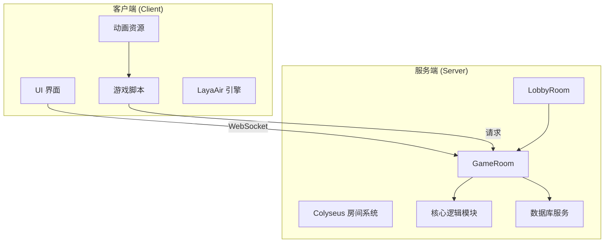
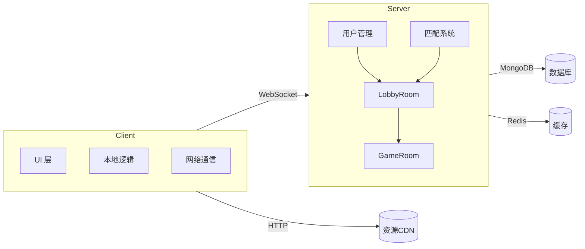
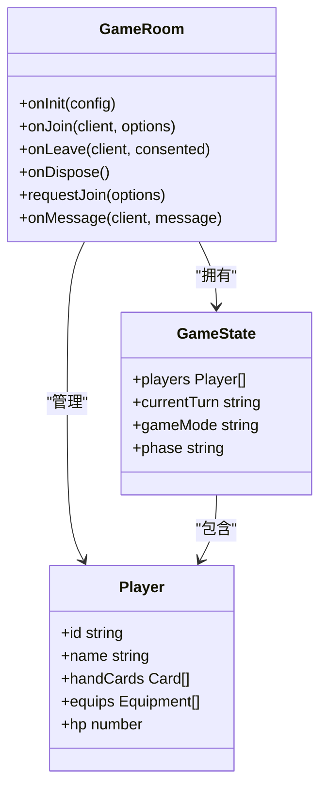
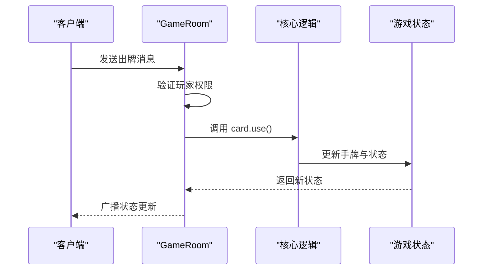
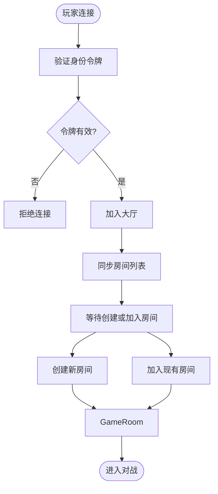
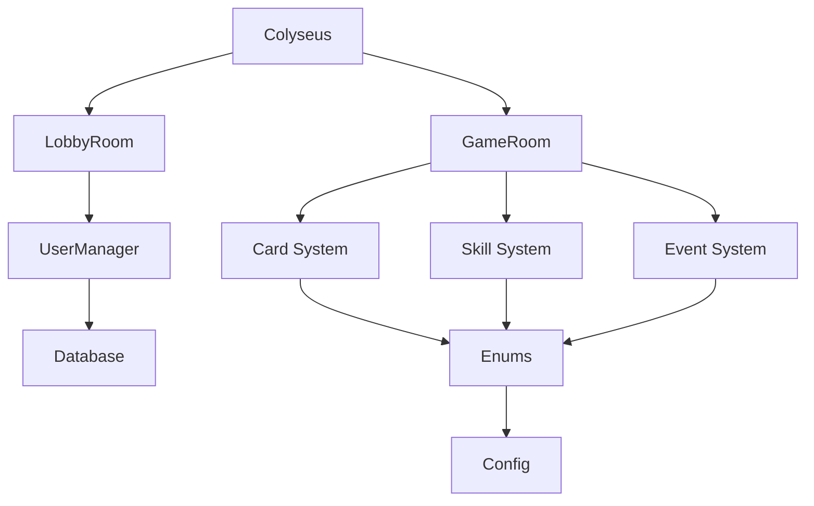

# 系统概述

<cite>
**本文档引用文件**  
- [index.ts](file://server/src/index.ts)
- [game.ts](file://server/src/rooms/game.ts)
- [lobby.ts](file://server/src/rooms/lobby.ts)
- [Main.ts](file://client/src/Main.ts)
- [package.json](file://client/package.json)
- [package.json](file://server/package.json)
- [README.md](file://server/README.md)
- [UserManager.ts](file://server/src/UserManager.ts)
- [enums.ts](file://client/src/enums.ts)
- [config.ts](file://client/src/config.ts)
</cite>

## 目录
1. [简介](#简介)
2. [项目结构](#项目结构)
3. [核心组件](#核心组件)
4. [架构概览](#架构概览)
5. [详细组件分析](#详细组件分析)
6. [依赖分析](#依赖分析)
7. [性能考量](#性能考量)
8. [故障排除指南](#故障排除指南)
9. [结论](#结论)

## 简介
resgsv1 是一个基于 Colyseus 框架构建的多人在线卡牌游戏系统，旨在提供稳定、实时的多人对战体验。该项目采用 LayaAir 引擎作为客户端渲染框架，结合 Node.js 与 Colyseus 实现实时通信，支持多种游戏模式，包括标准模式、战争模式、斗地主模式等。系统设计注重可扩展性与模块化，便于未来新增玩法与功能。

**Section sources**  
- [README.md](file://server/README.md#L1-L30)

## 项目结构
项目分为 `client`（客户端）和 `server`（服务端）两个主要部分：

- **client**：基于 LayaAir 引擎开发，包含游戏资源、UI 界面、动画、逻辑脚本等。
  - `assets`：存放动画、武将、技能等资源。
  - `src`：TypeScript 源码，包含 UI、模型、管理器等模块。
  - `bin`：编译输出目录，包含配置文件与 HTML 入口。
- **server**：基于 Node.js 与 Colyseus 构建，负责房间管理、状态同步、用户认证等。
  - `src/rooms`：定义游戏房间（GameRoom）与大厅（LobbyRoom）。
  - `src/core`：核心逻辑，包括卡牌、武将、技能、事件等系统。
  - `src/extensions`：扩展模块，支持不同游戏模式（如斗地主、战争模式）。
  - `src/db`：数据库模型与服务。

**Diagram sources**  
- [game.ts](file://server/src/rooms/game.ts)
- [lobby.ts](file://server/src/rooms/lobby.ts)

**Section sources**  
- [package.json](file://client/package.json)
- [package.json](file://server/package.json)

## 核心组件
系统的核心组件包括：

- **Colyseus 房间系统**：管理玩家连接、状态同步与实时通信。
- **LayaAir 客户端引擎**：负责游戏画面渲染、用户交互与本地逻辑。
- **多模式支持架构**：通过 `extensions` 模块实现不同游戏规则的热插拔。
- **用户管理系统**：处理用户登录、重连、身份验证等。

**Section sources**  
- [index.ts](file://server/src/index.ts#L1-L20)
- [Main.ts](file://client/src/Main.ts#L1-L15)

## 架构概览
系统采用典型的客户端-服务器（C/S）架构，客户端负责渲染与用户输入，服务端负责游戏逻辑与状态一致性。

**Diagram sources**  
- [index.ts](file://server/src/index.ts#L1-L20)
- [UserManager.ts](file://server/src/UserManager.ts#L1-L30)

## 详细组件分析

### 游戏房间（GameRoom）分析
GameRoom 是游戏对战的核心逻辑容器，继承自 Colyseus.Room，负责管理游戏状态、玩家行为与回合流程。

#### 类图

**Diagram sources**  
- [game.ts](file://server/src/rooms/game.ts#L1-L50)

#### 消息处理流程

**Diagram sources**  
- [game.ts](file://server/src/rooms/game.ts#L50-L100)
- [card.use.js](file://server/build/core/card/card.use.js)

### 大厅房间（LobbyRoom）分析
LobbyRoom 负责玩家匹配、房间创建与用户列表管理。

**Diagram sources**  
- [lobby.ts](file://server/src/rooms/lobby.ts#L1-L40)

**Section sources**  
- [lobby.ts](file://server/src/rooms/lobby.ts#L1-L100)

## 依赖分析
系统依赖关系清晰，模块间耦合度低，便于维护与扩展。

**Diagram sources**  
- [package.json](file://server/package.json#L1-L20)
- [index.ts](file://server/src/index.ts#L1-L10)

**Section sources**  
- [package.json](file://server/package.json#L1-L30)

## 性能考量
- **实时性**：Colyseus 基于 WebSocket，确保低延迟状态同步。
- **可扩展性**：支持多房间并行运行，可通过负载均衡横向扩展。
- **资源优化**：客户端资源按需加载，服务端状态精简序列化。
- **数据库访问**：频繁操作缓存化，减少直接 DB 查询。

## 故障排除指南
常见问题及解决方案：

- **连接失败**：检查服务端是否运行，防火墙是否开放端口。
- **状态不同步**：确认客户端未修改本地状态，所有变更需经服务端。
- **房间加入失败**：检查 `requestJoin` 权限逻辑与房间人数上限。
- **动画不播放**：确认资源路径正确，JSON 动画文件加载成功。

**Section sources**  
- [game.ts](file://server/src/rooms/game.ts#L80-L120)
- [Main.ts](file://client/src/Main.ts#L20-L50)

## 结论
resgsv1 是一个结构清晰、扩展性强的多人卡牌游戏系统。其基于 Colyseus 的实时通信能力，结合 LayaAir 的高效渲染，实现了流畅的多人对战体验。多模式支持通过插件化设计实现，未来可轻松集成新玩法。系统适合用于开发类似《三国杀》的策略卡牌游戏，具备良好的工程实践基础。